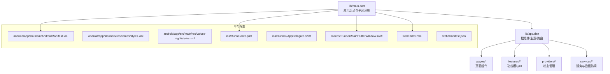
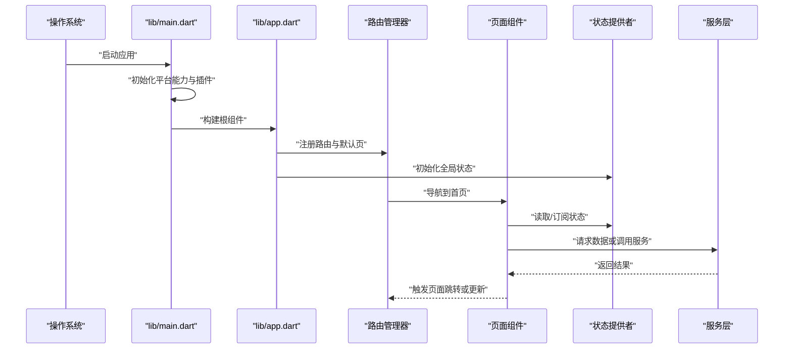
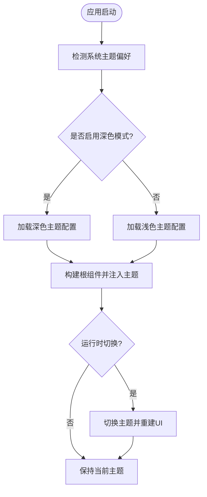
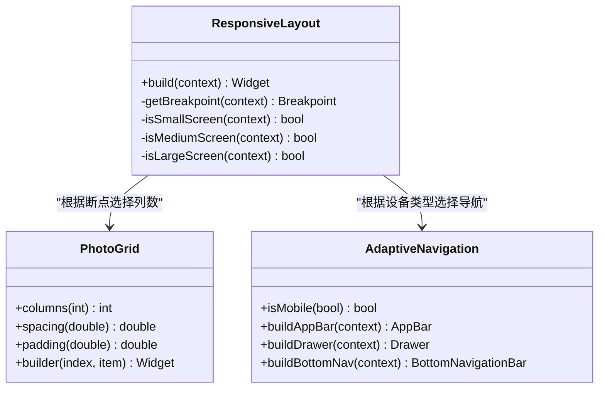
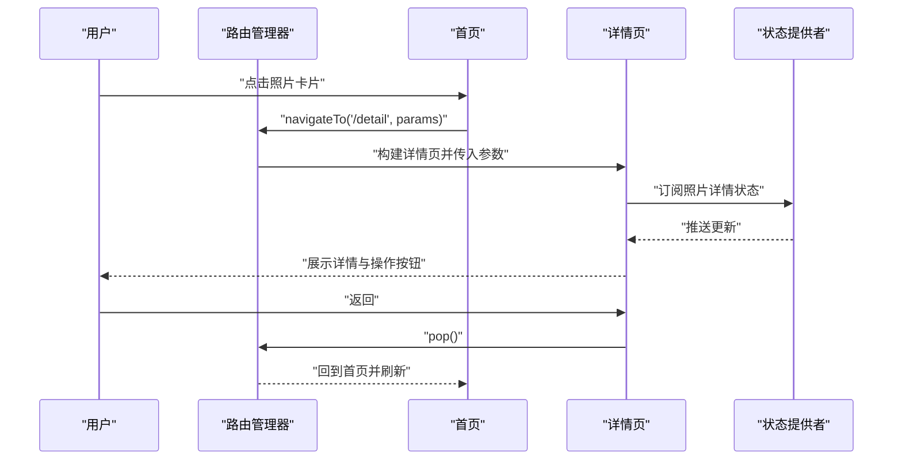
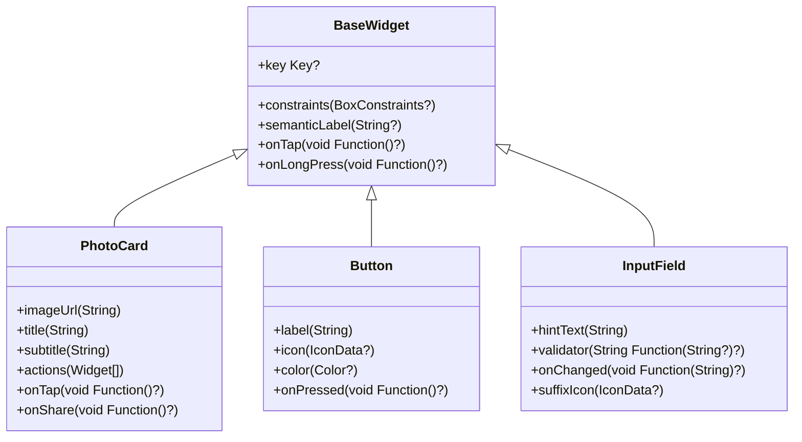
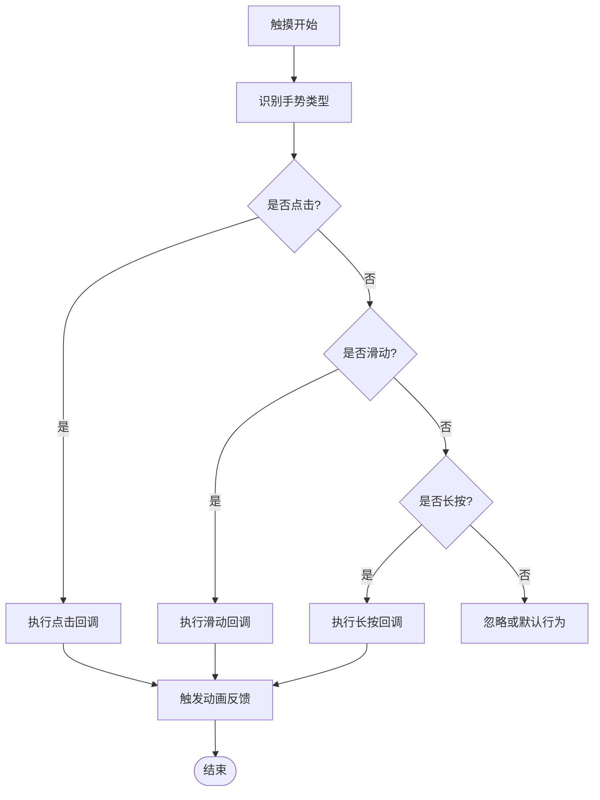
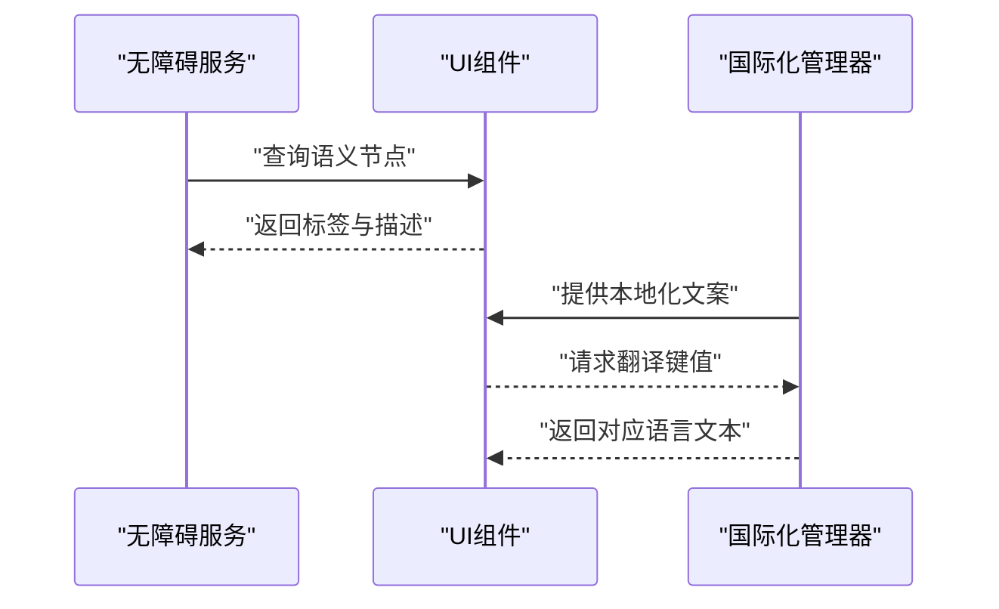
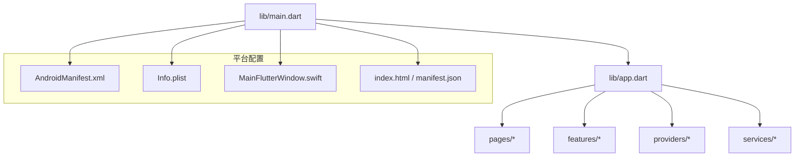

# UI组件架构

<cite>
**本文引用的文件**   
- [main.dart](file://lib/main.dart)
- [app.dart](file://lib/app.dart)
- [pubspec.yaml](file://pubspec.yaml)
- [AndroidManifest.xml](file://android/app/src/main/AndroidManifest.xml)
- [styles.xml](file://android/app/src/main/res/values/styles.xml)
- [styles.xml（夜间）](file://android/app/src/main/res/values-night/styles.xml)
- [AppDelegate.swift](file://ios/Runner/AppDelegate.swift)
- [Info.plist](file://ios/Runner/Info.plist)
- [MainFlutterWindow.swift](file://macos/Runner/MainFlutterWindow.swift)
- [index.html](file://web/index.html)
- [manifest.json](file://web/manifest.json)
</cite>

## 目录
1. [简介](#简介)
2. [项目结构](#项目结构)
3. [核心组件](#核心组件)
4. [架构总览](#架构总览)
5. [详细组件分析](#详细组件分析)
6. [依赖分析](#依赖分析)
7. [性能考虑](#性能考虑)
8. [故障排查指南](#故障排查指南)
9. [结论](#结论)
10. [附录](#附录)

## 简介
本技术文档聚焦于Flutter照片整理AI应用的UI组件架构，围绕页面组件设计、响应式布局、主题系统、导航管理、可复用组件库、交互模式（手势与动画）、跨平台适配、无障碍与国际化、以及开发规范与最佳实践进行系统化说明。文档旨在帮助开发者快速理解并扩展该项目的UI层，确保一致的用户体验与良好的可维护性。

## 项目结构
项目采用Flutter标准多端工程结构，核心UI逻辑位于lib目录，平台相关配置分别位于android、ios、macos、web等子目录。关键入口为lib/main.dart与lib/app.dart，前者负责应用初始化与平台能力接入，后者定义应用根组件、主题与路由。

图表来源
- [main.dart](file://lib/main.dart)
- [app.dart](file://lib/app.dart)
- [AndroidManifest.xml](file://android/app/src/main/AndroidManifest.xml)
- [styles.xml](file://android/app/src/main/res/values/styles.xml)
- [styles.xml（夜间）](file://android/app/src/main/res/values-night/styles.xml)
- [Info.plist](file://ios/Runner/Info.plist)
- [AppDelegate.swift](file://ios/Runner/AppDelegate.swift)
- [MainFlutterWindow.swift](file://macos/Runner/MainFlutterWindow.swift)
- [index.html](file://web/index.html)
- [manifest.json](file://web/manifest.json)

章节来源
- [main.dart](file://lib/main.dart)
- [app.dart](file://lib/app.dart)
- [pubspec.yaml](file://pubspec.yaml)

## 核心组件
- 应用入口与初始化：在应用启动阶段完成插件注册、平台特性检测、初始主题与路由设置，确保后续页面渲染具备一致的上下文环境。
- 根组件与主题：定义Material或Cupertino风格的主题对象，集中管理颜色、字体、阴影、图标等视觉资源，并提供深色模式切换能力。
- 导航管理：基于路由表统一管理页面跳转、参数传递与返回栈行为，支持命名路由与动态路由，保证页面生命周期可控。
- 状态管理：通过Provider或其他状态管理方案将UI与业务解耦，实现跨组件的数据共享与更新通知。
- 可复用组件库：封装通用Widget（如图片卡片、按钮、输入框、空状态、加载指示器等），统一属性接口与事件回调，提升复用率与一致性。

章节来源
- [app.dart](file://lib/app.dart)
- [pubspec.yaml](file://pubspec.yaml)

## 架构总览
整体UI架构遵循“入口→根组件→页面/功能模块→状态与服务”的分层设计，平台差异通过各自原生配置与桥接代码处理，Web端通过HTML与Manifest进行元信息配置。

图表来源
- [main.dart](file://lib/main.dart)
- [app.dart](file://lib/app.dart)

## 详细组件分析

### 主题系统与深色模式
- 主题对象：集中定义主色、强调色、背景色、文本色、图标色、阴影、字体族与字号层级，便于全局统一与替换。
- 深色模式：提供两套主题变体，根据系统或用户偏好自动切换；同时暴露API供运行时切换。
- 平台适配：Android使用styles.xml与values-night区分日间/夜间样式；iOS通过Info.plist与Swift代码控制外观；macOS与Web分别通过窗口与Manifest配置。

图表来源
- [app.dart](file://lib/app.dart)
- [styles.xml](file://android/app/src/main/res/values/styles.xml)
- [styles.xml（夜间）](file://android/app/src/main/res/values-night/styles.xml)
- [Info.plist](file://ios/Runner/Info.plist)
- [MainFlutterWindow.swift](file://macos/Runner/MainFlutterWindow.swift)

章节来源
- [app.dart](file://lib/app.dart)
- [styles.xml](file://android/app/src/main/res/values/styles.xml)
- [styles.xml（夜间）](file://android/app/src/main/res/values-night/styles.xml)
- [Info.plist](file://ios/Runner/Info.plist)
- [MainFlutterWindow.swift](file://macos/Runner/MainFlutterWindow.swift)

### 响应式布局与跨平台适配
- 断点策略：依据屏幕宽度与方向划分断点，在小屏设备上采用单列列表，中屏双列网格，大屏三列或侧边栏+内容区布局。
- 弹性布局：优先使用Flexible/Expanded与Wrap等组件适应不同尺寸；对图片类内容采用自适应缩放与占位图。
- 平台差异：Android与iOS的导航栏、状态栏、底部安全区域存在差异，需通过Padding与Scaffold进行补偿；Web端注意视口与缩放。

图表来源
- [app.dart](file://lib/app.dart)

章节来源
- [app.dart](file://lib/app.dart)

### 导航管理与页面生命周期
- 路由表：集中声明页面路径、默认参数与守卫逻辑，避免分散的路由定义导致维护困难。
- 页面跳转：支持命名路由与动态参数传递，结合返回栈管理实现多级页面导航。
- 生命周期：在页面进入时加载数据，离开时释放资源，确保内存与网络请求的合理管理。

图表来源
- [app.dart](file://lib/app.dart)

章节来源
- [app.dart](file://lib/app.dart)

### 可复用组件库设计与使用
- 组件封装：将常用UI元素抽象为独立Widget，明确输入属性与输出事件，保证高内聚低耦合。
- 属性配置：提供默认值与可选参数，支持主题化与样式覆盖。
- 事件处理：统一回调签名，便于上层业务监听与处理。
- 示例组件：图片卡片、按钮、输入框、空状态、加载指示器、错误提示等。

图表来源
- [app.dart](file://lib/app.dart)

章节来源
- [app.dart](file://lib/app.dart)

### 界面交互模式：手势与动画
- 手势处理：封装常见手势（点击、长按、滑动、缩放），提供统一的回调与状态反馈。
- 动画效果：使用隐式动画与显式动画组合，实现平滑过渡与微交互，提升用户体验。
- 过渡动画：页面切换与弹窗出现/消失使用统一的转场策略，保持一致的动效节奏。

图表来源
- [app.dart](file://lib/app.dart)

章节来源
- [app.dart](file://lib/app.dart)

### 无障碍支持与国际化
- 无障碍：为关键控件添加语义标签、描述与焦点顺序，确保读屏软件正确播报。
- 国际化：集中管理文案键值，按语言包加载与切换，支持复数与格式化。
- 平台兼容：在不同平台上验证无障碍树与本地化资源是否正确加载。

图表来源
- [app.dart](file://lib/app.dart)

章节来源
- [app.dart](file://lib/app.dart)

### 跨平台UI适配策略
- Android：通过styles.xml与values-night配置主题，使用Scaffold与Padding处理状态栏与安全区域。
- iOS：通过Info.plist与Swift代码控制外观与行为，适配刘海屏与底部横条。
- macOS：通过MainFlutterWindow设置窗口样式与标题栏。
- Web：通过index.html与manifest.json配置应用名称、图标与主题色。

章节来源
- [AndroidManifest.xml](file://android/app/src/main/AndroidManifest.xml)
- [styles.xml](file://android/app/src/main/res/values/styles.xml)
- [styles.xml（夜间）](file://android/app/src/main/res/values-night/styles.xml)
- [Info.plist](file://ios/Runner/Info.plist)
- [AppDelegate.swift](file://ios/Runner/AppDelegate.swift)
- [MainFlutterWindow.swift](file://macos/Runner/MainFlutterWindow.swift)
- [index.html](file://web/index.html)
- [manifest.json](file://web/manifest.json)

## 依赖分析
UI层依赖关系清晰，入口与根组件为核心枢纽，页面与功能模块向上依赖状态与服务，平台配置向下影响主题与行为。

图表来源
- [main.dart](file://lib/main.dart)
- [app.dart](file://lib/app.dart)
- [AndroidManifest.xml](file://android/app/src/main/AndroidManifest.xml)
- [Info.plist](file://ios/Runner/Info.plist)
- [MainFlutterWindow.swift](file://macos/Runner/MainFlutterWindow.swift)
- [index.html](file://web/index.html)
- [manifest.json](file://web/manifest.json)

章节来源
- [pubspec.yaml](file://pubspec.yaml)

## 性能考虑
- 组件拆分与懒加载：将大组件拆分为小组件，按需加载以减少首屏渲染时间。
- 列表优化：使用ListView.builder或GridView.builder实现虚拟列表，避免一次性构建大量项。
- 图片缓存：引入图片缓存策略，减少重复下载与内存占用。
- 动画性能：优先使用隐式动画，避免过度重绘与频繁setState。
- 状态管理：合理使用Provider或Riverpod，避免不必要的重建。

[本节为通用指导，不直接分析具体文件]

## 故障排查指南
- 主题未生效：检查主题对象是否正确注入根组件，确认平台样式文件是否存在冲突。
- 导航异常：核对路由表定义与参数传递，确认页面生命周期中的资源释放。
- 响应式布局错乱：检查断点判断逻辑与容器约束，确保在不同屏幕尺寸下布局稳定。
- 动画卡顿：分析动画帧率与重绘范围，简化复杂动画或使用更高效的实现方式。
- 无障碍问题：使用平台工具检查语义树，确保标签与描述完整。

章节来源
- [app.dart](file://lib/app.dart)

## 结论
本UI组件架构以清晰的层次与职责划分为基础，结合主题系统、响应式布局、导航管理与可复用组件库，提供了可扩展且一致的界面实现方案。通过完善的交互模式、跨平台适配与无障碍/国际化支持，确保了高质量的用户体验与可维护性。建议在实际开发中遵循组件开发规范与最佳实践，持续优化性能与可测试性。

[本节为总结性内容，不直接分析具体文件]

## 附录
- 组件开发规范
  - 命名约定：组件名使用PascalCase，文件名使用snake_case；属性与方法命名遵循Flutter惯例。
  - 代码组织：按功能模块划分目录，公共组件放入shared或components目录。
  - 文档注释：为关键组件与API添加注释，说明用途、参数与返回值。
  - 单元测试：为重要组件编写测试用例，覆盖边界条件与异常场景。
- 自定义指南
  - 继承基础组件：从BaseWidget或Material/Cupertino组件派生，保持接口一致性。
  - 主题化：使用Theme.of(context)获取主题，支持自定义样式覆盖。
  - 事件回调：统一回调签名，提供默认实现与可选参数。
  - 示例与演示：提供Demo页面与示例代码，便于团队使用与学习。

[本节为补充性内容，不直接分析具体文件]