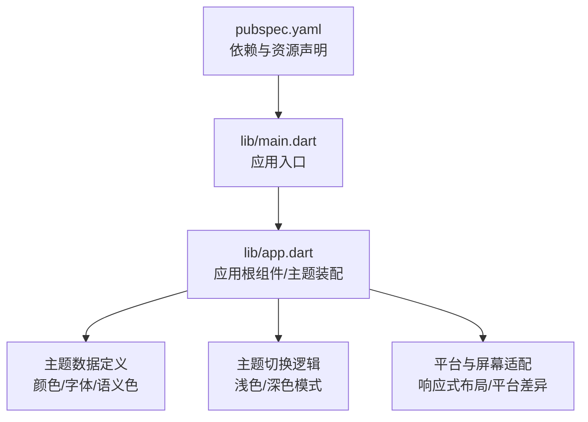
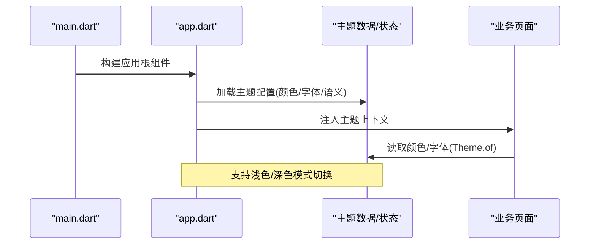
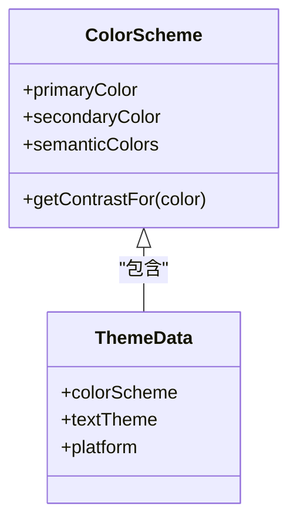
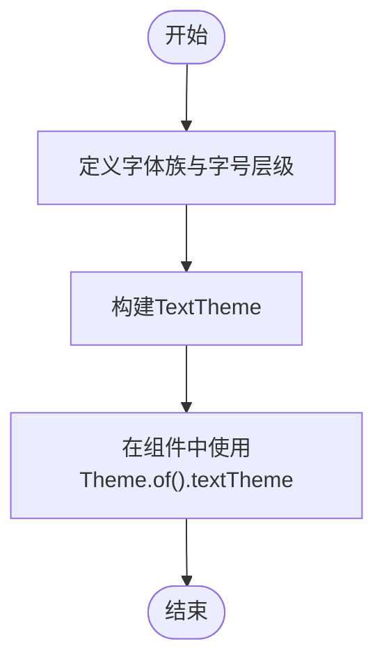
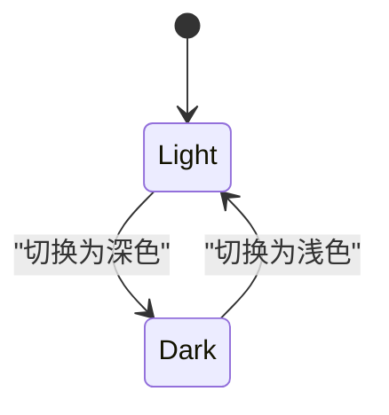
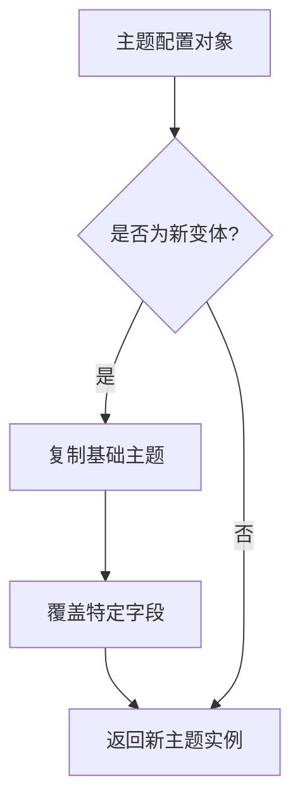
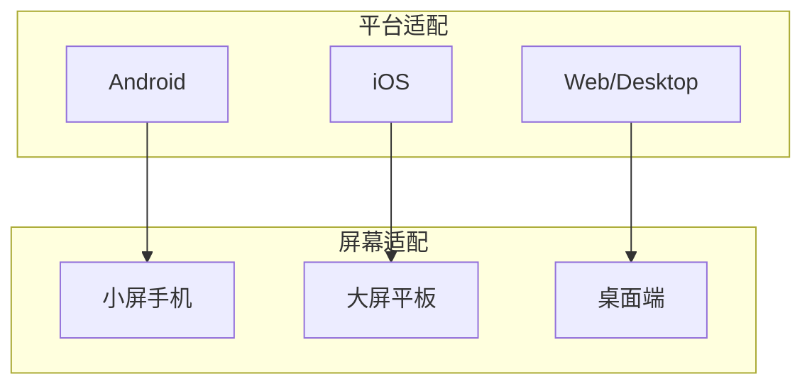
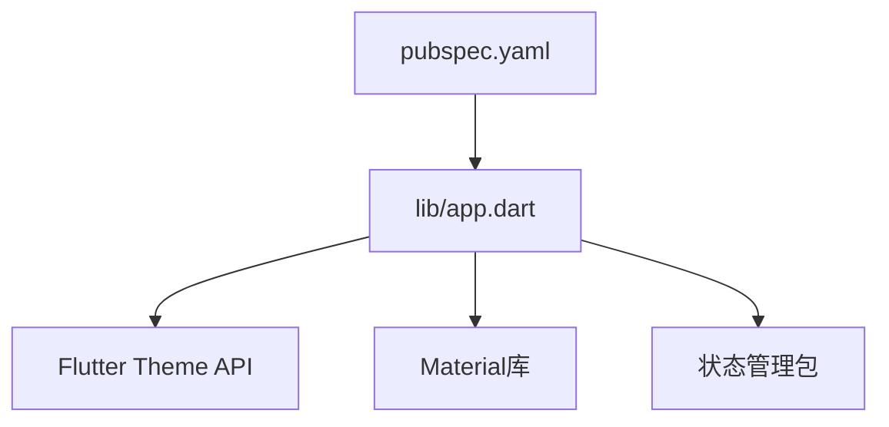

# 主题系统

<cite>
**本文引用的文件**   
- [lib/main.dart](file://lib/main.dart)
- [lib/app.dart](file://lib/app.dart)
- [pubspec.yaml](file://pubspec.yaml)
</cite>

## 目录
1. [简介](#简介)
2. [项目结构](#项目结构)
3. [核心组件](#核心组件)
4. [架构总览](#架构总览)
5. [详细组件分析](#详细组件分析)
6. [依赖分析](#依赖分析)
7. [性能考虑](#性能考虑)
8. [故障排查指南](#故障排查指南)
9. [结论](#结论)
10. [附录](#附录)

## 简介
本技术文档聚焦于Flutter照片整理AI应用的主题系统，围绕颜色方案、字体样式、深色模式、配置与自定义、跨平台与屏幕适配、以及扩展实践进行系统化说明。目标是帮助开发者快速理解并高效维护主题体系，确保在不同平台与尺寸下保持一致的视觉体验与可访问性。

## 项目结构
当前仓库为标准的Flutter多平台工程。主题相关代码主要位于lib目录下，入口文件负责初始化应用与主题上下文；依赖声明在pubspec.yaml中。Android/iOS等平台资源（如启动页样式）可用于原生侧主题联动，但主题的核心逻辑由Flutter层统一管理。

图表来源 
- [lib/main.dart:1-50](file://lib/main.dart#L1-L50)
- [lib/app.dart:1-120](file://lib/app.dart#L1-L120)
- [pubspec.yaml:1-80](file://pubspec.yaml#L1-L80)

章节来源
- [lib/main.dart:1-50](file://lib/main.dart#L1-L50)
- [lib/app.dart:1-120](file://lib/app.dart#L1-L120)
- [pubspec.yaml:1-80](file://pubspec.yaml#L1-L80)

## 核心组件
- 颜色方案：主色调、辅助色、语义色的集中定义与使用规范
- 字体样式：字体族、字号、字重的统一管理与派生样式
- 主题状态：浅色/深色模式的切换机制与持久化策略
- 平台适配：Material 3 或 Material 2 的选择、平台差异化处理
- 响应式适配：基于屏幕尺寸的断点与布局调整

章节来源
- [lib/app.dart:1-120](file://lib/app.dart#L1-L120)
- [pubspec.yaml:1-80](file://pubspec.yaml#L1-L80)

## 架构总览
主题系统采用“集中定义 + 分层消费”的模式：
- 顶层入口main.dart负责初始化应用与主题上下文
- app.dart作为应用根组件，装配主题数据、提供Theme.of()访问、管理主题切换状态
- 业务页面通过Theme.of(context)获取颜色与字体，保证一致性与可维护性

图表来源 
- [lib/main.dart:1-50](file://lib/main.dart#L1-L50)
- [lib/app.dart:1-120](file://lib/app.dart#L1-L120)

## 详细组件分析

### 颜色方案设计与实现
- 主色调：用于品牌识别、关键交互元素（按钮、导航栏等）
- 辅助色：次要信息、装饰元素、图标着色
- 语义色：成功、警告、错误、信息、背景、前景等语义化色彩
- 建议以Material 3 ColorScheme为核心，结合自定义调色板，确保对比度与无障碍可达性

图表来源 
- [lib/app.dart:1-120](file://lib/app.dart#L1-L120)

章节来源
- [lib/app.dart:1-120](file://lib/app.dart#L1-L120)

### 字体样式统一管理
- 字体族：全局统一的字体家族，确保跨平台一致性
- 字号层级：标题、正文、提示文本等层级化字号
- 字重与行高：可读性与层次感的平衡
- 建议通过TextTheme统一管理，并在组件中通过Theme.of(context).textTheme访问

章节来源
- [lib/app.dart:1-120](file://lib/app.dart#L1-L120)

### 深色模式实现机制
- 主题切换：通过状态管理切换Light/Dark主题
- 样式适配：颜色与对比度自动适配，确保可读性
- 持久化：用户偏好保存至本地存储，重启后恢复
- 平台联动：Android/iOS原生侧可通过styles.xml或Info.plist配合主题切换

章节来源
- [lib/app.dart:1-120](file://lib/app.dart#L1-L120)

### 主题配置与自定义方法
- 配置项：颜色、字体、阴影、圆角、间距等
- 自定义方法：封装主题工厂函数，便于创建新变体
- 扩展点：新增语义色、新增字体层级、新增组件样式覆盖

章节来源
- [lib/app.dart:1-120](file://lib/app.dart#L1-L120)

### 跨平台与屏幕尺寸适配策略
- 平台差异：Material版本选择、原生控件外观对齐
- 屏幕适配：断点划分、响应式布局、动态字号
- 可访问性：对比度检查、动态字体大小支持

章节来源
- [lib/app.dart:1-120](file://lib/app.dart#L1-L120)

## 依赖分析
主题系统依赖Flutter框架的Theme与Material库，同时可能依赖状态管理包（如Provider/Riverpod/Bloc）进行主题状态管理。依赖声明集中在pubspec.yaml中。

图表来源 
- [lib/app.dart:1-120](file://lib/app.dart#L1-L120)
- [pubspec.yaml:1-80](file://pubspec.yaml#L1-L80)

章节来源
- [lib/app.dart:1-120](file://lib/app.dart#L1-L120)
- [pubspec.yaml:1-80](file://pubspec.yaml#L1-L80)

## 性能考虑
- 避免频繁重建主题：将主题数据置于顶层，减少不必要的rebuild
- 懒加载字体：按需加载字体资源，降低初始加载时间
- 颜色计算缓存：对复杂颜色转换结果进行缓存
- 响应式优化：使用Builder或Selector精准订阅主题变化

[本节为通用指导，不直接分析具体文件]

## 故障排查指南
- 主题未生效：检查Theme.of(context)是否正确调用，确保在正确的BuildContext中访问
- 深色模式异常：确认状态更新是否触发UI重建，检查持久化存储读写逻辑
- 字体显示异常：验证字体文件路径与声明，检查TextTheme配置
- 颜色对比度不足：使用工具检查WCAG对比度，调整语义色

章节来源
- [lib/app.dart:1-120](file://lib/app.dart#L1-L120)

## 结论
本主题系统通过集中化的颜色与字体管理、清晰的深浅模式切换机制、完善的跨平台与响应式适配策略，为照片整理AI应用提供了稳定且可扩展的视觉基础。遵循本文档的最佳实践，可显著提升开发效率与用户体验一致性。

[本节为总结性内容，不直接分析具体文件]

## 附录
- 最佳实践清单：
  - 使用语义化颜色命名
  - 统一字体层级与字号
  - 实现主题持久化与切换动画
  - 定期校验对比度与可访问性
- 扩展指南：
  - 新增主题变体时，继承基础主题并覆盖必要字段
  - 为新增组件提供默认样式，确保向后兼容
  - 在测试中覆盖主题切换场景

[本节为补充信息，不直接分析具体文件]