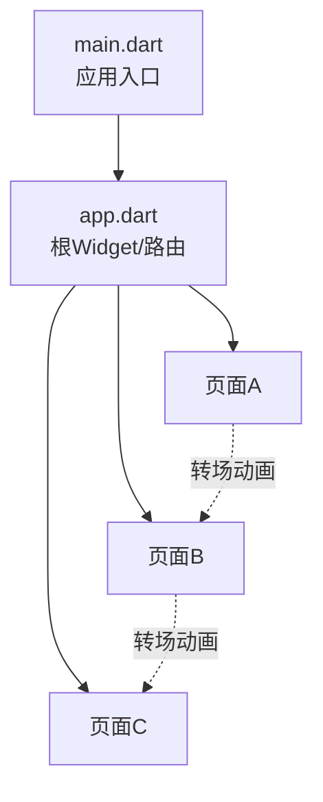
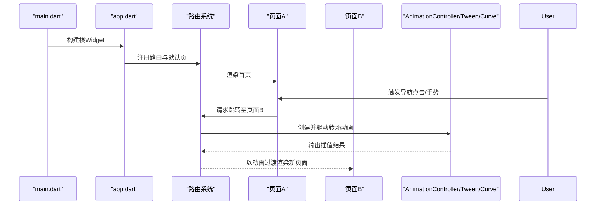
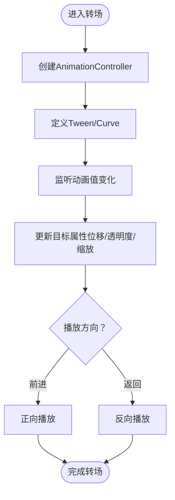
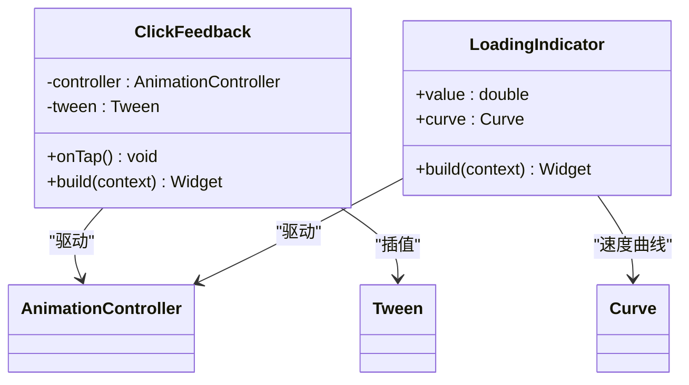
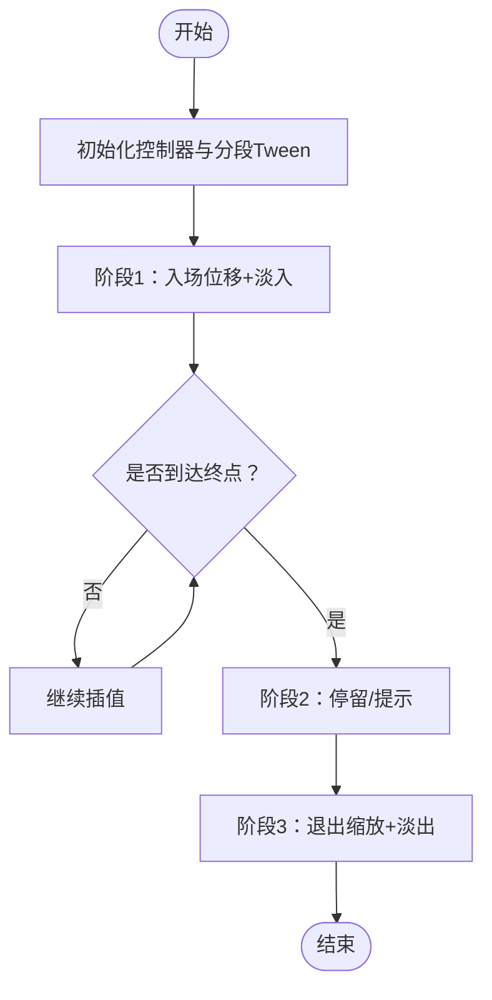
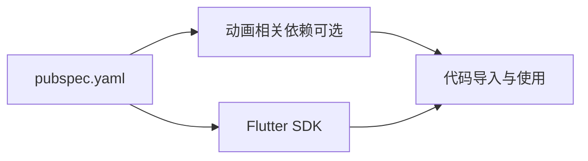

# 动画与过渡效果

<cite>
**本文引用的文件**   
- [lib/main.dart](file://lib/main.dart)
- [lib/app.dart](file://lib/app.dart)
- [pubspec.yaml](file://pubspec.yaml)
</cite>

## 目录
1. [简介](#简介)
2. [项目结构](#项目结构)
3. [核心组件](#核心组件)
4. [架构总览](#架构总览)
5. [详细组件分析](#详细组件分析)
6. [依赖分析](#依赖分析)
7. [性能考虑](#性能考虑)
8. [故障排查指南](#故障排查指南)
9. [结论](#结论)
10. [附录](#附录)

## 简介
本技术文档聚焦于Flutter照片整理AI应用的“动画与过渡效果”实现，围绕Flutter动画系统的核心概念（AnimationController、Tween、Curve）、页面间转场动画、用户交互反馈动画（点击、加载等）、复杂动画的组合与序列控制、性能优化（硬件加速与内存管理）以及设计最佳实践展开。文档同时提供可操作的调试方法与示例路径指引，帮助开发者快速落地高质量动画体验。

## 项目结构
当前仓库为多平台Flutter工程，核心Dart代码位于lib目录。与动画相关的关键入口包括应用主入口与根Widget配置：
- lib/main.dart：应用启动入口，负责初始化全局状态、主题、路由与根Widget。
- lib/app.dart：定义应用根Widget与路由表，是页面级转场动画的集中配置点。
- pubspec.yaml：声明第三方依赖，可能包含用于动画或UI增强的包。

图表来源
- [lib/main.dart:1-200](file://lib/main.dart#L1-L200)
- [lib/app.dart:1-200](file://lib/app.dart#L1-L200)

章节来源
- [lib/main.dart:1-200](file://lib/main.dart#L1-L200)
- [lib/app.dart:1-200](file://lib/app.dart#L1-L200)
- [pubspec.yaml:1-200](file://pubspec.yaml#L1-L200)

## 核心组件
- AnimationController：驱动动画时间轴的核心控制器，负责播放、暂停、反向与停止，并暴露值供Tween/Curve消费。
- Tween<T>：在两个值之间进行插值的工具，常用于数值型（如double、Offset）或颜色、大小等属性的渐变。
- Curve：描述动画速度曲线，如线性、缓入缓出、弹性等，影响动画节奏与感知流畅度。
- AnimatedBuilder / AnimatedWidget：基于动画值重建UI的最小化构件，避免不必要的重绘。
- PageTransitionsBuilder / CustomRoute：页面级转场动画的实现方式，支持Material风格或自定义转场。
- Hero：跨页面共享元素的平滑过渡，适合图片、头像等关键视觉元素。

章节来源
- [lib/app.dart:1-200](file://lib/app.dart#L1-L200)

## 架构总览
下图展示从应用启动到页面转场的整体流程，强调动画控制器与路由层的关系。

图表来源
- [lib/main.dart:1-200](file://lib/main.dart#L1-L200)
- [lib/app.dart:1-200](file://lib/app.dart#L1-L200)

## 详细组件分析

### 页面间转场动画
- 使用Material风格的页面转场：通过路由配置指定转场类型，适用于标准滑动、淡入淡出等。
- 自定义转场：封装PageRoute或PageTransitionsBuilder，结合AnimationController与Tween/Curve实现更丰富的动效（如缩放、旋转、位移组合）。
- Hero过渡：对跨页面的相同元素设置Hero标签，自动处理位置与尺寸变化的平滑过渡，特别适合照片缩略图到详情页大图。

图表来源
- [lib/app.dart:1-200](file://lib/app.dart#L1-L200)

章节来源
- [lib/app.dart:1-200](file://lib/app.dart#L1-L200)

### 用户交互反馈动画
- 点击效果：使用InkWell/InkResponse配合Ripple动画；或通过AnimatedContainer/AnimatedOpacity实现按钮按下时的缩放与透明度变化。
- 加载动画：使用CircularProgressIndicator或自定义AnimatedBuilder绘制进度环；长任务可使用Shimmer骨架屏提升感知速度。
- 列表项反馈：在新增/删除时以SlideTransition+FadeTransition组合，保持布局稳定且视觉连贯。

图表来源
- [lib/app.dart:1-200](file://lib/app.dart#L1-L200)

章节来源
- [lib/app.dart:1-200](file://lib/app.dart#L1-L200)

### 复杂动画的组合与序列控制
- 组合动画：使用AnimationController驱动多个Tween并行执行，或在同一控件上叠加多个AnimatedBuilder分别控制不同属性（如位移+透明度）。
- 序列动画：通过链式调用animateAfter或setState切换阶段，或使用AnimationController的addStatusListener在状态回调中推进下一阶段。
- 条件动画：根据业务状态（加载中、成功、失败）选择不同动画片段，确保用户体验一致。

图表来源
- [lib/app.dart:1-200](file://lib/app.dart#L1-L200)

章节来源
- [lib/app.dart:1-200](file://lib/app.dart#L1-L200)

### 动画设计与最佳实践
- 时长与曲线：常用时长200–400ms，曲线优先选择EaseInOut或BackOut，避免过于突兀的变化。
- 层级与优先级：重要操作（如提交、删除）给予更强反馈（更大位移/更明显透明度），次要操作保持克制。
- 一致性：统一转场风格与反馈模式，降低学习成本。
- 可访问性：尊重系统减少动态效果的设置，提供静态替代方案。

[本节为通用指导，不直接分析具体文件]

## 依赖分析
- Flutter框架内置动画能力（AnimationController、Tween、Curve、AnimatedBuilder、PageRoute等）。
- 若引入第三方包（如flutter_animate、animated_switcher_tab_bar等），需在pubspec.yaml中声明并在代码中导入使用。
- 建议按需引入，避免无关依赖增加包体积与初始化开销。

图表来源
- [pubspec.yaml:1-200](file://pubspec.yaml#L1-L200)

章节来源
- [pubspec.yaml:1-200](file://pubspec.yaml#L1-L200)

## 性能考虑
- 硬件加速：尽量使用GPU友好的属性（如transform、opacity），避免在动画中频繁改变布局（layout）或绘制（paint）密集型节点。
- 最小化重建：将动画相关的Widget下沉为独立StatefulWidget，并使用ValueListenableBuilder/AnimatedBuilder精准重建。
- 复用控制器：避免重复创建AnimationController，必要时使用SingleTickerProviderStateMixin或外部状态管理。
- 帧率保障：减少每帧计算量，避免在动画回调中进行I/O或重型计算；必要时使用compute或后台线程。
- 内存管理：在dispose中释放控制器与订阅，防止泄漏；及时取消未完成的动画。

[本节为通用指导，不直接分析具体文件]

## 故障排查指南
- 卡顿与掉帧：使用DevTools的Performance面板观察帧耗时，定位CPU/GPU瓶颈；检查是否在动画回调中做重计算。
- 闪烁与重绘：确认是否触发了不必要的build；使用RepaintBoundary隔离重绘区域。
- 内存泄漏：检查是否忘记dispose控制器或监听器；确保在页面销毁时清理资源。
- 转场异常：核对路由参数传递是否正确；检查Hero标签是否唯一且匹配。

[本节为通用指导，不直接分析具体文件]

## 结论
通过合理运用AnimationController、Tween、Curve与Flutter路由体系，可以在照片整理应用中实现流畅自然的页面转场与交互反馈。遵循性能优化与最佳实践，能够显著提升用户体验与稳定性。建议在开发过程中持续使用DevTools进行可视化分析与调优。

[本节为总结性内容，不直接分析具体文件]

## 附录
- 示例路径指引（请在对应文件中查找实现）：
  - 页面转场动画：参考路由配置与页面构建处
    - [lib/app.dart:1-200](file://lib/app.dart#L1-L200)
  - 点击与加载反馈：参考按钮与加载组件所在页面
    - [lib/app.dart:1-200](file://lib/app.dart#L1-L200)
  - 复杂动画组合：参考业务页面中的动画逻辑
    - [lib/app.dart:1-200](file://lib/app.dart#L1-L200)
  - 依赖声明：查看第三方动画相关包
    - [pubspec.yaml:1-200](file://pubspec.yaml#L1-L200)