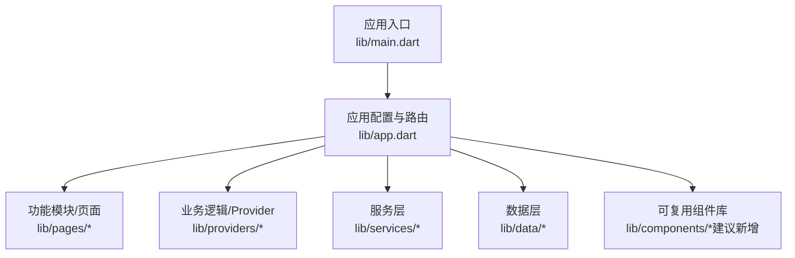
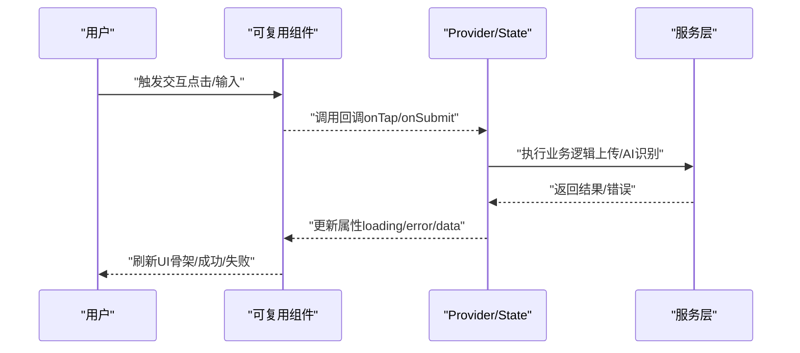
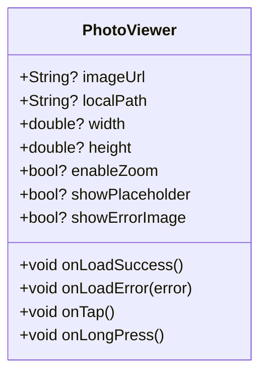
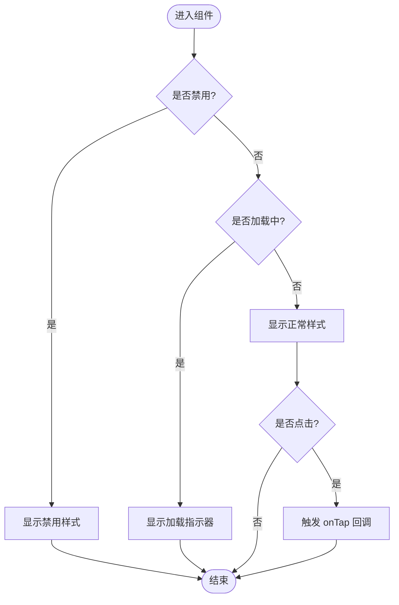
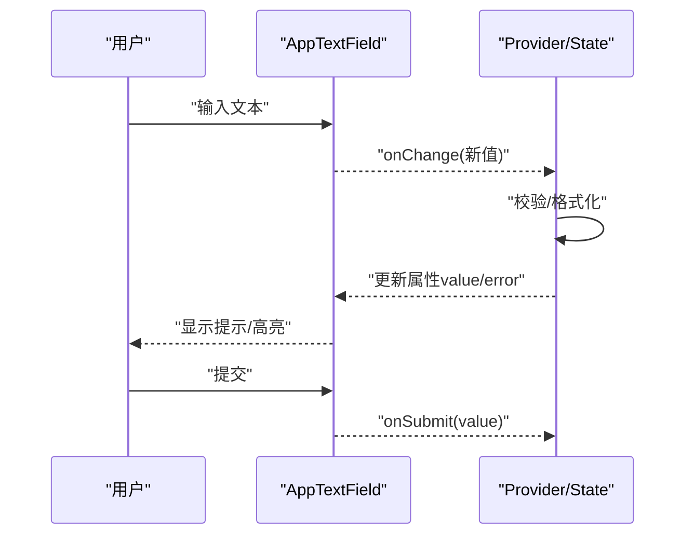
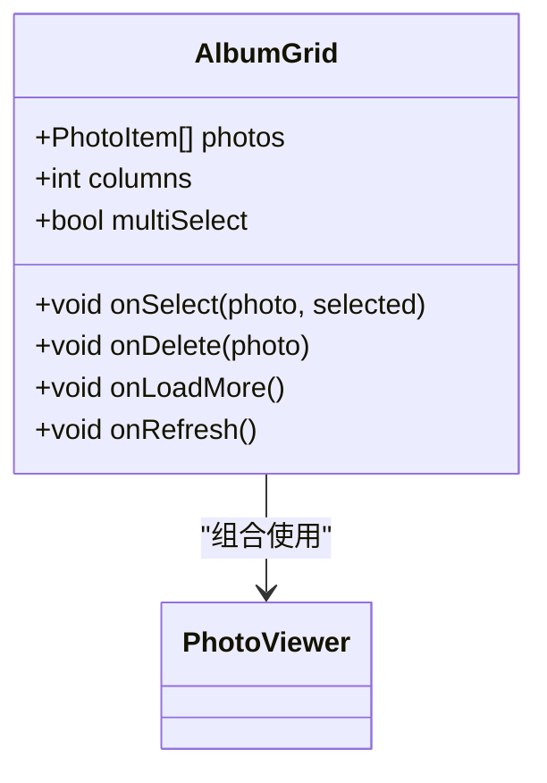
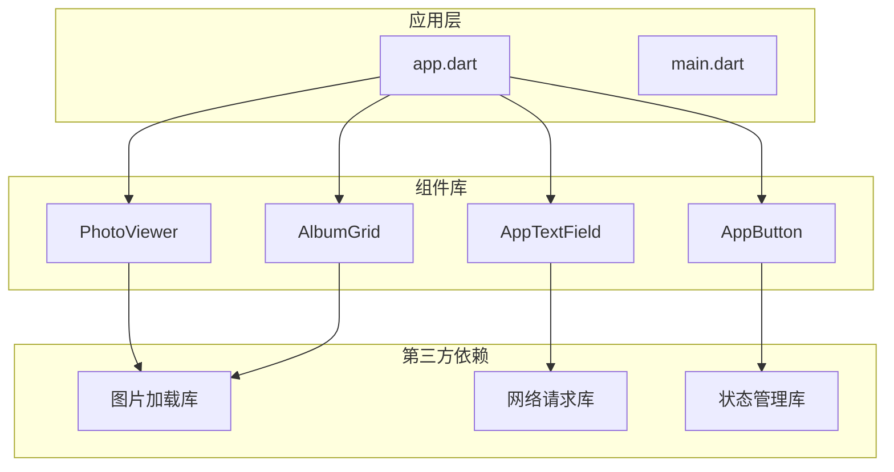

# 可复用组件库

<cite>
**本文引用的文件**   
- [pubspec.yaml](file://pubspec.yaml)
- [main.dart](file://lib/main.dart)
- [app.dart](file://lib/app.dart)
</cite>

## 目录
1. [简介](#简介)
2. [项目结构](#项目结构)
3. [核心组件](#核心组件)
4. [架构总览](#架构总览)
5. [详细组件分析](#详细组件分析)
6. [依赖分析](#依赖分析)
7. [性能考虑](#性能考虑)
8. [故障排查指南](#故障排查指南)
9. [结论](#结论)
10. [附录](#附录)

## 简介
本技术文档面向“Flutter 照片整理 AI 应用”的可复用组件库，聚焦于自定义 Widget 的设计与封装原则、API 设计模式、状态管理与数据流、测试策略与文档规范，以及常见组件（图片展示、按钮、输入框）的实现要点与扩展方式。由于当前仓库尚未包含具体的组件实现代码，本文提供一套基于 Flutter 最佳实践的可复用组件库设计与落地方案，并给出在现有工程中的集成路径与示例位置指引。

## 项目结构
当前仓库采用 Flutter 标准工程结构，核心 Dart 代码位于 lib 目录，平台相关代码分别位于 android、ios、windows、macos、linux、web 等目录。根据目标，组件库应统一收敛至 lib 下的 features 或独立 components 目录，便于跨页面复用与版本管理。

图表来源
- [main.dart:1-200](file://lib/main.dart#L1-L200)
- [app.dart:1-200](file://lib/app.dart#L1-L200)

章节来源
- [pubspec.yaml](file://pubspec.yaml)
- [main.dart:1-200](file://lib/main.dart#L1-L200)
- [app.dart:1-200](file://lib/app.dart#L1-L200)

## 核心组件
围绕照片整理场景，建议优先沉淀以下可复用组件：
- 图片展示组件：支持本地/网络图片、占位图、错误态、缩放、裁剪、圆角、阴影、点击反馈、懒加载等。
- 按钮组件：主按钮、次按钮、图标按钮、禁用态、加载态、尺寸与主题适配。
- 输入框组件：文本输入、搜索、带前缀/后缀、校验提示、防抖提交、键盘行为控制。
- 相册网格组件：瀑布流/网格布局、分页加载、选择多选、长按预览、批量操作。
- 标签与筛选组件：按日期、地点、人物、AI 分类等维度筛选。
- 进度与反馈组件：上传进度、AI 处理中骨架屏、Toast/Snackbar。

组件设计原则
- 单一职责：每个组件只负责一个 UI/交互职责。
- 属性驱动：通过不可变属性控制外观与行为，避免内部状态泄露。
- 事件回调：对外暴露明确的事件回调，如 onTap、onSelect、onError。
- 样式解耦：默认样式与主题系统结合，支持覆盖。
- 可组合性：小颗粒度组件组合出复杂界面。
- 可测试性：纯函数式渲染 + 明确输入输出，便于单元测试与 widget 测试。

章节来源
- [pubspec.yaml](file://pubspec.yaml)

## 架构总览
组件库与应用层的交互遵循“单向数据流”与“受控组件”模式：
- 组件接收属性（props），不直接持有外部状态。
- 用户交互通过回调上报给上层 Provider/Service。
- 上层更新状态后，以新属性回传给组件触发重建。

图表来源
- [app.dart:1-200](file://lib/app.dart#L1-L200)
- [main.dart:1-200](file://lib/main.dart#L1-L200)

## 详细组件分析

### 图片展示组件（PhotoViewer）
职责
- 显示本地/网络图片，处理加载、错误、缓存、占位图。
- 支持缩放、旋转、裁剪、圆角、阴影、点击放大预览。
- 提供懒加载与内存优化。

API 设计模式
- 必需属性：图片源（本地路径或网络 URL）。
- 可选属性：占位图、错误图、尺寸、圆角、阴影、是否可缩放、点击回调、懒加载开关。
- 事件回调：onLoadSuccess、onLoadError、onTap、onLongPress。
- 样式配置：主题色、边框、背景、动画时长。

状态与数据流
- 内部维护加载状态（idle/loading/success/error）。
- 通过回调将错误信息上报上层，由上层决定是否重试或降级。
- 大图使用缓存策略，避免重复下载。

图表来源
- [app.dart:1-200](file://lib/app.dart#L1-L200)
- [main.dart:1-200](file://lib/main.dart#L1-L200)

章节来源
- [pubspec.yaml](file://pubspec.yaml)

### 按钮组件（AppButton）
职责
- 统一的按钮样式与交互，支持主/次/图标/禁用/加载态。
- 与主题系统联动，支持自定义颜色、形状、阴影。

API 设计模式
- 必需属性：文本或图标、点击回调。
- 可选属性：尺寸、样式类型、禁用态、加载态、外边距、内边距、对齐方式。
- 事件回调：onTap、onDoubleTap、onLongPress。

状态与数据流
- 受控组件：通过 loading/disabled 属性控制交互。
- 点击时触发回调，由上层处理业务逻辑。

图表来源
- [app.dart:1-200](file://lib/app.dart#L1-L200)
- [main.dart:1-200](file://lib/main.dart#L1-L200)

章节来源
- [pubspec.yaml](file://pubspec.yaml)

### 输入框组件（AppTextField）
职责
- 文本输入、搜索、带前缀/后缀、校验提示、键盘行为控制。
- 支持防抖提交、自动完成、密码可见切换。

API 设计模式
- 必需属性：控制器或初始值、输入回调。
- 可选属性：占位符、前缀/后缀、最大长度、校验规则、键盘类型、自动对焦、隐藏密码。
- 事件回调：onChange、onSubmit、onFocusChange、onError。

状态与数据流
- 受控或非受控两种模式：推荐受控模式，由上层状态驱动。
- 校验失败时显示错误提示，阻止提交。

图表来源
- [app.dart:1-200](file://lib/app.dart#L1-L200)
- [main.dart:1-200](file://lib/main.dart#L1-L200)

章节来源
- [pubspec.yaml](file://pubspec.yaml)

### 相册网格组件（AlbumGrid）
职责
- 网格/瀑布流展示图片缩略图，支持分页加载、多选、长按预览、批量删除。
- 与 PhotoViewer 组合，复用图片加载能力。

API 设计模式
- 必需属性：图片列表、选择回调。
- 可选属性：列数、间距、选择模式、空态视图、加载指示器。
- 事件回调：onSelect、onDelete、onLoadMore、onRefresh。

状态与数据流
- 内部维护选中集合，通过回调同步到上层。
- 分页加载时合并数据，避免重复请求。

图表来源
- [app.dart:1-200](file://lib/app.dart#L1-L200)
- [main.dart:1-200](file://lib/main.dart#L1-L200)

章节来源
- [pubspec.yaml](file://pubspec.yaml)

## 依赖分析
- 组件库应尽量低耦合，仅依赖必要的第三方包（如图片加载、网络请求、状态管理）。
- 通过 pubspec.yaml 声明依赖，确保版本稳定与可复现构建。
- 建议在组件库中抽象网络与存储接口，便于替换实现与测试。

图表来源
- [pubspec.yaml](file://pubspec.yaml)
- [app.dart:1-200](file://lib/app.dart#L1-L200)
- [main.dart:1-200](file://lib/main.dart#L1-L200)

章节来源
- [pubspec.yaml](file://pubspec.yaml)

## 性能考虑
- 图片组件：启用缓存、按需加载、限制并发、使用合适的分辨率与格式。
- 列表组件：分页加载、虚拟列表、避免频繁重建。
- 状态管理：局部状态与全局状态分离，减少不必要的 rebuild。
- 主题与样式：集中管理，避免重复计算。
- 资源优化：压缩图片、延迟初始化、异步加载。

## 故障排查指南
常见问题与定位思路
- 图片加载失败：检查网络权限、URL 有效性、缓存策略、错误回调处理。
- 输入校验不生效：确认受控模式是否正确绑定 value 与 onChange。
- 按钮点击无响应：检查 disabled/loading 状态、事件冒泡、回调注册。
- 列表卡顿：检查数据量、重建范围、图片解码开销。
- 主题不生效：确认 Theme 包裹范围、组件是否读取正确属性。

调试建议
- 使用 Flutter DevTools 观察 widget 树与性能指标。
- 为关键组件添加日志与埋点，区分网络/IO/渲染耗时。
- 编写单元测试与 widget 测试，覆盖边界条件与异常路径。

## 结论
本方案为 Flutter 照片整理 AI 应用的组件库提供了清晰的设计原则、API 模式、状态管理与数据流规范，并给出了图片展示、按钮、输入框、相册网格等核心组件的实现要点与扩展指南。按照本文建议落地，可在保证一致性与可维护性的同时，提升开发效率与用户体验。

## 附录
- 组件继承与扩展：通过 Mixin 共享行为，或通过组合复用基础组件。
- 文档编写规范：为每个组件提供 API 说明、属性含义、默认值、示例用法与注意事项。
- 测试策略：单元/集成/端到端测试分层，重点覆盖交互与边界条件。
- 发布与版本管理：语义化版本、变更日志、向后兼容性保障。