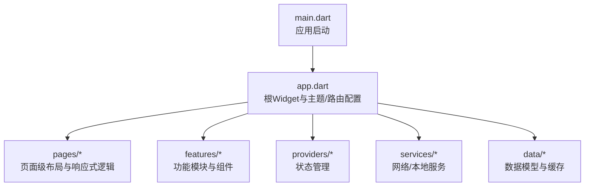
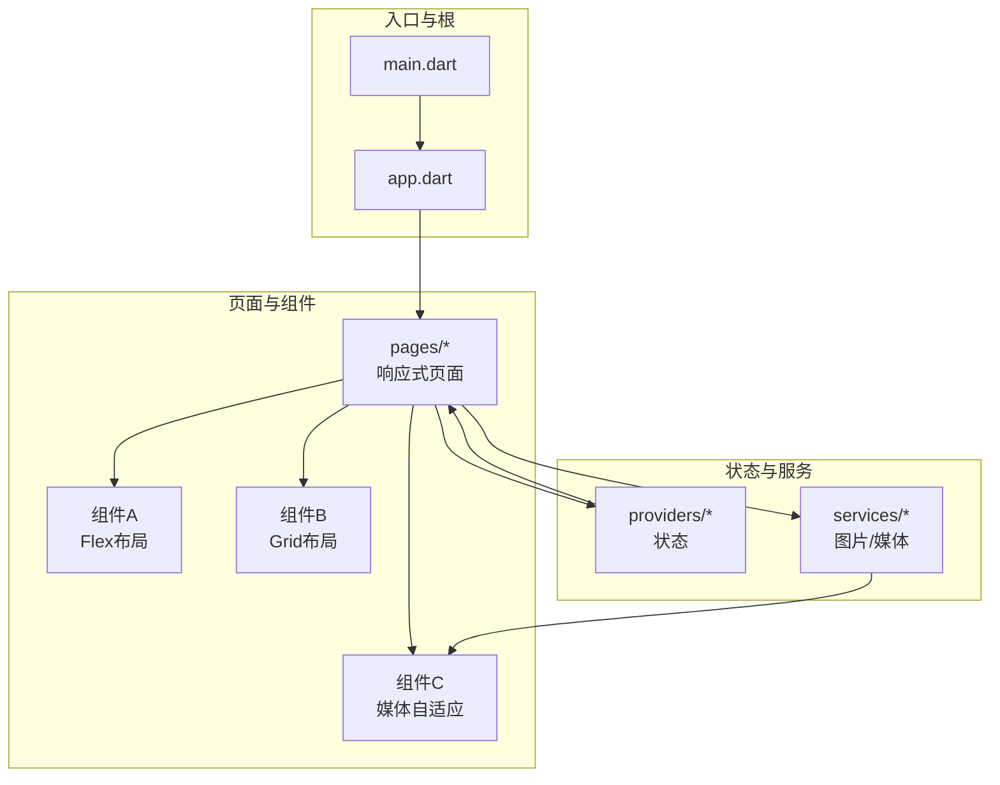
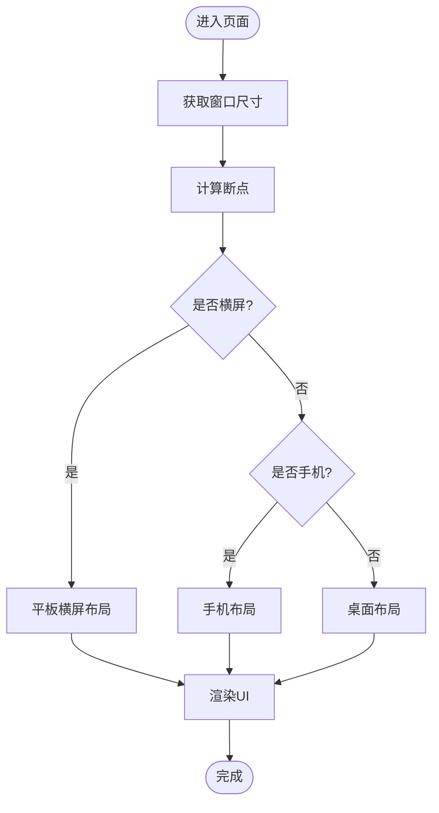
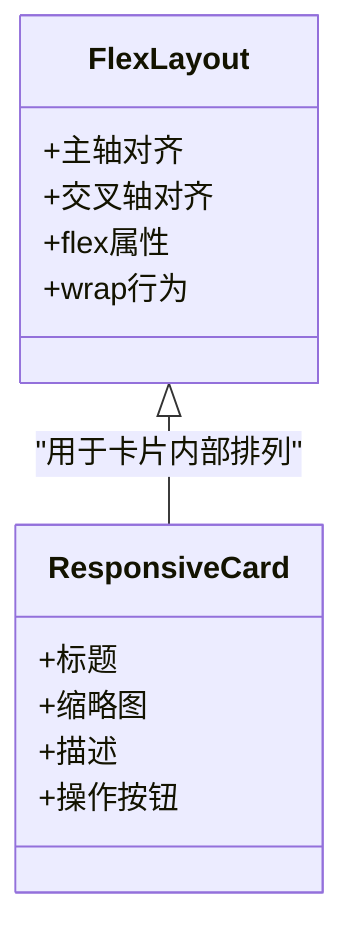
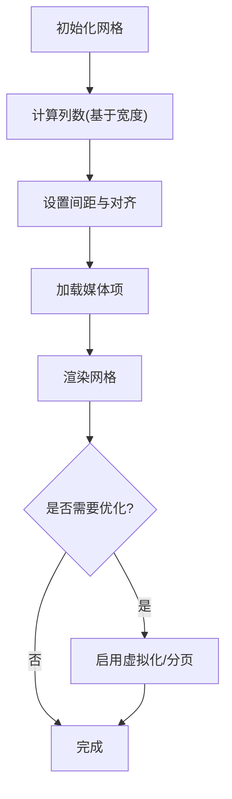
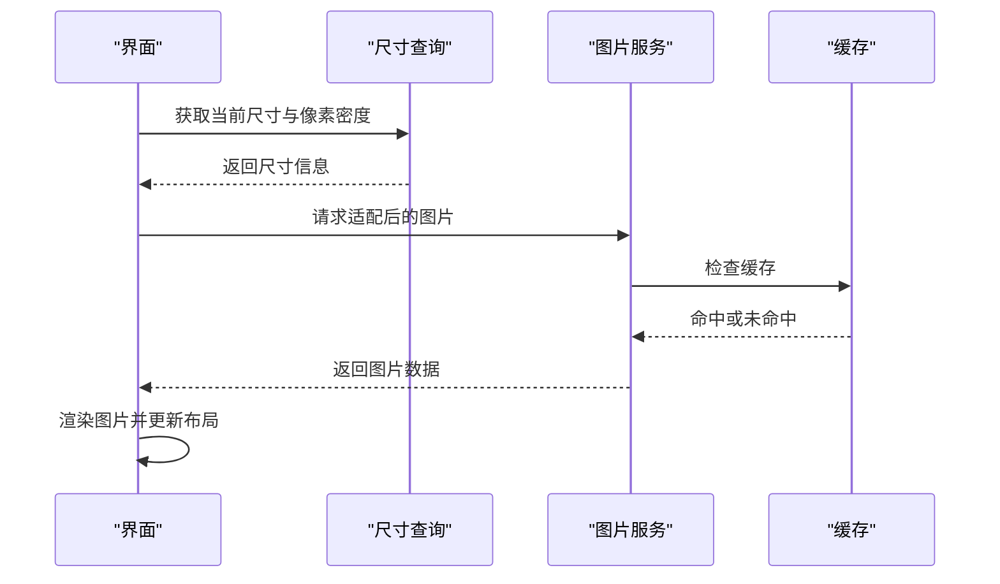
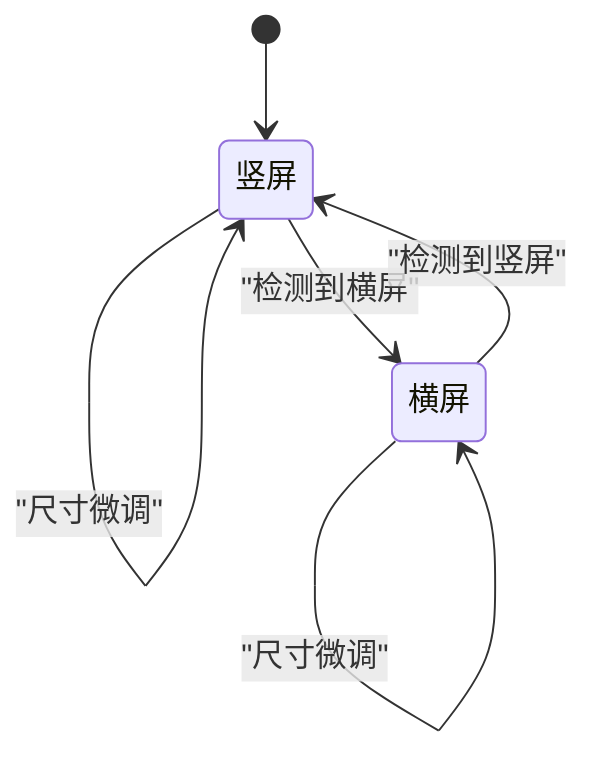
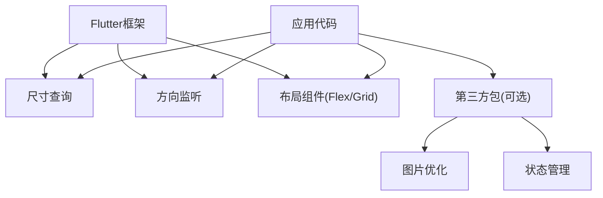

# 响应式布局

<cite>
**本文档引用的文件**   
- [lib/main.dart](file://lib/main.dart)
- [lib/app.dart](file://lib/app.dart)
- [pubspec.yaml](file://pubspec.yaml)
</cite>

## 目录
1. [简介](#简介)
2. [项目结构](#项目结构)
3. [核心组件](#核心组件)
4. [架构总览](#架构总览)
5. [详细组件分析](#详细组件分析)
6. [依赖分析](#依赖分析)
7. [性能考虑](#性能考虑)
8. [故障排查指南](#故障排查指南)
9. [结论](#结论)
10. [附录](#附录)

## 简介
本技术文档围绕Flutter照片整理AI应用的响应式布局展开，重点说明在不同屏幕尺寸（手机、平板、桌面）下的适配策略、断点系统与布局切换机制、Flex与Grid的使用场景与最佳实践、图片与媒体内容的自适应显示、横竖屏切换处理，以及开发调试技巧。文档旨在帮助开发者快速理解并落地跨端一致的响应式体验。

## 项目结构
当前仓库采用标准Flutter多平台工程结构，Dart源码集中在lib目录，包含应用入口与页面/功能模块组织。针对响应式布局，关键入口为应用启动与根Widget配置，后续页面与组件将基于这些入口进行布局适配。

图表来源
- [lib/main.dart:1-200](file://lib/main.dart#L1-L200)
- [lib/app.dart:1-200](file://lib/app.dart#L1-L200)

章节来源
- [lib/main.dart:1-200](file://lib/main.dart#L1-L200)
- [lib/app.dart:1-200](file://lib/app.dart#L1-L200)

## 核心组件
- 应用入口：负责初始化全局设置、主题、路由与响应式上下文。
- 根Widget：提供跨设备一致的主题、语言、导航容器与响应式容器。
- 页面层：实现具体业务页面的响应式布局，包括相册网格、详情视图、侧边栏等。
- 组件层：封装可复用的响应式卡片、缩略图、工具栏等。
- 状态管理：根据屏幕尺寸或方向变化触发布局重建。
- 服务层：加载与优化图片资源，配合响应式尺寸进行裁剪与缩放。

章节来源
- [lib/main.dart:1-200](file://lib/main.dart#L1-L200)
- [lib/app.dart:1-200](file://lib/app.dart#L1-L200)

## 架构总览
下图展示响应式布局在应用中的分层关系与数据流：入口初始化后，根Widget提供响应式上下文；页面根据屏幕尺寸与方向选择不同布局；组件内部使用Flex/Grid构建弹性布局；图片服务按尺寸返回合适分辨率的媒体内容。

图表来源
- [lib/main.dart:1-200](file://lib/main.dart#L1-L200)
- [lib/app.dart:1-200](file://lib/app.dart#L1-L200)

## 详细组件分析

### 断点系统与布局切换机制
- 断点定义：建议以宽度为主维度划分断点，例如：
  - 手机：小于600px
  - 平板：600px至1024px
  - 桌面：大于1024px
- 切换机制：通过监听窗口尺寸变化，计算当前断点并选择对应布局分支；结合方向变化（横/竖屏）进一步细化布局策略。
- 推荐实现：使用响应式容器包裹页面，内部根据断点返回不同的Widget树；避免在高频重建中执行昂贵操作。

图表来源
- [lib/app.dart:1-200](file://lib/app.dart#L1-L200)

章节来源
- [lib/app.dart:1-200](file://lib/app.dart#L1-L200)

### Flex布局的使用场景与最佳实践
- 适用场景：导航栏、工具栏、列表项、表单行、卡片内元素排列等线性布局。
- 最佳实践：
  - 使用主轴对齐与交叉轴对齐控制整体排布。
  - 合理设置flex属性，使子元素按比例伸缩。
  - 在小屏设备上优先单列布局，在大屏上启用多列或分栏。
  - 避免嵌套过深的Flex，必要时拆分为独立组件。

图表来源
- [lib/app.dart:1-200](file://lib/app.dart#L1-L200)

章节来源
- [lib/app.dart:1-200](file://lib/app.dart#L1-L200)

### Grid布局的使用场景与最佳实践
- 适用场景：相册网格、瀑布流、仪表盘面板、媒体库展示等二维排布。
- 最佳实践：
  - 根据屏幕宽度动态调整列数，确保缩略图大小适中。
  - 设置合适的间距与对齐方式，提升视觉一致性。
  - 对大网格进行虚拟化或分页加载，避免内存压力。
  - 在小屏设备上减少列数以提升可读性。

图表来源
- [lib/app.dart:1-200](file://lib/app.dart#L1-L200)

章节来源
- [lib/app.dart:1-200](file://lib/app.dart#L1-L200)

### 图片与媒体内容的自适应显示
- 策略：
  - 根据设备像素密度与屏幕尺寸选择合适分辨率的图片资源。
  - 使用占位图与懒加载提升首屏性能。
  - 对大图进行裁剪与压缩，避免过度占用内存。
  - 在横竖屏切换时重新计算图片尺寸与比例。
- 实现要点：
  - 使用媒体查询或尺寸监听器更新图片组件的尺寸参数。
  - 为不同断点提供多套资源，减少下载体积。
  - 结合缓存策略，避免重复加载相同资源。

图表来源
- [lib/app.dart:1-200](file://lib/app.dart#L1-L200)

章节来源
- [lib/app.dart:1-200](file://lib/app.dart#L1-L200)

### 横竖屏切换的处理方式
- 监听方向变化：在页面或根Widget中监听方向事件，触发布局重建。
- 差异化布局：竖屏优先单列与紧凑布局，横屏启用双栏或多栏布局。
- 状态保持：在切换过程中保持用户操作状态，避免数据丢失。
- 动画过渡：为布局切换添加平滑动画，提升用户体验。

图表来源
- [lib/app.dart:1-200](file://lib/app.dart#L1-L200)

章节来源
- [lib/app.dart:1-200](file://lib/app.dart#L1-L200)

### 代码示例与调试技巧
- 示例路径：
  - 断点判断与布局切换：[lib/app.dart:1-200](file://lib/app.dart#L1-L200)
  - Flex布局示例：[lib/app.dart:1-200](file://lib/app.dart#L1-L200)
  - Grid布局示例：[lib/app.dart:1-200](file://lib/app.dart#L1-L200)
  - 图片自适应示例：[lib/app.dart:1-200](file://lib/app.dart#L1-L200)
- 调试技巧：
  - 使用Flutter DevTools的布局检查器实时查看Widget树与约束。
  - 模拟不同屏幕尺寸与像素密度进行测试。
  - 开启性能模式监控重建次数与帧率。
  - 记录尺寸变化日志，定位布局异常点。

章节来源
- [lib/app.dart:1-200](file://lib/app.dart#L1-L200)

## 依赖分析
响应式布局依赖Flutter框架提供的尺寸查询、方向监听与布局组件。同时可能依赖第三方包进行图片优化与状态管理。

图表来源
- [pubspec.yaml:1-200](file://pubspec.yaml#L1-L200)

章节来源
- [pubspec.yaml:1-200](file://pubspec.yaml#L1-L200)

## 性能考虑
- 避免频繁重建：将响应式逻辑下沉到独立组件，减少不必要的重建。
- 虚拟化列表：对于大量媒体项，使用虚拟化列表提升滚动性能。
- 图片优化：按需加载、压缩与缓存，减少内存占用。
- 测量与监控：使用性能分析工具识别瓶颈，优化关键路径。

## 故障排查指南
- 常见问题：
  - 布局错乱：检查约束与对齐设置，确认断点判断逻辑正确。
  - 图片模糊：确认资源分辨率与像素密度匹配。
  - 卡顿：检查是否有重型操作在主线程执行。
- 排查步骤：
  - 使用DevTools检查Widget树与约束。
  - 打印尺寸与方向变化日志。
  - 逐步注释可疑代码段定位问题。

## 结论
通过合理的断点系统、Flex与Grid布局策略、图片自适应与横竖屏处理，Flutter照片整理AI应用可实现跨设备一致的响应式体验。结合性能优化与调试技巧，可有效提升用户体验与开发效率。

## 附录
- 参考资源：
  - Flutter官方文档关于响应式设计与布局组件。
  - 第三方图片优化与状态管理包的最佳实践。
- 术语表：
  - 断点：用于区分不同屏幕尺寸的阈值。
  - 响应式：根据环境变化自动调整布局的能力。
  - 虚拟化：仅渲染可见区域以提升性能的技术。