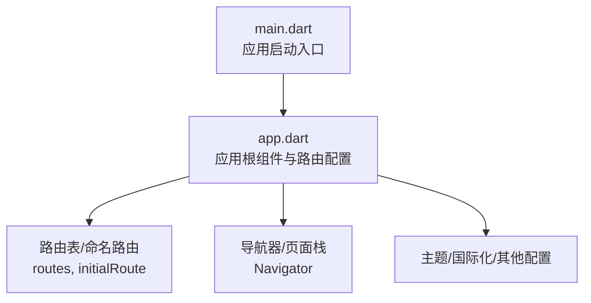
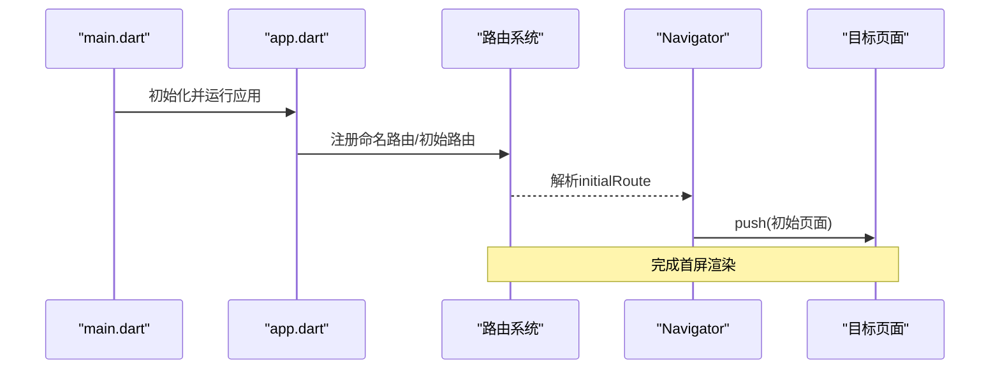
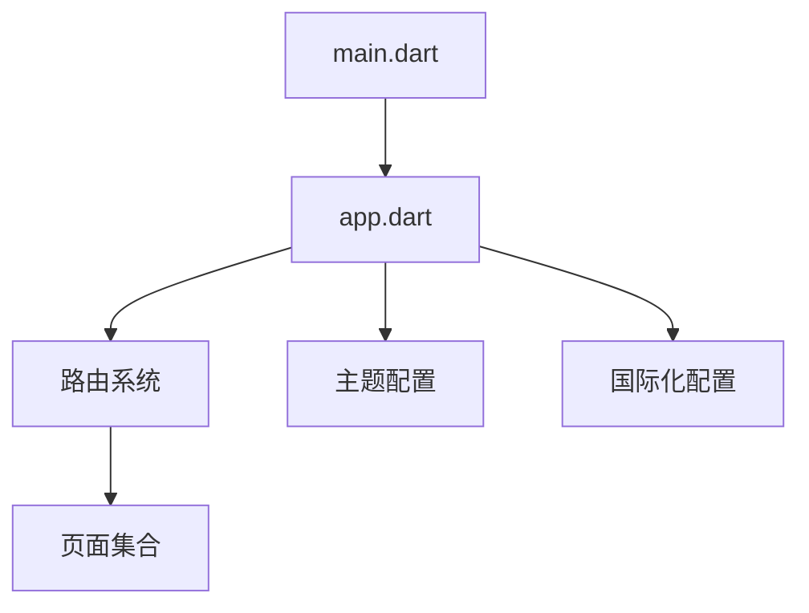

# 导航与路由

<cite>
**本文引用的文件**   
- [main.dart](file://lib/main.dart)
- [app.dart](file://lib/app.dart)
</cite>

## 目录
1. [简介](#简介)
2. [项目结构](#项目结构)
3. [核心组件](#核心组件)
4. [架构总览](#架构总览)
5. [详细组件分析](#详细组件分析)
6. [依赖关系分析](#依赖关系分析)
7. [性能考虑](#性能考虑)
8. [故障排查指南](#故障排查指南)
9. [结论](#结论)
10. [附录](#附录)

## 简介
本技术文档聚焦于Flutter照片整理AI应用的导航与路由系统，围绕命名路由、函数式路由、参数传递与接收、嵌套路由与Tab导航、路由守卫与权限控制、后退处理与页面栈管理、导航动画与过渡效果设计，以及路由优化（懒加载与预加载）等主题进行系统化说明。文档旨在帮助开发者快速理解并落地一套可维护、可扩展、高性能的导航方案。

## 项目结构
本项目采用典型的Flutter分层组织方式，入口文件位于lib目录下：
- lib/main.dart：应用启动入口，负责初始化全局配置与运行应用。
- lib/app.dart：应用根组件定义，通常包含MaterialApp或CupertinoApp的配置，集中声明路由表、初始路由、主题、国际化等。

图表来源
- [main.dart:1-200](file://lib/main.dart#L1-L200)
- [app.dart:1-200](file://lib/app.dart#L1-L200)

章节来源
- [main.dart:1-200](file://lib/main.dart#L1-L200)
- [app.dart:1-200](file://lib/app.dart#L1-L200)

## 核心组件
- MaterialApp/CupertinoApp：作为应用根组件，提供导航上下文、主题、路由、国际化等能力。
- Navigator：负责页面栈管理与页面跳转，支持push/pop等操作。
- Route/Named Routes：命名路由通过字符串标识页面，便于集中管理与权限校验。
- GoRouter（可选）：声明式路由库，适合复杂场景下的嵌套路由、深度链接与状态同步。

章节来源
- [app.dart:1-200](file://lib/app.dart#L1-L200)

## 架构总览
下图展示了应用启动到路由解析的核心流程，包括入口初始化、根组件装配、路由表注册与首次路由匹配。

图表来源
- [main.dart:1-200](file://lib/main.dart#L1-L200)
- [app.dart:1-200](file://lib/app.dart#L1-L200)

## 详细组件分析

### 命名路由与函数式路由
- 命名路由：在应用根组件中集中声明路由映射，使用字符串键值对表示页面路径与页面构建器。优点是可读性强、易于集中管理；缺点是对动态参数和复杂逻辑的支持较弱。
- 函数式路由：通过回调函数返回页面实例，适合需要动态计算或条件渲染的场景。可与命名路由结合使用，实现更灵活的跳转策略。

建议实践
- 将静态页面使用命名路由，动态页面使用函数式路由。
- 统一封装路由常量，避免硬编码字符串。

章节来源
- [app.dart:1-200](file://lib/app.dart#L1-L200)

### 路由参数的传递与接收
- 传递方式：
  - 命名路由：通过arguments参数传递对象或Map。
  - 函数式路由：直接传入参数给页面构建器。
- 接收方式：
  - 命名路由：在页面内通过ModalRoute.of(context).settings.arguments获取。
  - 函数式路由：直接从构建参数读取。

注意事项
- 确保参数类型安全，必要时进行空值与格式校验。
- 对于复杂对象，建议使用序列化或专用数据模型。

章节来源
- [app.dart:1-200](file://lib/app.dart#L1-L200)

### 嵌套路由与Tab导航
- 嵌套路由：适用于具有多层级结构的页面，如相册分类、详情页、编辑页等。可通过GoRouter或Navigator.push嵌套实现。
- Tab导航：推荐使用BottomNavigationBar配合IndexedStack或Scaffold.body切换，保持状态与性能。

最佳实践
- 将Tab内容拆分为独立页面，按需加载。
- 使用IndexedStack保留Tab状态，避免重复创建。

章节来源
- [app.dart:1-200](file://lib/app.dart#L1-L200)

### 路由守卫与权限控制
- 路由守卫：在路由跳转前进行权限校验，未授权时重定向至登录页或提示。
- 实现方式：
  - 命名路由：在路由构建器中进行判断。
  - GoRouter：使用redirect回调集中处理。

建议流程
- 检查用户登录状态与角色权限。
- 根据结果决定允许跳转或重定向。

章节来源
- [app.dart:1-200](file://lib/app.dart#L1-L200)

### 后退处理与页面栈管理
- 后退处理：监听系统返回键，自定义返回逻辑（如确认退出、保存草稿）。
- 页面栈管理：合理使用popUntil、removeUntil等方法清理无用页面，避免内存泄漏。

注意事项
- 避免在深层页面频繁调用pop导致栈混乱。
- 在退出前保存必要状态，提升用户体验。

章节来源
- [app.dart:1-200](file://lib/app.dart#L1-L200)

### 导航动画与过渡效果
- 内置动画：MaterialPageRoute默认提供页面进入/退出动画。
- 自定义动画：通过PageTransitionsTheme或自定义TransitionBuilder实现品牌化过渡。
- 性能考量：避免复杂动画影响首帧渲染，必要时降级为简单动画。

建议
- 为关键操作（如拍照、上传）添加进度反馈动画。
- 在不同平台保持一致的视觉体验。

章节来源
- [app.dart:1-200](file://lib/app.dart#L1-L200)

### 路由优化：懒加载与预加载
- 懒加载：按需加载页面代码，减少初始包体积。
- 预加载：对高频访问页面进行预加载，提升响应速度。
- 实现方式：
  - 使用deferred import进行代码分割。
  - 在后台线程预加载资源或数据。

建议
- 对首屏页面禁用懒加载，保证启动速度。
- 对非关键路径页面启用懒加载，平衡性能与体验。

章节来源
- [app.dart:1-200](file://lib/app.dart#L1-L200)

## 依赖关系分析
下图展示了应用启动过程中各模块的依赖关系，包括入口文件、根组件、路由系统与页面。

图表来源
- [main.dart:1-200](file://lib/main.dart#L1-L200)
- [app.dart:1-200](file://lib/app.dart#L1-L200)

章节来源
- [main.dart:1-200](file://lib/main.dart#L1-L200)
- [app.dart:1-200](file://lib/app.dart#L1-L200)

## 性能考虑
- 首屏优化：精简路由表，避免在initialRoute中执行耗时操作。
- 内存管理：及时释放不再使用的页面与资源，防止内存泄漏。
- 动画性能：限制同时运行的动画数量，避免卡顿。
- 网络请求：在路由跳转后异步加载数据，避免阻塞UI。

## 故障排查指南
- 路由无法匹配：检查路由表配置与路径拼写。
- 参数丢失：确认传递与接收方式一致，注意类型转换。
- 权限异常：调试守卫逻辑，检查用户状态更新时机。
- 动画卡顿：简化动画复杂度，监控帧率变化。

## 结论
通过合理设计命名路由与函数式路由、完善参数传递机制、实现嵌套路由与Tab导航、加强路由守卫与权限控制、优化后退处理与页面栈管理、设计流畅的导航动画，并结合懒加载与预加载策略，可以构建一个高效、稳定、易维护的Flutter导航系统。建议在实际项目中逐步迭代，持续优化用户体验与性能表现。

## 附录
- 推荐工具：GoRouter用于复杂路由场景，Routemaster用于声明式路由管理。
- 参考文档：Flutter官方导航与路由指南、GoRouter文档。
- 测试建议：编写路由单元测试与集成测试，覆盖边界情况与异常路径。