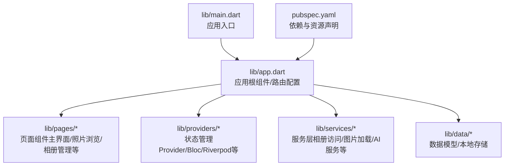
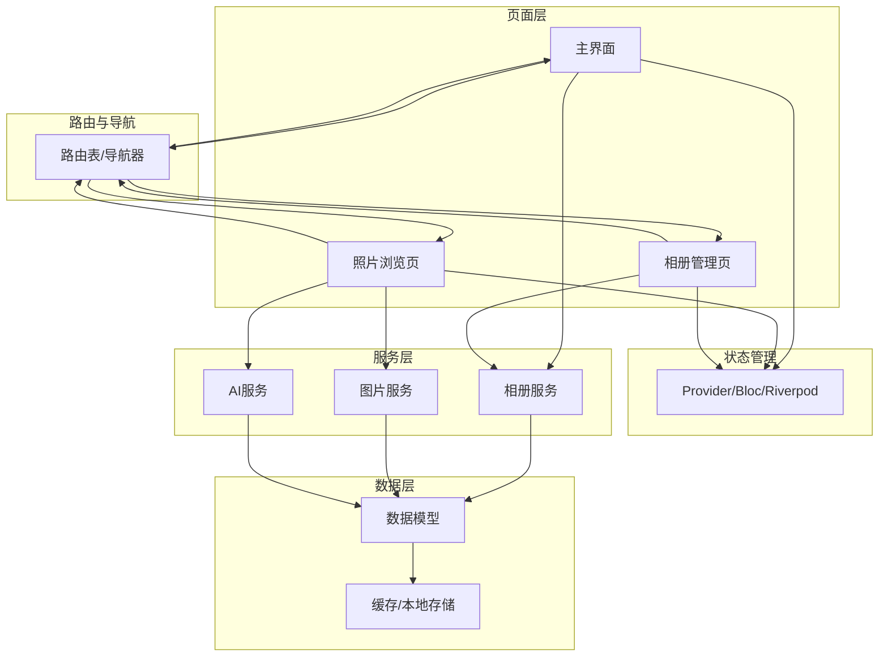
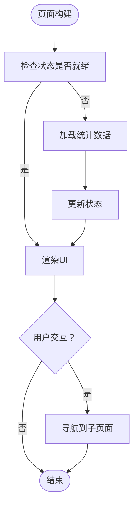
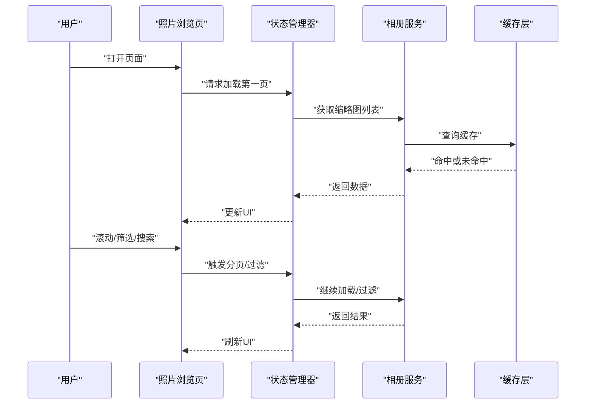
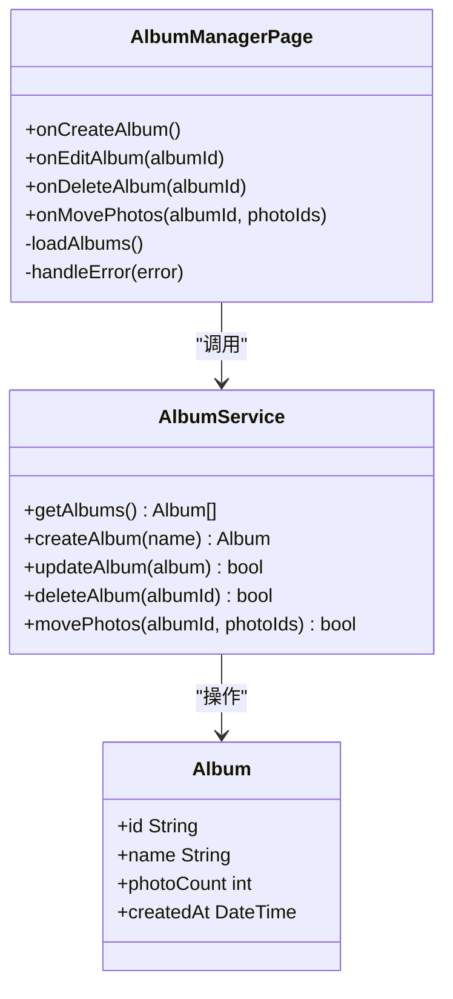
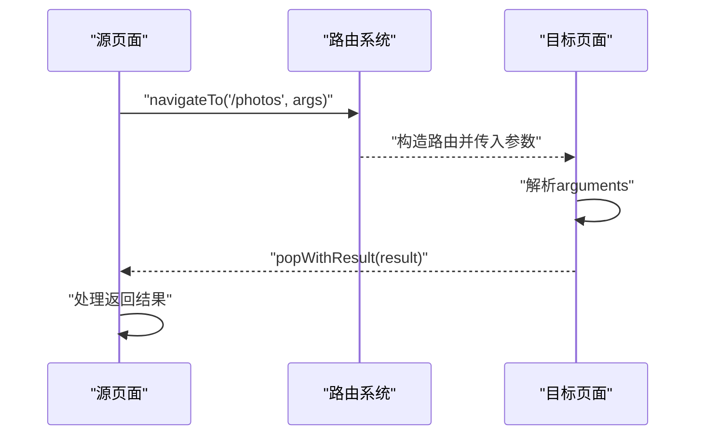
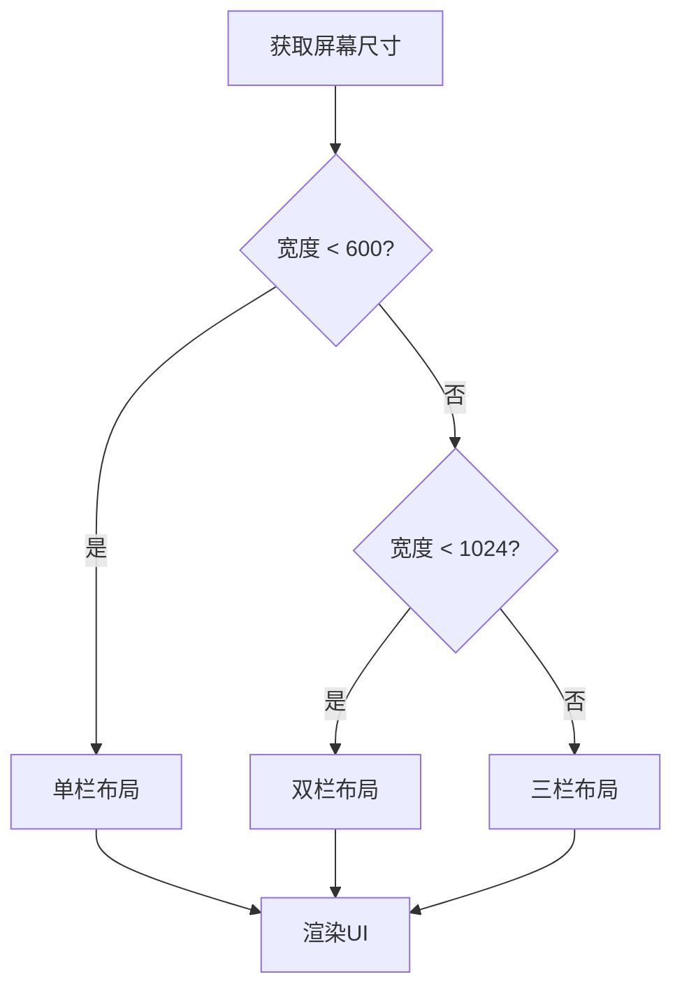
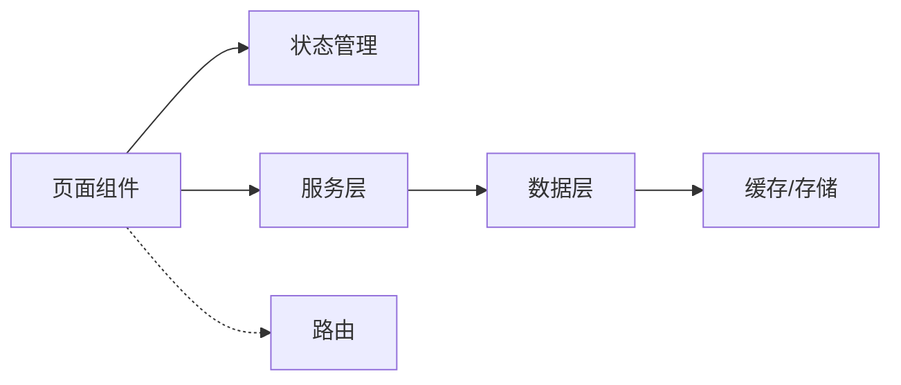

# 页面组件设计

<cite>
**本文引用的文件**   
- [main.dart](file://lib/main.dart)
- [app.dart](file://lib/app.dart)
- [pubspec.yaml](file://pubspec.yaml)
</cite>

## 目录
1. [简介](#简介)
2. [项目结构](#项目结构)
3. [核心组件](#核心组件)
4. [架构总览](#架构总览)
5. [详细组件分析](#详细组件分析)
6. [依赖分析](#依赖分析)
7. [性能考虑](#性能考虑)
8. [故障排查指南](#故障排查指南)
9. [结论](#结论)
10. [附录](#附录)

## 简介
本技术文档面向Flutter照片整理AI应用的页面组件设计与实现，聚焦主界面、照片浏览页、相册管理页等核心页面的生命周期管理、状态处理、数据绑定、导航与路由机制、响应式布局适配以及性能优化策略。文档以代码级分析与可视化图示为主，辅以最佳实践与常见问题排查建议，帮助开发者快速理解并高效扩展页面能力。

## 项目结构
本项目采用Flutter标准工程结构，入口为lib/main.dart，应用配置在lib/app.dart中定义，依赖声明位于pubspec.yaml。当前仓库的lib目录下包含data、features、pages、providers、services等模块划分，便于按功能组织页面与业务逻辑。

图表来源
- [main.dart:1-200](file://lib/main.dart#L1-L200)
- [app.dart:1-200](file://lib/app.dart#L1-L200)
- [pubspec.yaml:1-200](file://pubspec.yaml#L1-L200)

章节来源
- [main.dart:1-200](file://lib/main.dart#L1-L200)
- [app.dart:1-200](file://lib/app.dart#L1-L200)
- [pubspec.yaml:1-200](file://pubspec.yaml#L1-L200)

## 核心组件
- 应用入口与初始化：负责启动Flutter引擎、设置主题、国际化、错误捕获与全局配置。
- 应用根组件与路由：集中定义MaterialApp/CupertinoApp、初始路由、命名路由表、路由守卫与参数解析。
- 页面组件：主界面、照片浏览页、相册管理页等，分别承担不同业务职责，并通过Provider/Bloc/Riverpod等进行状态管理。
- 服务层：封装相册读取、图片缩略图生成、AI分类/去重等能力，供页面调用。
- 数据层：定义照片、相册等数据模型，提供本地缓存或持久化能力。

章节来源
- [main.dart:1-200](file://lib/main.dart#L1-L200)
- [app.dart:1-200](file://lib/app.dart#L1-L200)

## 架构总览
下图展示页面组件与路由、状态管理、服务层的交互关系。页面通过路由进行跳转与参数传递；状态由Provider/Bloc/Riverpod统一管理；服务层提供相册与AI能力；数据层负责模型与缓存。

图表来源
- [app.dart:1-200](file://lib/app.dart#L1-L200)
- [main.dart:1-200](file://lib/main.dart#L1-L200)

## 详细组件分析

### 主界面（首页）
- 职责：展示入口导航、统计概览、快捷操作（如进入照片浏览、相册管理）。
- 生命周期：使用StatefulWidget时，需关注initState、didChangeDependencies、build、dispose；若使用StatelessWidget，则通过外部状态管理驱动UI更新。
- 状态处理：通过Provider/Bloc/Riverpod订阅数据变化，避免频繁重建。
- 数据绑定：与服务层交互获取统计数据，结合本地缓存减少网络/磁盘IO。
- 响应式布局：使用LayoutBuilder/ResponsiveBuilder或媒体查询适配不同屏幕尺寸。
- 性能优化：列表项懒加载、图片占位与缓存、避免不必要的setState。

章节来源
- [app.dart:1-200](file://lib/app.dart#L1-L200)
- [main.dart:1-200](file://lib/main.dart#L1-L200)

### 照片浏览页
- 职责：分页展示照片缩略图，支持筛选、搜索、预览与批量操作。
- 生命周期：长列表建议使用ListView.builder或GridView.builder，按需构建可见项；注意dispose释放资源。
- 状态处理：分页状态、筛选条件、选中项集合由状态管理器维护。
- 数据绑定：从相册服务拉取缩略图，结合内存/磁盘缓存提升加载速度。
- 响应式布局：根据屏幕宽度动态调整网格列数，确保触控体验。
- 性能优化：图片懒加载、缩略图缓存、预取下一页数据、防抖搜索。

章节来源
- [app.dart:1-200](file://lib/app.dart#L1-L200)
- [main.dart:1-200](file://lib/main.dart#L1-L200)

### 相册管理页
- 职责：展示相册列表，支持创建、编辑、删除相册，移动/复制照片到目标相册。
- 生命周期：页面进入时加载相册列表，离开时清理监听与临时状态。
- 状态处理：相册集合、选中相册、操作反馈（成功/失败）由状态管理器统一维护。
- 数据绑定：与服务层交互执行CRUD，结合本地持久化保证一致性。
- 响应式布局：适配手机与平板，大屏幕上采用双栏布局（列表+详情）。
- 性能优化：增量更新、批量操作事务、异步任务队列。

章节来源
- [app.dart:1-200](file://lib/app.dart#L1-L200)
- [main.dart:1-200](file://lib/main.dart#L1-L200)

### 导航与路由机制
- 命名路由：集中定义路由表，便于管理与权限控制。
- 参数传递：通过RouteSettings.arguments传递结构化参数，并在目标页面解析。
- 返回处理：使用Navigator.popWithResult或回调函数处理返回数据。
- 路由守卫：在进入敏感页面前校验登录状态或权限。

章节来源
- [app.dart:1-200](file://lib/app.dart#L1-L200)
- [main.dart:1-200](file://lib/main.dart#L1-L200)

### 响应式布局实现
- 媒体查询：根据屏幕宽高动态调整布局与字体大小。
- LayoutBuilder：在构建阶段获取约束信息，实现自适应网格与流式布局。
- 断点策略：定义小屏、中屏、大屏断点，切换单栏/双栏/三栏布局。
- 可访问性：确保文本缩放与对比度符合无障碍要求。

章节来源
- [app.dart:1-200](file://lib/app.dart#L1-L200)
- [main.dart:1-200](file://lib/main.dart#L1-L200)

## 依赖分析
- 内部依赖：页面依赖状态管理器与服务层，服务层依赖数据模型与缓存。
- 外部依赖：相册访问、图片解码、AI推理等第三方库需在pubspec.yaml中声明。
- 耦合度：页面与服务层通过接口解耦，便于替换实现与单元测试。
- 循环依赖：避免页面直接依赖其他页面，通过路由与服务层间接通信。

图表来源
- [pubspec.yaml:1-200](file://pubspec.yaml#L1-L200)
- [app.dart:1-200](file://lib/app.dart#L1-L200)

章节来源
- [pubspec.yaml:1-200](file://pubspec.yaml#L1-L200)
- [app.dart:1-200](file://lib/app.dart#L1-L200)

## 性能考虑
- 懒加载：列表使用builder模式，仅构建可见项。
- 缓存策略：图片缩略图内存缓存+磁盘缓存，减少重复加载。
- 预取数据：在滚动接近底部时预取下一页，提升流畅度。
- 防抖与节流：搜索输入与频繁操作使用防抖/节流降低开销。
- 异步任务：使用Isolate或compute处理重型计算，避免阻塞UI线程。
- 内存管理：及时释放图片资源与监听器，防止内存泄漏。

[本节为通用指导，不直接分析具体文件]

## 故障排查指南
- 路由参数为空：检查RouteSettings.arguments是否正确传递与解析。
- 页面未更新：确认状态管理器是否正确通知监听者，避免无效setState。
- 图片加载缓慢：检查缓存命中率与缩略图尺寸，必要时启用渐进式加载。
- 内存溢出：监控大图加载与未释放的资源，使用性能分析工具定位热点。
- 崩溃与异常：在全局错误处理器中记录堆栈与上下文，便于复现与修复。

章节来源
- [app.dart:1-200](file://lib/app.dart#L1-L200)
- [main.dart:1-200](file://lib/main.dart#L1-L200)

## 结论
通过对主界面、照片浏览页、相册管理页等核心页面的深入分析，本文总结了生命周期管理、状态处理、数据绑定、导航路由、响应式布局与性能优化的关键要点。遵循本文的最佳实践，可有效提升页面稳定性、用户体验与开发效率。

[本节为总结性内容，不直接分析具体文件]

## 附录
- 开发示例：参考各页面组件的实现路径，结合状态管理模板与服务层接口进行扩展。
- 最佳实践：优先使用无状态组件配合外部状态管理，合理拆分职责，保持高内聚低耦合。
- 测试建议：对路由、状态变更与服务调用编写单元测试与集成测试，确保回归质量。

[本节为补充说明，不直接分析具体文件]