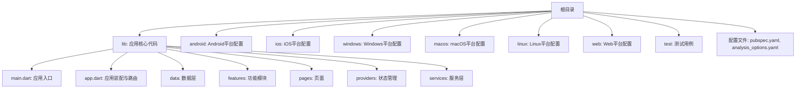
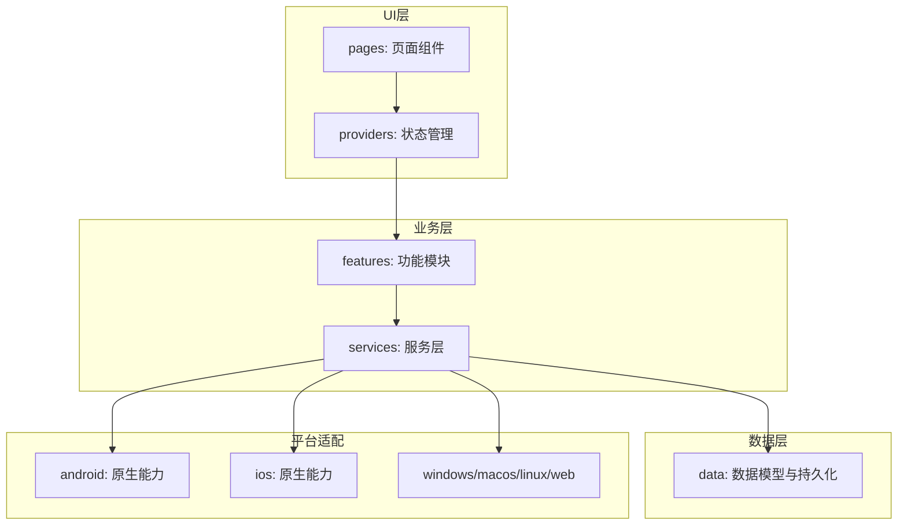
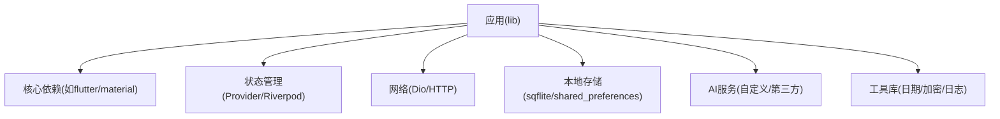

# 开发者指南

<cite>
**本文档引用的文件**   
- [README.md](file://README.md)
- [pubspec.yaml](file://pubspec.yaml)
- [analysis_options.yaml](file://analysis_options.yaml)
- [lib/main.dart](file://lib/main.dart)
- [lib/app.dart](file://lib/app.dart)
- [android/app/build.gradle.kts](file://android/app/build.gradle.kts)
- [ios/Runner/Info.plist](file://ios/Runner/Info.plist)
</cite>

## 目录
1. [简介](#简介)
2. [项目结构](#项目结构)
3. [核心组件](#核心组件)
4. [架构总览](#架构总览)
5. [详细组件分析](#详细组件分析)
6. [依赖分析](#依赖分析)
7. [性能考虑](#性能考虑)
8. [故障排查指南](#故障排查指南)
9. [结论](#结论)
10. [附录](#附录)

## 简介
本指南面向Flutter照片整理AI应用的开发者，提供从环境搭建、代码规范与最佳实践、Git工作流、调试与性能分析，到常见问题解决与贡献流程的完整说明。目标是帮助新成员快速上手，并提升团队协作效率与代码质量。

## 项目结构
本项目采用Flutter多平台工程结构，核心业务代码位于lib目录，Android、iOS、Windows、macOS、Linux、Web等平台相关配置分别位于对应目录。关键入口为lib/main.dart，应用初始化与路由组织在lib/app.dart中。

图表来源
- [lib/main.dart](file://lib/main.dart)
- [lib/app.dart](file://lib/app.dart)

章节来源
- [README.md](file://README.md)
- [pubspec.yaml](file://pubspec.yaml)

## 核心组件
- 应用入口与启动流程：通过lib/main.dart进行初始化，加载依赖、设置主题、注册全局配置，然后启动lib/app.dart定义的应用树。
- 应用装配与路由：lib/app.dart负责构建Material/Cupertino应用、配置主题、路由表、以及全局拦截器（如权限、日志）。
- 分层架构：
  - data：数据模型、本地存储、网络请求封装。
  - features：按功能划分的模块（例如相册浏览、智能分类、批量操作）。
  - pages：UI页面，遵循单一职责原则。
  - providers：状态管理（如Provider/Riverpod/Bloc），保证UI与逻辑解耦。
  - services：跨模块服务（如AI识别服务、图片处理服务、权限服务）。

章节来源
- [lib/main.dart](file://lib/main.dart)
- [lib/app.dart](file://lib/app.dart)

## 架构总览
整体采用“分层+模块化”的Flutter架构，结合状态管理与服务抽象，确保可维护性与可扩展性。

图表来源
- [lib/app.dart](file://lib/app.dart)
- [lib/main.dart](file://lib/main.dart)

## 详细组件分析

### 应用入口与初始化（lib/main.dart）
- 职责：初始化Flutter引擎、设置系统UI样式、加载本地配置、注册全局异常处理器、启动应用。
- 关键点：
  - 异步初始化：确保依赖服务就绪后再渲染UI。
  - 错误捕获：统一捕获未处理异常，便于上报与调试。
  - 平台差异：根据平台启用特定能力（如相机、文件系统）。

章节来源
- [lib/main.dart](file://lib/main.dart)

### 应用装配与路由（lib/app.dart）
- 职责：构建应用根Widget、配置主题、注册路由、挂载全局拦截器。
- 关键点：
  - 主题与国际化：集中管理颜色、字体、文案。
  - 路由策略：命名路由与参数传递，支持深链跳转。
  - 中间件：权限检查、登录态校验、埋点统计。

章节来源
- [lib/app.dart](file://lib/app.dart)

### 数据层（lib/data）
- 职责：定义数据模型、封装本地存储（SQLite/SharedPreferences）、网络请求（Dio/HTTP）。
- 关键点：
  - 模型序列化：使用json_serializable或freezed。
  - 缓存策略：内存缓存+磁盘缓存，避免重复请求。
  - 错误处理：统一错误码与重试机制。

章节来源
- [lib/data](file://lib/data)

### 功能模块（lib/features）
- 职责：按业务划分模块，每个模块包含UI、状态、服务调用。
- 关键点：
  - 模块内聚：模块内部耦合高，对外暴露清晰接口。
  - 可测试性：单元测试与集成测试覆盖核心逻辑。
  - 插件化：新功能以模块形式接入，降低耦合。

章节来源
- [lib/features](file://lib/features)

### 页面组件（lib/pages）
- 职责：实现用户界面，响应交互事件。
- 关键点：
  - 组件拆分：将复杂页面拆分为小组件，提高复用性。
  - 性能优化：合理使用setState、ListView.builder等。
  - 无障碍：支持屏幕阅读器与键盘导航。

章节来源
- [lib/pages](file://lib/pages)

### 状态管理（lib/providers）
- 职责：管理应用状态，驱动UI更新。
- 关键点：
  - 选择方案：Provider/Riverpod/Bloc，根据团队熟悉度决定。
  - 状态不可变：避免直接修改状态，使用不可变对象。
  - 订阅与更新：最小化重建范围，提升性能。

章节来源
- [lib/providers](file://lib/providers)

### 服务层（lib/services）
- 职责：封装跨模块共享的逻辑，如AI识别、图片处理、权限管理。
- 关键点：
  - 接口抽象：定义清晰的服务接口，便于替换实现。
  - 错误处理：统一异常类型与恢复策略。
  - 平台适配：通过platform_channel调用原生能力。

章节来源
- [lib/services](file://lib/services)

### Android平台配置（android/app/build.gradle.kts）
- 职责：定义Android应用构建脚本，包括依赖、签名、资源处理。
- 关键点：
  - 版本管理：统一管理SDK版本、编译工具链。
  - 资源优化：压缩图片、移除无用资源。
  - 权限声明：在AndroidManifest.xml中声明必要权限。

章节来源
- [android/app/build.gradle.kts](file://android/app/build.gradle.kts)

### iOS平台配置（ios/Runner/Info.plist）
- 职责：定义iOS应用元数据与权限。
- 关键点：
  - 权限描述：相机、相册访问需在Info.plist中说明用途。
  - 签名与证书：开发阶段使用自动签名，发布需手动配置。
  - 启动画面：配置LaunchScreen.storyboard。

章节来源
- [ios/Runner/Info.plist](file://ios/Runner/Info.plist)

## 依赖分析
项目依赖通过pubspec.yaml管理，包括Flutter SDK、第三方包、本地依赖。构建时由Flutter工具链解析并下载。

图表来源
- [pubspec.yaml](file://pubspec.yaml)

章节来源
- [pubspec.yaml](file://pubspec.yaml)

## 性能考虑
- UI性能：
  - 避免不必要的重建：使用const构造函数、合理拆分组件。
  - 列表优化：使用ListView.builder、IndexedStack。
  - 图片加载：缓存、懒加载、占位图。
- 内存管理：
  - 及时释放资源：关闭文件句柄、取消网络请求。
  - 避免内存泄漏：监听生命周期，清理定时器。
- 网络优化：
  - 请求合并与去重。
  - 压缩传输、断点续传。
- 分析工具：
  - Flutter DevTools：性能面板、内存快照、网络监控。
  - 日志输出：结构化日志，区分级别与环境。

[本节为通用指导，无需引用具体文件]

## 故障排查指南
- 构建问题：
  - 清理缓存：flutter clean、删除build目录。
  - 依赖冲突：检查pubspec.lock，升级或降级包版本。
  - 平台SDK：确认Android/iOS SDK路径正确。
- 运行时错误：
  - 权限问题：检查AndroidManifest.xml与Info.plist中的权限声明。
  - 空指针异常：添加空安全检查，使用?.运算符。
  - 网络超时：增加重试机制与超时配置。
- 平台兼容性：
  - API差异：使用Platform.isXxx判断平台。
  - 原生桥接：确保platform_channel方法名一致。
- 调试技巧：
  - 热重载：修改UI代码时使用hot reload。
  - 断点调试：在IDE中设置断点，逐步执行。
  - 日志打印：使用print或日志库输出上下文信息。

章节来源
- [android/app/build.gradle.kts](file://android/app/build.gradle.kts)
- [ios/Runner/Info.plist](file://ios/Runner/Info.plist)

## 结论
本指南提供了Flutter照片整理AI应用的开发环境与最佳实践，涵盖架构设计、依赖管理、性能优化与故障排查。建议团队遵循统一的代码规范与Git工作流，以提升协作效率与代码质量。持续学习与探索Flutter生态的新特性，将有助于构建更健壮的应用。

[本节为总结，无需引用具体文件]

## 附录

### 开发环境搭建
- Flutter SDK安装：
  - 下载官方安装包，配置环境变量。
  - 运行flutter doctor检查依赖。
- IDE配置：
  - VS Code：安装Flutter与Dart扩展。
  - Android Studio：安装Flutter插件，配置模拟器。
- 依赖包管理：
  - 使用pub get获取依赖。
  - 定期升级包版本，检查安全漏洞。

[本节为通用指导，无需引用具体文件]

### 代码规范与最佳实践
- Dart语言规范：
  - 遵循Effective Dart指南。
  - 使用lint规则（analysis_options.yaml）。
- Flutter开发约定：
  - 组件命名：PascalCase，语义化。
  - 文件组织：按功能或领域划分。
- 项目结构：
  - lib下分data/features/pages/providers/services。
  - 保持单一职责，避免大文件。

章节来源
- [analysis_options.yaml](file://analysis_options.yaml)

### Git工作流程
- 分支管理：
  - main：主分支，稳定版本。
  - develop：开发分支，集成新功能。
  - feature/*：功能分支，完成后合并至develop。
  - hotfix/*：紧急修复分支，直接合并至main。
- 提交规范：
  - 使用约定式提交（Conventional Commits）。
  - 提交信息清晰描述变更内容。
- 代码审查：
  - Pull Request需至少一名审查者批准。
  - 自动化测试通过后才能合并。

[本节为通用指导，无需引用具体文件]

### 调试技巧与工具
- Flutter DevTools：
  - 性能分析：CPU、GPU、内存使用。
  - 网络监控：请求与响应详情。
- 日志输出：
  - 使用log等级（debug/info/warn/error）。
  - 结构化日志，便于检索与分析。
- 性能分析：
  - Timeline视图：定位卡顿帧。
  - 内存快照：查找内存泄漏。

[本节为通用指导，无需引用具体文件]

### 常见问题与解决方案
- 构建失败：
  - 清理缓存后重试。
  - 检查依赖版本兼容性。
- 运行时崩溃：
  - 查看堆栈跟踪，定位错误位置。
  - 添加异常捕获与上报。
- 平台兼容性问题：
  - 使用条件编译处理平台差异。
  - 测试各平台行为一致性。

[本节为通用指导，无需引用具体文件]

### 贡献代码流程
- Issue提交：
  - 描述问题现象、复现步骤、期望结果。
  - 附上日志与截图。
- Pull Request：
  - 小步提交，清晰的变更说明。
  - 通过CI检查与代码审查。
- 文档维护：
  - 更新README与API文档。
  - 保持示例代码可运行。

[本节为通用指导，无需引用具体文件]

### 新成员入职指南
- 学习路径：
  - 阅读README与架构文档。
  - 运行Hello World示例。
  - 理解项目结构与依赖。
- 上手任务：
  - 修复简单Bug。
  - 添加小功能模块。
  - 参与代码审查。
- 资源推荐：
  - Flutter官方文档。
  - Dart语言教程。
  - 社区论坛与GitHub仓库。

[本节为通用指导，无需引用具体文件]