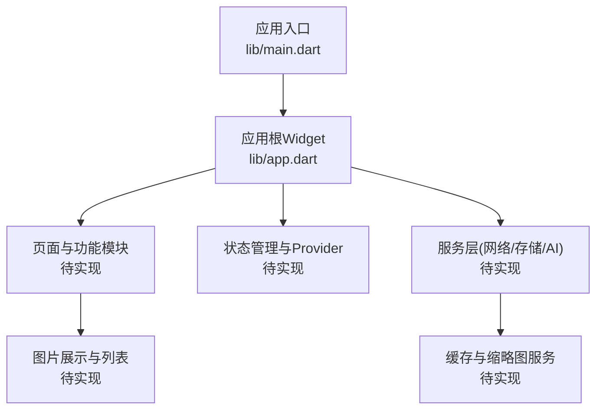
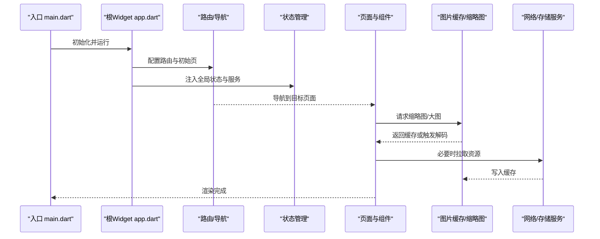
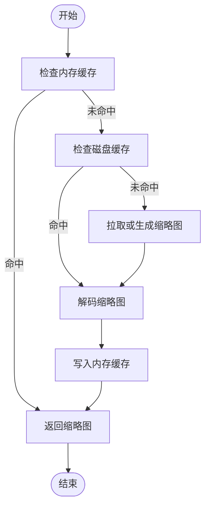
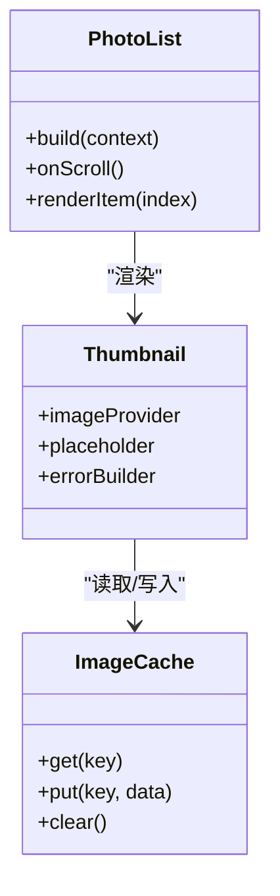
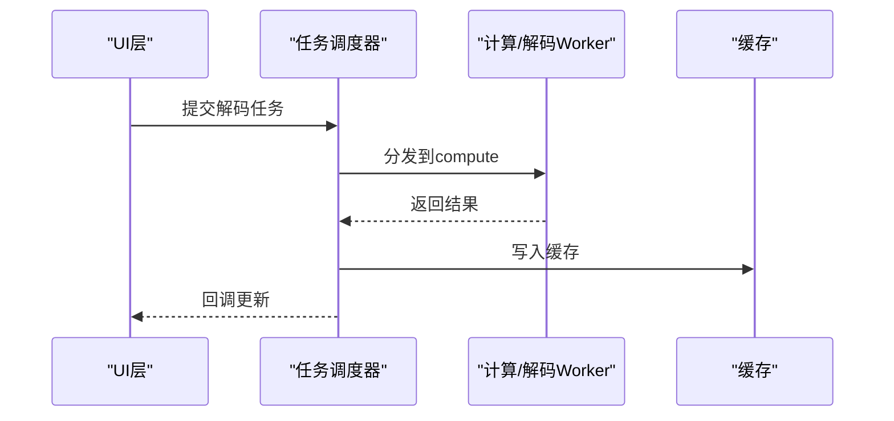
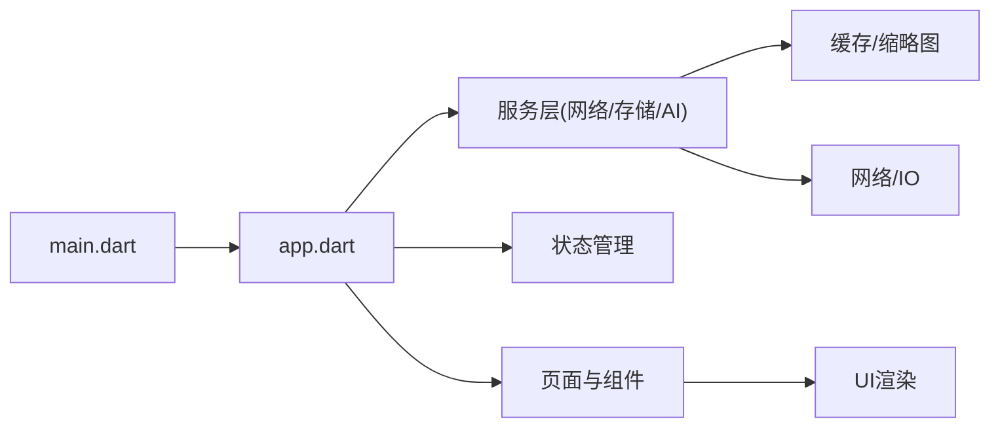

# 性能优化

<cite>
**本文引用的文件**   
- [lib/main.dart](file://lib/main.dart)
- [lib/app.dart](file://lib/app.dart)
- [pubspec.yaml](file://pubspec.yaml)
</cite>

## 目录
1. [简介](#简介)
2. [项目结构](#项目结构)
3. [核心组件](#核心组件)
4. [架构总览](#架构总览)
5. [详细组件分析](#详细组件分析)
6. [依赖分析](#依赖分析)
7. [性能考量](#性能考量)
8. [故障排查指南](#故障排查指南)
9. [结论](#结论)
10. [附录](#附录)

## 简介
本技术文档面向Flutter照片整理AI应用的性能优化，聚焦图片加载与渲染、内存管理、异步编程、网络请求以及性能监控与分析。由于当前仓库处于初始阶段（lib下仅有main.dart与app.dart，业务逻辑尚未实现），本文在给出通用最佳实践的同时，明确标注哪些内容可直接映射到现有代码入口，哪些为概念性指导。读者可据此在后续开发中落地具体优化方案。

## 项目结构
- lib/main.dart：应用启动入口，负责初始化全局配置、路由与主题等。
- lib/app.dart：应用根Widget定义，组织页面与Provider/状态管理。
- pubspec.yaml：依赖声明与构建配置，影响包体积与运行时行为。

图表来源
- [lib/main.dart:1-200](file://lib/main.dart#L1-L200)
- [lib/app.dart:1-200](file://lib/app.dart#L1-L200)

章节来源
- [lib/main.dart:1-200](file://lib/main.dart#L1-L200)
- [lib/app.dart:1-200](file://lib/app.dart#L1-L200)
- [pubspec.yaml:1-200](file://pubspec.yaml#L1-L200)

## 核心组件
- 应用启动与初始化：在入口文件中完成框架初始化、日志、错误捕获、国际化与主题设置。
- 根Widget装配：集中注册Provider/状态管理、路由、全局监听器与性能埋点。
- 依赖与插件：通过pubspec.yaml声明图片缓存、网络、存储、AI推理等依赖，控制编译产物与运行开销。

章节来源
- [lib/main.dart:1-200](file://lib/main.dart#L1-L200)
- [lib/app.dart:1-200](file://lib/app.dart#L1-L200)
- [pubspec.yaml:1-200](file://pubspec.yaml#L1-L200)

## 架构总览
下图展示了从应用启动到UI渲染的关键路径，并标注了与性能相关的扩展点（如图片缓存、懒加载、动画与重绘控制）。

图表来源
- [lib/main.dart:1-200](file://lib/main.dart#L1-L200)
- [lib/app.dart:1-200](file://lib/app.dart#L1-L200)

## 详细组件分析

### 图片加载优化（缓存策略、懒加载、内存管理、缩略图）
- 缓存策略
  - 多级缓存：内存缓存优先，磁盘缓存兜底；按分辨率/质量维度区分键值。
  - 并发控制：限制并发解码数量，避免CPU峰值导致掉帧。
  - 失效策略：LRU/TTL结合，定期清理冷数据。
- 懒加载
  - 列表项按需加载，滚动时再发起解码；使用占位图与骨架屏提升感知性能。
  - 预取策略：根据滚动方向与速度预测下一张图，提前入队。
- 内存管理
  - 解码后及时释放原始字节数组，仅保留压缩后的图像对象。
  - 限制单张图片最大尺寸与像素上限，防止OOM。
  - 使用弱引用或池化机制复用Bitmap/Codec。
- 缩略图生成
  - 服务端或本地生成多档缩略图，按显示尺寸选择最合适的版本。
  - 后台批量生成缩略图，避免主线程阻塞。

[此图为概念流程，不直接映射具体源码]

章节来源
- [lib/main.dart:1-200](file://lib/main.dart#L1-L200)
- [lib/app.dart:1-200](file://lib/app.dart#L1-L200)

### 渲染性能调优（Widget树优化、重绘减少、动画性能）
- Widget树优化
  - 使用const构造与不可变数据，减少不必要的重建。
  - 拆分大组件为小组件，配合Key稳定子树。
  - 避免在build中执行昂贵计算，使用Memoization或Provider的select。
- 重绘减少
  - 将频繁变化的状态下沉到最小范围，使用RepaintBoundary隔离重绘区域。
  - 避免在build中创建新对象（如Color、TextStyle），提升到顶层或使用常量。
- 动画性能
  - 优先使用Implicit Animations与AnimatedBuilder，避免手动setState全量更新。
  - 复杂动画使用Rive/Lottie或GPU加速路径，降低CPU压力。

图表来源
- [lib/app.dart:1-200](file://lib/app.dart#L1-L200)

章节来源
- [lib/app.dart:1-200](file://lib/app.dart#L1-L200)

### 内存管理策略（生命周期、泄漏检测、GC优化）
- 生命周期管理
  - 在dispose中释放StreamSubscription、定时器、事件监听与大型对象引用。
  - 使用WeakReference或Finalizer追踪潜在泄漏。
- 泄漏检测
  - 启用DevTools内存快照对比，定位未释放对象。
  - 使用lint规则与静态分析发现常见泄漏模式。
- GC优化
  - 避免频繁分配临时大对象，采用对象池或复用缓冲区。
  - 合理设置图片尺寸与采样率，降低堆占用。

章节来源
- [lib/main.dart:1-200](file://lib/main.dart#L1-L200)
- [lib/app.dart:1-200](file://lib/app.dart#L1-L200)

### 异步编程优化（Future/Stream、并发、任务调度）
- Future使用
  - 避免嵌套回调，使用async/await与Error边界处理。
  - 对长耗时操作设置超时与取消令牌。
- Stream使用
  - 合理使用debounce/throttle减少高频事件处理。
  - 正确订阅与取消订阅，避免内存泄漏。
- 并发与调度
  - 使用compute进行CPU密集任务，避免阻塞UI线程。
  - 限制并发度，防止过多解码或网络请求导致抖动。

[此图为概念流程，不直接映射具体源码]

章节来源
- [lib/main.dart:1-200](file://lib/main.dart#L1-L200)
- [lib/app.dart:1-200](file://lib/app.dart#L1-L200)

### 网络请求优化（合并、缓存、连接池）
- 请求合并
  - 对重复请求去重，使用一次性Future共享结果。
  - 批量接口聚合，减少往返次数。
- 缓存策略
  - HTTP缓存头与本地缓存结合，支持ETag/Last-Modified。
  - 离线优先策略，失败回退到缓存。
- 连接池管理
  - 复用HTTP连接，避免频繁握手。
  - 合理设置超时与重试策略，提升稳定性。

章节来源
- [lib/main.dart:1-200](file://lib/main.dart#L1-L200)
- [lib/app.dart:1-200](file://lib/app.dart#L1-L200)

### 性能监控与分析工具（DevTools、指标收集、瓶颈定位）
- Flutter DevTools
  - 使用Performance面板观察帧率、构建时间与布局耗时。
  - 使用Memory面板进行快照对比，定位内存增长与泄漏。
  - 使用Timeline记录关键路径，识别卡顿原因。
- 指标收集
  - 自定义埋点：首帧时间、滚动FPS、图片解码耗时、网络延迟。
  - 上报与可视化：集成后端或本地日志分析。
- 瓶颈定位
  - 热点函数火焰图分析，定位CPU密集型调用。
  - 重绘热点区域定位，使用RepaintBoundary隔离。

章节来源
- [lib/main.dart:1-200](file://lib/main.dart#L1-L200)
- [lib/app.dart:1-200](file://lib/app.dart#L1-L200)

## 依赖分析
- 入口与根Widget耦合度低，便于扩展功能模块。
- 图片、网络、存储与AI推理应解耦为独立服务，通过Provider或依赖注入接入。
- 依赖声明集中在pubspec.yaml，建议按功能域分组，便于裁剪与优化包体积。

图表来源
- [lib/main.dart:1-200](file://lib/main.dart#L1-L200)
- [lib/app.dart:1-200](file://lib/app.dart#L1-L200)

章节来源
- [lib/main.dart:1-200](file://lib/main.dart#L1-L200)
- [lib/app.dart:1-200](file://lib/app.dart#L1-L200)
- [pubspec.yaml:1-200](file://pubspec.yaml#L1-L200)

## 性能考量
- 图片加载：优先使用缩略图与按需解码，限制并发与内存占用。
- 渲染优化：最小化重建与重绘，使用const与RepaintBoundary。
- 内存管理：及时释放资源，避免长期持有大对象。
- 异步优化：合理调度与取消，避免阻塞主线程。
- 网络优化：合并请求、缓存与连接复用，降低延迟与抖动。
- 监控分析：持续采集关键指标，快速定位与修复问题。

[本节为通用指导，不直接分析具体文件]

## 故障排查指南
- 卡顿与掉帧
  - 使用DevTools Performance面板查看帧耗时与构建时间。
  - 检查是否存在同步I/O或重型计算在主线程执行。
- 内存泄漏
  - 使用Memory快照对比，查找未释放的StreamSubscription、定时器与监听器。
  - 检查图片解码后是否释放原始字节数组。
- 网络问题
  - 检查超时与重试策略，确认缓存命中率与连接复用情况。
  - 使用Timeline观察网络请求时序与响应时间。

章节来源
- [lib/main.dart:1-200](file://lib/main.dart#L1-L200)
- [lib/app.dart:1-200](file://lib/app.dart#L1-L200)

## 结论
在当前初始项目中，已具备应用启动与根Widget的基础结构。建议在后续开发中按本文指引逐步落地图片加载、渲染优化、内存管理、异步与网络优化，并通过DevTools持续监控与改进。通过模块化与解耦设计，确保性能优化可在各功能域内独立实施与验证。

[本节为总结性内容，不直接分析具体文件]

## 附录
- 推荐依赖（示例）
  - 图片缓存：cached_network_image、flutter_cache_manager
  - 网络：dio、http
  - 存储：shared_preferences、hive、path_provider
  - AI推理：tflite_flutter、onnxruntime_flutter
- 常用优化清单
  - 使用const构造与不可变数据
  - 列表项懒加载与占位图
  - RepaintBoundary隔离重绘区域
  - compute处理CPU密集任务
  - 合理设置图片尺寸与采样率
  - 统一错误边界与日志埋点

[本节为补充信息，不直接分析具体文件]