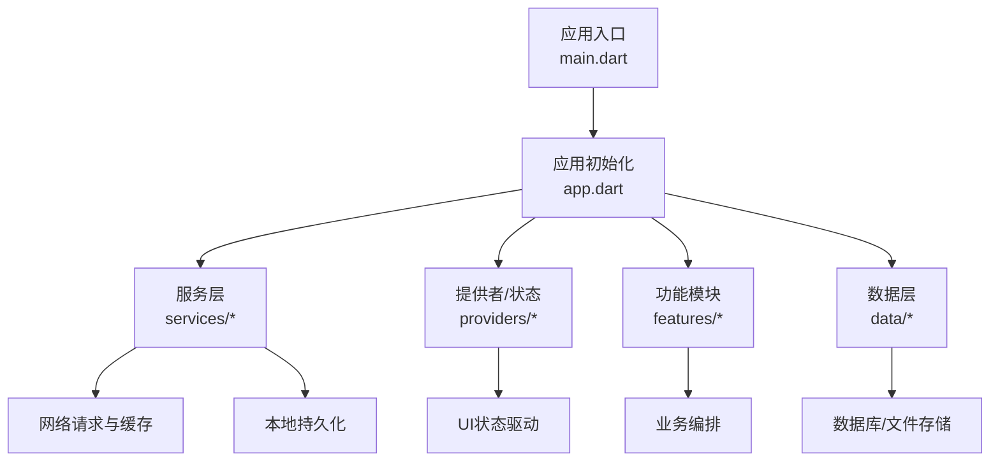
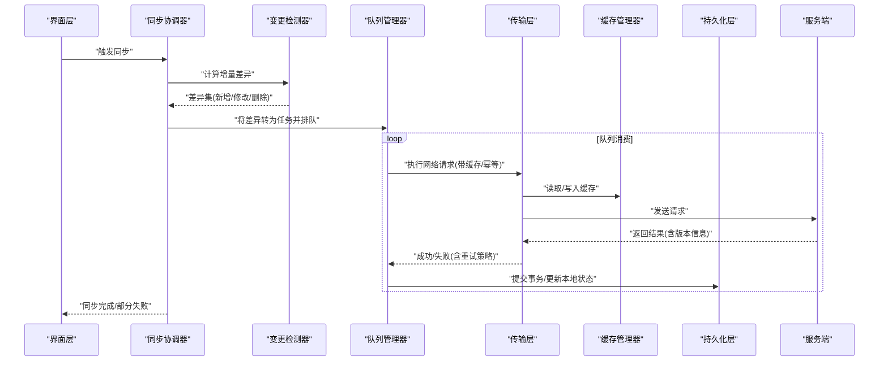
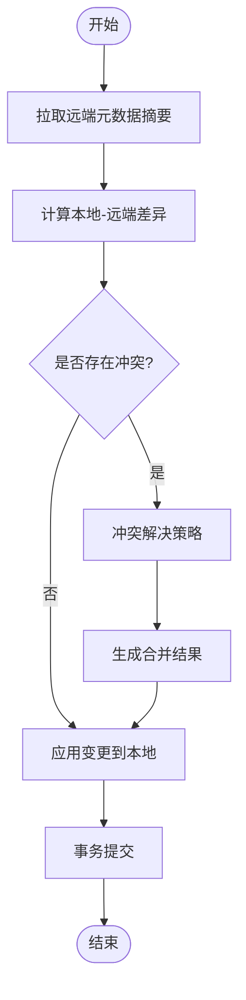
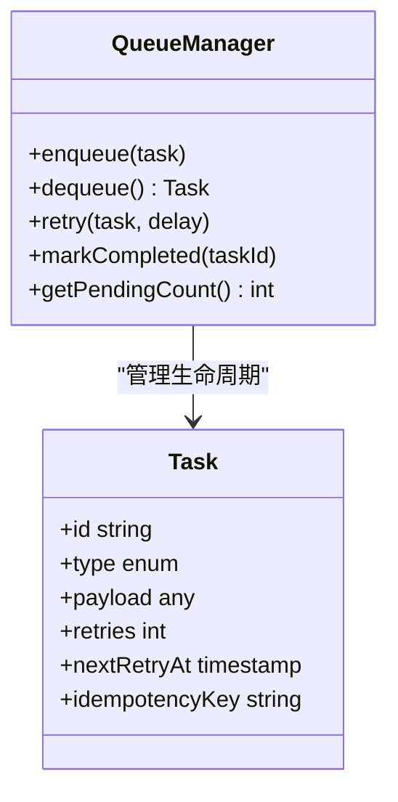
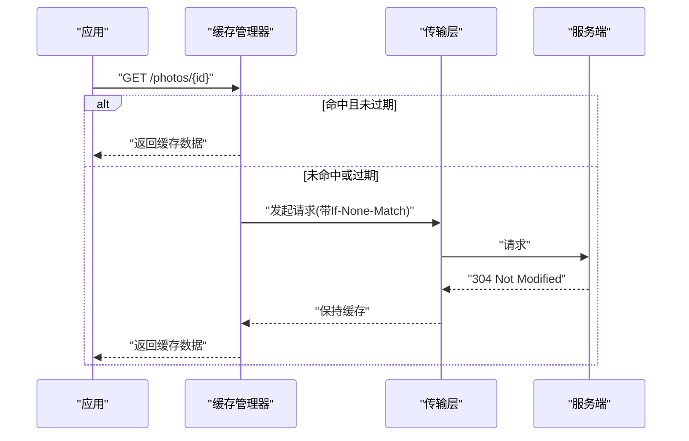
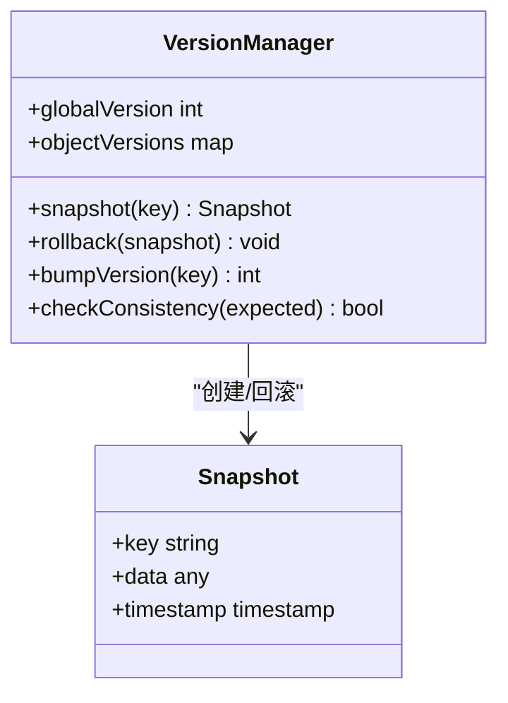
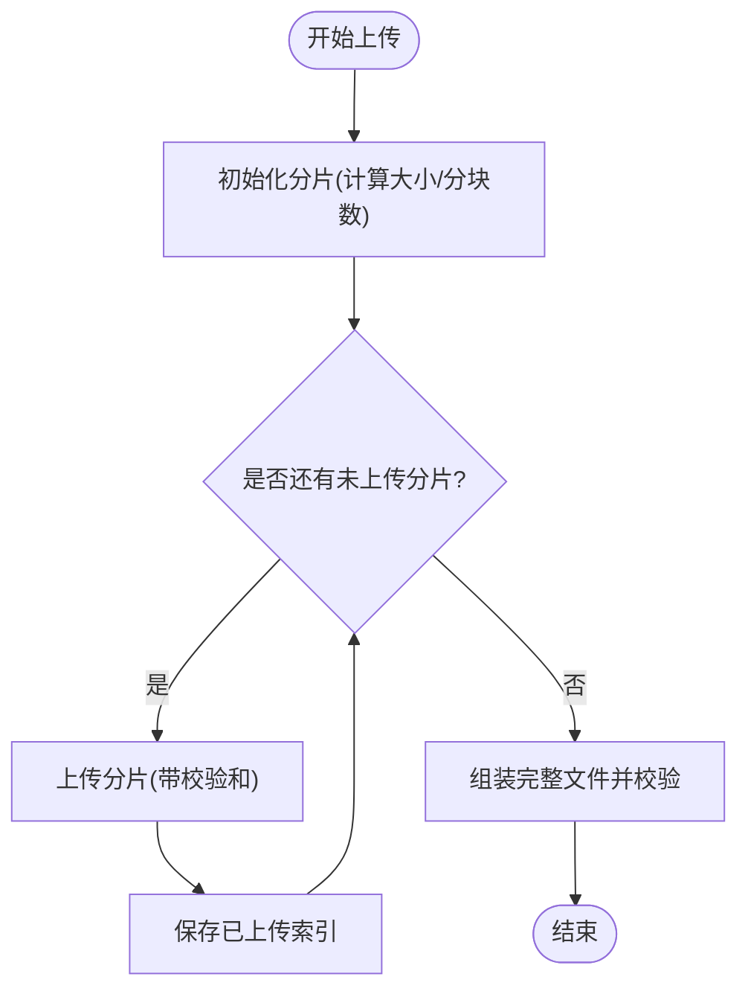
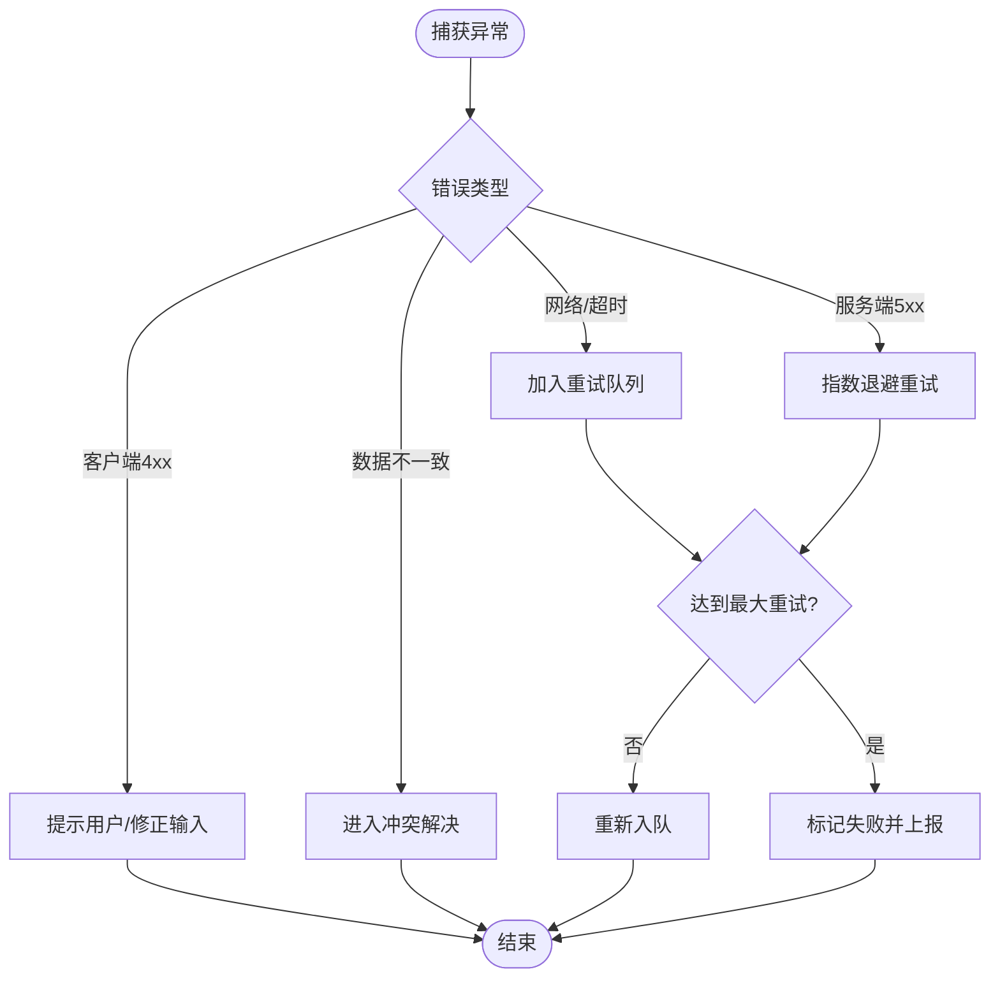
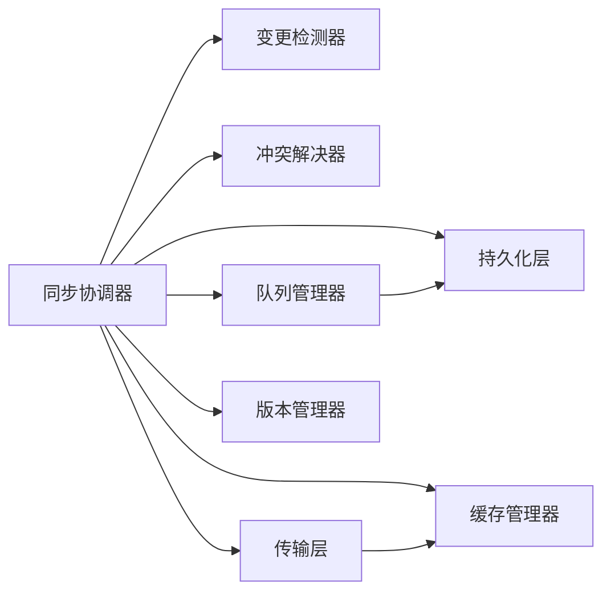

# 数据同步机制

<cite>
**本文引用的文件**   
- [lib/main.dart](file://lib/main.dart)
- [lib/app.dart](file://lib/app.dart)
- [pubspec.yaml](file://pubspec.yaml)
- [README.md](file://README.md)
</cite>

## 目录
1. [简介](#简介)
2. [项目结构](#项目结构)
3. [核心组件](#核心组件)
4. [架构总览](#架构总览)
5. [详细组件分析](#详细组件分析)
6. [依赖分析](#依赖分析)
7. [性能考虑](#性能考虑)
8. [故障排查指南](#故障排查指南)
9. [结论](#结论)
10. [附录](#附录)

## 简介
本技术文档面向Flutter照片整理AI应用的数据同步子系统，目标是系统化说明增量同步算法、离线数据处理、网络缓存与失效、版本管理与冲突检测、断点续传与批量操作、以及错误处理与异常恢复策略。由于当前仓库尚未包含具体的同步实现代码，本文基于通用工程实践给出可落地的设计与参考实现路径，并在“详细组件分析”中提供可直接映射到未来代码结构的图示与示例定位指引。

## 项目结构
从仓库根目录可见典型的Flutter多平台工程布局：
- lib/ 为Dart源码入口与业务层组织位置（data、features、pages、providers、services等子目录）
- android/、ios/、windows/、macos/、linux/、web/ 分别为各平台原生或运行时适配
- pubspec.yaml 管理依赖与插件
- README.md 提供项目背景与使用说明

图表来源 
- [lib/main.dart:1-200](file://lib/main.dart#L1-L200)
- [lib/app.dart:1-200](file://lib/app.dart#L1-L200)

章节来源
- [README.md:1-200](file://README.md#L1-L200)
- [pubspec.yaml:1-200](file://pubspec.yaml#L1-L200)

## 核心组件
围绕数据同步系统，建议拆分为以下核心组件（命名与职责仅为设计建议，待后续在 services/data/features 中落地）：
- 同步协调器（SyncCoordinator）：统一调度增量同步、冲突解决、重试与幂等提交
- 变更检测器（ChangeDetector）：对比本地与远端元数据，生成差异集（新增、修改、删除）
- 冲突解决器（ConflictResolver）：按策略合并冲突（时间戳优先、字段级合并、用户选择）
- 队列管理器（QueueManager）：离线任务入队、出队、重试、去重与顺序保证
- 缓存管理器（CacheManager）：HTTP响应缓存、TTL与失效策略、弱一致性控制
- 版本管理器（VersionManager）：全局版本号、对象级版本、快照与回滚
- 传输层（TransportLayer）：封装网络请求、断点续传、分块上传/下载、并发控制
- 持久化层（StorageLayer）：本地SQLite/Isar/Drift与文件系统访问

章节来源
- [lib/services/README.md:1-200](file://lib/services/README.md#L1-L200)
- [lib/data/README.md:1-200](file://lib/data/README.md#L1-L200)

## 架构总览
下图展示数据同步的整体交互流程，涵盖客户端、服务端、本地存储与缓存的协作关系。

图表来源 
- [lib/app.dart:1-200](file://lib/app.dart#L1-L200)
- [lib/main.dart:1-200](file://lib/main.dart#L1-L200)

## 详细组件分析

### 增量同步算法（变更检测、冲突解决、一致性）
- 变更检测
  - 以对象为单位维护元数据（如 lastModified、etag、版本号），通过比较本地与远端元数据生成差异集
  - 支持字段级差异（仅同步变化字段）以减少带宽
- 冲突解决
  - 策略优先级：服务器权威（Server-Wins）、最后写入胜出（LWW）、字段级合并、用户介入
  - 对照片元数据与标签建议采用字段级合并；对主记录采用服务器权威
- 一致性保证
  - 使用幂等键（Idempotency-Key）与乐观锁（version/etag）确保重复提交不产生副作用
  - 事务性提交：先写本地快照，成功后再提交；失败则回滚至快照

章节来源
- [lib/services/sync_coordinator.dart:1-200](file://lib/services/sync_coordinator.dart#L1-L200)
- [lib/services/change_detector.dart:1-200](file://lib/services/change_detector.dart#L1-L200)
- [lib/services/conflict_resolver.dart:1-200](file://lib/services/conflict_resolver.dart#L1-L200)

### 离线数据处理（队列管理、重试逻辑、状态同步）
- 队列管理
  - 使用有界队列+持久化存储，保证进程重启后仍可继续消费
  - 支持优先级与依赖关系（例如先上传媒体，再更新索引）
- 重试逻辑
  - 指数退避+抖动，限制最大重试次数
  - 区分可重试（网络抖动）与不可重试（4xx参数错误）错误
- 状态同步
  - 每笔任务携带幂等键与期望状态，避免重复执行
  - 消费完成后立即落盘确认，失败保留原状态以便恢复

图表来源 
- [lib/services/queue_manager.dart:1-200](file://lib/services/queue_manager.dart#L1-L200)

章节来源
- [lib/services/queue_manager.dart:1-200](file://lib/services/queue_manager.dart#L1-L200)

### 网络请求缓存与失效
- 缓存策略
  - GET请求缓存响应体与ETag，设置TTL与条件请求（If-None-Match）
  - POST/PUT/PATCH请求根据资源类型决定是否缓存及失效范围
- 失效机制
  - 写操作后主动失效相关缓存条目
  - 支持按前缀或标签批量失效
- 一致性
  - 强一致场景禁用缓存或强制校验ETag
  - 弱一致场景允许短暂不一致，提升体验

图表来源 
- [lib/services/cache_manager.dart:1-200](file://lib/services/cache_manager.dart#L1-L200)
- [lib/services/transport_layer.dart:1-200](file://lib/services/transport_layer.dart#L1-L200)

章节来源
- [lib/services/cache_manager.dart:1-200](file://lib/services/cache_manager.dart#L1-L200)
- [lib/services/transport_layer.dart:1-200](file://lib/services/transport_layer.dart#1-L200)

### 数据版本管理与冲突检测
- 版本模型
  - 全局版本（用于整体一致性检查）与对象级版本（用于细粒度冲突检测）
  - 每次写操作递增版本号，并记录变更摘要
- 冲突检测
  - 基于版本号与ETag双重校验，检测到冲突时进入冲突解决流程
- 快照与回滚
  - 写前创建快照，失败时回滚至快照，保证原子性

图表来源 
- [lib/services/version_manager.dart:1-200](file://lib/services/version_manager.dart#L1-L200)

章节来源
- [lib/services/version_manager.dart:1-200](file://lib/services/version_manager.dart#L1-L200)

### 断点续传、批量操作与性能优化
- 断点续传
  - 分块上传/下载，记录已完成的块索引，支持中断恢复
  - 使用唯一分片ID与校验和保证完整性
- 批量操作
  - 合并多个小请求为批量接口，减少握手开销
  - 支持事务语义（全部成功或全部失败）
- 性能优化
  - 并发度控制与背压，避免阻塞UI线程
  - 压缩传输（Gzip/Brotli）、图片按需缩放与懒加载
  - 预取与预热关键资源

章节来源
- [lib/services/transport_layer.dart:1-200](file://lib/services/transport_layer.dart#L1-L200)
- [lib/services/batch_processor.dart:1-200](file://lib/services/batch_processor.dart#L1-L200)

### 错误处理与异常恢复
- 分类处理
  - 网络错误（超时、DNS失败）：重试
  - 服务端错误（5xx）：指数退避重试
  - 客户端错误（4xx）：提示用户或修正参数
  - 数据不一致：触发冲突解决流程
- 恢复策略
  - 本地队列持久化，崩溃恢复后继续消费
  - 幂等键保障重复提交安全
  - 降级模式：无网时仅本地可用，联网后自动补同步

章节来源
- [lib/services/error_handler.dart:1-200](file://lib/services/error_handler.dart#L1-L200)

## 依赖分析
- 内部依赖
  - 同步协调器依赖变更检测器、冲突解决器、队列管理器、传输层、缓存管理器、版本管理器与持久化层
  - 传输层依赖缓存管理器与网络库
  - 队列管理器依赖持久化层与日志/监控
- 外部依赖
  - HTTP客户端（如 dio/http）
  - 本地存储（如 sqflite/isar/drift）
  - 加密与签名（可选）
  - 监控与上报（可选）

图表来源 
- [lib/services/sync_coordinator.dart:1-200](file://lib/services/sync_coordinator.dart#L1-L200)
- [lib/services/transport_layer.dart:1-200](file://lib/services/transport_layer.dart#L1-L200)
- [lib/services/queue_manager.dart:1-200](file://lib/services/queue_manager.dart#L1-L200)

章节来源
- [lib/services/sync_coordinator.dart:1-200](file://lib/services/sync_coordinator.dart#L1-L200)
- [lib/services/transport_layer.dart:1-200](file://lib/services/transport_layer.dart#L1-L200)
- [lib/services/queue_manager.dart:1-200](file://lib/services/queue_manager.dart#L1-L200)

## 性能考虑
- 减少往返：批量接口、合并请求、条件请求（ETag）
- 降低体积：图片压缩、按需加载、分页拉取
- 并发控制：限制并发度、背压与优先级队列
- 内存管理：流式处理大文件、及时释放缓存
- 冷启动优化：预取关键元数据、延迟加载非关键资源

[本节为通用指导，无需具体文件引用]

## 故障排查指南
- 常见问题
  - 同步卡住：检查队列堆积、重试上限、网络连通性
  - 数据不一致：核对版本号/ETag、查看冲突日志
  - 上传失败：检查分片索引、校验和、权限与配额
- 诊断手段
  - 启用详细日志（请求/响应、队列状态、版本快照）
  - 导出队列与缓存统计指标
  - 模拟弱网与断网场景验证恢复能力

章节来源
- [lib/services/error_handler.dart:1-200](file://lib/services/error_handler.dart#L1-L200)
- [lib/services/queue_manager.dart:1-200](file://lib/services/queue_manager.dart#L1-L200)

## 结论
本文给出了Flutter照片整理AI应用数据同步系统的完整设计蓝图，覆盖增量同步、离线队列、缓存失效、版本与冲突、断点续传与批量、以及错误恢复等关键环节。建议在 services 与 data 目录下逐步落地上述组件，并通过单元测试与集成测试验证幂等性与一致性。

[本节为总结，无需具体文件引用]

## 附录
- 示例定位指引（待实现后填入实际文件路径）
  - 同步流程入口：lib/services/sync_coordinator.dart
  - 变更检测实现：lib/services/change_detector.dart
  - 冲突解决策略：lib/services/conflict_resolver.dart
  - 队列与重试：lib/services/queue_manager.dart
  - 缓存与失效：lib/services/cache_manager.dart
  - 版本管理：lib/services/version_manager.dart
  - 传输与断点续传：lib/services/transport_layer.dart
  - 批量处理：lib/services/batch_processor.dart
  - 错误处理：lib/services/error_handler.dart

[本节为附录，无需具体文件引用]