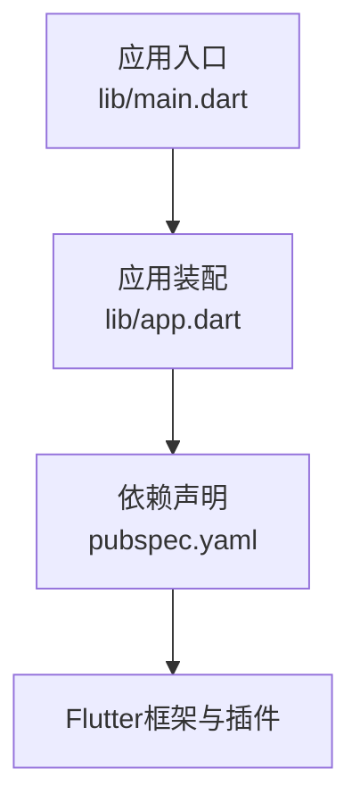
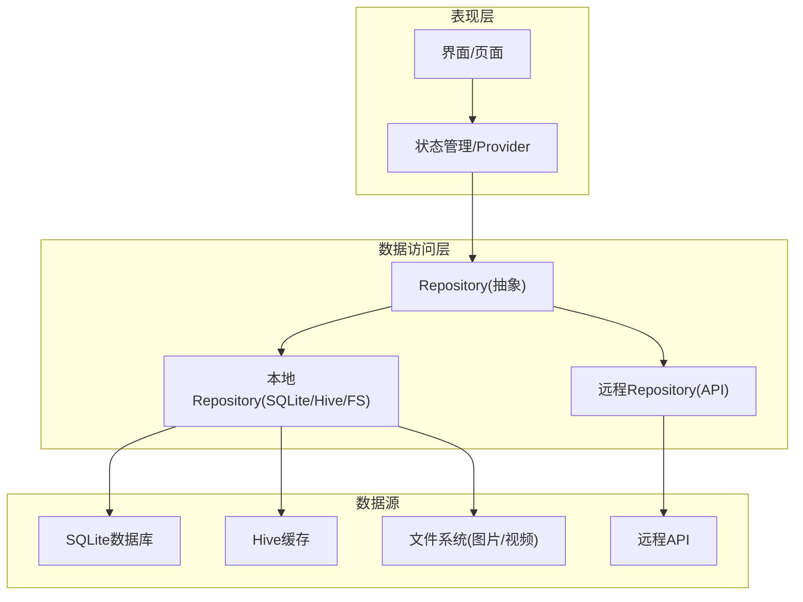
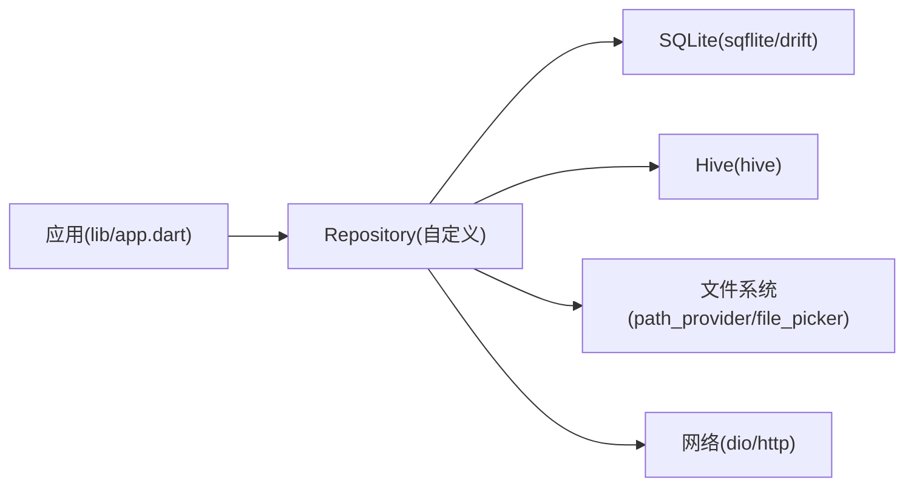

# 数据层设计

<cite>
**本文档引用的文件**   
- [pubspec.yaml](file://pubspec.yaml)
- [lib/main.dart](file://lib/main.dart)
- [lib/app.dart](file://lib/app.dart)
</cite>

## 目录
1. [简介](#简介)
2. [项目结构](#项目结构)
3. [核心组件](#核心组件)
4. [架构总览](#架构总览)
5. [详细组件分析](#详细组件分析)
6. [依赖分析](#依赖分析)
7. [性能考虑](#性能考虑)
8. [故障排查指南](#故障排查指南)
9. [结论](#结论)
10. [附录](#附录)

## 简介
本技术文档聚焦于Flutter照片整理AI应用的数据层设计与实现，目标是为PhotoModel、AlbumModel、UserModel、CategoryModel等核心实体提供清晰的字段定义与业务规则说明；阐述本地存储方案（SQLite、Hive缓存、文件存储）的选择与落地；描述数据同步机制（增量同步、冲突解决、离线处理）；解释数据访问抽象层（Repository模式）与数据源切换策略；并给出数据验证、错误处理、性能优化、迁移路径与版本管理的实践建议。

## 项目结构
当前仓库为Flutter多平台工程骨架，数据层相关代码尚未在lib/data下展开。现阶段可确认的入口与配置如下：
- 应用入口：lib/main.dart
- 应用装配：lib/app.dart
- 依赖声明：pubspec.yaml

图表来源
- [lib/main.dart:1-200](file://lib/main.dart#L1-L200)
- [lib/app.dart:1-200](file://lib/app.dart#L1-L200)
- [pubspec.yaml:1-200](file://pubspec.yaml#L1-L200)

章节来源
- [lib/main.dart:1-200](file://lib/main.dart#L1-L200)
- [lib/app.dart:1-200](file://lib/app.dart#L1-L200)
- [pubspec.yaml:1-200](file://pubspec.yaml#L1-L200)

## 核心组件
本节概述数据层的核心概念与职责边界，便于后续深入分析与落地。

- 数据模型
  - PhotoModel：照片元数据与关联信息（如拍摄时间、位置、标签、缩略图路径、原图路径、哈希值、分类/相册归属等）。
  - AlbumModel：相册集合（名称、封面、创建/更新时间、成员照片ID列表或外键关系）。
  - UserModel：用户账户（标识、昵称、头像、偏好设置、云端ID等）。
  - CategoryModel：分类体系（层级、名称、排序、父级ID、图标等）。
- 数据源
  - 本地持久化：SQLite（结构化关系数据）、Hive（轻量KV/对象缓存）、文件系统（图片/视频等大文件）。
  - 远程服务：REST/GraphQL API（用于同步与协作）。
- 数据访问抽象
  - Repository：统一对外暴露CRUD与查询接口，屏蔽底层数据源差异，支持切换与组合。
- 同步与离线
  - 增量同步：基于时间戳/版本号/ETag的变更拉取与推送。
  - 冲突解决：以“最后写入优先”或“合并策略”为主，结合用户选择。
  - 离线处理：队列化写操作，网络恢复后重试。
- 校验与错误
  - 输入校验：字段类型、范围、唯一性、关联完整性。
  - 错误分层：网络异常、数据库异常、IO异常、业务校验失败。
- 迁移与版本
  - 数据库版本管理：按版本顺序执行迁移脚本。
  - 数据兼容：向后兼容读取，逐步淘汰废弃字段。

章节来源
- [pubspec.yaml:1-200](file://pubspec.yaml#L1-L200)

## 架构总览
数据层采用分层与解耦设计：UI/Provider通过Repository访问数据，Repository根据环境或配置选择SQLite/Hive/文件存储或远程API，必要时进行缓存与同步。

图表来源
- [lib/app.dart:1-200](file://lib/app.dart#L1-L200)
- [pubspec.yaml:1-200](file://pubspec.yaml#L1-L200)

## 详细组件分析

### 数据模型设计
- 设计原则
  - 不可变模型：使用不可变数据结构提升并发安全与调试友好性。
  - 序列化友好：JSON编解码与本地存储格式一致，减少转换成本。
  - 强约束：在模型层与DAO层双重校验，确保一致性。
- 字段与业务规则（示例性说明）
  - PhotoModel
    - id：唯一标识（UUID），必填。
    - title/description：可选文本，长度限制。
    - mediaPath：媒体文件路径，必填且存在性校验。
    - thumbnailPath：缩略图路径，可选。
    - createdAt/updatedAt：时间戳，默认当前时间。
    - location：经纬度或地址，可选。
    - tags/categories：标签/分类ID集合，需满足引用完整性。
    - albumId：所属相册，外键约束。
    - hash：内容哈希，用于去重与完整性校验。
  - AlbumModel
    - id：唯一标识。
    - name：相册名，非空且唯一。
    - coverId：封面照片ID，可选。
    - photoIds：成员照片ID列表或关联表。
    - createdAt/updatedAt：时间戳。
  - UserModel
    - id：唯一标识。
    - nickname/avatar：用户信息。
    - preferences：主题/语言/隐私等偏好。
    - cloudId：云端账号ID，可选。
  - CategoryModel
    - id：唯一标识。
    - name：分类名，非空。
    - parentId：父分类ID，根节点为空。
    - sortOrder：排序权重。
    - icon：图标资源标识。
- 复杂度与索引
  - 高频查询字段建立索引（如createdAt、albumId、categoryId）。
  - 大字段（如base64）避免入库，仅存路径或URL。

章节来源
- [pubspec.yaml:1-200](file://pubspec.yaml#L1-L200)

### 本地存储方案
- SQLite
  - 用途：结构化关系数据（用户、相册、分类、照片元数据）。
  - 优势：事务、外键、索引、复杂查询能力强。
  - 注意：迁移脚本管理、并发读写控制、批量操作优化。
- Hive
  - 用途：轻量KV/对象缓存（配置、临时结果、热点数据）。
  - 优势：无模式、读写快、适合小对象。
  - 注意：不适合复杂关联查询，需与SQLite互补。
- 文件系统
  - 用途：图片/视频等大二进制文件。
  - 组织：按日期/相册/分类分目录，命名包含哈希或ID。
  - 管理：清理策略、缩略图生成、权限与沙箱。

章节来源
- [pubspec.yaml:1-200](file://pubspec.yaml#L1-L200)

### 数据同步机制
- 增量同步
  - 服务端返回变更集（新增/更新/删除），客户端基于时间戳或版本号合并。
  - 使用ETag/Last-Modified减少带宽。
- 冲突解决
  - 策略：服务器优先、客户端优先、手动合并。
  - 记录冲突日志，提供用户干预入口。
- 离线处理
  - 写操作入队，网络恢复后重试；幂等请求保证一致性。
  - 本地乐观锁与版本号防止覆盖。

章节来源
- [pubspec.yaml:1-200](file://pubspec.yaml#L1-L200)

### 数据访问抽象层（Repository模式）
- 设计要点
  - 统一接口：CRUD、分页、搜索、聚合。
  - 数据源切换：根据配置或运行时条件选择SQLite/Hive/远程API。
  - 缓存策略：读多写少场景启用Hive缓存，失效策略明确。
  - 事务与并发：批量写入使用事务，避免竞态。
- 典型流程
  - 读取：优先缓存→数据库→远程→回填缓存。
  - 写入：本地落库→队列化同步→失败重试。

章节来源
- [pubspec.yaml:1-200](file://pubspec.yaml#L1-L200)

### 数据验证与错误处理
- 验证规则
  - 字段级：类型、长度、格式、取值范围。
  - 关联级：外键存在性、唯一性、循环引用检测。
- 错误分层
  - 网络错误：超时、鉴权失败、限流。
  - 数据库错误：约束违反、死锁、迁移失败。
  - IO错误：文件不存在、权限不足。
  - 业务错误：非法状态、重复提交。
- 处理策略
  - 统一错误码与消息，向上抛出领域异常。
  - 用户可见错误降级提示，内部错误记录日志。

章节来源
- [pubspec.yaml:1-200](file://pubspec.yaml#L1-L200)

### 数据迁移与版本管理
- 数据库迁移
  - 版本号递增，迁移脚本按序执行。
  - 支持回滚与幂等执行。
- 数据兼容
  - 旧字段保留一段时间，逐步弃用。
  - 读取时做字段映射与默认值填充。
- 文件迁移
  - 路径规范升级，批量迁移工具。
  - 校验哈希与完整性。

章节来源
- [pubspec.yaml:1-200](file://pubspec.yaml#L1-L200)

## 依赖分析
当前阶段未引入具体数据层依赖包，建议在pubspec.yaml中按需添加：
- 数据库：sqflite / drift
- 缓存：hive / shared_preferences
- 文件：path_provider / file_picker
- 网络：dio / http
- 序列化：json_serializable / freezed

图表来源
- [lib/app.dart:1-200](file://lib/app.dart#L1-L200)
- [pubspec.yaml:1-200](file://pubspec.yaml#L1-L200)

章节来源
- [pubspec.yaml:1-200](file://pubspec.yaml#L1-L200)

## 性能考虑
- 查询优化
  - 合理使用索引，避免全表扫描。
  - 分页加载与懒加载缩略图。
- 写入优化
  - 批量插入/更新，开启事务。
  - 异步写入与背压控制。
- 缓存策略
  - 热点数据缓存到Hive，设置TTL与失效策略。
  - 图片缩略图缓存，避免重复生成。
- I/O优化
  - 文件分块读取，避免阻塞UI线程。
  - 压缩与转码策略平衡质量与体积。

[本节为通用指导，不直接分析具体文件]

## 故障排查指南
- 常见问题
  - 数据库迁移失败：检查版本号与脚本顺序，查看日志定位。
  - 文件路径无效：校验路径存在性与权限。
  - 同步冲突：查看冲突日志，选择解决策略。
  - 内存占用过高：检查大图加载与缓存大小。
- 诊断手段
  - 启用详细日志与指标上报。
  - 使用数据库可视化工具检查结构与数据。
  - 模拟弱网与断网测试离线能力。

[本节为通用指导，不直接分析具体文件]

## 结论
数据层应以清晰的分层与抽象为核心，通过Repository统一对外，结合SQLite、Hive与文件系统构建高效可靠的本地存储体系，并以增量同步与冲突解决保障在线/离线一致性。配合严格的验证、完善的错误处理与持续的迁移管理，可为照片整理AI应用提供稳定、可扩展的数据基础。

[本节为总结性内容，不直接分析具体文件]

## 附录
- 最佳实践清单
  - 模型不可变、强校验、序列化一致。
  - 数据源可插拔，缓存策略明确。
  - 同步幂等、重试与退避。
  - 迁移脚本幂等、可回滚。
  - 监控与日志完备，问题可追溯。
- 参考实现路径（待落地）
  - lib/data/models：数据模型定义
  - lib/data/repositories：Repository抽象与实现
  - lib/data/sources：SQLite/Hive/文件/远程数据源
  - lib/data/sync：同步与冲突解决
  - lib/data/migrations：数据库迁移脚本

[本节为补充信息，不直接分析具体文件]