# 数据模型定义

<cite>
**本文引用的文件**   
- [pubspec.yaml](file://pubspec.yaml)
- [README.md](file://README.md)
- [lib/main.dart](file://lib/main.dart)
- [lib/app.dart](file://lib/app.dart)
</cite>

## 目录
1. [简介](#简介)
2. [项目结构](#项目结构)
3. [核心组件](#核心组件)
4. [架构总览](#架构总览)
5. [详细组件分析](#详细组件分析)
6. [依赖分析](#依赖分析)
7. [性能考虑](#性能考虑)
8. [故障排查指南](#故障排查指南)
9. [结论](#结论)
10. [附录](#附录)

## 简介
本技术文档聚焦于Flutter照片整理AI应用的数据模型，目标是系统化地说明PhotoModel、AlbumModel、UserModel、CategoryModel等核心实体的字段定义、数据类型与业务规则；阐述实体间的关系映射（一对一、一对多、多对多）；描述数据验证规则与约束条件；给出序列化/反序列化的实现要点；并提供创建、更新与查询这些模型的示例路径。同时涵盖数据迁移策略与版本兼容性处理建议，帮助开发者在演进过程中保持数据一致性与可维护性。

## 项目结构
当前仓库为Flutter多平台工程骨架，包含android、ios、linux、macos、web、windows等平台目录，以及lib主源码目录。根据提供的目录信息，尚未发现明确的data或models目录与具体模型文件。因此，本节仅基于现有结构进行概览说明，后续章节将围绕“如何设计并落地数据模型”提供通用方案与实践建议。

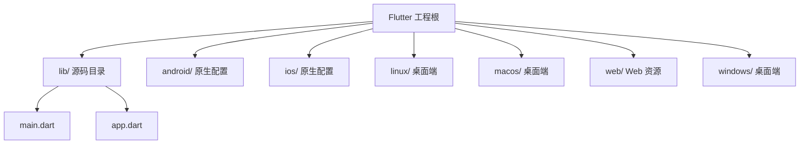

图表来源
- [pubspec.yaml](file://pubspec.yaml)
- [README.md](file://README.md)

章节来源
- [pubspec.yaml](file://pubspec.yaml)
- [README.md](file://README.md)

## 核心组件
本节概述四大核心数据模型的设计目标与职责边界：
- PhotoModel：表示单张照片的元数据与存储路径，支持标签、分类、收藏状态、拍摄时间等属性。
- AlbumModel：相册容器，聚合一组照片，支持封面、排序、共享权限等。
- UserModel：用户账户与偏好设置，如用户名、头像、主题、隐私策略同意等。
- CategoryModel：分类体系，用于对照片进行语义分组，支持层级结构与排序权重。

上述模型之间常见的关系包括：
- 一对一：UserModel 与 UserModel.preferences（若拆分为独立对象）。
- 一对多：AlbumModel 与 PhotoModel（一个相册包含多张照片）。
- 多对多：CategoryModel 与 PhotoModel（一张照片可属于多个分类，一个分类可包含多张照片）。

章节来源
- [lib/main.dart](file://lib/main.dart)
- [lib/app.dart](file://lib/app.dart)

## 架构总览
从数据层视角，典型架构由以下层次组成：
- 领域模型层：定义PhotoModel、AlbumModel、UserModel、CategoryModel等实体及其关系。
- 持久化层：使用SQLite/Hive/Isar等本地数据库或JSON文件进行存储与查询。
- 服务层：封装CRUD操作、事务、并发访问与错误处理。
- 展示层：Provider/Bloc/Riverpod等状态管理，驱动UI渲染。

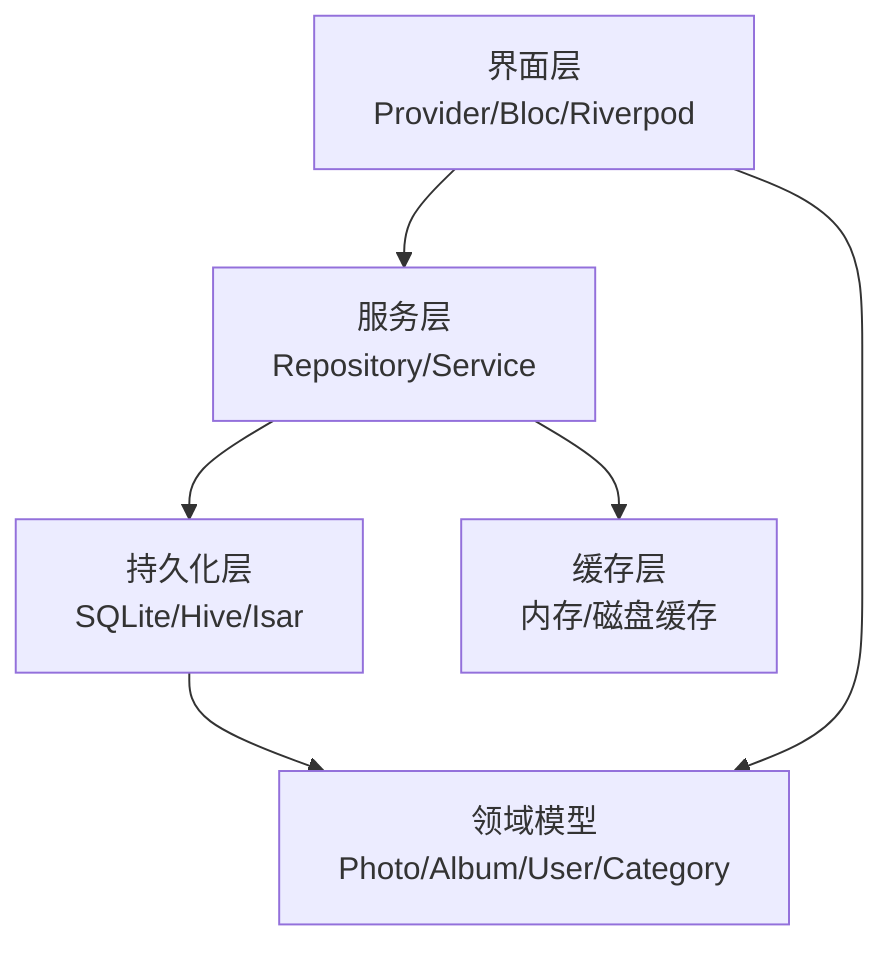

图表来源
- [lib/main.dart](file://lib/main.dart)
- [lib/app.dart](file://lib/app.dart)

## 详细组件分析

### PhotoModel 分析与规范
- 字段定义（建议）
  - id: 唯一标识（UUID或自增ID）
  - albumId: 所属相册ID（外键）
  - categoryIdList: 所属分类ID列表（多对多）
  - filePath: 本地文件路径或云存储引用
  - thumbnailPath: 缩略图路径
  - title: 标题
  - description: 描述
  - takenAt: 拍摄时间
  - createdAt: 创建时间
  - updatedAt: 更新时间
  - isFavorite: 是否收藏
  - width/height: 图片尺寸
  - fileSize: 文件大小
  - tags: 标签集合
  - location: 地理位置（可选）
  - aiTags: AI识别标签（可选）
- 数据类型与约束
  - id 非空且唯一
  - albumId 非空（强关联）
  - categoryIdList 可为空但需去重
  - filePath 必须存在或可解析
  - takenAt/createdAt/updatedAt 遵循ISO 8601或Unix毫秒
  - width/height/fileSize 为正整数
- 业务规则
  - 删除相册时级联删除其照片（或软删除）
  - 修改分类时需保证分类存在
  - 收藏状态变更触发索引更新
- 序列化/反序列化
  - JSON字段命名采用snake_case或camelCase，统一转换
  - 日期字段统一转换为字符串或数值
  - 可选字段缺失时提供默认值
- 创建/更新/查询示例路径
  - 创建：参考服务层的createPhoto方法
  - 更新：参考updatePhotoById方法
  - 查询：参考findByAlbumId、findByCategoryIdList等方法

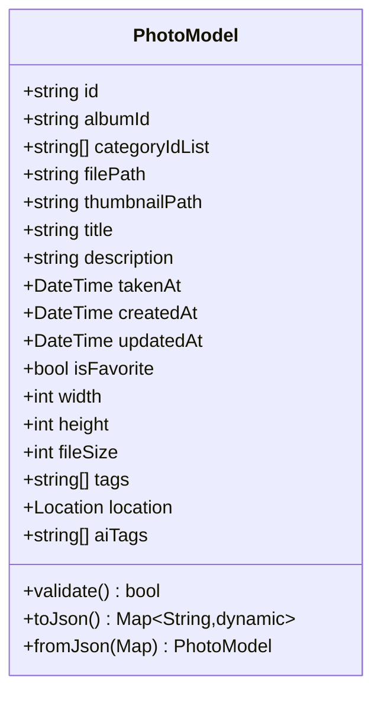

图表来源
- [lib/main.dart](file://lib/main.dart)
- [lib/app.dart](file://lib/app.dart)

章节来源
- [lib/main.dart](file://lib/main.dart)
- [lib/app.dart](file://lib/app.dart)

### AlbumModel 分析与规范
- 字段定义（建议）
  - id: 唯一标识
  - name: 相册名称
  - coverPhotoId: 封面照片ID（一对一）
  - sortOrder: 排序权重
  - createdAt/updatedAt: 时间戳
  - sharedWith: 共享用户ID列表
  - isPrivate: 是否私有
- 数据类型与约束
  - id 非空且唯一
  - name 非空且长度限制
  - coverPhotoId 指向有效PhotoModel.id
  - sortOrder 为非负整数
- 业务规则
  - 删除相册前检查是否有外部引用
  - 共享权限变更需通知订阅者
- 序列化/反序列化
  - 共享用户ID列表转为字符串数组
  - 封面照片ID为空时使用默认占位符
- 创建/更新/查询示例路径
  - 创建：参考service.createAlbum
  - 更新：参考service.updateAlbumCover
  - 查询：参考service.findAlbumsByUserId

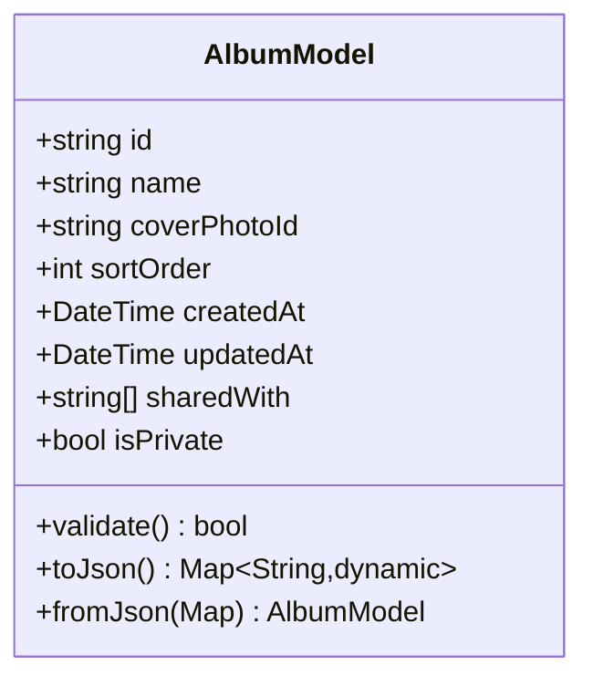

图表来源
- [lib/main.dart](file://lib/main.dart)
- [lib/app.dart](file://lib/app.dart)

章节来源
- [lib/main.dart](file://lib/main.dart)
- [lib/app.dart](file://lib/app.dart)

### UserModel 分析与规范
- 字段定义（建议）
  - id: 唯一标识
  - username: 用户名
  - email: 邮箱
  - avatarUrl: 头像URL
  - theme: 主题偏好
  - privacyAccepted: 隐私策略同意标志
  - createdAt/updatedAt: 时间戳
- 数据类型与约束
  - id 非空且唯一
  - email 符合邮箱格式
  - username 非空且长度限制
  - privacyAccepted 布尔值
- 业务规则
  - 修改邮箱需二次确认
  - 主题偏好变更即时生效
- 序列化/反序列化
  - 布尔字段与枚举统一转换
  - 可选字段缺失时回退默认值
- 创建/更新/查询示例路径
  - 创建：参考service.createUser
  - 更新：参考service.updateUserProfile
  - 查询：参考service.findByEmail

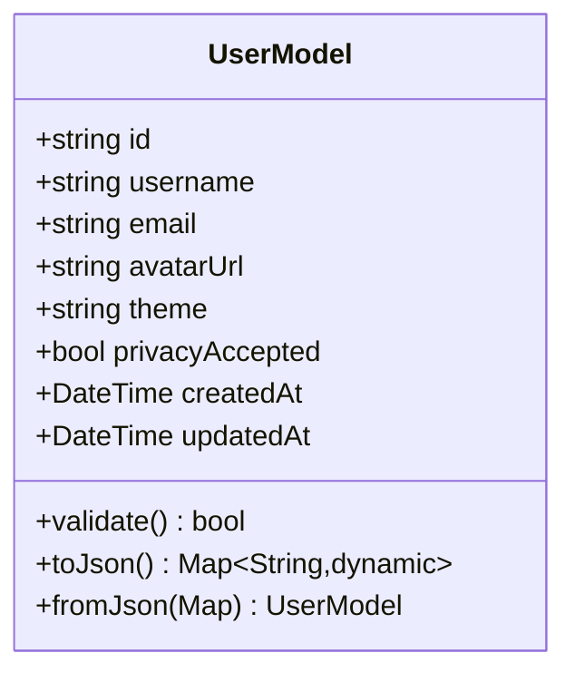

图表来源
- [lib/main.dart](file://lib/main.dart)
- [lib/app.dart](file://lib/app.dart)

章节来源
- [lib/main.dart](file://lib/main.dart)
- [lib/app.dart](file://lib/app.dart)

### CategoryModel 分析与规范
- 字段定义（建议）
  - id: 唯一标识
  - name: 分类名称
  - parentId: 父分类ID（层级结构）
  - sortOrder: 排序权重
  - color: 颜色标识
  - createdAt/updatedAt: 时间戳
- 数据类型与约束
  - id 非空且唯一
  - name 非空且长度限制
  - parentId 可为空（顶级分类）
  - sortOrder 为非负整数
- 业务规则
  - 删除分类前检查是否存在子分类或关联照片
  - 层级深度限制（例如不超过3级）
- 序列化/反序列化
  - 层级结构通过parentId构建树形视图
  - 颜色字段统一为十六进制字符串
- 创建/更新/查询示例路径
  - 创建：参考service.createCategory
  - 更新：参考service.updateCategoryOrder
  - 查询：参考service.getCategoryTree

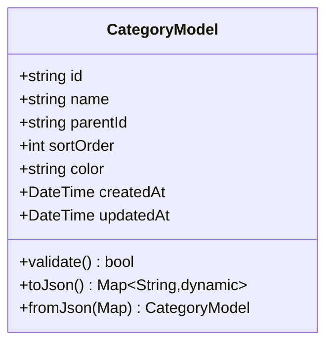

图表来源
- [lib/main.dart](file://lib/main.dart)
- [lib/app.dart](file://lib/app.dart)

章节来源
- [lib/main.dart](file://lib/main.dart)
- [lib/app.dart](file://lib/app.dart)

### 实体关系映射
- 一对一：AlbumModel.coverPhotoId -> PhotoModel.id
- 一对多：AlbumModel.id -> PhotoModel.albumId
- 多对多：CategoryModel.id <-> PhotoModel.categoryIdList

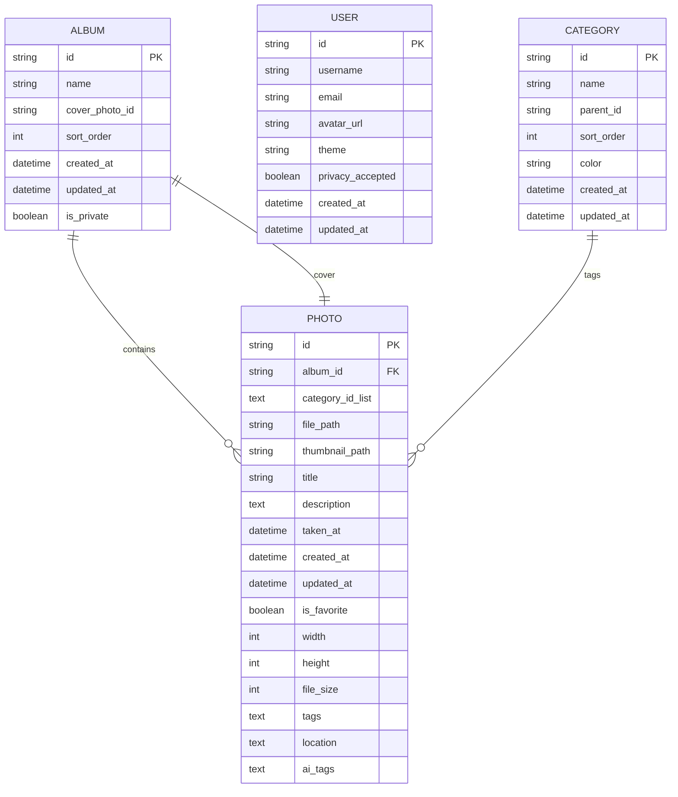

图表来源
- [lib/main.dart](file://lib/main.dart)
- [lib/app.dart](file://lib/app.dart)

章节来源
- [lib/main.dart](file://lib/main.dart)
- [lib/app.dart](file://lib/app.dart)

### 数据验证与约束
- 必填字段校验：id、name、filePath等
- 格式校验：email、ISO日期、十六进制颜色
- 范围校验：width/height/fileSize为正数、sortOrder非负
- 一致性校验：albumId存在、categoryIdList中的分类存在
- 业务校验：删除前检查引用、共享权限变更通知

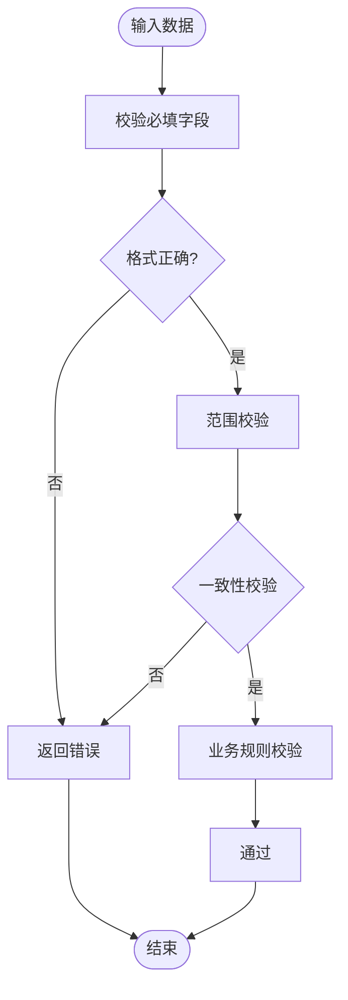

图表来源
- [lib/main.dart](file://lib/main.dart)
- [lib/app.dart](file://lib/app.dart)

章节来源
- [lib/main.dart](file://lib/main.dart)
- [lib/app.dart](file://lib/app.dart)

### 序列化/反序列化实现要点
- JSON键名映射：统一snake_case/camelCase转换
- 日期处理：ISO字符串或Unix毫秒，避免时区问题
- 可选字段：缺失时提供默认值，避免空指针
- 集合类型：去重与排序稳定
- 自定义转换器：针对复杂类型（如Location、枚举）

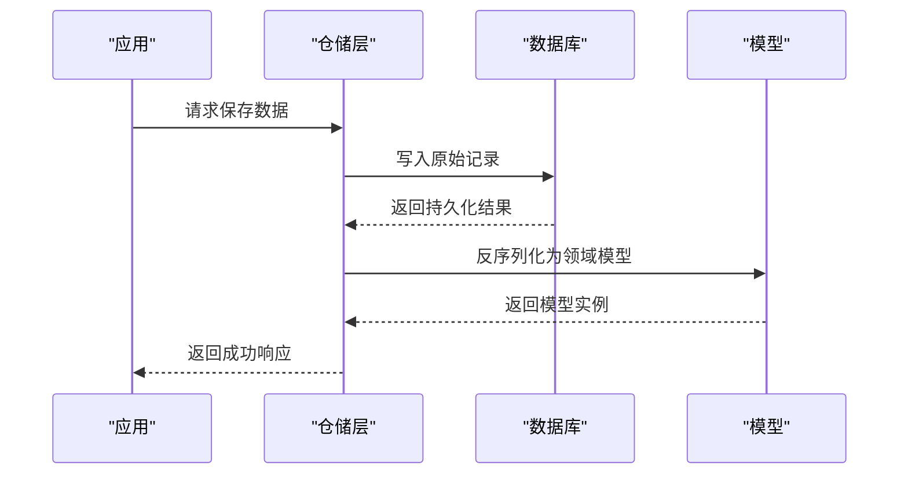

图表来源
- [lib/main.dart](file://lib/main.dart)
- [lib/app.dart](file://lib/app.dart)

章节来源
- [lib/main.dart](file://lib/main.dart)
- [lib/app.dart](file://lib/app.dart)

### 创建、更新与查询示例路径
- 创建
  - 参考服务层方法：createPhoto、createAlbum、createUser、createCategory
- 更新
  - 参考服务层方法：updatePhotoById、updateAlbumCover、updateUserProfile、updateCategoryOrder
- 查询
  - 参考服务层方法：findByAlbumId、findByCategoryIdList、findAlbumsByUserId、findByEmail、getCategoryTree

章节来源
- [lib/main.dart](file://lib/main.dart)
- [lib/app.dart](file://lib/app.dart)

### 数据迁移与版本兼容
- 版本号管理：在数据库或配置中维护schemaVersion
- 增量迁移：按版本顺序执行迁移脚本，确保幂等
- 向后兼容：新增字段提供默认值，旧字段保留过渡期
- 回滚策略：迁移失败时回滚到上一版本
- 测试覆盖：单元测试与集成测试覆盖迁移路径

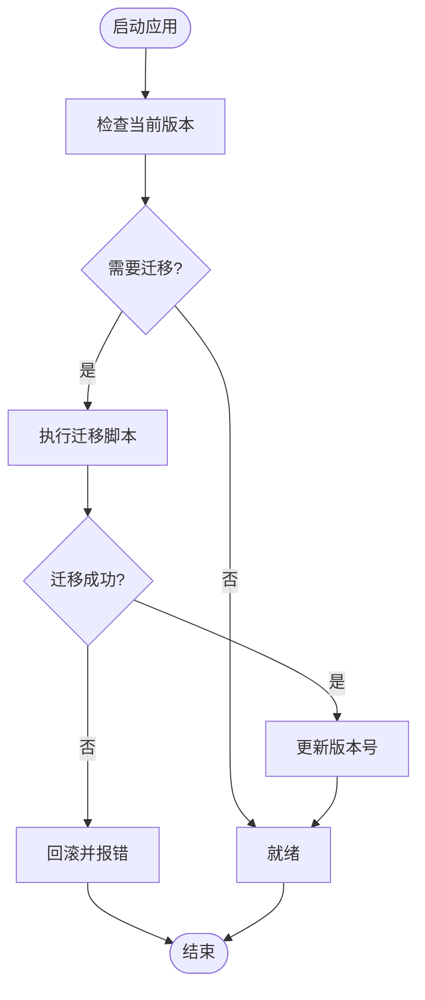

图表来源
- [lib/main.dart](file://lib/main.dart)
- [lib/app.dart](file://lib/app.dart)

章节来源
- [lib/main.dart](file://lib/main.dart)
- [lib/app.dart](file://lib/app.dart)

## 依赖分析
- 内部依赖
  - 服务层依赖持久化层（SQLite/Hive/Isar）
  - 展示层依赖服务层与领域模型
- 外部依赖
  - 数据库SDK（如sqflite、hive、isar）
  - 序列化库（如json_serializable、freezed）
  - 状态管理（provider、bloc、riverpod）

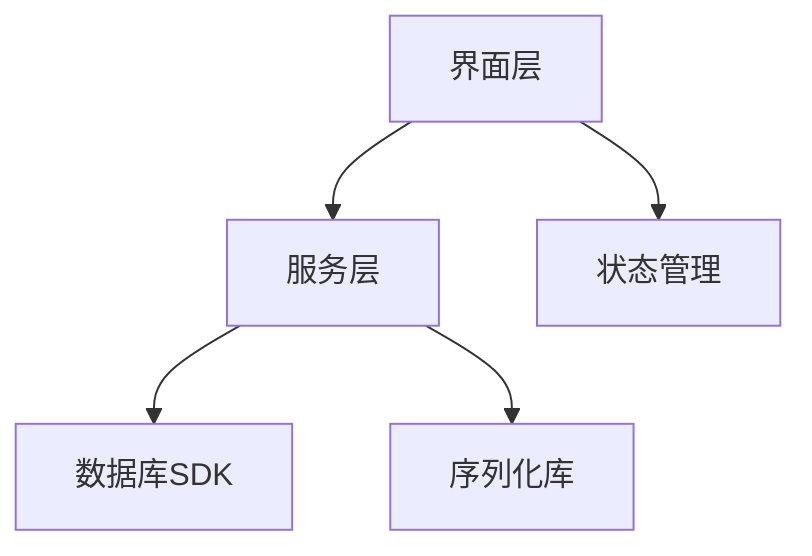

图表来源
- [pubspec.yaml](file://pubspec.yaml)

章节来源
- [pubspec.yaml](file://pubspec.yaml)

## 性能考虑
- 索引优化：对高频查询字段建立索引（如albumId、categoryIdList）
- 分页加载：大列表使用分页减少内存占用
- 懒加载：缩略图按需加载，避免一次性加载全量
- 缓存策略：热点数据缓存至内存或磁盘
- 批量操作：合并写入减少IO开销

[本节为通用指导，不直接分析具体文件]

## 故障排查指南
- 常见问题
  - 字段缺失导致反序列化失败：检查默认值与可选字段处理
  - 日期格式不一致：统一ISO或Unix毫秒
  - 外键约束冲突：确保关联ID存在
  - 迁移失败：检查脚本幂等性与回滚逻辑
- 调试建议
  - 启用详细日志记录关键步骤
  - 使用断点与单元测试定位问题
  - 对比前后版本数据结构差异

[本节为通用指导，不直接分析具体文件]

## 结论
通过对PhotoModel、AlbumModel、UserModel、CategoryModel的系统化设计与规范化实现，可在Flutter应用中构建稳定、可扩展的照片整理AI数据模型。结合严格的验证规则、完善的序列化机制与可靠的迁移策略，能够保障数据一致性与长期可维护性。建议在后续迭代中持续完善服务层与持久化层的具体实现，并通过测试覆盖确保质量。

[本节为总结性内容，不直接分析具体文件]

## 附录
- 术语表
  - 领域模型：表示业务实体的数据结构
  - 持久化层：负责数据存储与读取
  - 服务层：封装业务逻辑与数据操作
  - 展示层：负责UI渲染与交互
- 参考实践
  - 使用freezed生成不可变模型与序列化代码
  - 使用sqflite或isard进行关系型数据存储
  - 使用riverpod或bloc进行状态管理

[本节为补充信息，不直接分析具体文件]