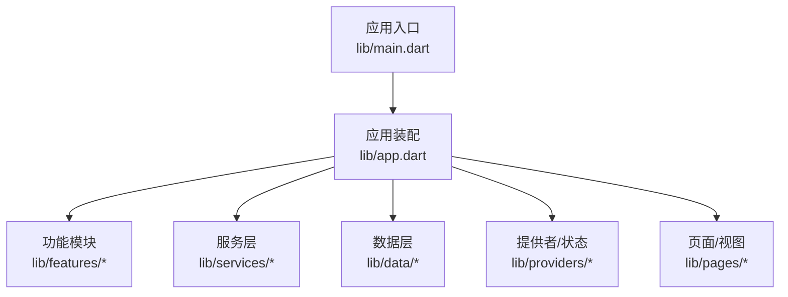
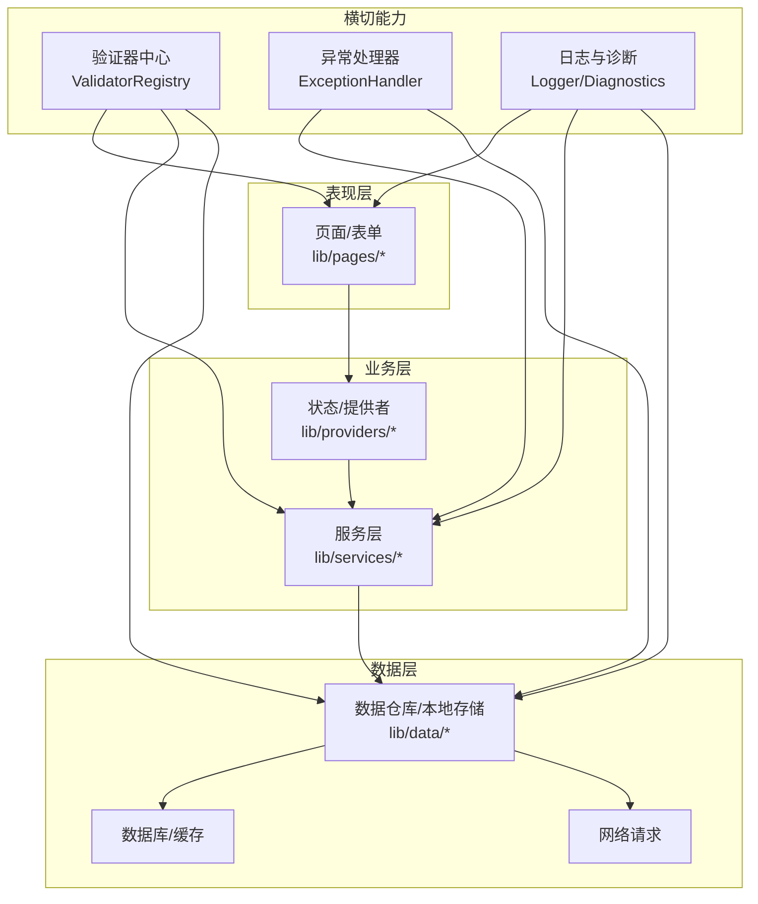
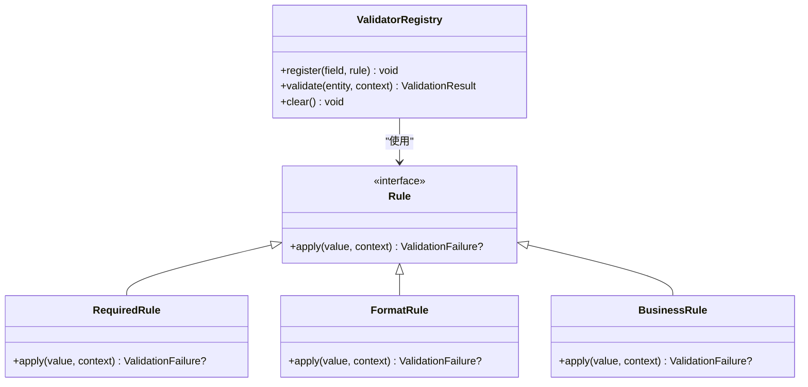
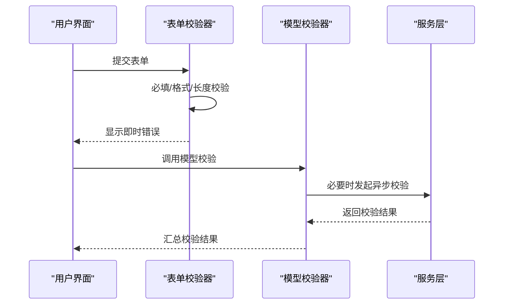
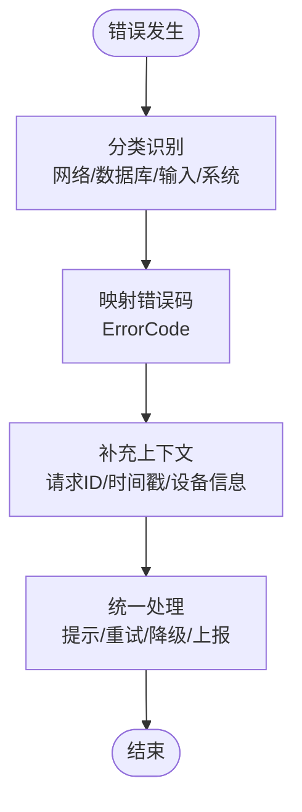
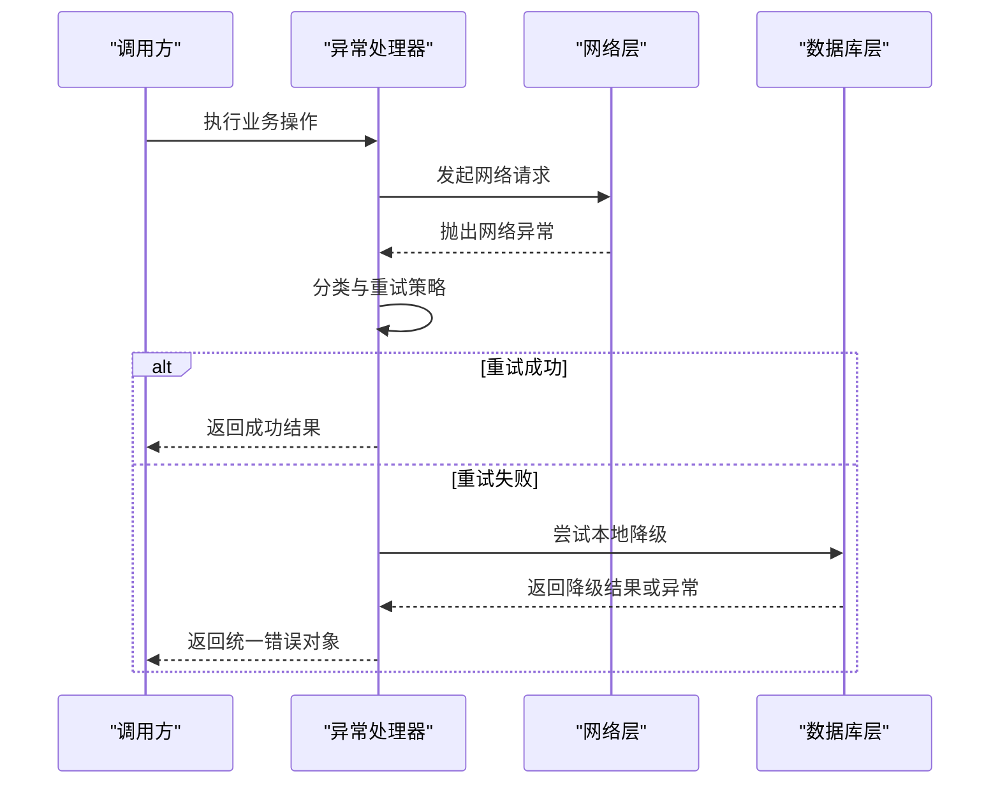
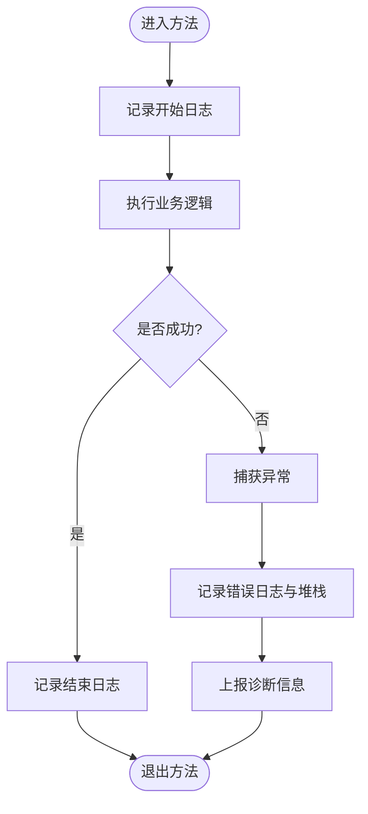
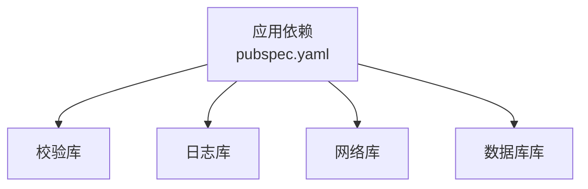

# 数据验证与错误处理

<cite>
**本文引用的文件**   
- [pubspec.yaml](file://pubspec.yaml)
- [main.dart](file://lib/main.dart)
- [app.dart](file://lib/app.dart)
</cite>

## 目录
1. [简介](#简介)
2. [项目结构](#项目结构)
3. [核心组件](#核心组件)
4. [架构总览](#架构总览)
5. [详细组件分析](#详细组件分析)
6. [依赖分析](#依赖分析)
7. [性能考虑](#性能考虑)
8. [故障排查指南](#故障排查指南)
9. [结论](#结论)
10. [附录](#附录)

## 简介
本技术文档聚焦于Flutter照片整理AI应用的数据验证与错误处理体系，目标是：
- 明确数据验证规则的定义与执行机制（必填、格式、业务规则）
- 说明自定义验证器的实现与扩展方式
- 定义错误分类体系与错误码规范
- 统一异常处理策略（网络、数据库、用户输入）
- 完善日志记录与调试信息收集
- 提供可复用的最佳实践与示例路径指引

当前仓库处于初始化阶段，尚未包含具体的验证与错误处理实现。本文在“详细组件分析”部分给出推荐架构与落地方案，便于后续快速集成。

## 项目结构
- lib/main.dart：应用入口，负责初始化全局配置、依赖注入与路由等
- lib/app.dart：应用装配层，组织页面、主题、国际化与全局状态
- pubspec.yaml：声明第三方依赖，建议引入数据校验与日志相关库

**图表来源** 
- [main.dart](file://lib/main.dart)
- [app.dart](file://lib/app.dart)

**章节来源**
- [main.dart](file://lib/main.dart)
- [app.dart](file://lib/app.dart)
- [pubspec.yaml](file://pubspec.yaml)

## 核心组件
为支撑照片整理AI应用的数据质量与稳定性，建议构建以下核心组件：
- 验证器中心（ValidatorRegistry）：集中管理字段级与实体级验证规则
- 表单与模型校验器（Form/Model Validators）：针对用户输入与领域模型进行校验
- 错误分类与错误码（ErrorCategory & ErrorCode）：统一错误语义与编码
- 异常处理器（ExceptionHandler）：捕获并归一化网络、数据库、输入类异常
- 日志与诊断（Logger & Diagnostics）：结构化日志、采样与上报

这些组件将贯穿UI、服务与数据层，确保一致的校验与错误处理体验。

**章节来源**
- [pubspec.yaml](file://pubspec.yaml)

## 架构总览
下图展示数据验证与错误处理在应用中的分层协作关系：

**图表来源** 
- [app.dart](file://lib/app.dart)

## 详细组件分析

### 验证器中心（ValidatorRegistry）
职责
- 注册与查找字段级、实体级验证规则
- 支持链式组合与条件校验
- 提供批量校验与增量更新结果的能力

关键设计
- 规则类型：必填、长度、范围、正则、枚举、自定义函数
- 执行顺序：按注册顺序执行，短路或全量模式可选
- 结果对象：包含字段名、错误码、消息、上下文

扩展点
- 新增规则：实现规则接口并注册到中心
- 条件校验：基于上下文动态启用/禁用规则

**图表来源** 
- [app.dart](file://lib/app.dart)

**章节来源**
- [app.dart](file://lib/app.dart)

### 表单与模型校验器（Form/Model Validators）
职责
- 对页面表单数据进行前置校验，减少无效请求
- 对领域模型进行一致性校验，保证数据契约

关键点
- 表单校验：实时反馈、防抖、异步校验（如唯一性检查）
- 模型校验：跨字段约束、业务不变量、外部依赖校验（如权限）

**图表来源** 
- [app.dart](file://lib/app.dart)

**章节来源**
- [app.dart](file://lib/app.dart)

### 错误分类与错误码（ErrorCategory & ErrorCode）
目标
- 统一错误语义，便于前端提示、埋点与监控
- 支持层级化分类与可扩展的错误码

建议分类
- 网络异常：超时、连接失败、服务端错误、鉴权失败
- 数据库异常：写入冲突、查询失败、事务回滚
- 用户输入异常：必填缺失、格式不符、业务拒绝
- 系统异常：内存不足、权限不足、平台限制

错误码规范
- 前缀+模块+场景+细节，例如 NET_TIMEOUT_001、DB_WRITE_CONFLICT_002、INPUT_REQUIRED_001
- 保持可读性与机器友好性，避免泄露敏感信息

**图表来源** 
- [app.dart](file://lib/app.dart)

**章节来源**
- [app.dart](file://lib/app.dart)

### 异常处理器（ExceptionHandler）
职责
- 捕获并归一化各层异常，转换为统一的错误对象
- 提供重试、降级与兜底策略
- 与日志系统联动，输出结构化诊断信息

处理策略
- 网络异常：指数退避重试、熔断与降级、离线缓存
- 数据库异常：事务回滚、重试与告警、数据修复建议
- 用户输入异常：即时反馈、引导修正、保留草稿

**图表来源** 
- [app.dart](file://lib/app.dart)

**章节来源**
- [app.dart](file://lib/app.dart)

### 日志与诊断（Logger & Diagnostics）
职责
- 结构化日志记录，支持分级与过滤
- 采集关键指标与堆栈信息，便于定位问题
- 支持脱敏与采样，平衡性能与可观测性

要点
- 日志级别：DEBUG/INFO/WARN/ERROR/FATAL
- 关键字段：请求ID、用户ID、时间戳、模块、方法、耗时、错误码
- 脱敏策略：掩码手机号、邮箱、令牌等敏感信息

**图表来源** 
- [app.dart](file://lib/app.dart)

**章节来源**
- [app.dart](file://lib/app.dart)

## 依赖分析
建议在依赖管理中引入以下类型的库：
- 数据校验：用于字段与模型校验的库
- 日志与诊断：结构化日志、性能追踪与错误上报
- 网络与数据库：统一封装以配合异常处理器

**图表来源** 
- [pubspec.yaml](file://pubspec.yaml)

**章节来源**
- [pubspec.yaml](file://pubspec.yaml)

## 性能考虑
- 校验延迟：表单输入采用防抖与增量校验，避免阻塞主线程
- 批量校验：合并多次输入变更，减少重复计算
- 异步校验：仅对外部依赖进行异步校验，并提供占位与取消机制
- 日志采样：在高并发场景下对DEBUG日志进行采样，降低IO压力
- 错误上报：控制频率与大小，避免影响用户体验

[本节为通用指导，不直接分析具体文件]

## 故障排查指南
常见问题与定位步骤
- 网络异常
  - 检查超时与重试策略是否合理
  - 查看错误码与响应体，确认服务端状态
  - 通过请求ID关联日志链路
- 数据库异常
  - 核对事务边界与回滚策略
  - 检查索引与约束冲突
  - 结合慢查询日志定位热点
- 用户输入异常
  - 确认校验规则覆盖所有必填与格式要求
  - 检查前端提示是否与后端错误码一致
  - 使用沙箱数据复现问题

建议工具
- 结构化日志：按模块与方法维度检索
- 错误面板：聚合错误码与出现次数
- 性能面板：观察校验与I/O耗时

**章节来源**
- [app.dart](file://lib/app.dart)

## 结论
通过建立统一的验证器中心、清晰的错误分类与错误码、完善的异常处理器以及结构化的日志诊断，照片整理AI应用可以在数据质量与稳定性方面获得显著提升。建议在后续迭代中逐步落地上述组件，并结合实际业务场景持续优化。

[本节为总结性内容，不直接分析具体文件]

## 附录
- 最佳实践清单
  - 所有用户输入必须经过表单与模型双重校验
  - 网络与数据库调用必须包裹异常处理器
  - 错误码需具备可读性与可追溯性
  - 日志必须脱敏且包含必要上下文
  - 关键路径增加性能与错误埋点
- 示例路径指引
  - 验证器中心实现位置：lib/core/validator_registry.dart（待实现）
  - 错误分类与错误码定义位置：lib/core/error_codes.dart（待实现）
  - 异常处理器位置：lib/core/exception_handler.dart（待实现）
  - 日志与诊断位置：lib/core/logger.dart（待实现）

[本节为附录内容，不直接分析具体文件]