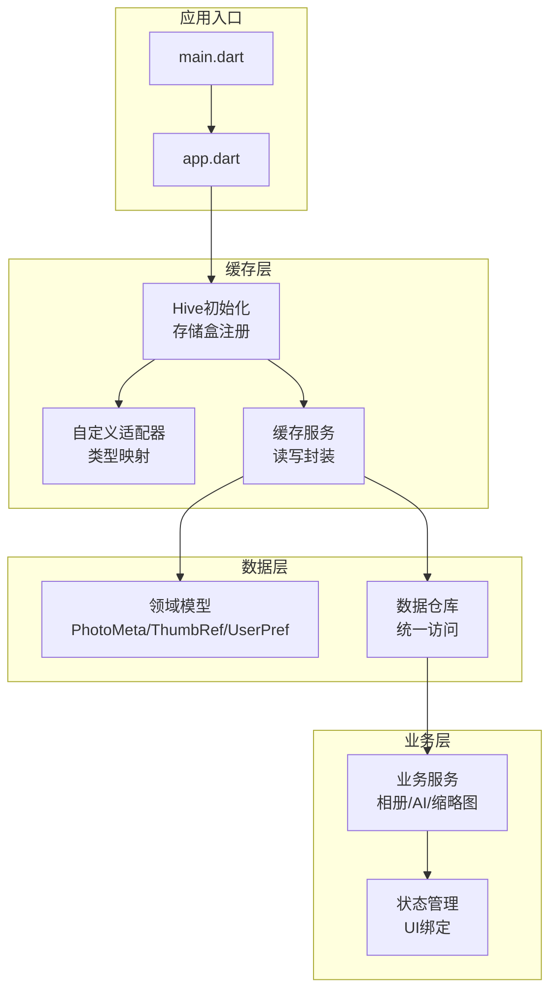
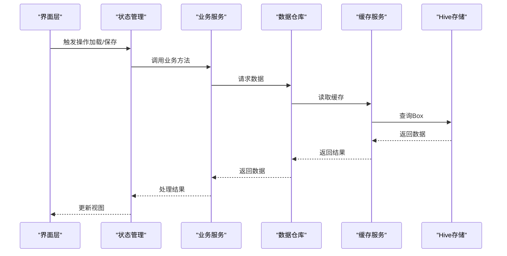
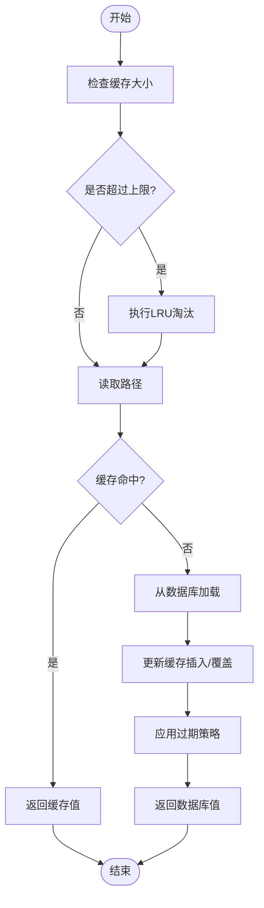
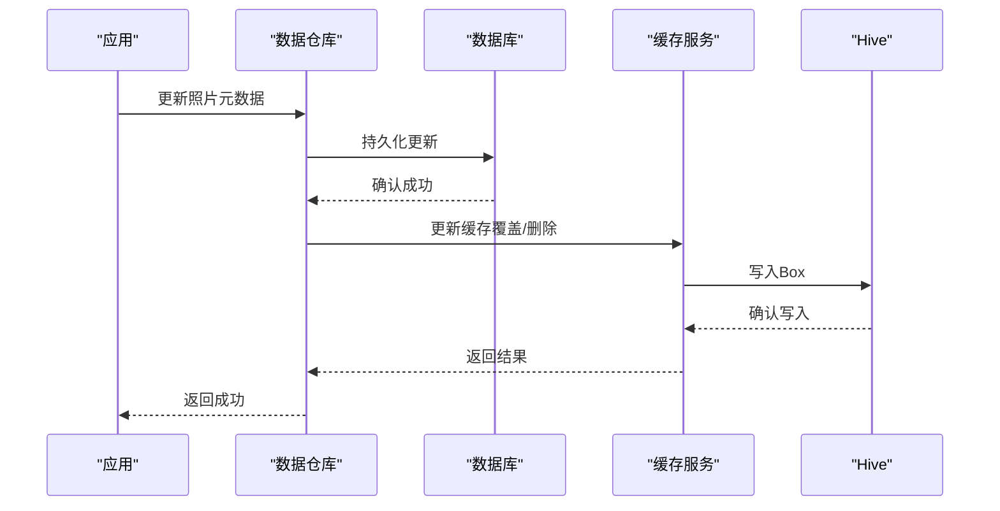

# Hive缓存机制

<cite>
**本文档引用的文件**   
- [pubspec.yaml](file://pubspec.yaml)
- [main.dart](file://lib/main.dart)
- [app.dart](file://lib/app.dart)
</cite>

## 目录
1. [简介](#简介)
2. [项目结构](#项目结构)
3. [核心组件](#核心组件)
4. [架构总览](#架构总览)
5. [详细组件分析](#详细组件分析)
6. [依赖关系分析](#依赖关系分析)
7. [性能考虑](#性能考虑)
8. [故障排查指南](#故障排查指南)
9. [结论](#结论)
10. [附录](#附录)

## 简介
本技术文档面向Flutter照片整理AI应用中的Hive缓存子系统，目标是帮助开发者理解并正确使用Hive进行本地数据持久化与缓存管理。文档涵盖存储盒配置、数据类型映射与自定义适配器、缓存策略（LRU、容量限制、过期）、数据结构组织（照片元数据、缩略图缓存、用户偏好）、缓存同步机制、读写优化与内存管理、以及监控与调试方法。由于当前仓库未包含具体实现代码，本文提供基于Hive的最佳实践与可落地的设计蓝图，便于后续在lib目录下落地实现。

## 项目结构
为支撑Hive缓存系统，建议在lib下按职责划分模块：
- lib/cache：Hive初始化、存储盒注册、适配器定义、缓存服务封装
- lib/models：领域模型（照片元数据、缩略图引用、用户偏好）
- lib/services：业务服务层（相册扫描、AI标签、缩略图生成）
- lib/providers：状态管理与UI绑定（Provider/Riverpod/Bloc等）
- lib/data：数据访问层（Repository/DAO，统一读写入口）

图表来源
- [main.dart:1-200](file://lib/main.dart#L1-L200)
- [app.dart:1-200](file://lib/app.dart#L1-L200)

章节来源
- [pubspec.yaml:1-200](file://pubspec.yaml#L1-L200)
- [main.dart:1-200](file://lib/main.dart#L1-L200)
- [app.dart:1-200](file://lib/app.dart#L1-L200)

## 核心组件
- 存储盒（Box）与注册：为不同数据域创建独立Box，如photo_meta_box、thumb_cache_box、user_prefs_box，并在应用启动时完成初始化与版本迁移。
- 自定义适配器：为复杂类型（如时间戳、枚举、嵌套对象）编写Hive适配器，确保序列化稳定与兼容升级。
- 缓存服务：封装CRUD操作，提供批量写入、事务、条件更新、失效清理等能力。
- 数据仓库：对外暴露统一的读写接口，屏蔽Hive细节，便于替换或扩展。
- 领域模型：照片元数据、缩略图引用、用户偏好等实体，保持POD结构，避免业务耦合。

章节来源
- [pubspec.yaml:1-200](file://pubspec.yaml#L1-L200)
- [main.dart:1-200](file://lib/main.dart#L1-L200)
- [app.dart:1-200](file://lib/app.dart#L1-L200)

## 架构总览
下图展示从UI到Hive的调用路径与职责分工，强调缓存服务与数据仓库的解耦，以及适配器的类型保障。

图表来源
- [main.dart:1-200](file://lib/main.dart#L1-L200)
- [app.dart:1-200](file://lib/app.dart#L1-L200)

## 详细组件分析

### 存储盒配置与管理
- 命名规范：按功能域命名Box，如“照片元数据”、“缩略图缓存”、“用户偏好”。
- 初始化顺序：先注册所有适配器，再打开Box；支持多环境（开发/测试/生产）差异化配置。
- 版本管理：通过版本号与迁移脚本保证向后兼容，避免破坏性变更。
- 安全与隔离：敏感字段加密存储（可选），不同Box权限隔离。

章节来源
- [pubspec.yaml:1-200](file://pubspec.yaml#L1-L200)
- [main.dart:1-200](file://lib/main.dart#L1-L200)
- [app.dart:1-200](file://lib/app.dart#L1-L200)

### 数据类型映射与自定义适配器
- 基础类型：直接使用Hive内置类型映射。
- 复杂类型：为自定义类、枚举、集合、时间类型编写适配器，确保encode/decode稳定。
- 兼容性：适配器版本化，旧数据可通过迁移逻辑平滑过渡。
- 性能：避免在适配器中进行IO或重型计算，尽量轻量。

章节来源
- [pubspec.yaml:1-200](file://pubspec.yaml#L1-L200)
- [main.dart:1-200](file://lib/main.dart#L1-L200)
- [app.dart:1-200](file://lib/app.dart#L1-L200)

### 缓存策略设计（LRU、容量限制、过期）
- LRU算法：维护最近使用记录，淘汰最久未使用的条目；适合缩略图等热点数据。
- 容量限制：设置最大条目数或字节上限，超出时触发清理；支持动态调整。
- 过期策略：TTL（生存时间）与绝对过期时间结合，定期清理过期键。
- 一致性：写路径优先更新缓存，读路径回源数据库并回填缓存。

图表来源
- [pubspec.yaml:1-200](file://pubspec.yaml#L1-L200)
- [main.dart:1-200](file://lib/main.dart#L1-L200)
- [app.dart:1-200](file://lib/app.dart#L1-L200)

### 缓存数据结构组织
- 照片元数据：唯一ID、路径、拍摄时间、尺寸、AI标签、分类、缩略图引用、更新时间戳。
- 缩略图缓存：键为图片ID或哈希，值为缩略图二进制或路径；附带分辨率、质量、生成时间。
- 用户偏好：主题、排序规则、过滤条件、隐私设置、导入策略。
- 索引与查询：为常用查询字段建立二级索引（如时间范围、标签集合）。

章节来源
- [pubspec.yaml:1-200](file://pubspec.yaml#L1-L200)
- [main.dart:1-200](file://lib/main.dart#L1-L200)
- [app.dart:1-200](file://lib/app.dart#L1-L200)

### 缓存同步机制（本地缓存与数据库一致性）
- 写路径：先写数据库，成功后再更新缓存；失败则回滚缓存。
- 读路径：优先读缓存，未命中则读数据库并回填缓存。
- 冲突解决：以数据库为准，缓存作为快速通道；支持增量同步与全量校验。
- 事件驱动：数据库变更事件触发缓存失效或更新，保证最终一致。

图表来源
- [pubspec.yaml:1-200](file://pubspec.yaml#L1-L200)
- [main.dart:1-200](file://lib/main.dart#L1-L200)
- [app.dart:1-200](file://lib/app.dart#L1-L200)

### 缓存操作示例（读写优化与内存管理）
- 批量写入：合并多次写入为一次事务，减少IO开销。
- 懒加载：按需加载大对象（如原图路径），避免一次性载入内存。
- 分页与游标：对列表数据采用分页读取，降低峰值内存。
- 内存管理：及时释放不再使用的缓存项，避免泄漏；监控堆内存增长。

章节来源
- [pubspec.yaml:1-200](file://pubspec.yaml#L1-L200)
- [main.dart:1-200](file://lib/main.dart#L1-L200)
- [app.dart:1-200](file://lib/app.dart#L1-L200)

### 缓存监控与调试工具
- 指标采集：命中率、平均延迟、淘汰次数、容量使用率。
- 日志记录：关键读写路径打点，异常堆栈与上下文信息。
- 诊断命令：导出快照、对比差异、回放操作序列。
- 可视化：Dashboard展示实时指标与趋势，辅助定位问题。

章节来源
- [pubspec.yaml:1-200](file://pubspec.yaml#L1-L200)
- [main.dart:1-200](file://lib/main.dart#L1-L200)
- [app.dart:1-200](file://lib/app.dart#L1-L200)

## 依赖关系分析
- pubspec.yaml声明Hive及相关插件依赖，确保版本兼容。
- main.dart负责应用启动与全局初始化（包括Hive初始化）。
- app.dart定义应用结构与路由，可能集成缓存相关的页面与服务。

图表来源
- [pubspec.yaml:1-200](file://pubspec.yaml#L1-L200)
- [main.dart:1-200](file://lib/main.dart#L1-L200)
- [app.dart:1-200](file://lib/app.dart#L1-L200)

章节来源
- [pubspec.yaml:1-200](file://pubspec.yaml#L1-L200)
- [main.dart:1-200](file://lib/main.dart#L1-L200)
- [app.dart:1-200](file://lib/app.dart#L1-L200)

## 性能考虑
- 减少频繁小写：合并写入，使用事务提升吞吐。
- 合理分盒：按访问频率与数据规模拆分Box，降低锁竞争。
- 压缩与编码：对大体积数据采用压缩或高效编码格式。
- 预热与预取：预测热点数据提前加载，缩短首屏延迟。
- 内存上限：设定缓存上限与淘汰策略，防止OOM。

## 故障排查指南
- 常见问题：适配器不兼容、Box未初始化、键冲突、容量不足。
- 排查步骤：检查初始化顺序、验证适配器版本、查看错误日志、导出快照对比。
- 恢复策略：回滚到上一版本、重建索引、清理损坏数据。
- 预防措施：单元测试覆盖适配器与边界场景，灰度发布与回滚预案。

## 结论
本方案为Flutter照片整理AI应用的Hive缓存系统提供了完整的设计蓝图与实践指南。通过清晰的模块划分、稳定的适配器与一致的同步机制，可在保证性能与可靠性的同时，支撑照片元数据、缩略图与用户偏好的高效缓存。建议在实际落地中结合监控与测试，持续优化缓存策略与资源占用。

## 附录
- 术语表：Hive、Box、适配器、LRU、TTL、缓存命中率等。
- 参考链接：Hive官方文档、Flutter最佳实践、性能调优指南。
- 模板清单：适配器模板、缓存服务接口、监控指标定义。