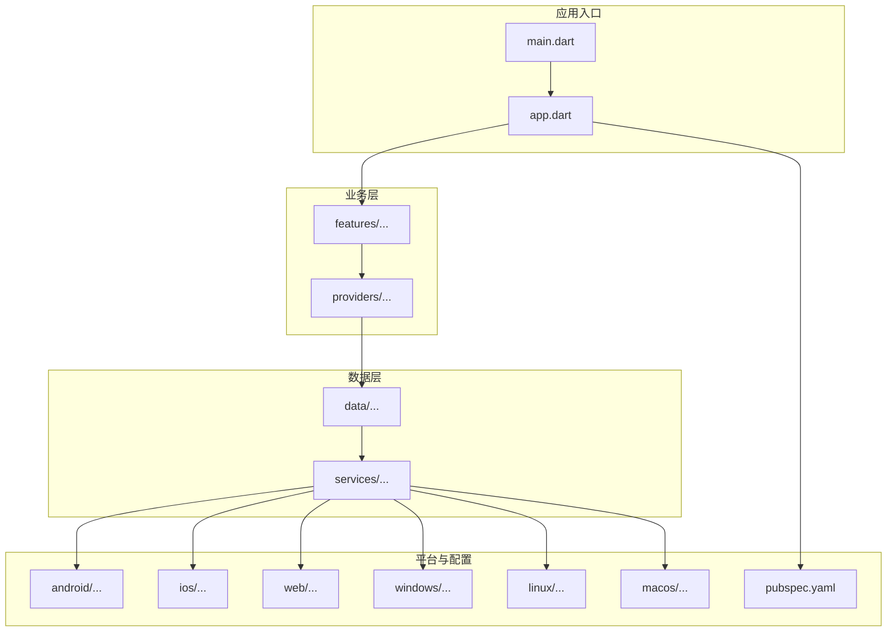
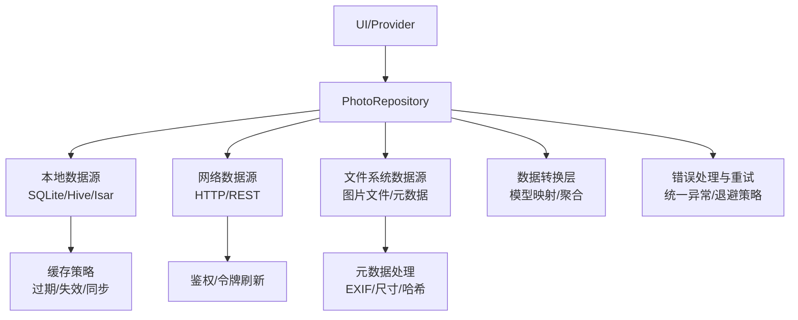
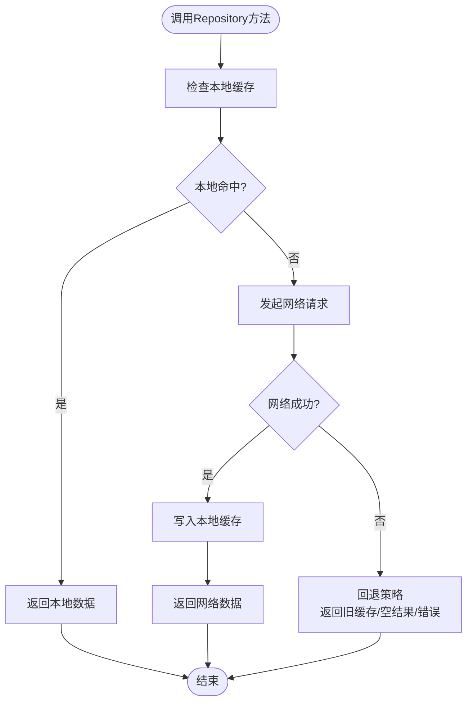
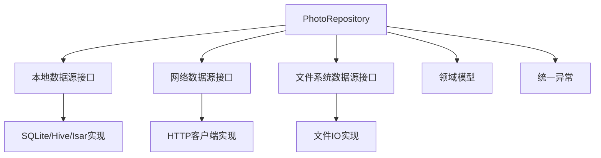

# Repository模式实现

<cite>
**本文档引用的文件**   
- [lib/main.dart](file://lib/main.dart)
- [lib/app.dart](file://lib/app.dart)
- [pubspec.yaml](file://pubspec.yaml)
- [README.md](file://README.md)
</cite>

## 目录
1. [简介](#简介)
2. [项目结构](#项目结构)
3. [核心组件](#核心组件)
4. [架构总览](#架构总览)
5. [详细组件分析](#详细组件分析)
6. [依赖关系分析](#依赖关系分析)
7. [性能考量](#性能考量)
8. [故障排查指南](#故障排查指南)
9. [结论](#结论)
10. [附录](#附录)

## 简介
本技术文档面向Flutter照片整理AI应用中的Repository模式实现，聚焦以下目标：
- 定义清晰的Repository接口与数据源抽象，统一对外API。
- 设计多数据源切换机制，优先本地存储，网络失败时回退到远程数据。
- 构建数据聚合与转换层，标准化不同数据源的模型与错误。
- 完善错误处理与重试策略，覆盖网络异常、数据库错误与文件操作异常。
- 提供可组合的Repository实现示例，展示如何组合多个数据源并暴露统一API。
- 制定测试策略与Mock对象使用规范，确保高覆盖率与稳定性。

## 项目结构
当前仓库为Flutter工程骨架，包含Android、iOS、Web、Windows、Linux、macOS等多平台配置，核心业务代码位于lib目录。根据现有结构，Repository相关代码尚未落地，但已具备分层组织的基础（data、features、services、providers等）。后续应在lib/data下建立repository、datasource、models、exceptions等子模块，以支撑统一的Repository模式。

图表来源
- [lib/main.dart:1-200](file://lib/main.dart#L1-L200)
- [lib/app.dart:1-200](file://lib/app.dart#L1-L200)
- [pubspec.yaml:1-200](file://pubspec.yaml#L1-L200)

章节来源
- [lib/main.dart:1-200](file://lib/main.dart#L1-L200)
- [lib/app.dart:1-200](file://lib/app.dart#L1-L200)
- [pubspec.yaml:1-200](file://pubspec.yaml#L1-L200)

## 核心组件
- Repository接口
  - 职责：对上层屏蔽数据源细节，统一CRUD与查询方法，返回标准化的数据结构或流式结果。
  - 方法规范：命名清晰、参数最小化、返回值类型一致（如Future<T>/Stream<T>），错误通过统一异常抛出。
- 数据源抽象
  - 本地数据源：封装SQLite/Hive/Isar等持久化能力，提供缓存读写、索引与事务支持。
  - 网络数据源：封装HTTP请求、鉴权、分页、限流与超时控制。
  - 文件系统数据源：封装图片文件读取、写入、压缩与元数据提取。
- 数据聚合与转换层
  - 将不同数据源的模型映射到统一的领域模型，保证上层一致性。
  - 合并本地缓存与网络数据，解决冲突与版本差异。
- 错误处理与重试
  - 统一异常体系：网络异常、数据库异常、文件异常、权限异常等。
  - 重试策略：指数退避、最大重试次数、条件重试（仅针对幂等请求）。
- 测试与Mock
  - 基于接口的Mock替换真实数据源，覆盖成功、失败、超时、并发等场景。

章节来源
- [lib/main.dart:1-200](file://lib/main.dart#L1-L200)
- [lib/app.dart:1-200](file://lib/app.dart#L1-L200)

## 架构总览
Repository模式在本应用中承担“数据访问门面”的角色，向上暴露统一API，向下协调本地缓存、网络与文件系统。整体流程遵循“本地优先、网络回退”的策略，并通过转换层统一数据结构与错误。

图表来源
- [lib/app.dart:1-200](file://lib/app.dart#L1-L200)
- [pubspec.yaml:1-200](file://pubspec.yaml#L1-L200)

## 详细组件分析

### Repository接口设计与方法规范
- 接口设计原则
  - 单一职责：每个Repository聚焦一个业务域（如照片、标签、分类）。
  - 抽象稳定：对外方法不随数据源变化而频繁变更。
  - 可组合性：支持注入多个数据源以实现灵活切换。
- 方法定义规范
  - 异步返回：使用Future或Stream表达异步结果。
  - 错误语义：通过异常或Result包装区分成功与失败。
  - 参数校验：在入口处进行必要校验，减少下游复杂度。
- 典型方法族
  - 获取列表：getPhotos(page, size, filters)
  - 获取详情：getPhoto(id)
  - 新增/更新：savePhoto(photo), updatePhoto(photo)
  - 删除：deletePhoto(id)
  - 搜索与过滤：searchPhotos(query, tags)
  - 批量操作：batchSave/photos, batchDelete

章节来源
- [lib/main.dart:1-200](file://lib/main.dart#L1-L200)
- [lib/app.dart:1-200](file://lib/app.dart#L1-L200)

### 多数据源切换机制（本地优先 + 网络回退）
- 策略说明
  - 读路径：先查本地缓存，命中则直接返回；未命中则请求网络，成功后回填缓存。
  - 写路径：先落本地，再异步同步至网络；网络失败保留本地状态并标记待同步。
  - 冲突解决：基于时间戳或版本号决定最终数据，必要时提示用户。
- 流程图示

图表来源
- [lib/app.dart:1-200](file://lib/app.dart#L1-L200)

### 数据聚合与转换层
- 模型标准化
  - 定义统一的领域模型（如Photo、Tag、Category），屏蔽底层差异。
  - 提供转换器将本地实体、网络响应映射到领域模型。
- 聚合逻辑
  - 合并本地与网络数据，去重、排序、分页。
  - 计算派生字段（如缩略图路径、统计信息）。
- 错误归一化
  - 将各数据源异常转换为统一错误码与消息，便于上层处理。

章节来源
- [lib/main.dart:1-200](file://lib/main.dart#L1-L200)
- [lib/app.dart:1-200](file://lib/app.dart#L1-L200)

### 错误处理与重试机制
- 异常分类
  - 网络异常：超时、连接失败、HTTP错误码、鉴权失败。
  - 数据库异常：约束冲突、事务失败、索引损坏。
  - 文件异常：权限不足、磁盘空间不足、IO错误。
- 重试策略
  - 指数退避：初始延迟乘以倍数，限制最大重试次数。
  - 条件重试：仅对幂等GET请求启用，POST/PUT避免重复副作用。
  - 熔断保护：连续失败达到阈值后快速失败，降低雪崩风险。
- 容错处理
  - 降级：网络不可用时返回本地缓存或默认值。
  - 补偿：后台任务重试失败的操作，记录审计日志。

章节来源
- [lib/app.dart:1-200](file://lib/app.dart#L1-L200)

### Repository实现示例（组合多数据源）
- 组合方式
  - 注入本地数据源、网络数据源、文件系统数据源。
  - 在方法中按策略选择数据源，并进行数据转换与错误处理。
- 典型流程
  - 读取：本地优先 -> 网络回退 -> 缓存更新。
  - 写入：本地落盘 -> 异步同步 -> 失败重试。
- 注意事项
  - 避免循环依赖，使用依赖注入管理生命周期。
  - 保持方法幂等，便于重试与恢复。

章节来源
- [lib/main.dart:1-200](file://lib/main.dart#L1-L200)
- [lib/app.dart:1-200](file://lib/app.dart#L1-L200)

### 测试策略与Mock对象
- 单元测试
  - 对Repository方法进行输入输出验证，覆盖正常与异常分支。
  - 使用Mock替换数据源，模拟网络延迟、错误码、数据库异常。
- 集成测试
  - 验证端到端流程：UI -> Provider -> Repository -> 数据源。
  - 使用内存数据库或临时文件系统进行隔离测试。
- Mock最佳实践
  - 基于接口生成Mock，避免耦合具体实现。
  - 设置期望行为与断言，确保调用顺序与次数正确。

章节来源
- [lib/main.dart:1-200](file://lib/main.dart#L1-L200)
- [lib/app.dart:1-200](file://lib/app.dart#L1-L200)

## 依赖关系分析
- 组件耦合
  - Repository依赖数据源抽象，不感知具体实现。
  - 转换层依赖领域模型，屏蔽数据源差异。
- 外部依赖
  - 网络库（如http/dio）、数据库库（如sqflite/hive/isar）、文件系统操作。
- 潜在问题
  - 循环依赖：通过依赖注入与接口解耦。
  - 单点故障：引入熔断与降级策略。

图表来源
- [lib/app.dart:1-200](file://lib/app.dart#L1-L200)
- [pubspec.yaml:1-200](file://pubspec.yaml#L1-L200)

章节来源
- [lib/main.dart:1-200](file://lib/main.dart#L1-L200)
- [lib/app.dart:1-200](file://lib/app.dart#L1-L200)
- [pubspec.yaml:1-200](file://pubspec.yaml#L1-L200)

## 性能考量
- 缓存策略
  - 合理设置TTL与失效条件，避免脏读与过度刷新。
  - 使用增量更新与懒加载提升首屏速度。
- 并发控制
  - 限制并发请求数，避免阻塞主线程。
  - 使用队列与背压机制处理突发流量。
- 资源优化
  - 图片压缩与缩略图生成，减少内存占用。
  - 数据库索引优化，提升查询效率。

## 故障排查指南
- 常见问题定位
  - 网络请求失败：检查网络状态、鉴权令牌、服务端可用性。
  - 数据库错误：查看事务日志、约束冲突、索引完整性。
  - 文件操作异常：确认权限、存储空间、路径有效性。
- 调试手段
  - 启用详细日志，记录关键节点耗时与错误堆栈。
  - 使用Mock与沙箱环境复现问题。
- 恢复措施
  - 自动重试与降级，保障用户体验。
  - 数据修复工具与人工干预流程。

章节来源
- [lib/app.dart:1-200](file://lib/app.dart#L1-L200)

## 结论
通过Repository模式，本应用实现了数据访问的统一抽象与灵活组合，结合本地优先与网络回退策略，提升了鲁棒性与性能。完善的错误处理与重试机制保障了在各种异常场景下的稳定性。未来可在数据一致性、缓存策略与监控告警方面持续优化。

## 附录
- 术语表
  - Repository：数据访问门面，统一对外API。
  - 数据源：本地存储、网络服务、文件系统等。
  - 转换层：模型映射与数据聚合。
  - 重试策略：指数退避、条件重试、熔断保护。
- 参考文件
  - [README.md](file://README.md)
  - [pubspec.yaml](file://pubspec.yaml)