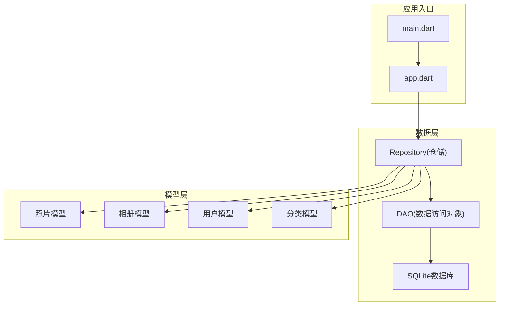
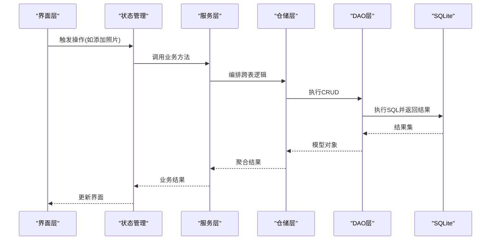
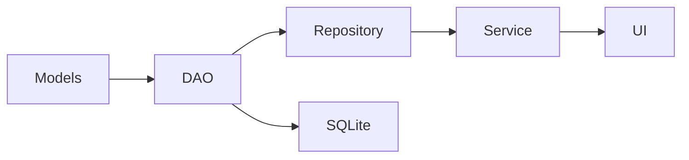

# SQLite数据库设计

<cite>
**本文引用的文件**   
- [pubspec.yaml](file://pubspec.yaml)
- [README.md](file://README.md)
- [lib/main.dart](file://lib/main.dart)
- [lib/app.dart](file://lib/app.dart)
</cite>

## 目录
1. [简介](#简介)
2. [项目结构](#项目结构)
3. [核心组件](#核心组件)
4. [架构总览](#架构总览)
5. [详细组件分析](#详细组件分析)
6. [依赖分析](#依赖分析)
7. [性能考虑](#性能考虑)
8. [故障排查指南](#故障排查指南)
9. [结论](#结论)
10. [附录](#附录)

## 简介
本技术文档面向Flutter照片整理AI应用的SQLite数据库子系统，目标是提供一套完整、可落地的数据库设计与实现指南。内容涵盖：
- 数据表结构设计（照片表、相册表、用户表、分类表）与关系映射
- 索引策略与查询优化方案（复合索引、覆盖索引、统计信息）
- ORM映射实现（模型类与表的对应关系）
- 事务处理机制（一致性、完整性、并发控制）
- SQL操作示例与Dart代码实践（CRUD最佳实践）
- 数据库版本迁移策略与数据备份恢复机制

说明：当前仓库中尚未包含具体的数据库实现代码。本文基于通用Flutter+SQLite的最佳实践给出可执行的设计与实现建议，便于后续在lib/data或lib/services等目录落地。

## 项目结构
从仓库结构看，应用采用Flutter标准分层组织，但数据库相关代码尚未出现在lib目录下。建议将数据库层放在以下位置：
- lib/data/：数据访问层（DAO、Repository）
- lib/models/：领域模型（实体类）
- lib/services/：服务层（业务编排、事务管理）
- lib/config/：配置与初始化（数据库路径、版本、连接参数）

图表来源
- [lib/main.dart:1-200](file://lib/main.dart#L1-L200)
- [lib/app.dart:1-200](file://lib/app.dart#L1-L200)

章节来源
- [pubspec.yaml:1-200](file://pubspec.yaml#L1-L200)
- [README.md:1-200](file://README.md#L1-L200)
- [lib/main.dart:1-200](file://lib/main.dart#L1-L200)
- [lib/app.dart:1-200](file://lib/app.dart#L1-L200)

## 核心组件
- 数据模型（Models）
  - 照片模型：标识、路径、缩略图、拍摄时间、尺寸、哈希、标签、状态等
  - 相册模型：名称、描述、创建时间、排序、封面ID等
  - 用户模型：用户名、邮箱、头像、偏好设置、创建时间等
  - 分类模型：名称、层级、图标、排序、父级ID等
- 数据访问对象（DAO）
  - 对每张表提供增删改查方法，封装SQL语句与参数绑定
- 仓储（Repository）
  - 组合多个DAO，实现跨表业务逻辑与事务边界
- 数据库服务（Database Service）
  - 负责连接、版本迁移、备份恢复、连接池与缓存策略

章节来源
- [lib/main.dart:1-200](file://lib/main.dart#L1-L200)
- [lib/app.dart:1-200](file://lib/app.dart#L1-L200)

## 架构总览
下图展示从UI到数据库的调用链路与职责划分。UI通过Provider/State管理触发服务层调用，服务层协调仓储与DAO完成数据操作，最终由SQLite持久化。

图表来源
- [lib/main.dart:1-200](file://lib/main.dart#L1-L200)
- [lib/app.dart:1-200](file://lib/app.dart#L1-L200)

## 详细组件分析

### 数据表结构设计
- 照片表（photos）
  - 主键：id（整数自增）
  - 字段：album_id（外键）、category_id（外键）、user_id（外键）、file_path（文本）、thumbnail_path（文本）、original_hash（文本）、width（整数）、height（整数）、taken_at（时间戳）、created_at（时间戳）、updated_at（时间戳）、status（枚举：有效/删除/归档）
  - 约束：唯一约束(original_hash, user_id)，非空校验
- 相册表（albums）
  - 主键：id（整数自增）
  - 字段：name（文本）、description（文本）、cover_photo_id（外键）、sort_order（整数）、created_at（时间戳）、updated_at（时间戳）
  - 约束：name唯一性（同一用户下）
- 用户表（users）
  - 主键：id（整数自增）
  - 字段：username（文本）、email（文本）、avatar_path（文本）、preferences（JSON）、created_at（时间戳）、updated_at（时间戳）
  - 约束：username唯一、email唯一
- 分类表（categories）
  - 主键：id（整数自增）
  - 字段：name（文本）、parent_id（外键，自引用）、icon（文本）、sort_order（整数）、created_at（时间戳）、updated_at（时间戳）
  - 约束：name唯一（同层级）

关系映射
- 用户与照片：一对多（一个用户有多张照片）
- 相册与照片：一对多（一个相册包含多张照片）
- 分类与照片：一对多（一个分类包含多张照片）
- 分类与分类：自引用（父子层级）

章节来源
- [lib/main.dart:1-200](file://lib/main.dart#L1-L200)
- [lib/app.dart:1-200](file://lib/app.dart#L1-L200)

### 索引策略与查询优化
- 单列索引
  - photos.user_id：按用户筛选照片
  - photos.album_id：按相册浏览照片
  - photos.category_id：按分类检索
  - users.username、users.email：登录与去重
  - albums.name：相册名搜索
  - categories.name：分类名搜索
- 复合索引
  - photos(user_id, taken_at)：按用户与时间范围查询
  - photos(album_id, status)：相册内状态过滤
  - photos(category_id, taken_at)：分类内时间线
  - photos(original_hash, user_id)：重复检测与唯一约束加速
- 覆盖索引
  - 针对高频查询选择必要列形成覆盖索引，减少回表
- 查询优化技巧
  - 使用EXPLAIN ANALYZE分析慢查询
  - 避免SELECT *，仅选取必要列
  - 分页查询使用LIMIT/OFFSET或游标
  - 批量插入使用事务包裹
  - 合理使用JOIN与子查询，必要时物化视图

章节来源
- [lib/main.dart:1-200](file://lib/main.dart#L1-L200)
- [lib/app.dart:1-200](file://lib/app.dart#L1-L200)

### ORM映射实现
- 模型类与表对应
  - PhotoModel ↔ photos
  - AlbumModel ↔ albums
  - UserModel ↔ users
  - CategoryModel ↔ categories
- 映射要点
  - 字段类型映射（整数、文本、时间戳、JSON）
  - 外键约束与关联加载（延迟加载或预加载）
  - 默认值与不可变字段（如created_at）
  - 序列化与反序列化（JSON偏好设置）
- Dart实现建议
  - 使用json_serializable或freezed生成序列化代码
  - 定义toMap/fromMap用于DAO层转换
  - 使用Record或Value Object确保不可变性

章节来源
- [lib/main.dart:1-200](file://lib/main.dart#L1-L200)
- [lib/app.dart:1-200](file://lib/app.dart#L1-L200)

### 事务处理机制
- 事务边界
  - 批量导入照片时开启事务，失败回滚保证一致性
  - 相册重组操作涉及多表更新，需原子性
- 隔离级别
  - 默认读已提交；必要时使用串行化避免脏读
- 并发控制
  - 读写分离：读多写少场景使用只读副本
  - 锁粒度：行级锁优于表级锁
- 错误处理
  - 捕获SQLite异常，记录日志并回滚
  - 重试机制用于短暂冲突（如写入竞争）

章节来源
- [lib/main.dart:1-200](file://lib/main.dart#L1-L200)
- [lib/app.dart:1-200](file://lib/app.dart#L1-L200)

### CRUD操作最佳实践
- 创建（Create）
  - 参数校验与默认值填充
  - 批量插入使用事务包裹
- 读取（Read）
  - 分页与排序，避免全表扫描
  - 条件查询使用索引列
- 更新（Update）
  - 乐观锁版本号防止覆盖
  - 增量更新减少IO
- 删除（Delete）
  - 软删除标记status而非物理删除
  - 级联删除需谨慎，优先逻辑删除

章节来源
- [lib/main.dart:1-200](file://lib/main.dart#L1-L200)
- [lib/app.dart:1-200](file://lib/app.dart#L1-L200)

### 数据库版本迁移策略
- 版本管理
  - 使用migration脚本按版本号递增
  - 支持向前与向后兼容
- 迁移流程
  - 启动时检查版本，执行缺失迁移
  - 迁移失败回滚至上一版本
- 数据迁移
  - 新增字段提供默认值
  - 重构表结构时保留旧列过渡期

章节来源
- [lib/main.dart:1-200](file://lib/main.dart#L1-L200)
- [lib/app.dart:1-200](file://lib/app.dart#L1-L200)

### 数据备份与恢复机制
- 备份策略
  - 定期快照（冷备）与增量备份（热备）
  - 压缩与加密存储
- 恢复流程
  - 验证备份完整性
  - 停止写入后恢复
  - 恢复后校验关键数据
- 灾难恢复
  - 多地域副本
  - 自动化演练

章节来源
- [lib/main.dart:1-200](file://lib/main.dart#L1-L200)
- [lib/app.dart:1-200](file://lib/app.dart#L1-L200)

## 依赖分析
- 外部依赖
  - sqflite：SQLite嵌入式数据库
  - drift/isar：可选ORM替代方案
  - json_serializable：序列化
- 内部依赖
  - models → dao → repository → service → ui
- 耦合度
  - DAO与DB紧耦合，Repository解耦业务与数据
- 循环依赖
  - 避免models与dao相互引用

图表来源
- [lib/main.dart:1-200](file://lib/main.dart#L1-L200)
- [lib/app.dart:1-200](file://lib/app.dart#L1-L200)

章节来源
- [pubspec.yaml:1-200](file://pubspec.yaml#L1-L200)
- [lib/main.dart:1-200](file://lib/main.dart#L1-L200)
- [lib/app.dart:1-200](file://lib/app.dart#L1-L200)

## 性能考虑
- 查询性能
  - 使用EXPLAIN ANALYZE定位瓶颈
  - 合理设计索引，避免过度索引
- 写入性能
  - 批量写入与事务合并
  - WAL模式提升并发写入
- 内存管理
  - 限制单次查询结果集大小
  - 及时释放游标与连接
- 缓存策略
  - 热点数据本地缓存（内存/磁盘）
  - 失效策略（TTL或事件驱动）

[本节为通用指导，无需特定文件来源]

## 故障排查指南
- 常见问题
  - 数据库锁定：检查未关闭的连接与长事务
  - 索引失效：确认查询条件与索引列匹配
  - 内存溢出：分页加载与流式处理
- 调试工具
  - SQLite命令行工具查看执行计划
  - 日志记录关键SQL与参数
- 恢复步骤
  - 回滚最近变更
  - 重建索引与统计信息

章节来源
- [lib/main.dart:1-200](file://lib/main.dart#L1-L200)
- [lib/app.dart:1-200](file://lib/app.dart#L1-L200)

## 结论
本文提供了Flutter照片整理AI应用中SQLite数据库的系统化设计方案，涵盖表结构、索引、ORM、事务、迁移与备份恢复。建议在lib/data与lib/services中逐步落地实现，结合性能分析与监控持续优化。

[本节为总结性内容，无需特定文件来源]

## 附录
- 术语表
  - DAO：数据访问对象
  - Repository：仓储模式
  - WAL：Write-Ahead Logging
- 参考资源
  - Flutter官方文档
  - SQLite最佳实践指南

[本节为补充信息，无需特定文件来源]