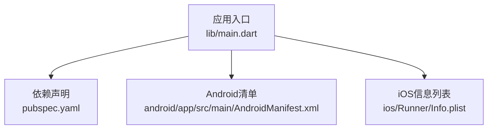
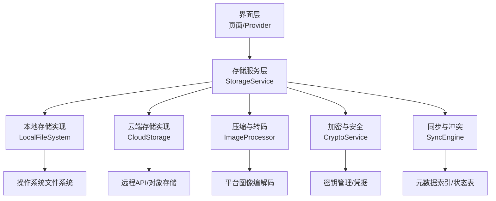
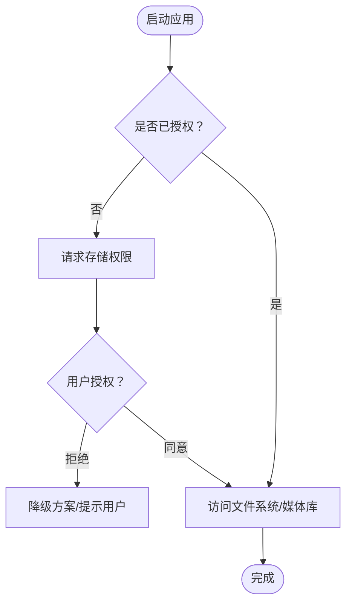
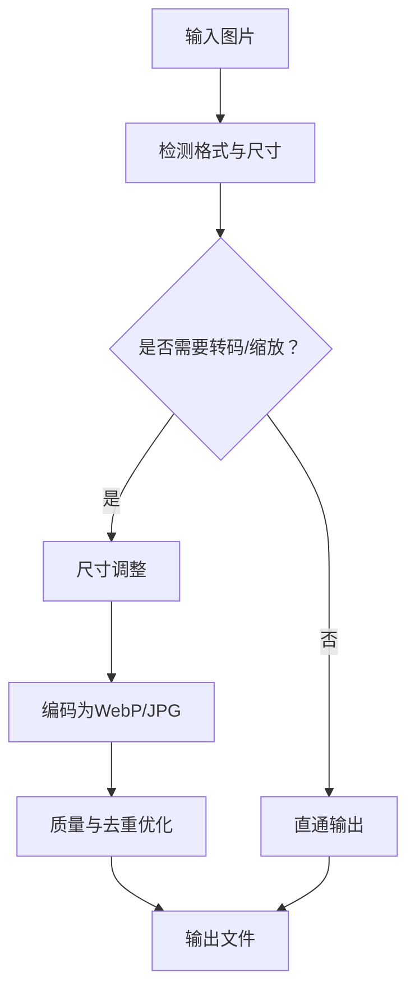
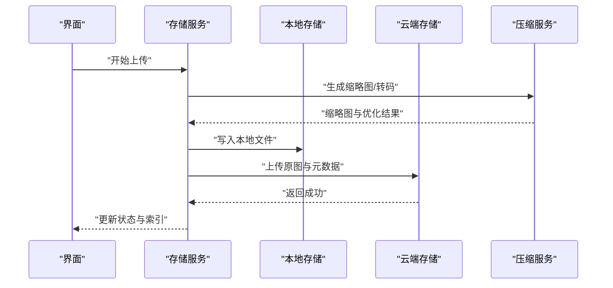
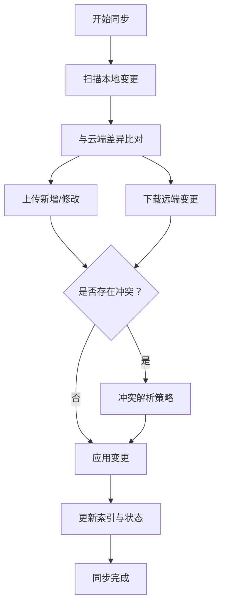
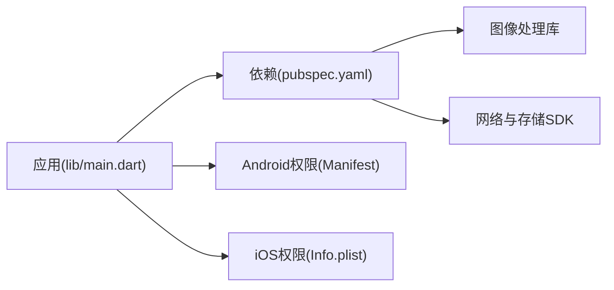

# 文件存储管理

<cite>
**本文引用的文件**   
- [pubspec.yaml](file://pubspec.yaml)
- [lib/main.dart](file://lib/main.dart)
- [android/app/src/main/AndroidManifest.xml](file://android/app/src/main/AndroidManifest.xml)
- [ios/Runner/Info.plist](file://ios/Runner/Info.plist)
</cite>

## 目录
1. [简介](#简介)
2. [项目结构](#项目结构)
3. [核心组件](#核心组件)
4. [架构总览](#架构总览)
5. [详细组件分析](#详细组件分析)
6. [依赖分析](#依赖分析)
7. [性能考虑](#性能考虑)
8. [故障排查指南](#故障排查指南)
9. [结论](#结论)
10. [附录](#附录)

## 简介
本技术文档面向Flutter照片整理AI应用的“文件存储系统”，聚焦以下目标：
- 图片文件的组织结构与命名规范（原始照片、缩略图、编辑版本）
- 跨平台文件访问权限处理（Android与iOS的权限申请与文件系统操作）
- 文件压缩与优化机制（格式转换、尺寸调整、存储空间管理）
- 文件安全机制（加密存储、访问控制、隐私保护）
- 具体文件操作示例（上传、下载、删除、批量处理）
- 文件同步与冲突解决策略

说明：当前仓库处于初始阶段，尚未包含具体的文件存储实现代码。本文基于Flutter通用实践与平台特性，给出可落地的设计与实现建议，并在需要时引用仓库中的配置文件以支撑平台相关说明。

## 项目结构
- Flutter应用入口位于 lib/main.dart；平台配置分别位于 android/app/src/main/AndroidManifest.xml 与 ios/Runner/Info.plist；依赖声明在 pubspec.yaml。
- 由于当前仓库未包含数据层与服务层的业务代码，文件存储系统的职责边界将在后续章节中通过分层设计进行明确。

**图表来源** 
- [lib/main.dart](file://lib/main.dart)
- [pubspec.yaml](file://pubspec.yaml)
- [android/app/src/main/AndroidManifest.xml](file://android/app/src/main/AndroidManifest.xml)
- [ios/Runner/Info.plist](file://ios/Runner/Info.plist)

**章节来源**
- [lib/main.dart](file://lib/main.dart)
- [pubspec.yaml](file://pubspec.yaml)
- [android/app/src/main/AndroidManifest.xml](file://android/app/src/main/AndroidManifest.xml)
- [ios/Runner/Info.plist](file://ios/Runner/Info.plist)

## 核心组件
为便于扩展与维护，建议将文件存储系统拆分为如下组件：
- 存储抽象接口：定义统一的读写、元数据、索引、压缩、加密等能力契约
- 本地存储实现：封装设备本地文件系统操作（含沙盒路径、媒体库访问）
- 云端存储实现：对接云对象存储或后端服务（可选）
- 压缩与转码服务：负责图片格式转换、尺寸缩放、质量优化
- 加密与安全服务：提供文件级加密、密钥管理、访问控制
- 同步与冲突解决：增量同步、断点续传、冲突检测与合并策略
- 权限与生命周期管理：统一处理Android/iOS存储权限、后台任务限制

说明：以上组件为设计建议，待实际代码落地后，可在对应模块内实现并注册到依赖注入容器。

## 架构总览
下图展示文件存储系统的分层与交互关系，强调从UI到存储介质的调用链以及各子系统职责。

[本图为概念性架构图，不直接映射具体源码文件]

## 详细组件分析

### 文件组织与命名规范
- 目录结构建议
  - 根目录：用户相册根（受平台沙盒或媒体库约束）
  - 原始照片：/originals/{YYYY}/{MM}/{DD}/UUID.jpg|heic
  - 缩略图：/thumbnails/{width}x{height}/UUID_thumb.webp|jpg
  - 编辑版本：/edits/{UUID}/v{version}.webp|jpg
  - 元数据：/metadata/{UUID}.json（EXIF、标签、位置、AI分类结果）
  - 索引：/index.db（SQLite或轻量KV）用于快速检索
- 命名规范
  - UUID作为唯一标识，保证跨设备一致性
  - 时间分片目录提升大数量下的遍历性能
  - 缩略图文件名包含尺寸信息，便于缓存命中
  - 编辑版本采用语义化版本号，支持回滚与对比

[本节为通用设计建议，不直接分析具体文件]

### 跨平台文件访问权限处理
- Android
  - 读取外部存储需声明相应权限，并在运行时申请
  - 使用MediaStore访问系统相册，避免直接扫描磁盘
  - 针对Android 11+的分区存储限制，优先使用SAF或MediaStore
- iOS
  - 通过Photos框架访问相册，需在Info.plist声明权限描述
  - 使用PHAsset获取资源，按需生成缩略图或导出原图
  - 注意后台任务与内存限制，避免长时间占用

**章节来源**
- [android/app/src/main/AndroidManifest.xml](file://android/app/src/main/AndroidManifest.xml)
- [ios/Runner/Info.plist](file://ios/Runner/Info.plist)

### 文件压缩与优化机制
- 格式选择
  - 原始照片保留HEIC/JPG，兼顾兼容性与体积
  - 缩略图与编辑版本优先WebP，平衡画质与体积
- 尺寸与质量
  - 按显示场景生成多档缩略图（如120px、320px、720px）
  - 动态质量参数（例如70%-85%），结合感知质量评估
- 空间管理
  - 定期清理过期缩略图与临时文件
  - 基于LRU策略回收缓存，限制最大占用比例

[本图为算法流程示意，不直接映射具体源码文件]

### 文件安全机制
- 加密存储
  - 对敏感元数据与编辑版本启用文件级加密（AES-GCM）
  - 密钥由平台安全存储（Android Keystore、iOS Keychain）托管
- 访问控制
  - 应用内鉴权校验后再执行读写
  - 对外分享前进行水印与脱敏处理
- 隐私保护
  - 默认不在日志中输出文件路径与内容
  - 用户可一键清除敏感数据与缓存

[本节为通用设计建议，不直接分析具体文件]

### 文件操作示例（上传、下载、删除、批量处理）
- 上传
  - 步骤：选择文件→生成缩略图→加密（可选）→写入本地→同步至云端→更新索引
- 下载
  - 步骤：拉取元数据→判断本地存在→按需下载→校验完整性→更新索引
- 删除
  - 步骤：标记删除→清理缩略图与缓存→异步删除原文件→更新索引
- 批量处理
  - 步骤：构建任务队列→并发控制→进度回调→失败重试→汇总报告

[本图为概念性序列图，不直接映射具体源码文件]

### 文件同步与冲突解决策略
- 增量同步
  - 基于文件哈希与修改时间戳，仅传输变更部分
- 断点续传
  - 记录分块偏移，网络中断后恢复传输
- 冲突检测与合并
  - 同文件多端编辑：采用最后修改时间优先或三方合并策略
  - 元数据冲突：字段级合并，保留用户偏好设置

[本图为概念性流程图，不直接映射具体源码文件]

## 依赖分析
- 平台权限与文件系统访问依赖Android与iOS的系统能力
- 图片处理依赖平台编解码库与第三方插件（如image、path_provider、crypto等）
- 同步与云端存储依赖HTTP客户端与对象存储SDK

**图表来源** 
- [lib/main.dart](file://lib/main.dart)
- [pubspec.yaml](file://pubspec.yaml)
- [android/app/src/main/AndroidManifest.xml](file://android/app/src/main/AndroidManifest.xml)
- [ios/Runner/Info.plist](file://ios/Runner/Info.plist)

**章节来源**
- [pubspec.yaml](file://pubspec.yaml)
- [android/app/src/main/AndroidManifest.xml](file://android/app/src/main/AndroidManifest.xml)
- [ios/Runner/Info.plist](file://ios/Runner/Info.plist)

## 性能考虑
- I/O优化
  - 批量写入与事务提交减少磁盘抖动
  - 缩略图与索引常驻内存缓存，降低重复计算
- 编解码优化
  - 使用硬件加速编解码（平台原生API）
  - 合理设置线程池与队列长度，避免阻塞主线程
- 存储优化
  - 定期碎片整理与压缩归档
  - 冷热数据分层存储（热数据SSD/内存，冷数据归档）

[本节为通用指导，不直接分析具体文件]

## 故障排查指南
- 权限问题
  - 检查Android Manifest与运行时授权流程
  - 检查iOS Info.plist权限描述与用户授权弹窗
- 文件损坏
  - 校验MD5/SHA256，失败则重新下载或恢复备份
- 同步异常
  - 查看网络状态与重试策略，确认冲突解析逻辑
- 存储空间不足
  - 监控可用空间，触发清理策略与用户提示

[本节为通用指导，不直接分析具体文件]

## 结论
本文给出了Flutter照片整理AI应用文件存储系统的整体设计方案，涵盖组织结构、命名规范、跨平台权限、压缩优化、安全机制、操作流程与同步策略。建议在后续迭代中逐步落地各组件，并通过单元测试与集成测试验证正确性与性能表现。

## 附录
- 推荐插件与库（根据实际需求选择）
  - 图像处理：image、flutter_image_compress
  - 文件路径与沙盒：path_provider、shared_preferences
  - 加密与安全：crypto、flutter_secure_storage
  - 网络与存储：http、dio、cloud_firestore/storage
- 参考平台文档
  - Android MediaStore与分区存储
  - iOS Photos框架与权限模型

[本节为补充信息，不直接分析具体文件]