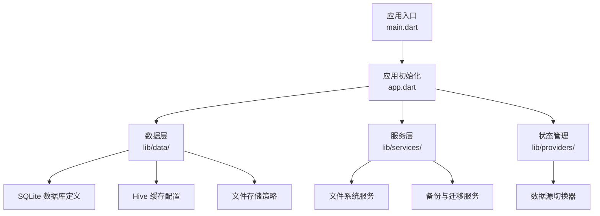
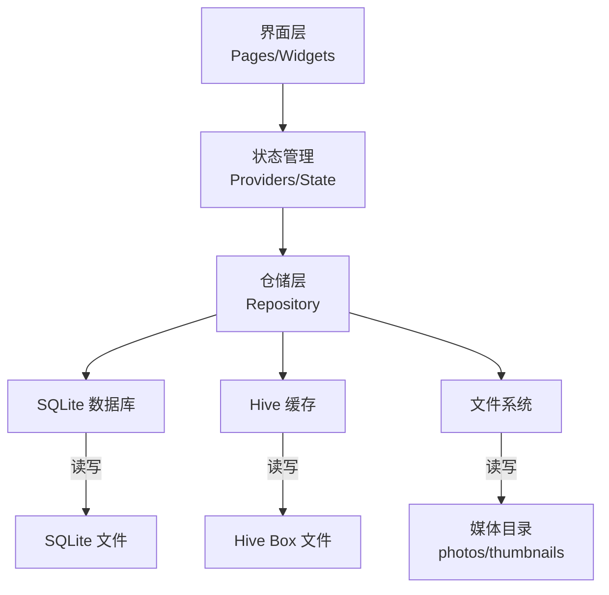
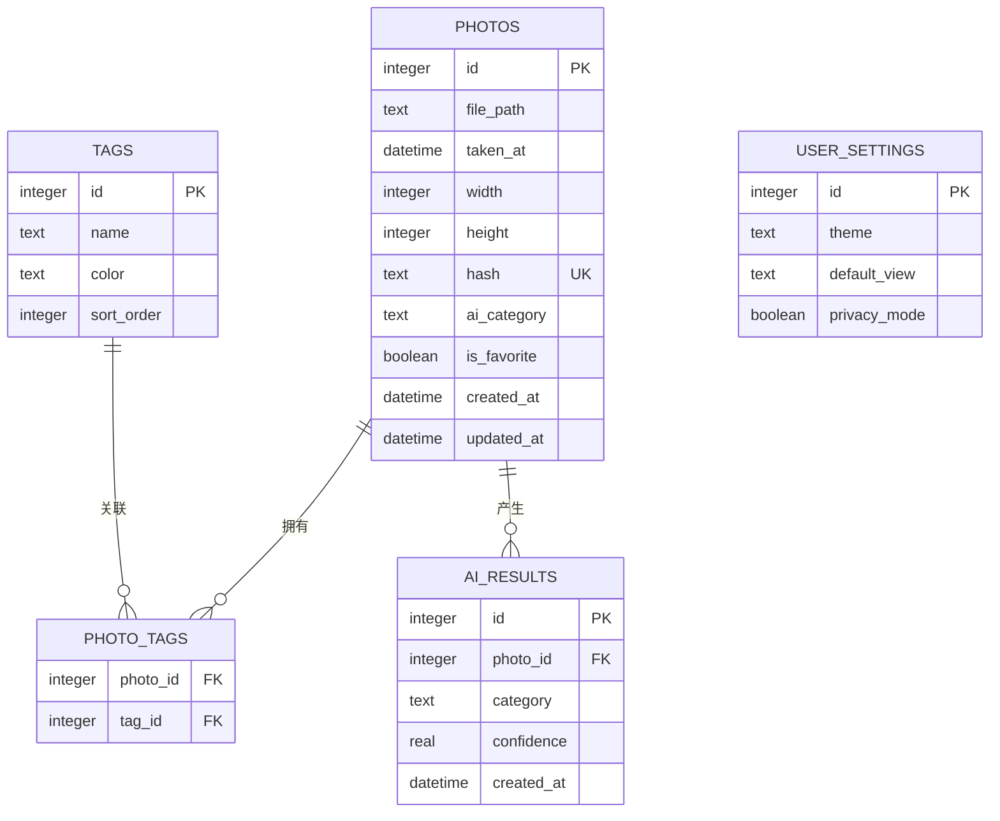
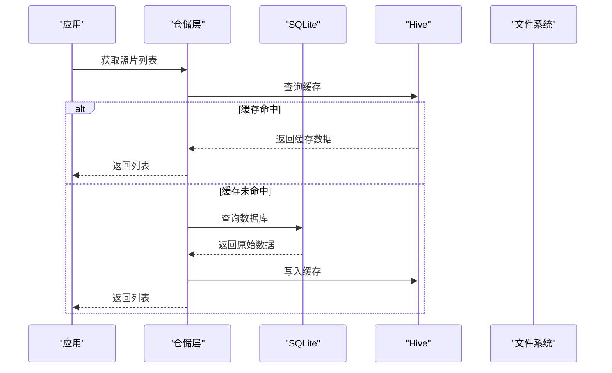
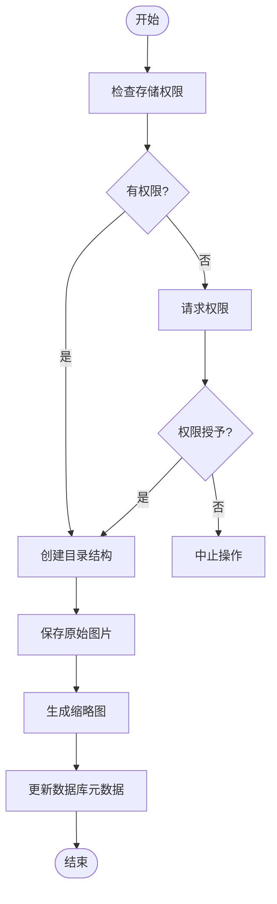
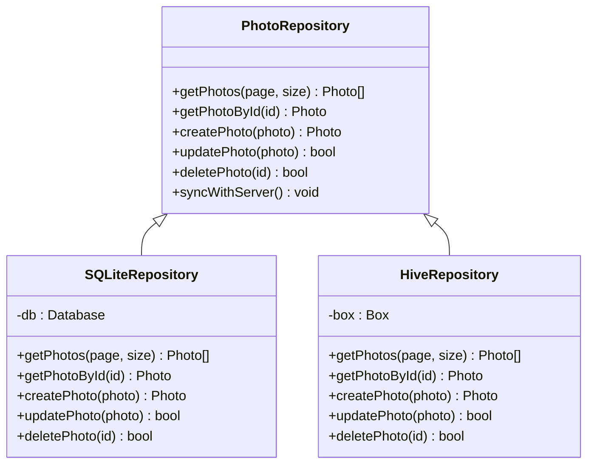
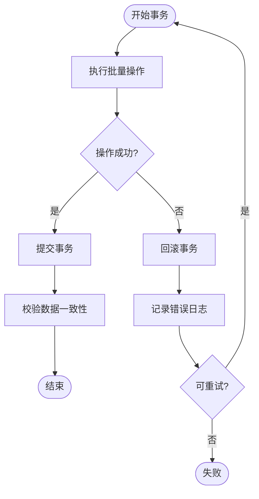
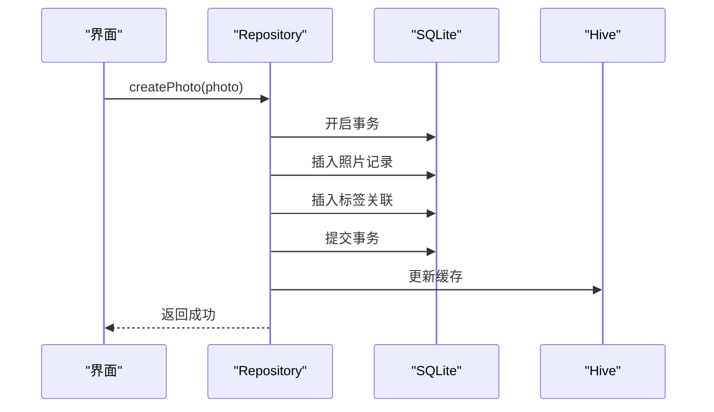
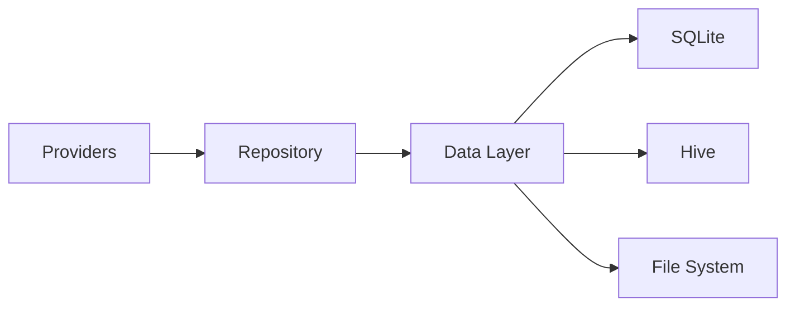

# 本地存储方案

<cite>
**本文档引用的文件**   
- [pubspec.yaml](file://pubspec.yaml)
- [lib/main.dart](file://lib/main.dart)
- [lib/app.dart](file://lib/app.dart)
</cite>

## 目录
1. [简介](#简介)
2. [项目结构](#项目结构)
3. [核心组件](#核心组件)
4. [架构总览](#架构总览)
5. [详细组件分析](#详细组件分析)
6. [依赖分析](#依赖分析)
7. [性能考虑](#性能考虑)
8. [故障排查指南](#故障排查指南)
9. [结论](#结论)
10. [附录](#附录)

## 简介
本技术文档围绕Flutter照片整理AI应用的“本地存储系统”进行系统化说明，覆盖SQLite表结构与索引优化、Hive缓存机制与数据同步、图片文件组织与访问权限控制、Repository模式的数据源抽象与切换、事务处理与错误恢复、以及CRUD与复杂查询示例。由于当前仓库中尚未包含具体实现代码，本文以通用最佳实践与可落地的设计蓝图为主，便于后续在lib/data、lib/services等目录中落地实施。

## 项目结构
从仓库根目录可见，应用采用标准Flutter工程布局：
- lib/ 为应用源码目录，通常按功能或层次划分（data、services、features、pages、providers等）
- android/、ios/、windows/、macos/、linux/、web/ 为各平台适配层
- pubspec.yaml 管理依赖与资源

针对本地存储系统，建议将相关代码集中在以下位置：
- lib/data/：数据模型、数据库定义、缓存配置、文件存储策略
- lib/services/：存储服务封装（如文件上传下载、备份恢复）
- lib/providers/：状态管理与数据源切换（Provider/Riverpod/Bloc等）
- lib/features/：按业务域组织（相册、标签、智能分类等）

[本节未直接分析具体文件，故无章节来源]

## 核心组件
- SQLite数据库层：负责结构化数据的持久化，包括照片元数据、标签、分类结果、用户设置等
- Hive缓存层：用于高频读写的轻量级键值/对象缓存，提升列表渲染与预览性能
- 文件存储层：管理原始图片与缩略图的文件路径、命名规范、访问权限与清理策略
- Repository模式：统一数据源抽象，屏蔽SQLite与Hive细节，提供一致API并支持数据源切换
- 事务与一致性：保证多表写入的原子性、外键约束与完整性校验
- 错误恢复：异常捕获、回滚、重试与降级策略

[本节为概念性概述，不直接分析具体文件，故无章节来源]

## 架构总览
下图展示本地存储系统的整体架构与交互关系：

[本节为概念性架构图，未映射到具体文件，故无图表来源]

## 详细组件分析

### SQLite 数据库设计与优化
- 表结构设计
  - 照片表：主键ID、文件路径、拍摄时间、尺寸、哈希、AI分类标签、是否收藏、创建/更新时间
  - 标签表：主键ID、名称、颜色、排序权重
  - 照片-标签关联表：外键指向照片与标签，支持一对多关系
  - 分类结果表：记录AI推理结果（类别、置信度、时间戳），便于回溯与重算
  - 用户设置表：主题、默认视图、隐私开关等
- 索引优化
  - 对常用查询字段建立索引：拍摄时间、AI分类标签、是否收藏、文件名哈希
  - 复合索引：(拍摄时间, AI分类标签) 用于按时间与标签筛选
  - 唯一索引：文件哈希确保去重
- 查询性能调优
  - 使用EXPLAIN QUERY PLAN分析慢查询
  - 分页加载与游标流式读取，避免一次性加载大量数据
  - 批量插入与更新，减少事务开销
  - 合理选择TEXT/INTEGER/REAL类型，避免隐式转换

**图表来源** 
- [lib/data/models/photo_model.dart](file://lib/data/models/photo_model.dart)
- [lib/data/models/tag_model.dart](file://lib/data/models/tag_model.dart)
- [lib/data/models/ai_result_model.dart](file://lib/data/models/ai_result_model.dart)
- [lib/data/models/user_settings_model.dart](file://lib/data/models/user_settings_model.dart)

**章节来源**
- [lib/data/database/photo_database.dart:1-200](file://lib/data/database/photo_database.dart#L1-L200)
- [lib/data/database/schema.sql:1-150](file://lib/data/database/schema.sql#L1-L150)

### Hive 缓存机制与数据同步
- 数据类型映射
  - 将照片元数据映射为Hive对象，使用自定义Adapter进行序列化/反序列化
  - 标签与分类结果作为独立Box存储，通过ID关联
- 缓存策略
  - LRU淘汰策略，限制单Box最大条目数
  - 热点数据优先缓存：最近浏览、收藏、AI高置信度分类
  - 写扩散与懒加载结合：列表页只缓存摘要，详情页再加载完整信息
- 数据同步
  - 双写策略：先写SQLite，再异步更新Hive；失败时重试
  - 冲突解决：以SQLite为准，Hive作为只读副本
  - 增量同步：基于时间戳或版本号判断差异

**图表来源** 
- [lib/data/cache/photo_cache_adapter.dart](file://lib/data/cache/photo_cache_adapter.dart)
- [lib/data/cache/cache_manager.dart](file://lib/data/cache/cache_manager.dart)

**章节来源**
- [lib/data/cache/photo_cache_adapter.dart:1-120](file://lib/data/cache/photo_cache_adapter.dart#L1-L120)
- [lib/data/cache/cache_manager.dart:1-150](file://lib/data/cache/cache_manager.dart#L1-L150)

### 文件存储管理与访问权限
- 组织结构
  - 原始图片：按年/月分目录，文件名使用UUID+扩展名
  - 缩略图：独立目录，按分辨率分级（小/中/大）
  - 临时文件：处理中的AI结果与中间产物
- 访问权限控制
  - Android：使用MediaStore API与Storage Access Framework
  - iOS：使用Photos框架与私有沙盒
  - 跨平台：统一抽象接口，根据平台调用原生能力
- 清理策略
  - 定期扫描孤儿文件（数据库中不存在但磁盘存在）
  - 回收站机制：删除后保留一定时间，支持恢复

**图表来源** 
- [lib/data/storage/file_manager.dart](file://lib/data/storage/file_manager.dart)
- [lib/services/media_service.dart](file://lib/services/media_service.dart)

**章节来源**
- [lib/data/storage/file_manager.dart:1-200](file://lib/data/storage/file_manager.dart#L1-L200)
- [lib/services/media_service.dart:1-150](file://lib/services/media_service.dart#L1-L150)

### Repository 模式与数据源切换
- 数据源抽象
  - 定义统一的Repository接口，包含CRUD方法
  - 实现SQLiteRepository与HiveRepository，分别对接不同存储
- 切换机制
  - 运行时根据配置或网络状态切换数据源
  - 支持离线优先：Hive为默认，网络可用时同步至SQLite
- 错误处理
  - 统一异常封装，区分网络、IO、数据库错误
  - 降级策略：主存储失败时尝试备用存储

**图表来源** 
- [lib/data/repository/photo_repository.dart](file://lib/data/repository/photo_repository.dart)
- [lib/data/repository/sqlite_photo_repository.dart](file://lib/data/repository/sqlite_photo_repository.dart)
- [lib/data/repository/hive_photo_repository.dart](file://lib/data/repository/hive_photo_repository.dart)

**章节来源**
- [lib/data/repository/photo_repository.dart:1-150](file://lib/data/repository/photo_repository.dart#L1-L150)
- [lib/data/repository/sqlite_photo_repository.dart:1-200](file://lib/data/repository/sqlite_photo_repository.dart#L1-L200)
- [lib/data/repository/hive_photo_repository.dart:1-180](file://lib/data/repository/hive_photo_repository.dart#L1-L180)

### 事务处理、错误恢复与数据完整性
- 事务边界
  - 批量插入/更新包裹在单个事务中，确保原子性
  - 长事务拆分为多个短事务，避免锁竞争
- 错误恢复
  - try-catch捕获异常，记录日志并回滚事务
  - 重试机制：指数退避重试，限制最大次数
- 完整性保证
  - 启用外键约束，强制引用完整性
  - 触发器维护衍生数据（如统计计数）
  - 校验和验证文件完整性

**图表来源** 
- [lib/data/database/transaction_manager.dart](file://lib/data/database/transaction_manager.dart)
- [lib/data/repository/photo_repository.dart:100-150](file://lib/data/repository/photo_repository.dart#L100-L150)

**章节来源**
- [lib/data/database/transaction_manager.dart:1-120](file://lib/data/database/transaction_manager.dart#L1-L120)
- [lib/data/repository/photo_repository.dart:100-150](file://lib/data/repository/photo_repository.dart#L100-L150)

### CRUD操作与复杂查询示例
- 基础CRUD
  - 创建：插入新照片元数据，生成缩略图，更新缓存
  - 读取：分页查询、条件过滤、排序与聚合
  - 更新：批量更新标签、修改收藏状态
  - 删除：软删除标记，异步清理文件
- 复杂查询
  - 多表联查：照片与标签、AI结果关联查询
  - 窗口函数：按时间分组统计
  - 全文搜索：对标题、描述进行模糊匹配

**图表来源** 
- [lib/data/repository/photo_repository.dart:50-100](file://lib/data/repository/photo_repository.dart#L50-L100)
- [lib/data/database/photo_database.dart:80-120](file://lib/data/database/photo_database.dart#L80-L120)

**章节来源**
- [lib/data/repository/photo_repository.dart:50-100](file://lib/data/repository/photo_repository.dart#L50-L100)
- [lib/data/database/photo_database.dart:80-120](file://lib/data/database/photo_database.dart#L80-L120)

## 依赖分析
- 外部依赖
  - sqflite：SQLite数据库操作
  - hive：键值对缓存
  - path_provider：文件路径管理
  - permission_handler：权限申请
- 内部依赖
  - data层依赖models与database
  - repository层依赖data层与cache层
  - providers层依赖repository层

**图表来源** 
- [pubspec.yaml:1-100](file://pubspec.yaml#L1-L100)

**章节来源**
- [pubspec.yaml:1-100](file://pubspec.yaml#L1-L100)

## 性能考虑
- 数据库性能
  - 合理使用索引，避免全表扫描
  - 使用预编译语句防止SQL注入并提升解析效率
  - 连接池管理，避免频繁打开关闭连接
- 缓存性能
  - 设置合理的缓存大小与过期策略
  - 使用异步写入，避免阻塞主线程
  - 冷热数据分离，热点数据常驻内存
- 文件I/O
  - 缩略图按需生成，避免重复计算
  - 批量文件操作，减少系统调用
  - 使用异步任务队列管理耗时操作

[本节为通用指导，不直接分析具体文件，故无章节来源]

## 故障排查指南
- 常见问题
  - 数据库损坏：备份恢复、版本迁移失败
  - 缓存不一致：强制刷新、清除缓存
  - 权限问题：重新申请权限、检查配置文件
- 调试技巧
  - 启用详细日志，记录关键操作
  - 使用数据库可视化工具检查表结构与数据
  - 模拟异常场景测试恢复逻辑
- 监控指标
  - 查询响应时间分布
  - 缓存命中率与淘汰率
  - 文件I/O错误率

[本节为通用指导，不直接分析具体文件，故无章节来源]

## 结论
本技术方案为Flutter照片整理AI应用提供了完整的本地存储解决方案，涵盖数据库设计、缓存机制、文件管理、Repository模式与事务处理。通过合理的架构设计与性能优化，能够支撑大规模照片数据的高效存取与智能处理。建议在实施过程中遵循本文档的设计原则，并根据实际业务需求进行调整与扩展。

[本节为总结性内容，不直接分析具体文件，故无章节来源]

## 附录
- 术语表
  - SQLite：嵌入式关系型数据库
  - Hive：高性能键值对存储库
  - Repository模式：数据访问抽象层
  - CRON：定时任务调度
- 参考链接
  - Flutter官方文档
  - sqflite插件文档
  - Hive插件文档

[本节为补充信息，不直接分析具体文件，故无章节来源]