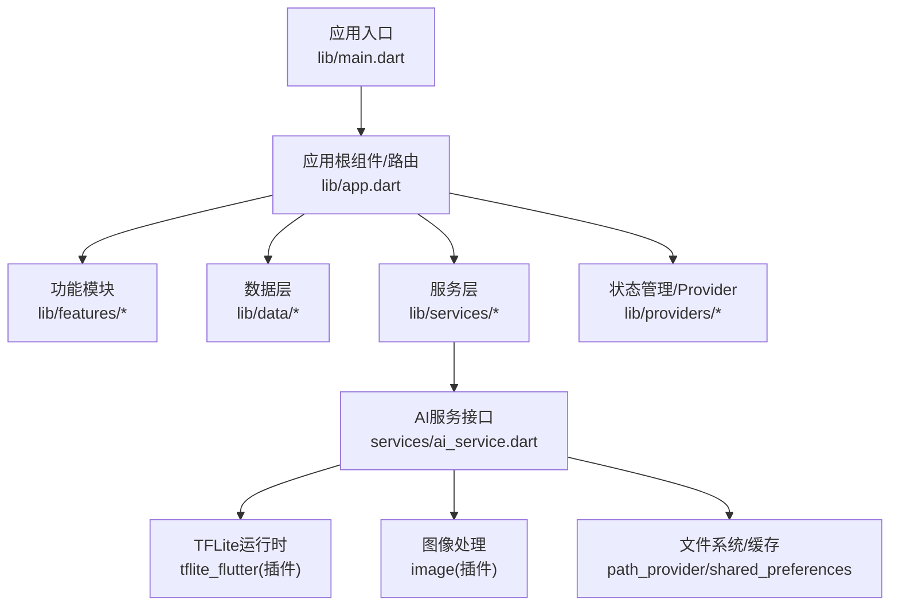
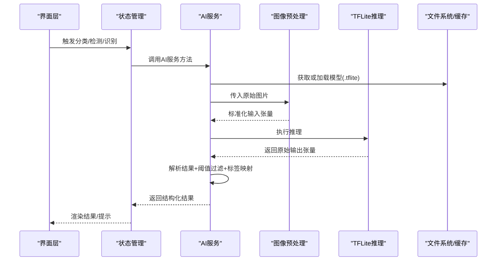
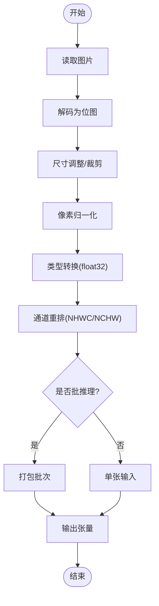
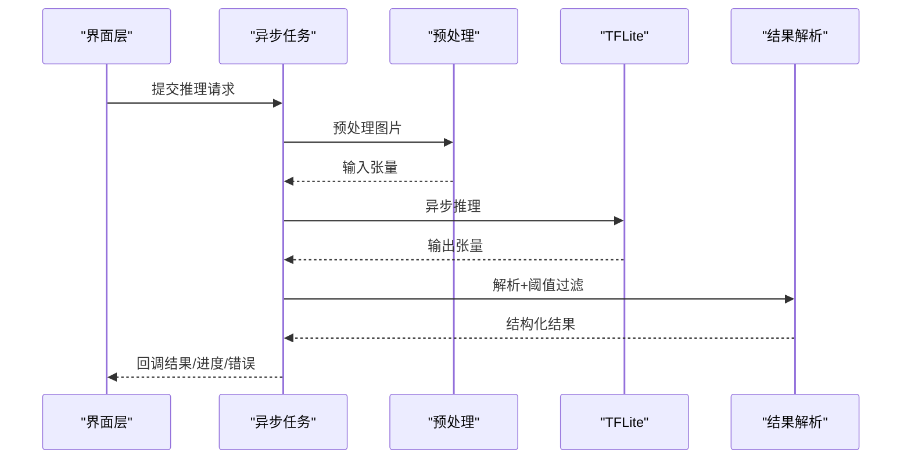
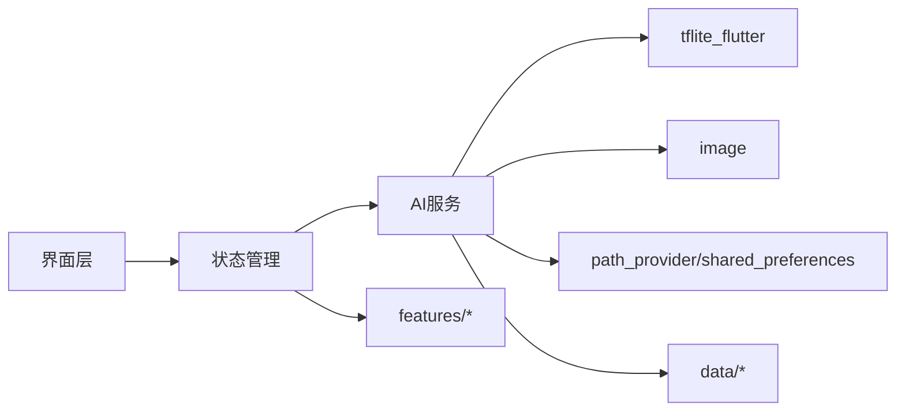

# AI服务集成

<cite>
**本文引用的文件**   
- [README.md](file://README.md)
- [pubspec.yaml](file://pubspec.yaml)
- [lib/main.dart](file://lib/main.dart)
- [lib/app.dart](file://lib/app.dart)
</cite>

## 目录
1. [简介](#简介)
2. [项目结构](#项目结构)
3. [核心组件](#核心组件)
4. [架构总览](#架构总览)
5. [详细组件分析](#详细组件分析)
6. [依赖分析](#依赖分析)
7. [性能考虑](#性能考虑)
8. [故障排查指南](#故障排查指南)
9. [结论](#结论)
10. [附录](#附录)

## 简介
本技术文档面向Flutter照片整理AI应用中的“AI服务集成”模块，聚焦于TensorFlow Lite模型的加载、初始化与推理流程，涵盖模型文件管理、内存优化与性能调优；图像预处理（格式转换、尺寸调整、色彩空间处理）；识别结果解析（分类结果、置信度阈值、标签映射）；异步推理（后台任务、进度反馈、错误处理）；以及模型更新机制、缓存策略与性能监控的最佳实践。同时提供调用AI服务进行照片分类、场景检测与人脸识别的示例路径说明，帮助开发者快速落地并优化AI能力。

## 项目结构
当前仓库为Flutter多平台工程骨架，包含Android、iOS、Web、Windows、macOS、Linux等目标平台的脚手架代码。核心业务逻辑位于lib目录下，其中main.dart与app.dart为应用入口与顶层配置。AI相关能力通常通过插件或本地库集成，例如tflite_flutter、image、path_provider、shared_preferences等。由于当前仓库未包含具体AI实现代码，本节仅对现有结构与职责进行概览，后续章节将给出推荐的分层与模块划分，便于在已有骨架上扩展AI服务。

图表来源
- [lib/main.dart](file://lib/main.dart)
- [lib/app.dart](file://lib/app.dart)

章节来源
- [README.md](file://README.md)
- [pubspec.yaml](file://pubspec.yaml)
- [lib/main.dart](file://lib/main.dart)
- [lib/app.dart](file://lib/app.dart)

## 核心组件
- AI服务接口：统一封装模型加载、推理、资源释放与错误处理，向上暴露清晰API（如classify、detectScene、recognizeFace）。
- 图像预处理：负责读取图片、解码、缩放、归一化、通道重排（如RGB->NHWC）、数据类型转换（如float32），确保输入符合模型期望。
- 模型管理器：负责.tflite模型文件的加载、版本校验、热更新与缓存，支持多模型共存与按需加载。
- 推理引擎：基于tflite_flutter执行推理，支持多线程/线程池、量化模型加速、GPU/NPU后端选择。
- 结果解析器：将原始张量输出转换为结构化结果（类别、置信度、边界框、关键点等），并进行阈值过滤与标签映射。
- 异步任务编排：使用Isolate或Future/PStream管理后台推理，提供进度回调与异常上报。
- 缓存与监控：对中间结果与频繁访问的模型进行缓存，记录耗时、吞吐、内存占用等指标。

章节来源
- [pubspec.yaml](file://pubspec.yaml)

## 架构总览
下图展示AI服务在Flutter应用中的分层与交互关系，强调从UI到模型推理的数据流与控制流。

图表来源
- [lib/app.dart](file://lib/app.dart)
- [pubspec.yaml](file://pubspec.yaml)

## 详细组件分析

### 模型加载与初始化
- 模型文件管理
  - 存储位置：建议置于assets或下载至应用沙盒目录，按版本号命名（如model_v1.tflite）。
  - 加载方式：首次启动预加载常用模型，其余按需懒加载；支持增量更新与回滚。
  - 校验机制：计算SHA256校验和，防止篡改或损坏。
- 内存优化
  - 使用量化模型（INT8/FP16）降低内存与提升速度。
  - 合理设置线程数，避免过度并行导致抖动。
  - 及时释放不再使用的模型实例，避免内存泄漏。
- 性能调优
  - 选择合适后端（CPU/GPU/NPU），根据设备能力动态切换。
  - 批处理与流水线化，减少上下文切换开销。
  - 预热模型，冷启动时执行一次轻量推理。

章节来源
- [pubspec.yaml](file://pubspec.yaml)

### 图像预处理流程
- 输入来源：相册、相机、网络图片。
- 解码与格式：统一解码为位图，必要时转为RGB。
- 尺寸调整：保持比例裁剪或填充，使输入尺寸匹配模型要求（如224x224）。
- 归一化与类型：像素值缩放到[0,1]或[-1,1]，转换为float32。
- 通道顺序：根据模型需求调整为NHWC或NCHW。
- 批量准备：若支持批推理，合并多张图片为批次。

图表来源
- [pubspec.yaml](file://pubspec.yaml)

### 推理执行与异步编排
- 推理执行
  - 使用tflite_flutter执行推理，支持同步/异步调用。
  - 针对大模型启用多线程或Isolate隔离主线程。
- 异步编排
  - 使用Future/PStream管理任务生命周期。
  - 提供进度回调（如预处理完成、推理中、完成）。
  - 错误处理：网络失败、IO异常、模型不兼容、推理超时等。
- 并发控制
  - 限制并发推理数量，避免OOM。
  - 队列化请求，优先处理最近帧。

图表来源
- [pubspec.yaml](file://pubspec.yaml)

### 结果解析与标签映射
- 分类结果
  - 取Top-K类别，结合置信度阈值过滤低置信度项。
  - 标签映射：将索引映射为可读标签（如“风景”、“人像”）。
- 场景检测
  - 输出可能包含多个场景分数，按分数排序并去重。
- 人脸识别
  - 输出人脸框、关键点、特征向量；用于比对与检索。
- 后处理
  - NMS（非极大值抑制）去除重复框。
  - 平滑滤波减少抖动。

章节来源
- [pubspec.yaml](file://pubspec.yaml)

### 调用示例（路径指引）
- 照片分类
  - 入口：调用AI服务的classify方法，传入图片路径或字节数组。
  - 参考路径：services/ai_service.dart中的分类接口定义与调用示例。
- 场景检测
  - 入口：调用detectScene方法，返回场景列表及置信度。
  - 参考路径：services/ai_service.dart中的场景检测接口定义与调用示例。
- 人脸识别
  - 入口：调用recognizeFace方法，返回人脸框、关键点、特征向量。
  - 参考路径：services/ai_service.dart中的人脸识别接口定义与调用示例。

章节来源
- [pubspec.yaml](file://pubspec.yaml)

### 模型更新机制
- 版本管理
  - 服务端下发模型版本与校验信息，客户端对比本地版本。
- 下载与安装
  - 断点续传、完整性校验、原子替换。
- 回滚策略
  - 新版本推理失败自动回滚至上一稳定版本。
- 灰度发布
  - 按用户分组逐步放量，观察指标后全量。

章节来源
- [pubspec.yaml](file://pubspec.yaml)

### 缓存策略
- 模型缓存
  - 常驻内存缓存热点模型，磁盘持久化避免重复加载。
- 结果缓存
  - 相同图片哈希命中缓存，减少重复推理。
- 预处理缓存
  - 对固定尺寸的预处理结果进行短期缓存。

章节来源
- [pubspec.yaml](file://pubspec.yaml)

### 性能监控
- 指标采集
  - 推理耗时、吞吐、内存峰值、CPU/GPU占用。
- 上报与分析
  - 本地聚合后上报至监控平台，支持分维度统计。
- 告警与降级
  - 超阈值告警，自动降级为轻量模型或关闭非必要功能。

章节来源
- [pubspec.yaml](file://pubspec.yaml)

## 依赖分析
- 外部依赖
  - tflite_flutter：TFLite运行时绑定，提供模型加载与推理能力。
  - image：图像解码与处理，支持多种格式与变换。
  - path_provider/shared_preferences：文件与偏好存储，用于模型与缓存管理。
- 内部依赖
  - services/ai_service.dart：对外暴露AI能力。
  - data/*：数据模型与序列化。
  - features/*：业务功能调用AI服务。
  - providers/*：状态管理与事件分发。

图表来源
- [pubspec.yaml](file://pubspec.yaml)

章节来源
- [pubspec.yaml](file://pubspec.yaml)

## 性能考虑
- 模型层面
  - 优先使用量化模型，减小体积与内存占用。
  - 多模型按需加载，避免一次性载入全部模型。
- 预处理层面
  - 复用Image对象，减少分配与GC压力。
  - 批量预处理与推理，提高吞吐。
- 推理层面
  - 合理设置线程数，避免阻塞主线程。
  - 选择合适的后端（CPU/GPU/NPU），根据设备能力动态切换。
- 缓存层面
  - 热点模型与结果缓存，命中优先。
- 监控层面
  - 采集关键指标，定位瓶颈，持续优化。

## 故障排查指南
- 常见问题
  - 模型加载失败：检查路径、权限、文件格式与完整性。
  - 推理崩溃：确认输入尺寸、数据类型、通道顺序是否符合模型要求。
  - 内存溢出：减少并发、释放资源、使用量化模型。
  - 结果不准确：检查预处理参数、阈值设置与标签映射。
- 调试手段
  - 打印预处理后的张量形状与范围。
  - 使用tflite_flutter的调试模式输出中间层信息。
  - 捕获并上报异常堆栈与设备信息。
- 恢复策略
  - 自动重试与降级，回滚模型版本。
  - 清理缓存与临时文件，重启推理进程。

## 结论
通过在Flutter应用中构建清晰的AI服务分层与完善的预处理、推理、结果解析与异步编排机制，可以高效集成TensorFlow Lite模型，实现照片分类、场景检测与人脸识别等功能。配合模型更新、缓存与性能监控，可显著提升用户体验与系统稳定性。建议在现有工程骨架上按本文推荐的模块划分逐步落地，并结合设备特性持续优化。

## 附录
- 最佳实践清单
  - 使用量化模型与合适的后端。
  - 预处理标准化与验证。
  - 异步推理与并发控制。
  - 结果阈值与标签映射。
  - 模型版本管理与回滚。
  - 缓存与监控闭环。
- 参考路径
  - services/ai_service.dart：AI服务接口与调用示例。
  - pubspec.yaml：依赖声明与版本管理。
  - lib/main.dart与lib/app.dart：应用入口与配置。