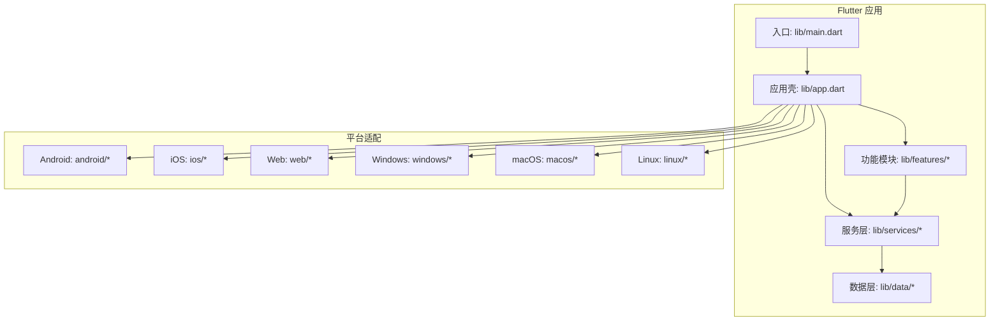
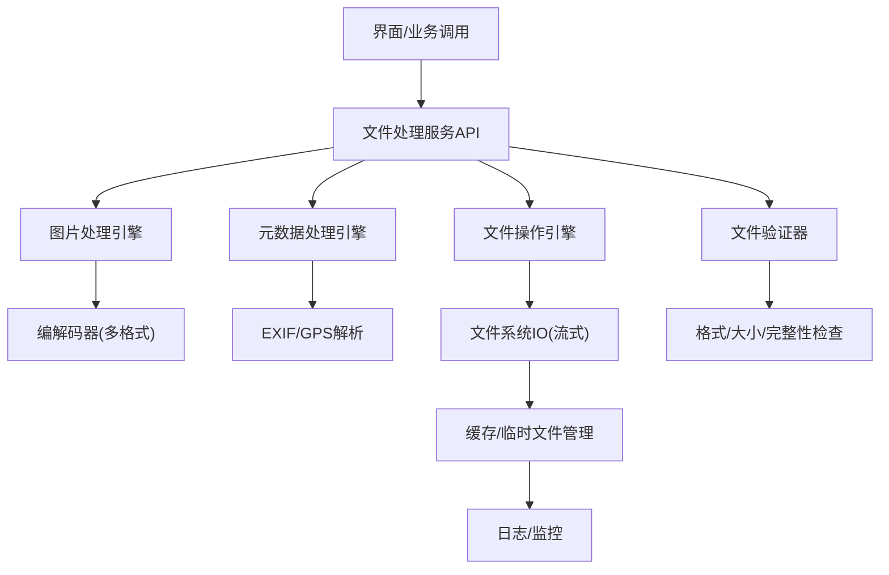
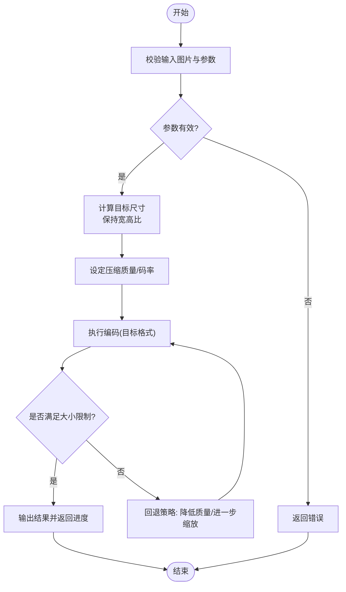
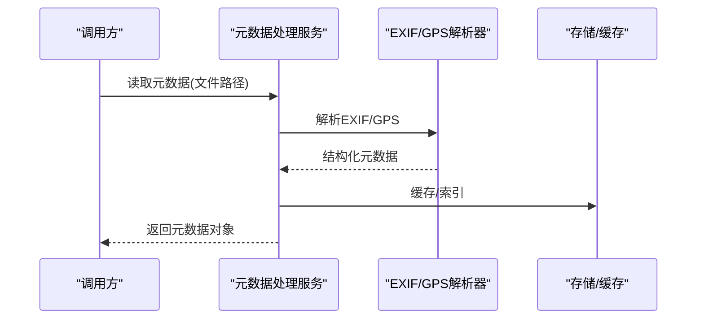
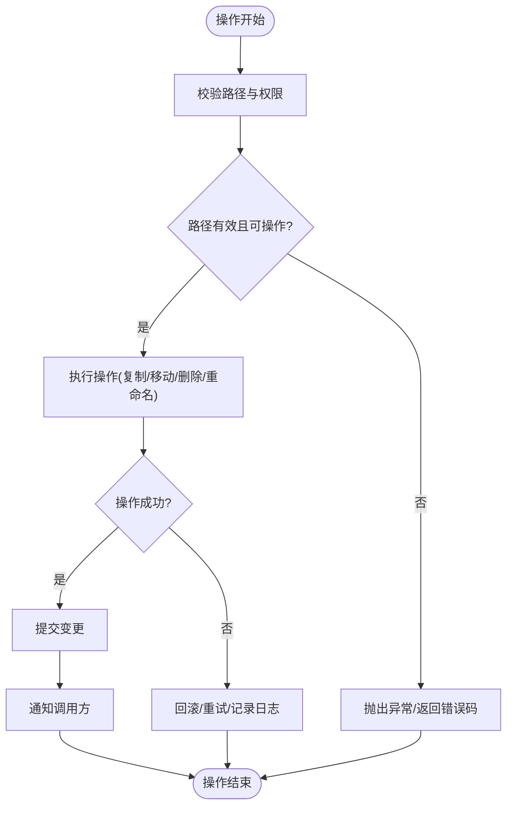
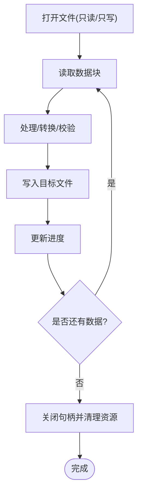
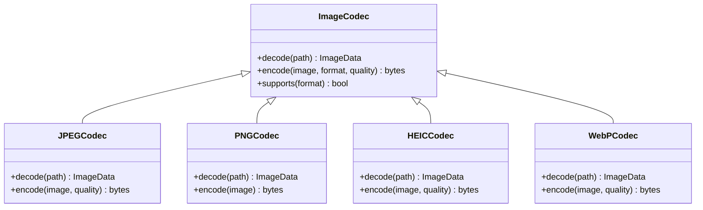
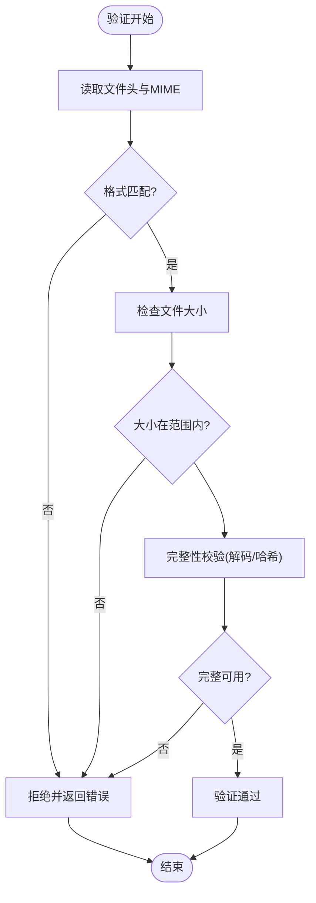
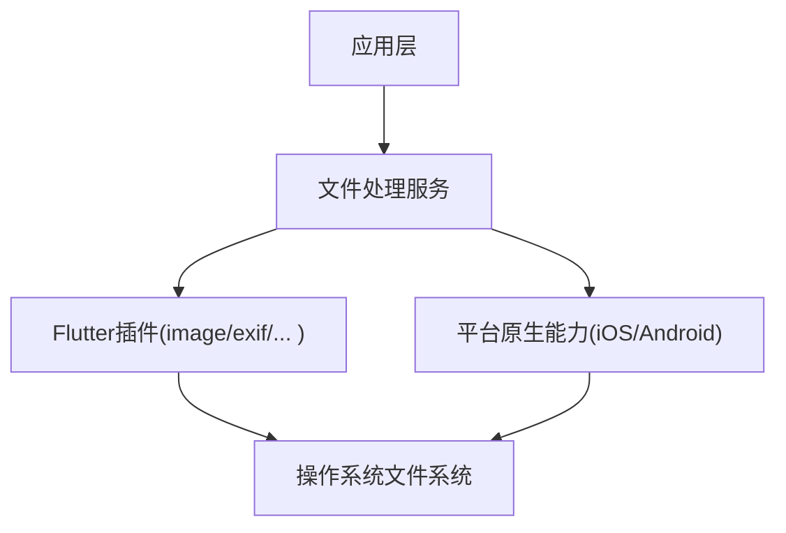

# 文件处理服务

<cite>
**本文档引用的文件**   
- [pubspec.yaml](file://pubspec.yaml)
- [lib/main.dart](file://lib/main.dart)
- [lib/app.dart](file://lib/app.dart)
</cite>

## 目录
1. [简介](#简介)
2. [项目结构](#项目结构)
3. [核心组件](#核心组件)
4. [架构总览](#架构总览)
5. [详细组件分析](#详细组件分析)
6. [依赖分析](#依赖分析)
7. [性能考虑](#性能考虑)
8. [故障排查指南](#故障排查指南)
9. [结论](#结论)
10. [附录](#附录)

## 简介
本技术文档面向Flutter照片整理AI应用中的“文件处理服务”，聚焦于图片压缩、元数据提取与处理、通用文件操作、大文件流式处理策略、多格式编解码支持以及文件验证机制。文档旨在帮助开发者快速理解并扩展该服务，同时提供可操作的流程图与最佳实践建议。

## 项目结构
当前仓库为Flutter工程骨架，包含Android、iOS、Web、Windows、macOS、Linux等多平台配置，核心业务代码位于lib目录下。根据提供的目录信息，尚未发现具体的文件处理实现代码；因此本节仅对整体结构进行说明，并在后续章节给出基于常见Flutter生态的推荐方案与集成点。

**图表来源** 
- [lib/main.dart](file://lib/main.dart)
- [lib/app.dart](file://lib/app.dart)

**章节来源**
- [pubspec.yaml](file://pubspec.yaml)
- [lib/main.dart](file://lib/main.dart)
- [lib/app.dart](file://lib/app.dart)

## 核心组件
围绕“文件处理服务”的核心能力通常包括：
- 图片压缩与尺寸优化：质量调整、目标分辨率控制、宽高比保持、批量处理。
- 格式转换：JPEG、PNG、HEIC、WebP等格式的编解码与互转。
- 元数据处理：EXIF读取（拍摄参数）、GPS位置解析、时间戳与相机信息提取。
- 文件操作：复制、移动、删除、重命名、批量管理。
- 大文件处理：流式读写、分块处理、内存占用控制、进度回调。
- 文件验证：格式校验、大小限制、损坏检测、哈希校验。

由于当前仓库未包含具体实现，上述能力将以推荐的服务接口与流程设计呈现，便于在现有Flutter工程中落地。

**章节来源**
- [pubspec.yaml](file://pubspec.yaml)

## 架构总览
文件处理服务采用分层架构：
- 接入层：UI或业务调用方通过统一API发起请求（如压缩、转换、元数据读取）。
- 服务层：封装图片处理、元数据解析、文件IO、任务调度与进度反馈。
- 平台适配层：利用平台插件或原生能力完成跨平台兼容（如HEIC、系统相册权限）。
- 数据层：缓存、临时文件管理、日志与错误上报。

[此图为概念性架构图，不直接映射到具体源码文件]

## 详细组件分析

### 图片压缩与尺寸优化
- 质量调整：按目标文件大小或质量阈值动态调节压缩参数，避免过度压缩导致画质劣化。
- 尺寸优化：基于原图分辨率与显示需求计算目标尺寸，保持宽高比，必要时进行智能裁剪。
- 批量处理：队列化任务，支持并发控制与失败重试。
- 进度反馈：以分块或百分比形式向UI层推送进度。

**图表来源** 
- [pubspec.yaml](file://pubspec.yaml)

**章节来源**
- [pubspec.yaml](file://pubspec.yaml)

### 元数据提取与处理（EXIF与GPS）
- EXIF读取：获取拍摄设备、镜头、曝光、ISO、快门速度、白平衡等参数。
- GPS解析：从经纬度转换为地理坐标，支持地图标注与分组。
- 时间线组织：基于拍摄时间生成相册视图与排序。
- 隐私保护：可选擦除敏感元数据（如GPS）后再分享。

**图表来源** 
- [pubspec.yaml](file://pubspec.yaml)

**章节来源**
- [pubspec.yaml](file://pubspec.yaml)

### 文件操作核心功能
- 复制：支持跨目录/跨卷复制，断点续传与冲突处理。
- 移动：原子性移动，失败回滚。
- 删除：软删除与硬删除，回收站支持。
- 重命名：名称合法性校验与冲突解决。
- 批量操作：事务化执行，部分失败可补偿。

**图表来源** 
- [pubspec.yaml](file://pubspec.yaml)

**章节来源**
- [pubspec.yaml](file://pubspec.yaml)

### 大文件处理策略（流式处理与内存管理）
- 流式读写：按固定块大小读取/写入，避免一次性加载至内存。
- 内存管理：限制缓冲区大小，及时释放资源，防止OOM。
- 进度反馈：每处理一个块更新进度，支持取消与暂停。
- 容错恢复：中断后从断点继续，校验已处理块的完整性。

**图表来源** 
- [pubspec.yaml](file://pubspec.yaml)

**章节来源**
- [pubspec.yaml](file://pubspec.yaml)

### 图片格式支持与编解码
- 支持格式：JPEG、PNG、HEIC、WebP等。
- 编解码策略：优先使用平台原生能力（如iOS的ImageIO、Android的BitmapFactory），Flutter层做统一封装。
- 兼容性处理：当目标格式不支持时自动降级或提示用户。
- 色彩空间：确保sRGB一致性，避免色偏。

**图表来源** 
- [pubspec.yaml](file://pubspec.yaml)

**章节来源**
- [pubspec.yaml](file://pubspec.yaml)

### 文件验证机制
- 格式检查：通过MIME类型与文件头签名双重校验。
- 大小限制：依据配置拒绝过大或过小文件。
- 损坏检测：校验和（MD5/SHA）或图像解码失败判定。
- 安全扫描：可选病毒/恶意内容检测（平台能力）。

**图表来源** 
- [pubspec.yaml](file://pubspec.yaml)

**章节来源**
- [pubspec.yaml](file://pubspec.yaml)

## 依赖分析
- Flutter生态常用插件：image、exif、path_provider、flutter_image_compress、heic_to_jpeg_converter、webp_dart等。
- 平台能力：iOS的ImageIO/Photos框架、Android的MediaStore/ExifInterface。
- 进程与线程：后台任务隔离，避免阻塞主线程。

**图表来源** 
- [pubspec.yaml](file://pubspec.yaml)

**章节来源**
- [pubspec.yaml](file://pubspec.yaml)

## 性能考虑
- 并发控制：限制并行任务数，避免I/O竞争与CPU过载。
- 缓存策略：对频繁访问的原图与缩略图进行本地缓存，设置过期与LRU淘汰。
- 内存峰值控制：严格限制缓冲区大小，及时释放临时文件。
- I/O优化：顺序读写、减少随机访问，使用异步非阻塞IO。
- 进度与响应：短任务即时反馈，长任务分段汇报，支持取消。

[本节为通用指导，无需特定文件引用]

## 故障排查指南
- 常见问题定位：
  - 编解码失败：检查文件格式与颜色空间，确认插件版本兼容性。
  - 内存溢出：降低并发、减小块大小、启用GC观察。
  - 权限问题：确认相册/文件读写权限已授予。
  - 进度不更新：检查回调链路是否正确绑定。
- 日志与监控：
  - 关键节点打点（开始、处理中、完成、失败）。
  - 错误堆栈与上下文信息（文件路径、参数、平台）。
- 恢复策略：
  - 失败重试（指数退避）。
  - 断点续传（记录偏移量与校验值）。
  - 降级模式（如HEIC转JPEG）。

**章节来源**
- [pubspec.yaml](file://pubspec.yaml)

## 结论
本文件处理服务围绕图片压缩、元数据处理、文件操作、大文件流式处理与格式编解码构建，强调跨平台兼容、性能与稳定性。建议在现有Flutter工程中按分层架构逐步实现，并通过插件与原生能力补齐平台差异。结合完善的验证与错误恢复机制，可提供稳定高效的文件处理能力。

[本节为总结性内容，无需特定文件引用]

## 附录
- 参考插件与库（示例）：
  - image：图像处理与格式转换
  - exif：EXIF元数据读取
  - path_provider：平台路径获取
  - flutter_image_compress：图片压缩
  - heic_to_jpeg_converter：HEIC转JPEG
  - webp_dart：WebP编解码
- 集成步骤（概览）：
  - 在pubspec.yaml中添加依赖
  - 初始化服务单例或依赖注入
  - 在UI层调用统一API
  - 监听进度与错误回调
  - 清理临时文件与缓存

**章节来源**
- [pubspec.yaml](file://pubspec.yaml)