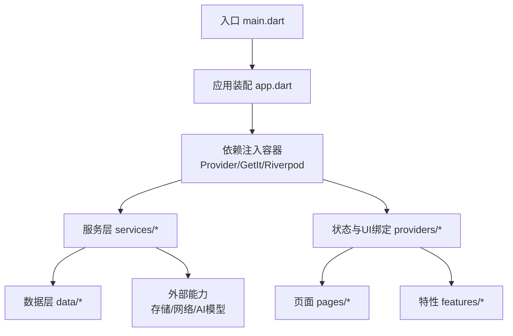
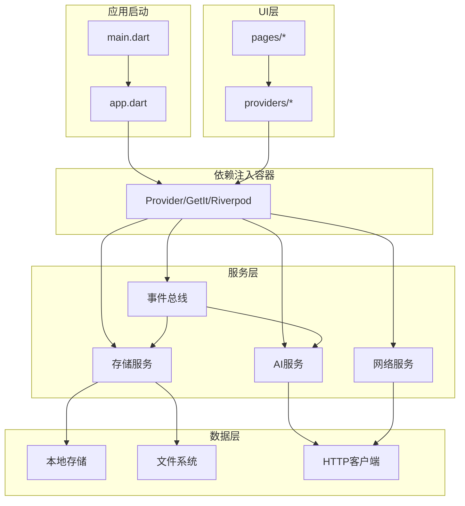
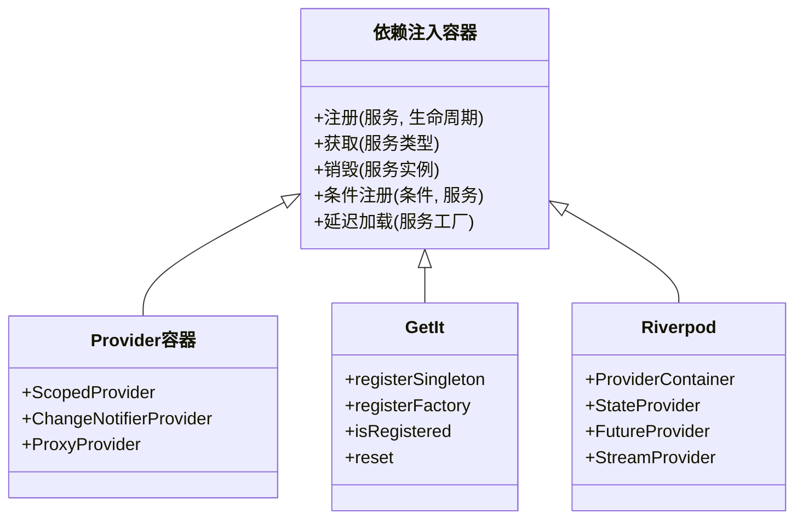
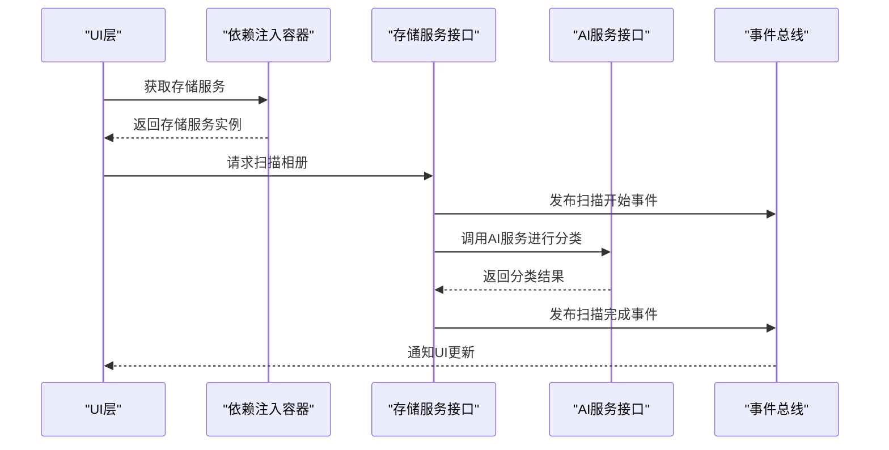
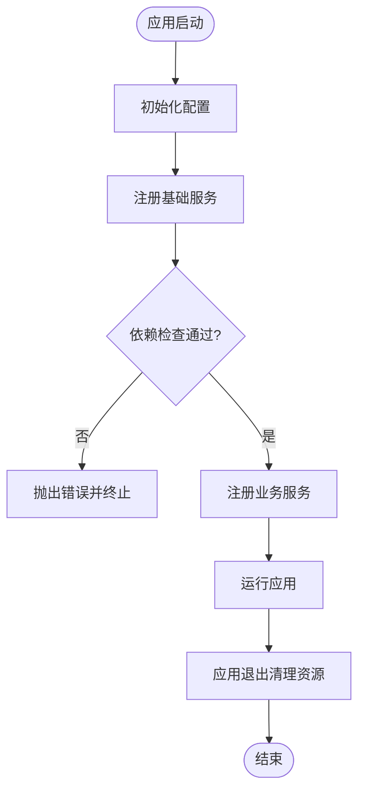
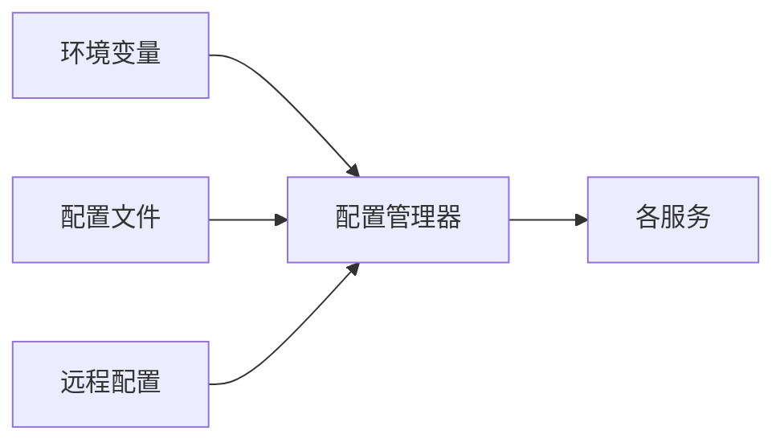
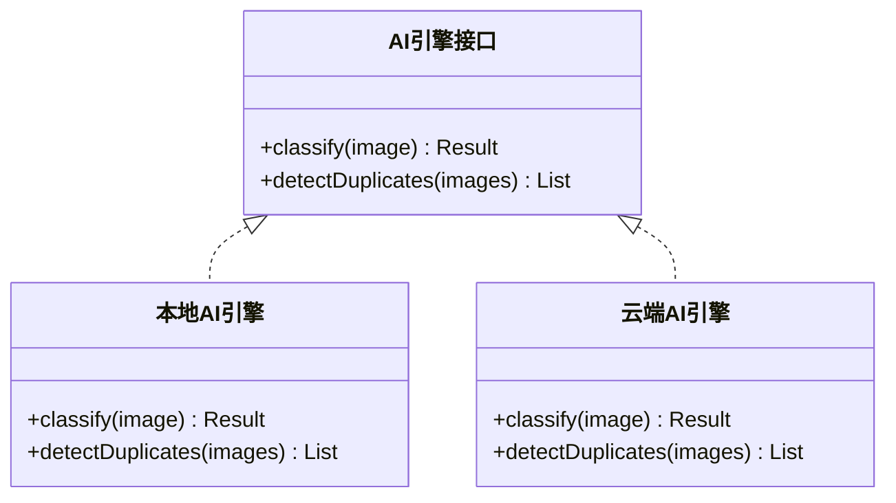
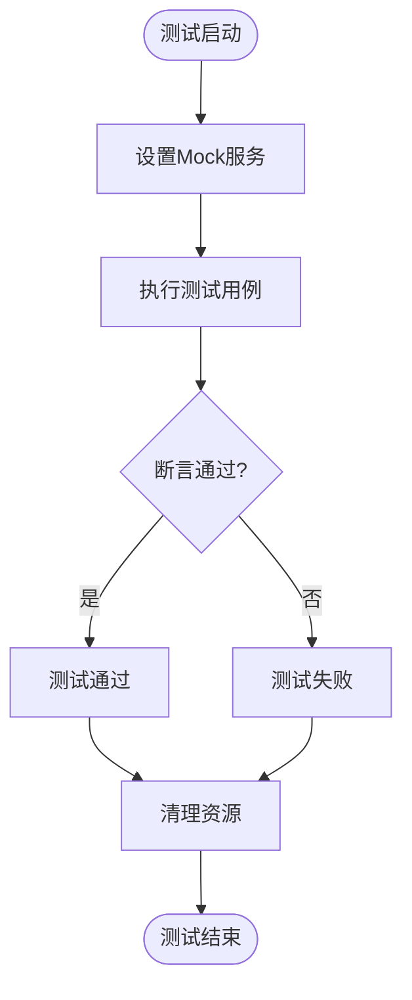
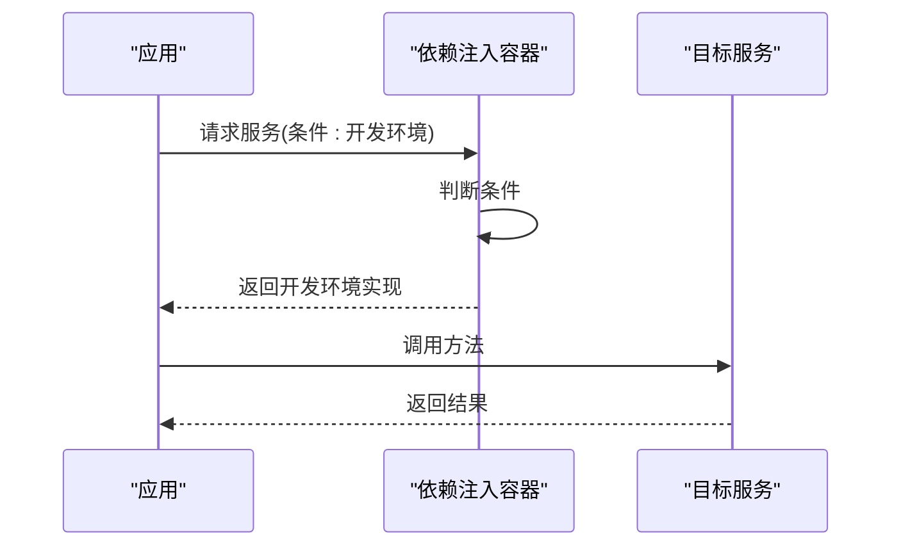
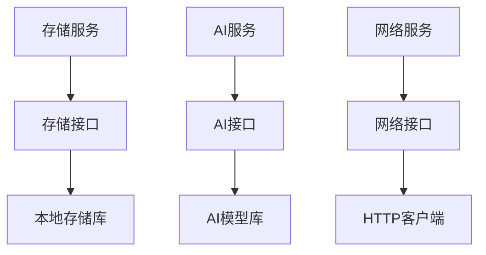

# 服务依赖管理

<cite>
**本文档引用的文件**   
- [main.dart](file://lib/main.dart)
- [app.dart](file://lib/app.dart)
- [pubspec.yaml](file://pubspec.yaml)
- [README.md](file://README.md)
</cite>

## 目录
1. [简介](#简介)
2. [项目结构](#项目结构)
3. [核心组件](#核心组件)
4. [架构总览](#架构总览)
5. [详细组件分析](#详细组件分析)
6. [依赖分析](#依赖分析)
7. [性能考虑](#性能考虑)
8. [故障排查指南](#故障排查指南)
9. [结论](#结论)
10. [附录](#附录)

## 简介
本技术文档面向Flutter照片整理AI应用的服务依赖管理，聚焦于：
- 依赖注入模式（Provider、GetIt、Riverpod）在工程中的落地与选型建议
- 服务间解耦设计（接口抽象、事件总线、消息传递）
- 服务生命周期管理（初始化顺序、依赖检查、资源清理）
- 配置管理策略（环境变量、配置文件、动态配置）
- 服务替换与扩展机制（插件化、模块化、热重载支持）
- 测试策略（Mock服务、单元测试、集成测试）
- 依赖注入的配置与使用示例（条件依赖、延迟加载、服务发现）
- 服务监控与调试最佳实践

说明：当前仓库为初始脚手架，尚未包含具体业务实现。本文基于Flutter生态的最佳实践给出可落地的方案与图示，便于后续快速接入。

## 项目结构
- lib 为主代码目录，包含入口 main.dart、应用装配 app.dart、功能模块 services、providers、features、pages、data 等
- pubspec.yaml 声明依赖与构建配置
- README.md 提供项目背景与使用说明

图表来源
- [main.dart:1-200](file://lib/main.dart#L1-L200)
- [app.dart:1-200](file://lib/app.dart#L1-L200)

章节来源
- [main.dart:1-200](file://lib/main.dart#L1-L200)
- [app.dart:1-200](file://lib/app.dart#L1-L200)
- [pubspec.yaml:1-200](file://pubspec.yaml#L1-L200)
- [README.md:1-200](file://README.md#L1-L200)

## 核心组件
- 依赖注入容器
  - Provider：适合UI状态与服务解耦，轻量易用
  - GetIt：全局服务定位器，适合跨层级服务访问与单例管理
  - Riverpod：强类型、可组合的状态管理与依赖注入，推荐用于复杂应用
- 服务层
  - 存储服务：相册扫描、图片元数据读取、本地缓存
  - AI服务：图像分类、去重、标签生成
  - 网络服务：云端同步、API调用
  - 事件总线：跨模块通信（如扫描完成、任务进度）
- 配置管理
  - 环境变量：不同环境切换（开发/测试/生产）
  - 配置文件：JSON/YAML 静态配置
  - 动态配置：远程配置中心或运行时开关

章节来源
- [pubspec.yaml:1-200](file://pubspec.yaml#L1-L200)

## 架构总览
下图展示依赖注入与服务交互的总体架构，强调“接口抽象 + 容器注册 + 按需获取”的解耦方式。

图表来源
- [main.dart:1-200](file://lib/main.dart#L1-L200)
- [app.dart:1-200](file://lib/app.dart#L1-L200)

## 详细组件分析

### 依赖注入容器设计与选择
- 选择建议
  - 小型/中等规模：Provider + GetIt 组合，UI状态用Provider，跨层服务用GetIt
  - 大型/复杂状态：Riverpod 统一状态与依赖注入，减少样板代码
- 容器职责
  - 服务注册与生命周期控制（单例、工厂、作用域）
  - 条件依赖与环境切换（开发/测试/生产）
  - 延迟加载与懒初始化
  - 服务发现与插件式扩展

图表来源
- [pubspec.yaml:1-200](file://pubspec.yaml#L1-L200)

章节来源
- [pubspec.yaml:1-200](file://pubspec.yaml#L1-L200)

### 服务层接口抽象与解耦
- 接口抽象原则
  - 以接口定义服务契约，避免直接依赖实现
  - 通过容器注入接口，运行时绑定具体实现
- 事件总线与消息传递
  - 使用事件总线进行跨服务通信（如扫描完成、任务失败）
  - 消息采用不可变对象，保证线程安全与可追溯性

图表来源
- [app.dart:1-200](file://lib/app.dart#L1-L200)

章节来源
- [app.dart:1-200](file://lib/app.dart#L1-L200)

### 服务生命周期管理
- 初始化顺序
  - 先注册基础服务（日志、配置、存储），再注册业务服务（AI、网络）
  - 使用依赖检查确保前置服务可用
- 资源清理
  - 明确服务的创建与销毁时机
  - 在应用退出时释放文件句柄、网络连接、模型内存

图表来源
- [main.dart:1-200](file://lib/main.dart#L1-L200)
- [app.dart:1-200](file://lib/app.dart#L1-L200)

章节来源
- [main.dart:1-200](file://lib/main.dart#L1-L200)
- [app.dart:1-200](file://lib/app.dart#L1-L200)

### 配置管理策略
- 环境变量
  - 使用 .env 或平台特定配置区分环境
- 配置文件
  - JSON/YAML 存放静态配置（如AI模型路径、API端点）
- 动态配置
  - 远程配置中心或运行时开关（Feature Flags）

图表来源
- [pubspec.yaml:1-200](file://pubspec.yaml#L1-L200)

章节来源
- [pubspec.yaml:1-200](file://pubspec.yaml#L1-L200)

### 服务替换与扩展机制
- 插件架构
  - 通过接口抽象实现插件式AI引擎（如本地模型 vs 云端API）
- 模块化设计
  - 按功能划分模块，模块内聚、模块间通过接口通信
- 热重载支持
  - 保持服务状态稳定，避免热重载导致状态丢失

图表来源
- [app.dart:1-200](file://lib/app.dart#L1-L200)

章节来源
- [app.dart:1-200](file://lib/app.dart#L1-L200)

### 测试策略
- Mock服务
  - 使用Mockito或Riverpod的mock provider替换真实服务
- 单元测试
  - 针对服务逻辑编写用例，验证输入输出与边界条件
- 集成测试
  - 模拟完整流程（扫描->分类->去重），验证端到端行为

图表来源
- [pubspec.yaml:1-200](file://pubspec.yaml#L1-L200)

章节来源
- [pubspec.yaml:1-200](file://pubspec.yaml#L1-L200)

### 依赖注入的高级特性
- 条件依赖
  - 根据环境或用户偏好注册不同实现
- 延迟加载
  - 按需初始化重型服务（如AI模型）
- 服务发现
  - 自动扫描并注册插件服务

图表来源
- [app.dart:1-200](file://lib/app.dart#L1-L200)

章节来源
- [app.dart:1-200](file://lib/app.dart#L1-L200)

## 依赖分析
- 组件耦合度
  - 服务层通过接口抽象降低耦合，容器负责绑定实现
- 循环依赖
  - 避免服务间直接循环引用，使用事件总线或回调解耦
- 外部依赖
  - 存储、网络、AI模型等第三方库通过适配器封装

图表来源
- [pubspec.yaml:1-200](file://pubspec.yaml#L1-L200)

章节来源
- [pubspec.yaml:1-200](file://pubspec.yaml#L1-L200)

## 性能考虑
- 懒加载重型服务（AI模型）以减少冷启动时间
- 使用单例模式共享昂贵资源（数据库连接、网络池）
- 避免在UI线程执行耗时操作，使用异步与后台任务
- 合理缓存中间结果，减少重复计算

## 故障排查指南
- 常见问题
  - 服务未注册：检查容器初始化顺序与注册逻辑
  - 循环依赖：重构服务关系，引入事件总线
  - 内存泄漏：确保服务正确释放资源
- 调试技巧
  - 启用详细日志，记录服务调用链
  - 使用性能分析工具定位瓶颈

章节来源
- [README.md:1-200](file://README.md#L1-L200)

## 结论
通过统一的依赖注入容器与接口抽象，可实现高内聚、低耦合的服务架构。结合生命周期管理、配置策略与测试框架，能够构建可维护、可扩展的照片整理AI应用。建议在大型项目中优先采用Riverpod统一管理状态与依赖，中小项目可使用Provider+GetIt组合。

## 附录
- 参考链接
  - Flutter官方文档：https://flutter.dev/docs
  - Provider包：https://pub.dev/packages/provider
  - GetIt包：https://pub.dev/packages/get_it
  - Riverpod包：https://pub.dev/packages/flutter_riverpod