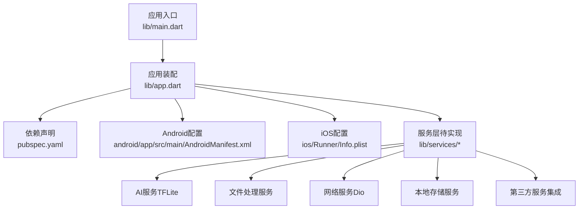
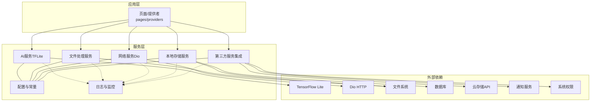
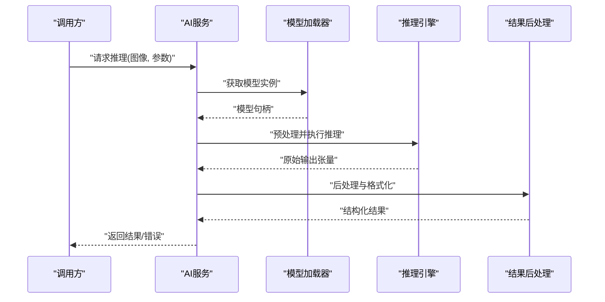
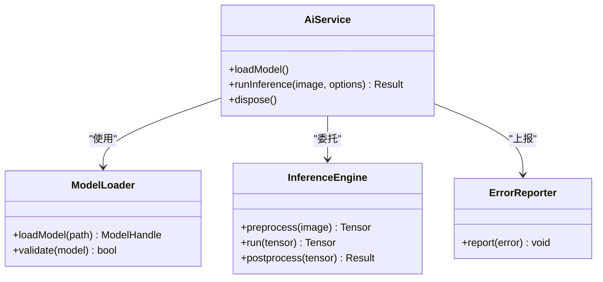
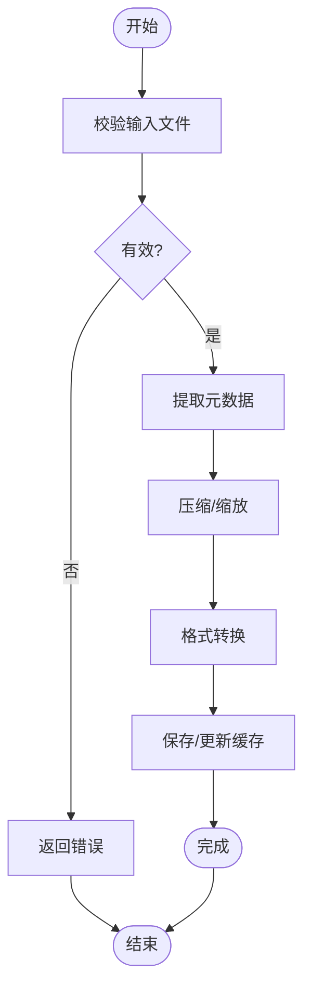
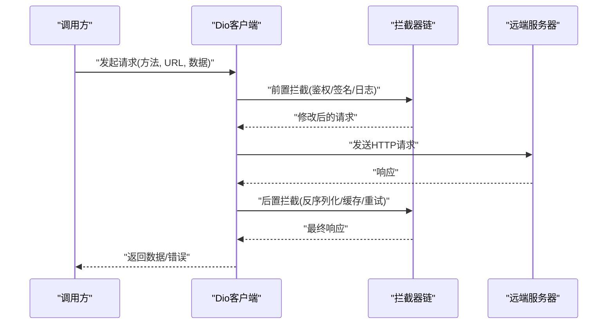
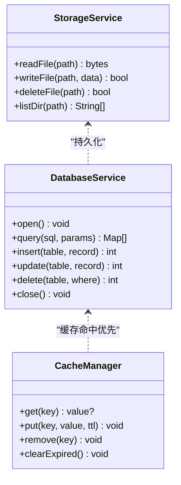
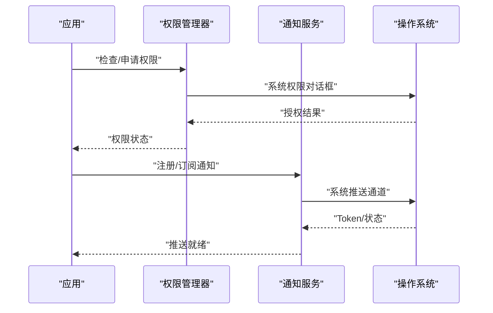
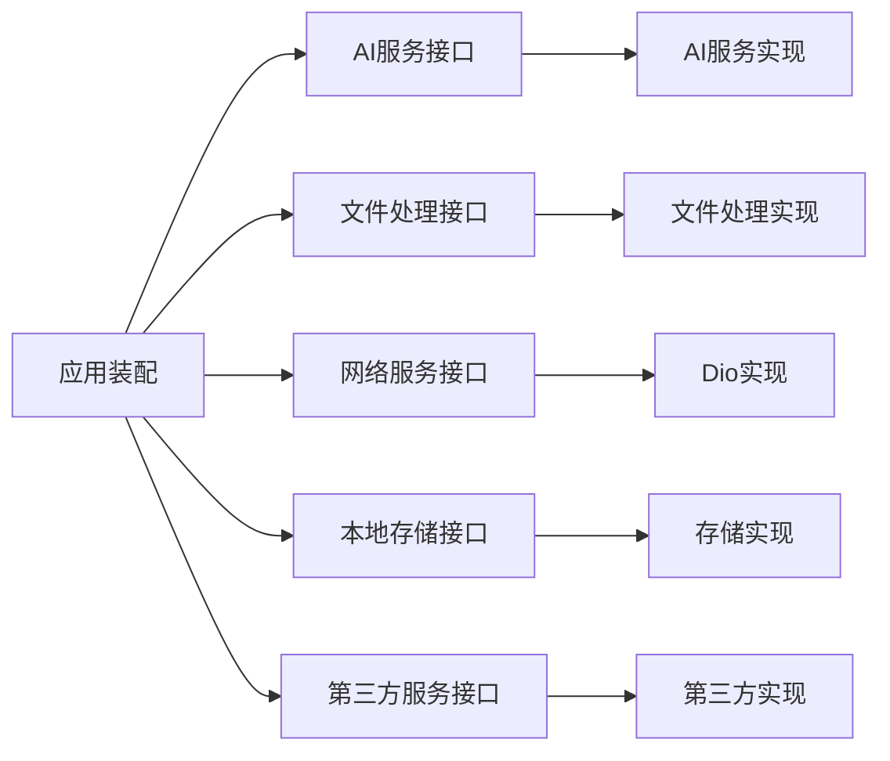

# 服务层架构

<cite>
**本文引用的文件**   
- [lib/main.dart](file://lib/main.dart)
- [lib/app.dart](file://lib/app.dart)
- [pubspec.yaml](file://pubspec.yaml)
- [android/app/src/main/AndroidManifest.xml](file://android/app/src/main/AndroidManifest.xml)
- [ios/Runner/Info.plist](file://ios/Runner/Info.plist)
</cite>

## 目录
1. [简介](#简介)
2. [项目结构](#项目结构)
3. [核心组件](#核心组件)
4. [架构总览](#架构总览)
5. [详细组件分析](#详细组件分析)
6. [依赖关系分析](#依赖关系分析)
7. [性能考量](#性能考量)
8. [故障排除指南](#故障排除指南)
9. [结论](#结论)
10. [附录](#附录)

## 简介
本技术文档聚焦于Flutter照片整理AI应用的服务层，围绕以下目标展开：
- AI服务集成：TensorFlow Lite模型的加载、推理与结果处理流程。
- 文件处理服务：图片压缩、格式转换、元数据提取等能力。
- 网络请求封装：Dio客户端配置、拦截器、错误处理与重试机制。
- 本地存储服务：文件系统操作、数据库访问与缓存管理。
- 第三方服务集成：云存储API、通知服务、权限管理等。
- 服务间依赖与通信机制：接口抽象与依赖注入实践。
- 扩展与替换最佳实践：面向接口的编程、可插拔实现与测试策略。
- 代码示例路径与排障指南：便于快速定位与解决问题。

说明：当前仓库中services目录为空，尚未包含具体服务实现。本文基于Flutter工程结构与常见实践给出完整的服务层设计蓝图与落地建议，并在“详细组件分析”章节提供可直接映射到未来实现的类图、时序图与流程图模板，便于后续填充真实代码。

## 项目结构
从仓库结构看，Flutter应用入口位于lib/main.dart，应用初始化在lib/app.dart中进行；平台相关配置分别位于android与ios目录；依赖声明在pubspec.yaml中。服务层通常位于lib/services或按功能模块拆分至features/*/services下。当前services目录为空，意味着服务层尚未实现，但整体架构已具备扩展空间。

图表来源
- [lib/main.dart:1-200](file://lib/main.dart#L1-L200)
- [lib/app.dart:1-200](file://lib/app.dart#L1-L200)
- [pubspec.yaml:1-200](file://pubspec.yaml#L1-L200)
- [android/app/src/main/AndroidManifest.xml:1-200](file://android/app/src/main/AndroidManifest.xml#L1-L200)
- [ios/Runner/Info.plist:1-200](file://ios/Runner/Info.plist#L1-L200)

章节来源
- [lib/main.dart:1-200](file://lib/main.dart#L1-L200)
- [lib/app.dart:1-200](file://lib/app.dart#L1-L200)
- [pubspec.yaml:1-200](file://pubspec.yaml#L1-L200)
- [android/app/src/main/AndroidManifest.xml:1-200](file://android/app/src/main/AndroidManifest.xml#L1-L200)
- [ios/Runner/Info.plist:1-200](file://ios/Runner/Info.plist#L1-L200)

## 核心组件
服务层由以下核心组件构成，彼此通过清晰的接口解耦，支持依赖注入与替换：
- AI服务（TFLite）：负责模型加载、推理执行与结果解析。
- 文件处理服务：负责图片压缩、格式转换、EXIF/元数据提取。
- 网络服务（Dio）：封装HTTP请求、拦截器、重试、超时与错误处理。
- 本地存储服务：文件IO、SQLite/Hive/Isar等数据库、缓存策略。
- 第三方服务集成：云存储（如对象存储）、推送通知、系统权限。
- 配置与常量：环境配置、密钥管理、功能开关。
- 日志与监控：统一日志、错误上报、性能埋点。

章节来源
- [pubspec.yaml:1-200](file://pubspec.yaml#L1-L200)

## 架构总览
下图展示服务层总体架构与各组件交互关系。上层业务通过接口调用服务，服务之间通过依赖注入协作，外部依赖（TFLite、Dio、文件系统、系统权限）被隔离在服务内部。

图表来源
- [lib/app.dart:1-200](file://lib/app.dart#L1-L200)
- [pubspec.yaml:1-200](file://pubspec.yaml#L1-L200)

## 详细组件分析

### AI服务（TensorFlow Lite）
职责
- 模型加载与生命周期管理（内存占用、预热）。
- 输入预处理（缩放、归一化、通道重排）。
- 推理执行（线程池/后台任务）。
- 输出后处理（类别映射、置信度阈值、NMS等）。
- 错误处理（模型损坏、版本不匹配、设备不支持）。

关键流程（时序图）

图表来源
- [lib/app.dart:1-200](file://lib/app.dart#L1-L200)

类关系（类图）

图表来源
- [lib/app.dart:1-200](file://lib/app.dart#L1-L200)

章节来源
- [lib/app.dart:1-200](file://lib/app.dart#L1-L200)

### 文件处理服务
职责
- 图片压缩（质量、尺寸、分辨率控制）。
- 格式转换（JPEG/PNG/WebP互转）。
- 元数据提取（EXIF、GPS、拍摄时间、相机信息）。
- 批量处理与进度回调。
- 错误处理（无效文件、权限不足、磁盘空间不足）。

处理流程（流程图）

图表来源
- [lib/app.dart:1-200](file://lib/app.dart#L1-L200)

章节来源
- [lib/app.dart:1-200](file://lib/app.dart#L1-L200)

### 网络服务（Dio）
职责
- Dio客户端配置（基础URL、超时、证书校验、代理）。
- 拦截器（请求签名、鉴权、日志、重试、幂等）。
- 错误分类与重试策略（网络异常、服务端错误、超时）。
- 取消与并发控制。
- 响应缓存与离线策略。

请求序列（时序图）

图表来源
- [lib/app.dart:1-200](file://lib/app.dart#L1-L200)

章节来源
- [lib/app.dart:1-200](file://lib/app.dart#L1-L200)

### 本地存储服务
职责
- 文件系统操作（读写、移动、删除、目录管理）。
- 数据库访问（增删改查、事务、索引优化）。
- 缓存管理（LRU、过期策略、冷热分层）。
- 数据迁移与版本控制。
- 错误处理（权限、磁盘满、锁冲突）。

数据流（类图）

图表来源
- [lib/app.dart:1-200](file://lib/app.dart#L1-L200)

章节来源
- [lib/app.dart:1-200](file://lib/app.dart#L1-L200)

### 第三方服务集成
职责
- 云存储API（上传、下载、分片、断点续传、签名URL）。
- 通知服务（推送注册、消息订阅、点击事件）。
- 权限管理（相册、存储、网络、位置等动态申请）。
- 错误处理与降级（不可用时的本地回退）。

权限与通知流程（时序图）

图表来源
- [lib/app.dart:1-200](file://lib/app.dart#L1-L200)

章节来源
- [lib/app.dart:1-200](file://lib/app.dart#L1-L200)

### 配置与常量
职责
- 环境区分（开发/测试/生产）。
- 密钥与敏感信息保护。
- 功能开关与A/B实验。
- 默认值与边界参数。

章节来源
- [pubspec.yaml:1-200](file://pubspec.yaml#L1-L200)

### 日志与监控
职责
- 统一日志输出（级别、标签、上下文）。
- 错误上报（崩溃、异常、慢请求）。
- 性能埋点（耗时、内存、CPU）。
- 隐私合规（脱敏、采样率）。

章节来源
- [lib/app.dart:1-200](file://lib/app.dart#L1-L200)

## 依赖关系分析
服务层采用“面向接口+依赖注入”的架构，降低耦合度，提升可测试性与可替换性。典型依赖关系如下：
- 应用装配层负责创建服务实例并注入到调用方。
- 各服务仅依赖其接口，避免直接依赖具体实现。
- 外部库（TFLite、Dio、文件系统、系统API）被封装在服务内部。

图表来源
- [lib/app.dart:1-200](file://lib/app.dart#L1-L200)

章节来源
- [lib/app.dart:1-200](file://lib/app.dart#L1-L200)

## 性能考量
- AI推理：
  - 模型预热与复用，避免重复加载。
  - 输入预处理异步化，减少主线程阻塞。
  - 合理设置批大小与线程数，平衡吞吐与延迟。
- 文件处理：
  - 按需压缩与懒加载缩略图。
  - 批量处理时限制并发，避免OOM。
  - 元数据提取缓存，减少重复IO。
- 网络请求：
  - 连接池与Keep-Alive。
  - 合理的超时与重试策略（指数退避）。
  - 响应体压缩与分页加载。
- 本地存储：
  - 数据库索引优化与查询计划审查。
  - 缓存命中率监控与淘汰策略调优。
  - 大文件分块读写与临时文件清理。

[本节为通用指导，无需特定文件引用]

## 故障排除指南
常见问题与排查步骤：
- TFLite模型加载失败：
  - 检查模型路径与完整性。
  - 确认设备架构与模型兼容。
  - 查看内存占用与版本匹配。
- 图片处理异常：
  - 验证输入文件格式与编码。
  - 检查存储空间与权限。
  - 逐步禁用压缩/转换定位问题。
- 网络请求错误：
  - 检查拦截器链顺序与签名。
  - 查看重试次数与退避策略。
  - 捕获并记录请求/响应摘要。
- 本地存储问题：
  - 确认数据库版本迁移脚本。
  - 检查事务回滚与锁竞争。
  - 监控磁盘空间与文件句柄泄漏。
- 第三方服务不可用：
  - 降级到本地模式或队列重试。
  - 记录错误码与用户提示。
  - 监控可用性指标与告警。

章节来源
- [lib/app.dart:1-200](file://lib/app.dart#L1-L200)

## 结论
本服务层设计以接口抽象与依赖注入为核心，将AI推理、文件处理、网络请求、本地存储与第三方服务解耦，形成高内聚、低耦合的可扩展架构。通过统一的错误处理、日志监控与性能优化策略，确保系统在复杂场景下的稳定性与可维护性。后续可在lib/services目录下逐步实现各服务的具体逻辑，并配合单元测试与集成测试保障质量。

[本节为总结性内容，无需特定文件引用]

## 附录
- 依赖清单与版本管理：参考pubspec.yaml中的包声明与约束。
- 平台权限配置：Android在AndroidManifest.xml中声明，iOS在Info.plist中配置。
- 环境变量与密钥：建议使用flutter_dotenv或平台Keychain/Keystore进行安全存储。
- 测试策略：对服务接口编写Mock实现，覆盖正常路径与异常分支。

章节来源
- [pubspec.yaml:1-200](file://pubspec.yaml#L1-L200)
- [android/app/src/main/AndroidManifest.xml:1-200](file://android/app/src/main/AndroidManifest.xml#L1-L200)
- [ios/Runner/Info.plist:1-200](file://ios/Runner/Info.plist#L1-L200)