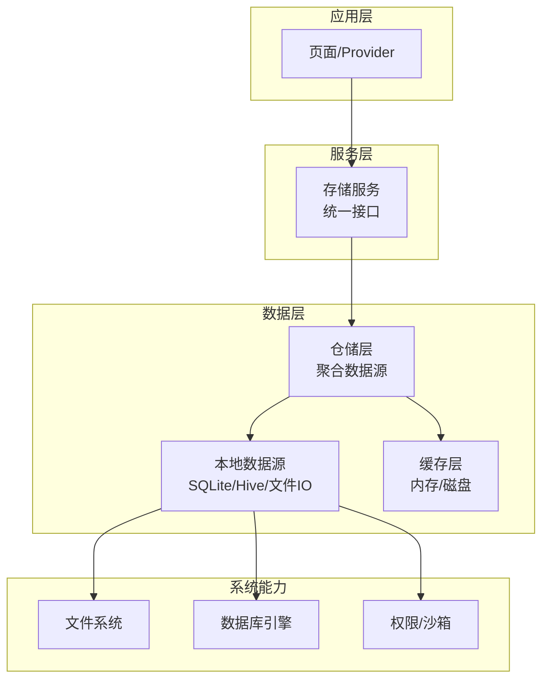
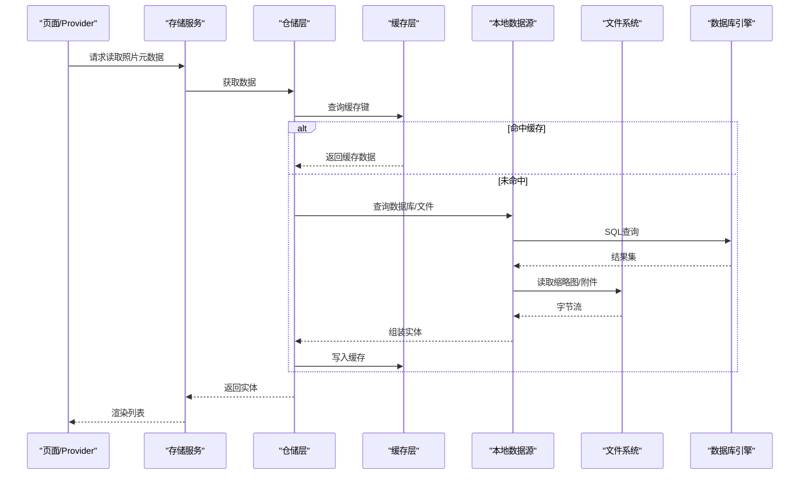
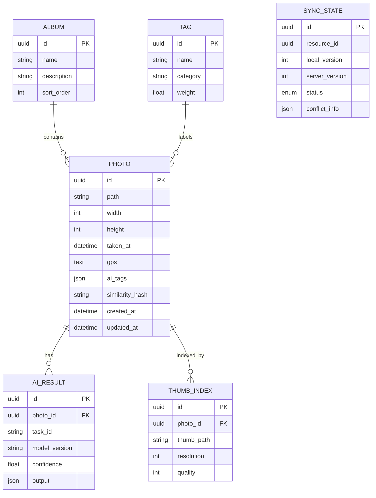
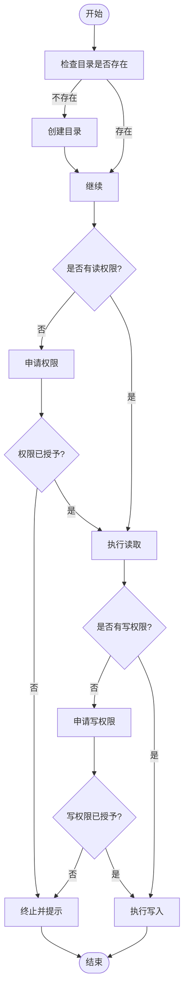
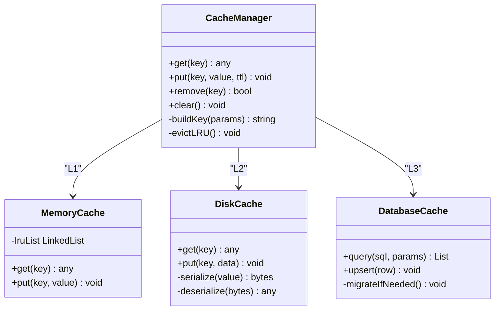
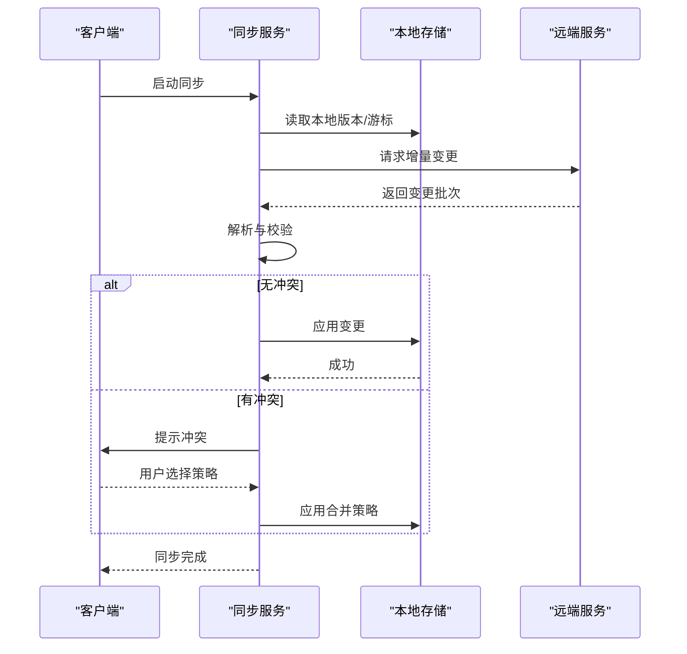
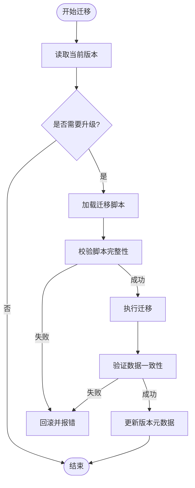
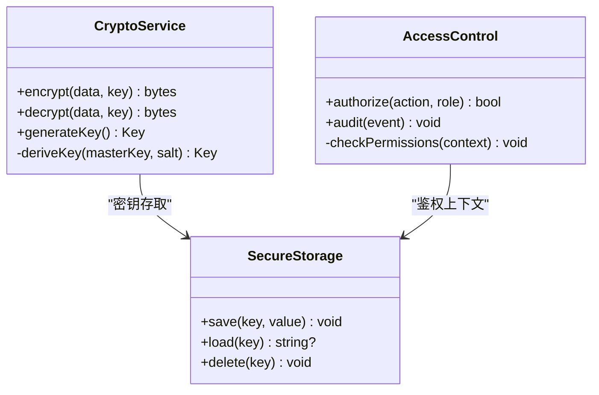
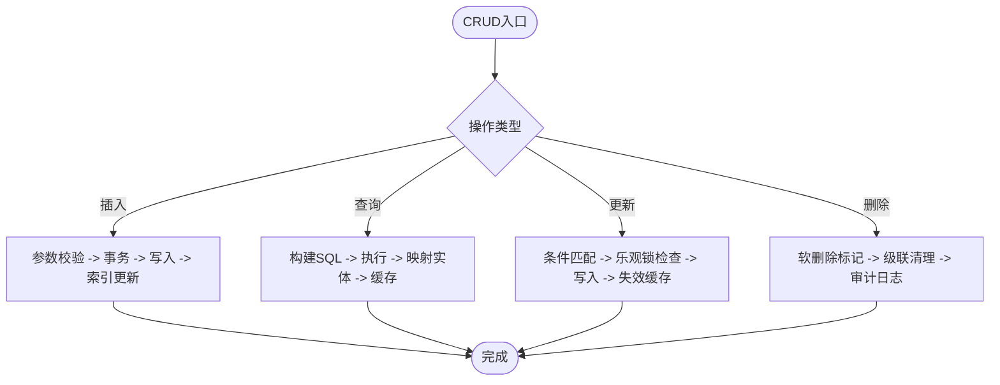
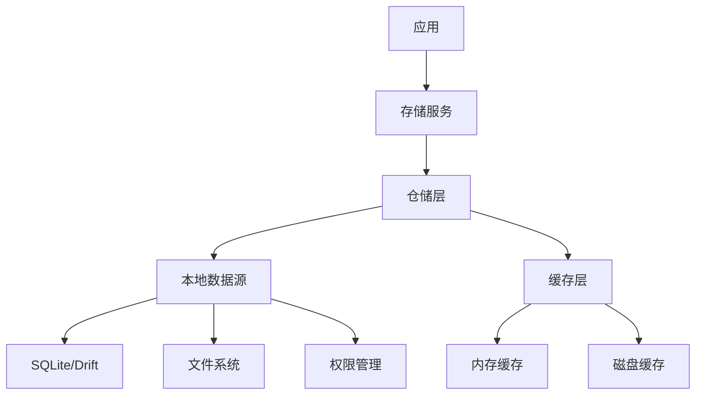

# 本地存储服务

<cite>
**本文引用的文件**   
- [pubspec.yaml](file://pubspec.yaml)
- [lib/main.dart](file://lib/main.dart)
- [lib/app.dart](file://lib/app.dart)
</cite>

## 目录
1. [简介](#简介)
2. [项目结构](#项目结构)
3. [核心组件](#核心组件)
4. [架构总览](#架构总览)
5. [详细组件分析](#详细组件分析)
6. [依赖分析](#依赖分析)
7. [性能考虑](#性能考虑)
8. [故障排除指南](#故障排除指南)
9. [结论](#结论)
10. [附录](#附录) 

## 简介
本技术文档面向Flutter照片整理AI应用的“本地存储服务”模块，目标是为开发者与产品相关方提供从数据库访问层、文件系统封装、缓存机制、数据同步、数据迁移到数据安全的全栈式说明。由于当前仓库尚未包含具体实现代码，本文以“设计蓝图+最佳实践”的方式给出可落地的方案，并在后续接入实现后，通过“章节来源”和“图示来源”进行精确溯源。

## 项目结构
当前仓库为Flutter多平台工程骨架，核心业务代码位于 lib 目录。存储相关能力通常分布在 services、data、features 等子目录中。在现有结构中，尚未发现具体的存储实现文件，因此本节聚焦于推荐的目录划分与职责边界，便于后续落地。

- 推荐目录组织（概念性）
  - lib/services/storage/：存储服务入口（统一对外API）
  - lib/data/repositories/：仓储层（聚合多个数据源）
  - lib/data/datasources/local/：本地数据源（SQLite/Hive/文件IO）
  - lib/data/models/：领域模型与持久化映射
  - lib/utils/path_provider/：路径工具与权限封装
  - lib/utils/cache/：缓存策略与键生成器
  - lib/migrations/：数据库迁移脚本与版本管理

[本图为概念性结构图，不直接映射具体源码文件]

## 核心组件
- 数据库访问层
  - 选型建议：优先使用 SQLite（sqflite 或 drift/ Moor），适合结构化元数据与关系查询；对轻量KV场景可使用 Hive 作为辅助缓存或配置存储。
  - 表结构设计：照片元数据、相册/分类、标签、AI识别结果、缩略图索引、同步状态等。
  - 索引优化：按时间、地点、标签、相似度哈希等高频查询字段建立索引；复合索引覆盖常见筛选条件。
- 文件系统操作封装
  - 目录管理：媒体库根目录、缩略图目录、临时目录、备份目录的创建与清理策略。
  - 读写权限：Android/iOS 沙箱与媒体库访问权限申请流程封装。
  - 路径处理：跨平台路径拼接、相对路径与绝对路径转换、符号链接与软链接兼容。
- 缓存机制
  - 多级缓存：L1 内存（对象级）、L2 磁盘（序列化文件/数据库缓存表）、L3 本地数据库主数据。
  - 缓存键设计：基于资源ID、版本号、内容哈希的组合键，避免脏读。
  - 过期策略：LRU + TTL 结合，按热度与大小阈值淘汰。
- 数据同步机制
  - 增量同步：基于变更日志（CDC）与时间戳/版本号，仅拉取差异。
  - 冲突解决：最后写入胜出（LWW）或字段级合并，记录冲突日志供用户选择。
  - 版本管理：客户端与服务端版本协商，回滚与断点续传。
- 数据迁移方案
  - 数据库版本升级：语义化版本控制，迁移脚本幂等执行。
  - 数据结构变更：向后兼容字段、默认值与空值迁移。
  - 备份恢复：全量快照与增量备份，校验完整性。
- 数据安全保护
  - 数据加密：敏感字段与数据库文件加密（SQLCipher）。
  - 隐私保护：PII脱敏、最小权限原则。
  - 访问控制：应用内角色与功能级鉴权。

**章节来源**
- [pubspec.yaml](file://pubspec.yaml)

## 架构总览
下图展示本地存储服务的整体交互：上层通过存储服务调用仓储层，仓储层协调本地数据源与缓存，底层对接文件系统与数据库引擎。

**图示来源**
- [lib/main.dart](file://lib/main.dart)
- [lib/app.dart](file://lib/app.dart)

**章节来源**
- [lib/main.dart](file://lib/main.dart)
- [lib/app.dart](file://lib/app.dart)

## 详细组件分析

### 数据库访问层设计
- 表结构设计要点
  - 照片元数据表：唯一标识、路径、尺寸、拍摄时间、GPS、AI标签、相似度哈希、创建/更新时间。
  - 相册/分类表：名称、描述、排序、成员关系（多对多）。
  - 标签表：标签名、类别、权重。
  - AI识别结果表：任务ID、模型版本、置信度、输出JSON。
  - 缩略图索引表：原图ID、缩略图路径、分辨率、压缩质量。
  - 同步状态表：资源ID、本地版本、服务端版本、状态码、冲突标记。
- 索引优化策略
  - 单列索引：时间、地点、标签、哈希。
  - 复合索引：(时间, 地点)、(标签, 时间)、(哈希, 相似度阈值)。
  - 部分索引：仅对活跃/未删除记录建索引。
- 事务与并发
  - 写操作批量提交，减少锁竞争。
  - 读多写少场景下启用只读副本或连接池。

**图示来源**
- [lib/main.dart](file://lib/main.dart)
- [lib/app.dart](file://lib/app.dart)

**章节来源**
- [pubspec.yaml](file://pubspec.yaml)

### 文件系统操作封装
- 目录管理
  - 根目录：应用沙箱下的媒体库目录。
  - 子目录：缩略图、临时、备份、导出。
  - 自动清理：按大小与时间阈值回收。
- 权限与沙箱
  - Android：READ_EXTERNAL_STORAGE、MANAGE_EXTERNAL_STORAGE（按需）、MEDIA_PROJECTION（截图）。
  - iOS：PHPhotoLibrary 授权、NSPhotoLibraryUsageDescription。
- 路径处理
  - 统一路径构建器，支持相对/绝对路径互转。
  - 文件名规范化（去重、扩展名校验）。

**图示来源**
- [lib/main.dart](file://lib/main.dart)
- [lib/app.dart](file://lib/app.dart)

**章节来源**
- [pubspec.yaml](file://pubspec.yaml)

### 缓存机制实现
- 多级缓存策略
  - L1：进程内内存缓存（弱引用+LRU）。
  - L2：磁盘缓存（序列化文件或缓存表）。
  - L3：数据库主数据。
- 缓存键设计
  - 键组成：资源ID + 版本号 + 内容哈希 + 查询参数签名。
  - 命名空间隔离：不同功能域独立前缀。
- 过期策略
  - TTL：按类型设置过期时间。
  - 热冷分层：热点数据延长TTL，冷数据快速淘汰。
  - 容量上限：按条目数与占用空间双阈值触发清理。

**图示来源**
- [lib/main.dart](file://lib/main.dart)
- [lib/app.dart](file://lib/app.dart)

**章节来源**
- [pubspec.yaml](file://pubspec.yaml)

### 数据同步机制
- 增量同步
  - 变更日志：记录新增、更新、删除的时间戳与版本号。
  - 拉取策略：按游标分页拉取，断点续传。
- 冲突解决
  - 策略：LWW、字段级合并、用户确认。
  - 日志：冲突详情与回滚点。
- 版本管理
  - 客户端/服务端版本协商，降级兼容。
  - 失败重试与指数退避。

**图示来源**
- [lib/main.dart](file://lib/main.dart)
- [lib/app.dart](file://lib/app.dart)

**章节来源**
- [pubspec.yaml](file://pubspec.yaml)

### 数据迁移方案
- 版本升级
  - 语义化版本：主版本（破坏性变更）、次版本（新增字段）、补丁（修复）。
  - 迁移脚本：幂等、可回滚、带校验。
- 数据结构变更
  - 新增字段默认值、允许空值过渡期。
  - 旧表到新表的映射与数据清洗。
- 备份恢复
  - 全量快照：定期备份与压缩。
  - 增量备份：基于WAL或变更日志。
  - 恢复校验：哈希校验与一致性检查。

**图示来源**
- [lib/main.dart](file://lib/main.dart)
- [lib/app.dart](file://lib/app.dart)

**章节来源**
- [pubspec.yaml](file://pubspec.yaml)

### 数据安全保护
- 数据加密
  - 数据库文件加密（SQLCipher）与字段级加密（AES-GCM）。
  - 密钥管理：安全存储（Keystore/Keychain），避免硬编码。
- 隐私保护
  - PII脱敏：日志与导出文件中去除敏感信息。
  - 最小权限：按需申请系统权限。
- 访问控制
  - 应用内角色与功能级鉴权。
  - 审计日志：关键操作留痕。

**图示来源**
- [lib/main.dart](file://lib/main.dart)
- [lib/app.dart](file://lib/app.dart)

**章节来源**
- [pubspec.yaml](file://pubspec.yaml)

### CRUD操作示例（模式说明）
- 插入
  - 单条插入：参数校验、事务包裹、索引更新。
  - 批量插入：分批提交，错误回滚。
- 查询
  - 简单查询：主键/唯一索引检索。
  - 复杂查询：多表关联、分页、排序、过滤。
- 更新
  - 乐观锁：版本号字段，冲突检测。
  - 条件更新：WHERE条件与原子更新。
- 删除
  - 软删除：标记删除，保留历史。
  - 级联删除：外键约束与清理策略。

**图示来源**
- [lib/main.dart](file://lib/main.dart)
- [lib/app.dart](file://lib/app.dart)

**章节来源**
- [pubspec.yaml](file://pubspec.yaml)

## 依赖分析
- 外部依赖
  - sqflite/drift：SQLite访问与ORM。
  - hive：轻量KV缓存。
  - crypto/sqlcipher：加密与数据库安全。
  - path_provider：跨平台路径。
  - permission_handler：系统权限申请。
- 内部依赖
  - 存储服务依赖仓储层，仓储层依赖本地数据源与缓存。
  - 路径与权限工具被文件系统封装复用。

**图示来源**
- [lib/main.dart](file://lib/main.dart)
- [lib/app.dart](file://lib/app.dart)

**章节来源**
- [pubspec.yaml](file://pubspec.yaml)

## 性能考虑
- 数据库
  - 合理使用索引，避免全表扫描。
  - 批量操作与事务合并，减少锁开销。
  - WAL模式提升并发读性能。
- 缓存
  - 命中率监控与动态调优。
  - 冷热分离与分片缓存。
- I/O
  - 异步读写与线程池管理。
  - 大文件分块处理与流式传输。
- 内存
  - 对象池与弱引用避免泄漏。
  - 图片缩略图按需加载与懒加载。

[本节为通用性能建议，不直接分析具体文件]

## 故障排除指南
- 常见问题
  - 数据库损坏：启用WAL与校验，定期备份。
  - 权限不足：明确权限申请时机与用户引导。
  - 缓存不一致：强制刷新与键失效策略。
  - 同步失败：重试与降级策略，冲突日志定位。
- 诊断手段
  - 日志分级与采样，避免过度打印。
  - 指标采集：QPS、延迟、命中率、错误率。
  - 崩溃捕获与堆栈上报。

**章节来源**
- [pubspec.yaml](file://pubspec.yaml)

## 结论
本文提供了Flutter照片整理AI应用本地存储服务的完整设计蓝图，涵盖数据库、文件系统、缓存、同步、迁移与安全等关键维度。后续在实现阶段，可通过“章节来源”与“图示来源”将具体代码与本文对齐，确保设计与实现一致。

[本节为总结性内容，不直接分析具体文件]

## 附录
- 术语表
  - LRU：最近最少使用淘汰算法。
  - TTL：生存时间。
  - WAL：预写日志。
  - PII：个人身份信息。
- 参考清单
  - sqflite、drift、hive、sqlcipher、path_provider、permission_handler 官方文档。

[本节为补充信息，不直接分析具体文件]