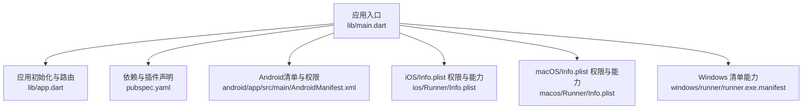
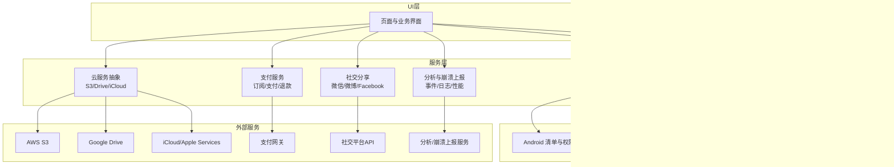
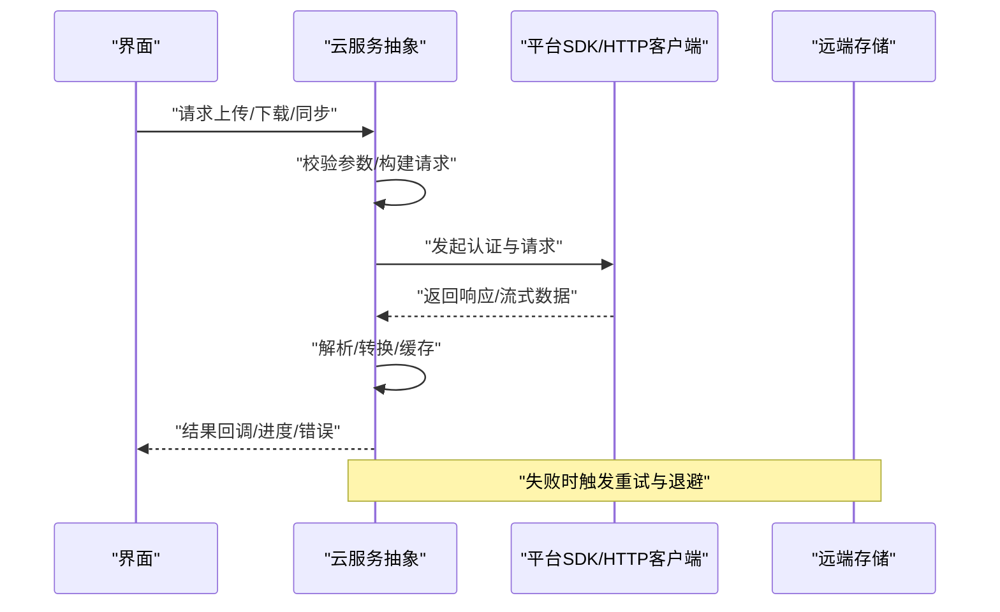
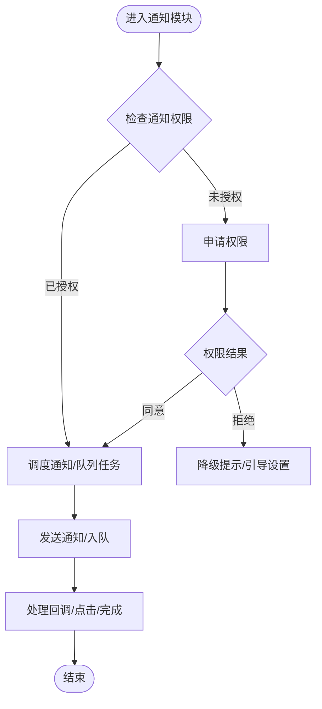
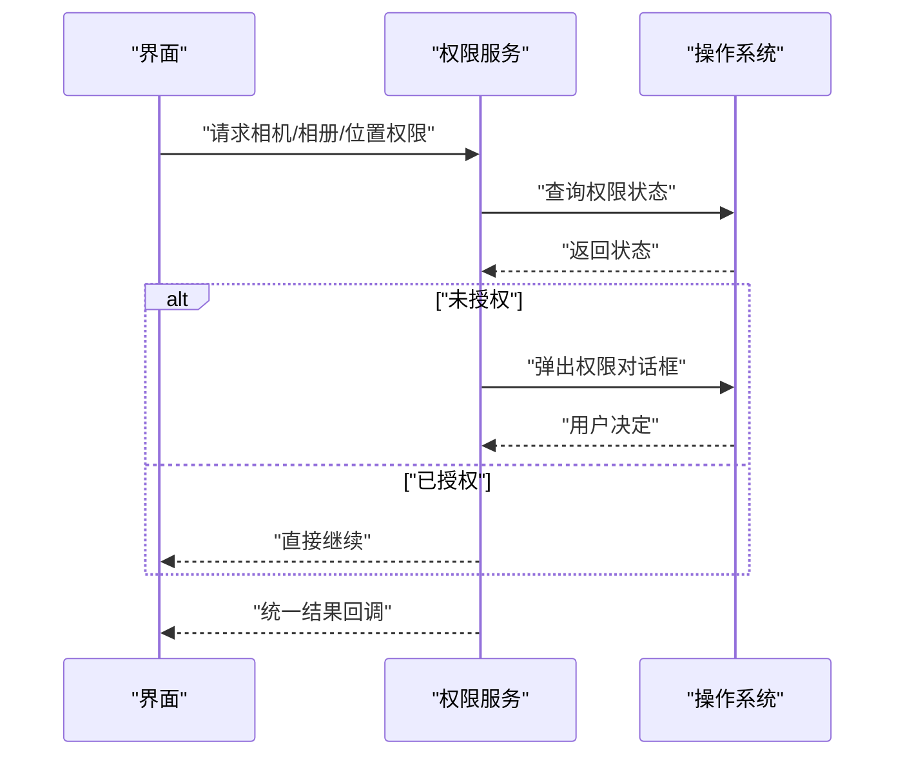
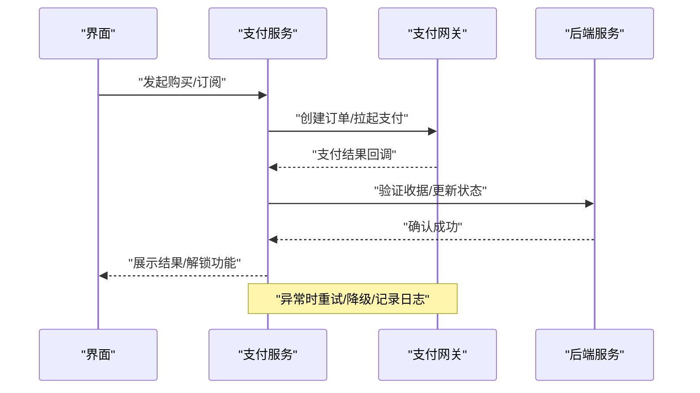
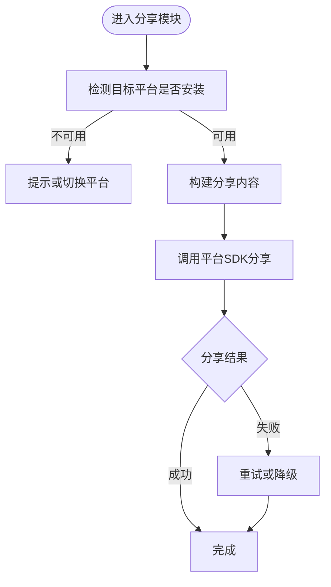
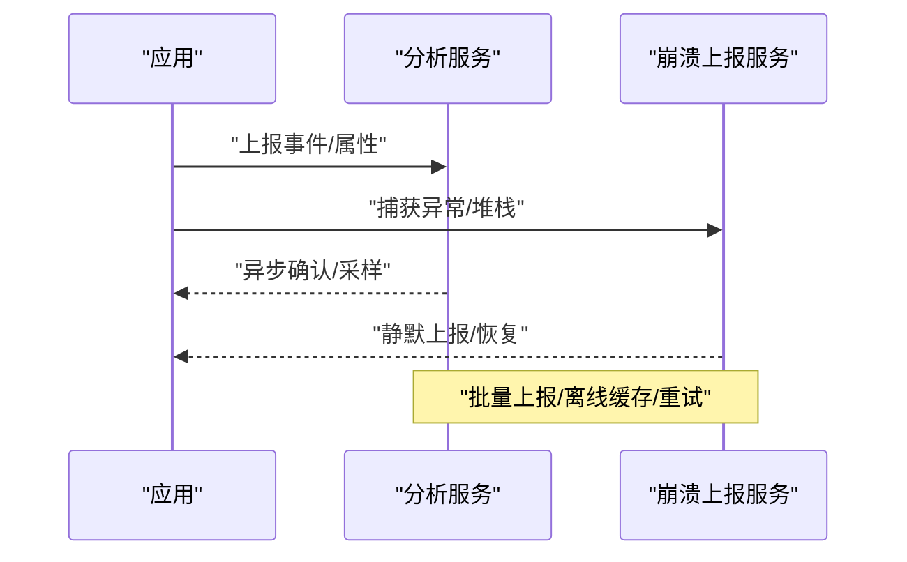
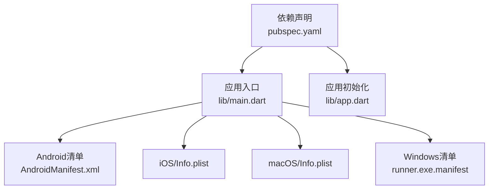

# 第三方服务集成

<cite>
**本文引用的文件**   
- [pubspec.yaml](file://pubspec.yaml)
- [lib/main.dart](file://lib/main.dart)
- [lib/app.dart](file://lib/app.dart)
- [android/app/src/main/AndroidManifest.xml](file://android/app/src/main/AndroidManifest.xml)
- [ios/Runner/Info.plist](file://ios/Runner/Info.plist)
- [macos/Runner/Info.plist](file://macos/Runner/Info.plist)
- [windows/runner/runner.exe.manifest](file://windows/runner/runner.exe.manifest)
</cite>

## 目录
1. [简介](#简介)
2. [项目结构](#项目结构)
3. [核心组件](#核心组件)
4. [架构总览](#架构总览)
5. [详细组件分析](#详细组件分析)
6. [依赖分析](#依赖分析)
7. [性能考虑](#性能考虑)
8. [故障排查指南](#故障排查指南)
9. [结论](#结论)
10. [附录](#附录)

## 简介
本技术文档面向Flutter照片整理AI应用的“第三方服务集成”，覆盖云存储（AWS S3、Google Drive、iCloud）、通知（推送与本地通知、消息队列）、权限管理（相机、相册、位置）、支付（订阅、支付流程、退款）、社交分享（微信、微博、Facebook）以及Analytics与Crash Reporting（用户行为分析、错误收集、性能监控）。文档以仓库现有结构与配置为依据，提供可操作的集成方案、调用路径与最佳实践，并给出错误处理、重试机制与离线支持的实现建议。

## 项目结构
该Flutter工程采用多平台标准布局：
- lib：应用逻辑入口与页面、服务、数据层等代码组织
- android/ios/macos/windows/linux：各平台原生配置与插件注册
- pubspec.yaml：依赖声明与插件配置中心

图表来源
- [lib/main.dart:1-200](file://lib/main.dart#L1-L200)
- [lib/app.dart:1-200](file://lib/app.dart#L1-L200)
- [pubspec.yaml:1-200](file://pubspec.yaml#L1-L200)
- [android/app/src/main/AndroidManifest.xml:1-200](file://android/app/src/main/AndroidManifest.xml#L1-L200)
- [ios/Runner/Info.plist:1-200](file://ios/Runner/Info.plist#L1-L200)
- [macos/Runner/Info.plist:1-200](file://macos/Runner/Info.plist#L1-L200)
- [windows/runner/runner.exe.manifest:1-200](file://windows/runner/runner.exe.manifest#L1-L200)

章节来源
- [lib/main.dart:1-200](file://lib/main.dart#L1-L200)
- [lib/app.dart:1-200](file://lib/app.dart#L1-L200)
- [pubspec.yaml:1-200](file://pubspec.yaml#L1-L200)

## 核心组件
- 应用入口与初始化：负责启动顺序、全局状态、插件初始化与路由设置
- 平台配置与权限：在各平台清单中声明所需权限与能力，确保第三方SDK可用
- 依赖与插件：通过包管理器统一声明第三方库，便于版本管理与更新

章节来源
- [lib/main.dart:1-200](file://lib/main.dart#L1-L200)
- [lib/app.dart:1-200](file://lib/app.dart#L1-L200)
- [pubspec.yaml:1-200](file://pubspec.yaml#L1-L200)
- [android/app/src/main/AndroidManifest.xml:1-200](file://android/app/src/main/AndroidManifest.xml#L1-L200)
- [ios/Runner/Info.plist:1-200](file://ios/Runner/Info.plist#L1-L200)
- [macos/Runner/Info.plist:1-200](file://macos/Runner/Info.plist#L1-L200)
- [windows/runner/runner.exe.manifest:1-200](file://windows/runner/runner.exe.manifest#L1-L200)

## 架构总览
下图展示第三方服务在Flutter应用中的分层与交互关系：UI层通过服务层调用各平台SDK或HTTP接口；服务层封装认证、重试、缓存与错误处理；平台层负责权限与系统能力；配置层集中管理密钥与开关。

图表来源
- [lib/main.dart:1-200](file://lib/main.dart#L1-L200)
- [lib/app.dart:1-200](file://lib/app.dart#L1-L200)
- [pubspec.yaml:1-200](file://pubspec.yaml#L1-L200)
- [android/app/src/main/AndroidManifest.xml:1-200](file://android/app/src/main/AndroidManifest.xml#L1-L200)
- [ios/Runner/Info.plist:1-200](file://ios/Runner/Info.plist#L1-L200)
- [macos/Runner/Info.plist:1-200](file://macos/Runner/Info.plist#L1-L200)
- [windows/runner/runner.exe.manifest:1-200](file://windows/runner/runner.exe.manifest#L1-L200)

## 详细组件分析

### 云存储服务集成（AWS S3、Google Drive、iCloud）
- SDK使用要点
  - 选择跨平台或平台专属SDK，统一抽象为存储服务接口
  - 支持分块上传、断点续传、并发控制与压缩传输
- 认证授权
  - 使用短期令牌或OAuth流程获取访问凭证
  - 安全存储凭据，避免硬编码密钥
- 文件同步
  - 增量同步策略，基于元数据对比与冲突解决
  - 后台任务与网络状态感知，失败重试与退避

图表来源
- [pubspec.yaml:1-200](file://pubspec.yaml#L1-L200)
- [lib/main.dart:1-200](file://lib/main.dart#L1-L200)
- [lib/app.dart:1-200](file://lib/app.dart#L1-L200)

章节来源
- [pubspec.yaml:1-200](file://pubspec.yaml#L1-L200)
- [lib/main.dart:1-200](file://lib/main.dart#L1-L200)
- [lib/app.dart:1-200](file://lib/app.dart#L1-L200)

### 通知服务（推送通知、本地通知、消息队列）
- 推送通知
  - 使用平台通道或SDK接入APNs/FCM
  - 处理前台/后台/点击事件与自定义payload
- 本地通知
  - 定时提醒、重复通知与富媒体内容
- 消息队列
  - 将高耗时任务入队，保证可靠执行与幂等性
  - 结合持久化存储与重试策略

图表来源
- [android/app/src/main/AndroidManifest.xml:1-200](file://android/app/src/main/AndroidManifest.xml#L1-L200)
- [ios/Runner/Info.plist:1-200](file://ios/Runner/Info.plist#L1-L200)
- [macos/Runner/Info.plist:1-200](file://macos/Runner/Info.plist#L1-L200)
- [windows/runner/runner.exe.manifest:1-200](file://windows/runner/runner.exe.manifest#L1-L200)

章节来源
- [android/app/src/main/AndroidManifest.xml:1-200](file://android/app/src/main/AndroidManifest.xml#L1-L200)
- [ios/Runner/Info.plist:1-200](file://ios/Runner/Info.plist#L1-L200)
- [macos/Runner/Info.plist:1-200](file://macos/Runner/Info.plist#L1-L200)
- [windows/runner/runner.exe.manifest:1-200](file://windows/runner/runner.exe.manifest#L1-L200)

### 权限管理（相机、相册、位置）
- 权限申请流程
  - 动态检测当前权限状态
  - 按需申请并处理用户拒绝/部分授予
- 平台差异
  - Android：在清单中声明权限并在运行时请求
  - iOS/macOS：在Info.plist中声明用途字符串
  - Windows：在清单中启用相关能力
- 用户体验
  - 明确说明权限用途
  - 提供引导至系统设置页

图表来源
- [android/app/src/main/AndroidManifest.xml:1-200](file://android/app/src/main/AndroidManifest.xml#L1-L200)
- [ios/Runner/Info.plist:1-200](file://ios/Runner/Info.plist#L1-L200)
- [macos/Runner/Info.plist:1-200](file://macos/Runner/Info.plist#L1-L200)
- [windows/runner/runner.exe.manifest:1-200](file://windows/runner/runner.exe.manifest#L1-L200)

章节来源
- [android/app/src/main/AndroidManifest.xml:1-200](file://android/app/src/main/AndroidManifest.xml#L1-L200)
- [ios/Runner/Info.plist:1-200](file://ios/Runner/Info.plist#L1-L200)
- [macos/Runner/Info.plist:1-200](file://macos/Runner/Info.plist#L1-L200)
- [windows/runner/runner.exe.manifest:1-200](file://windows/runner/runner.exe.manifest#L1-L200)

### 支付服务（订阅管理、支付流程、退款处理）
- 订阅管理
  - 订阅产品定义、自动续费与到期提醒
  - 验证收据与状态同步
- 支付流程
  - 拉起支付、处理回调与幂等性
  - 失败重试与人工对账
- 退款处理
  - 退款申请、审核与状态回写
  - 用户通知与审计日志

图表来源
- [pubspec.yaml:1-200](file://pubspec.yaml#L1-L200)
- [lib/main.dart:1-200](file://lib/main.dart#L1-L200)
- [lib/app.dart:1-200](file://lib/app.dart#L1-L200)

章节来源
- [pubspec.yaml:1-200](file://pubspec.yaml#L1-L200)
- [lib/main.dart:1-200](file://lib/main.dart#L1-L200)
- [lib/app.dart:1-200](file://lib/app.dart#L1-L200)

### 社交分享（微信、微博、Facebook）
- 平台接入
  - 注册应用、配置回调与签名
  - 处理分享类型（文本、图片、链接）
- 分享流程
  - 预检平台可用性
  - 构造分享内容并调用SDK
  - 处理回调与错误码
- 体验优化
  - 失败降级与替代分享方式
  - 统计分享成功率与转化

图表来源
- [pubspec.yaml:1-200](file://pubspec.yaml#L1-L200)
- [lib/main.dart:1-200](file://lib/main.dart#L1-L200)
- [lib/app.dart:1-200](file://lib/app.dart#L1-L200)

章节来源
- [pubspec.yaml:1-200](file://pubspec.yaml#L1-L200)
- [lib/main.dart:1-200](file://lib/main.dart#L1-L200)
- [lib/app.dart:1-200](file://lib/app.dart#L1-L200)

### Analytics与Crash Reporting（用户行为分析、错误收集、性能监控）
- 事件埋点
  - 关键业务流程打点（登录、上传、分享、支付）
  - 去重与隐私合规
- 崩溃上报
  - 捕获未处理异常与ANR
  - 堆栈还原与版本关联
- 性能监控
  - 首屏时间、卡顿、内存与网络耗时
  - 指标聚合与告警

图表来源
- [pubspec.yaml:1-200](file://pubspec.yaml#L1-L200)
- [lib/main.dart:1-200](file://lib/main.dart#L1-L200)
- [lib/app.dart:1-200](file://lib/app.dart#L1-L200)

章节来源
- [pubspec.yaml:1-200](file://pubspec.yaml#L1-L200)
- [lib/main.dart:1-200](file://lib/main.dart#L1-L200)
- [lib/app.dart:1-200](file://lib/app.dart#L1-L200)

## 依赖分析
- 依赖声明集中在包管理文件中，便于统一升级与冲突解决
- 平台特定能力通过清单与配置文件声明，确保SDK可用
- 服务层抽象降低耦合，便于替换与扩展

图表来源
- [pubspec.yaml:1-200](file://pubspec.yaml#L1-L200)
- [lib/main.dart:1-200](file://lib/main.dart#L1-L200)
- [lib/app.dart:1-200](file://lib/app.dart#L1-L200)
- [android/app/src/main/AndroidManifest.xml:1-200](file://android/app/src/main/AndroidManifest.xml#L1-L200)
- [ios/Runner/Info.plist:1-200](file://ios/Runner/Info.plist#L1-L200)
- [macos/Runner/Info.plist:1-200](file://macos/Runner/Info.plist#L1-L200)
- [windows/runner/runner.exe.manifest:1-200](file://windows/runner/runner.exe.manifest#L1-L200)

章节来源
- [pubspec.yaml:1-200](file://pubspec.yaml#L1-L200)
- [lib/main.dart:1-200](file://lib/main.dart#L1-L200)
- [lib/app.dart:1-200](file://lib/app.dart#L1-L200)
- [android/app/src/main/AndroidManifest.xml:1-200](file://android/app/src/main/AndroidManifest.xml#L1-L200)
- [ios/Runner/Info.plist:1-200](file://ios/Runner/Info.plist#L1-L200)
- [macos/Runner/Info.plist:1-200](file://macos/Runner/Info.plist#L1-L200)
- [windows/runner/runner.exe.manifest:1-200](file://windows/runner/runner.exe.manifest#L1-L200)

## 性能考虑
- 网络与I/O
  - 连接池与复用、超时与重试、压缩与缓存
  - 大文件分块上传与断点续传
- 资源管理
  - 图片缩略图与懒加载，内存占用控制
  - 后台任务限流与优先级
- 监控与优化
  - 关键路径耗时埋点与热点分析
  - 线上指标采集与告警

## 故障排查指南
- 常见问题定位
  - 权限被拒：检查清单与用途字符串，引导用户开启
  - 网络异常：查看错误码与重试策略，必要时降级
  - 崩溃上报：核对堆栈与版本信息，复现问题
- 调试技巧
  - 启用详细日志与沙箱环境
  - 模拟弱网与异常场景
  - 使用平台开发者工具与日志抓取

## 结论
通过统一的服务抽象与平台配置，本应用在云存储、通知、权限、支付、分享与分析等方面具备可扩展与可维护的集成基础。建议在后续迭代中完善错误处理、重试与离线能力，持续优化性能与用户体验，并遵循隐私与合规要求。

## 附录
- 服务切换与扩展最佳实践
  - 接口抽象与依赖注入，便于替换实现
  - 特性开关与灰度发布，降低风险
  - 统一错误模型与日志规范，提升排障效率
- 离线支持与可靠性
  - 本地缓存与队列持久化
  - 冲突合并与一致性保障
  - 健康检查与服务降级