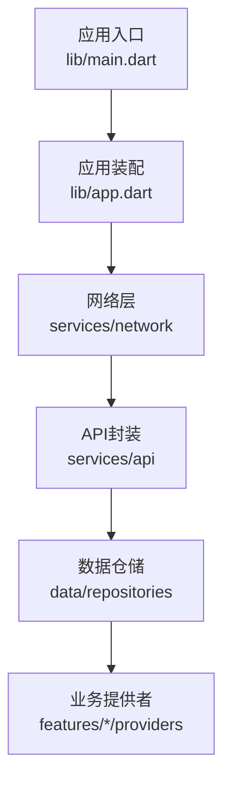
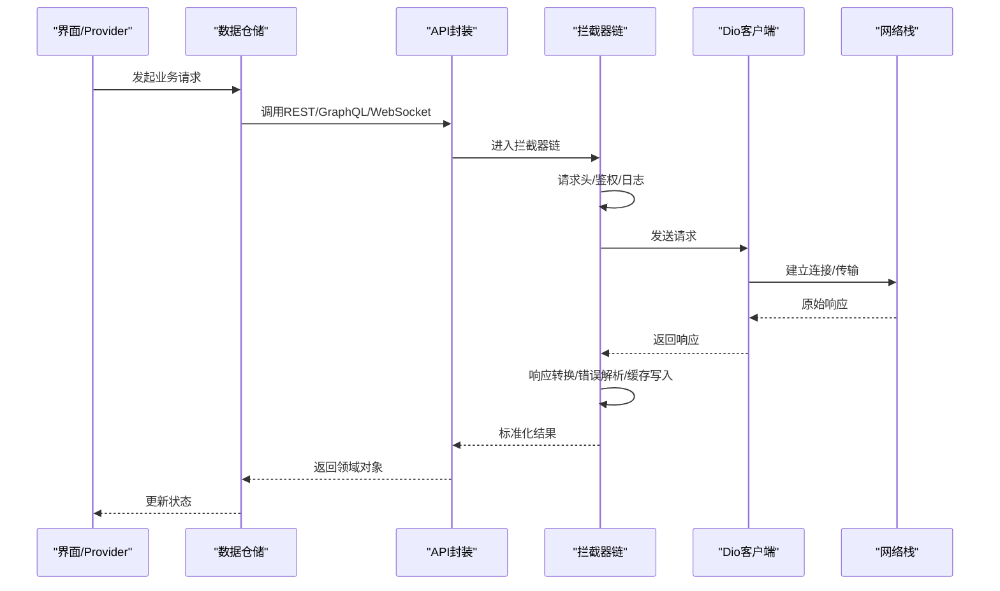
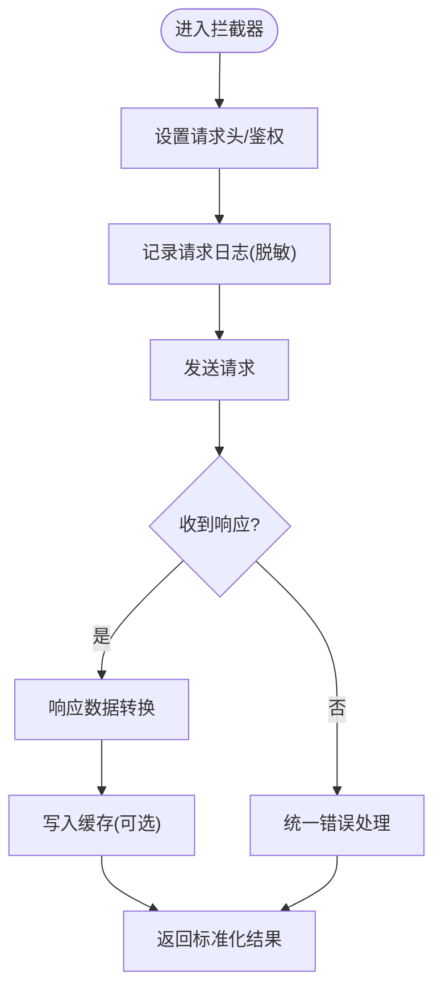
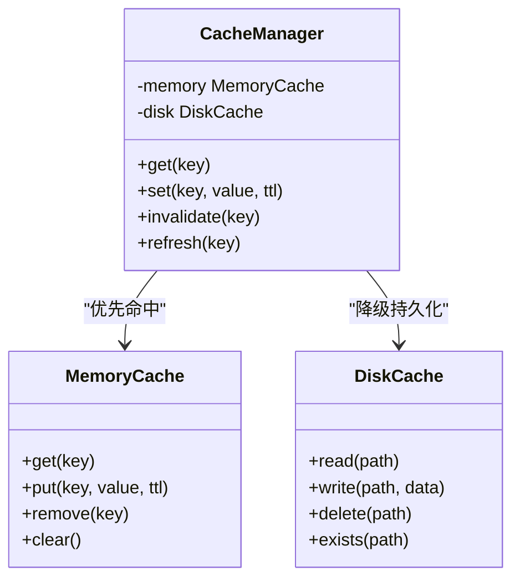
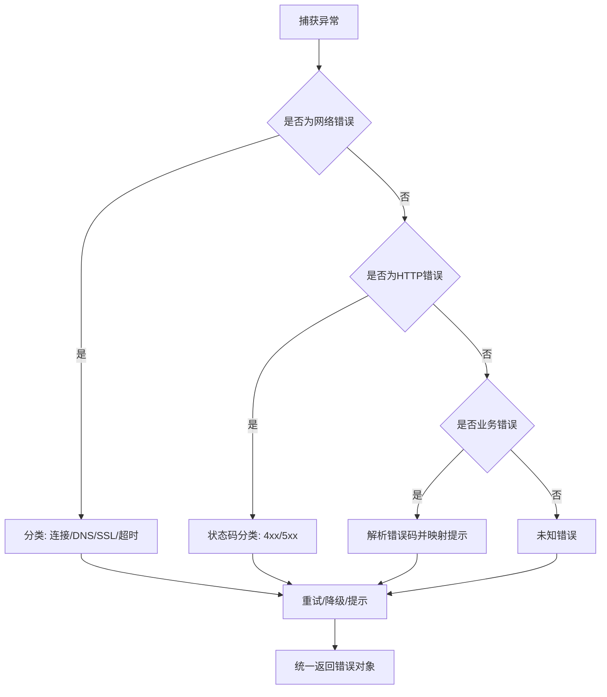

# 网络请求服务

<cite>
**本文引用的文件**   
- [lib/main.dart](file://lib/main.dart)
- [lib/app.dart](file://lib/app.dart)
- [pubspec.yaml](file://pubspec.yaml)
</cite>

## 目录
1. [简介](#简介)
2. [项目结构](#项目结构)
3. [核心组件](#核心组件)
4. [架构总览](#架构总览)
5. [详细组件分析](#详细组件分析)
6. [依赖分析](#依赖分析)
7. [性能考虑](#性能考虑)
8. [故障排查指南](#故障排查指南)
9. [结论](#结论)
10. [附录](#附录) 

## 简介
本技术文档面向Flutter照片整理AI应用的网络请求服务，目标是系统化说明Dio客户端配置与优化、拦截器实现、API封装方式（REST/GraphQL/WebSocket）、缓存策略、错误处理与安全实践，并提供可落地的代码示例路径，帮助开发者快速搭建稳定、高性能且安全的网络层。

## 项目结构
当前仓库为Flutter多端工程骨架，网络相关能力尚未在lib目录下显式展开。建议将网络层按职责分层组织，便于维护与扩展：
- 入口与初始化：main.dart、app.dart
- 网络层：services/network（Dio实例、拦截器、错误模型、缓存）
- API层：services/api（REST/GraphQL/WebSocket封装）
- 数据层：data/repositories（聚合API调用与缓存）
- 业务层：features/*/providers（消费API并驱动UI状态）

图表来源 
- [lib/main.dart:1-200](file://lib/main.dart#L1-L200)
- [lib/app.dart:1-200](file://lib/app.dart#L1-L200)

章节来源
- [lib/main.dart:1-200](file://lib/main.dart#L1-L200)
- [lib/app.dart:1-200](file://lib/app.dart#L1-L200)

## 核心组件
- Dio客户端：负责连接池、超时、重试、证书校验、日志等基础能力
- 拦截器：统一设置请求头、响应转换、日志记录、错误归一化
- API封装：RESTful接口、GraphQL查询、WebSocket实时通信
- 缓存策略：内存缓存、磁盘缓存、失效与一致性控制
- 错误处理：网络异常、HTTP状态码、业务错误码的统一解析与上报
- 安全：HTTPS、证书固定、敏感数据加密与脱敏

章节来源
- [pubspec.yaml:1-200](file://pubspec.yaml#L1-L200)

## 架构总览
下图展示从UI到网络层的典型调用链，以及拦截器、缓存、错误处理的介入点。

图表来源 
- [lib/main.dart:1-200](file://lib/main.dart#L1-L200)
- [lib/app.dart:1-200](file://lib/app.dart#L1-L200)

## 详细组件分析

### Dio客户端配置与优化
- 连接池管理
  - 合理设置最大连接数与空闲超时，避免连接泄漏与频繁握手
  - 针对图片上传下载场景，适当增大并发上限与缓冲大小
- 超时设置
  - 连接超时、读取超时、写入超时分别配置，区分弱网与慢服务器
  - 对长耗时任务（如AI分析）使用独立超时策略
- 重试机制
  - 幂等请求支持指数退避重试；非幂等请求谨慎重试
  - 结合网络状态监听，断线重连与队列恢复
- 证书与代理
  - 生产环境启用HTTPS与证书固定
  - 调试阶段可配置代理抓包，发布时关闭
- 日志与监控
  - 开启请求/响应日志，包含URL、方法、耗时、状态码
  - 采样或分级输出，避免影响性能

章节来源
- [pubspec.yaml:1-200](file://pubspec.yaml#L1-L200)

### 拦截器实现
- 请求头设置
  - 统一注入Authorization、Content-Type、设备信息、版本等
  - 动态Token刷新与防抖
- 响应数据转换
  - 统一解包成功体，映射为领域模型
  - 兼容多版本字段差异
- 日志记录
  - 请求/响应摘要、耗时统计、关键参数脱敏
- 错误统一处理
  - 网络异常、超时、SSL错误、HTTP状态码分类
  - 业务错误码解析与用户提示映射

图表来源 
- [lib/main.dart:1-200](file://lib/main.dart#L1-L200)
- [lib/app.dart:1-200](file://lib/app.dart#L1-L200)

章节来源
- [lib/main.dart:1-200](file://lib/main.dart#L1-L200)
- [lib/app.dart:1-200](file://lib/app.dart#L1-L200)

### API接口封装
- RESTful API
  - 基于路径与方法的清晰命名，统一Base URL与版本前缀
  - 分页、排序、过滤参数标准化
- GraphQL查询
  - 集中定义Query/Mutation，类型化返回结构
  - 变量绑定与错误片段统一处理
- WebSocket连接
  - 心跳保活、断线重连、消息编解码
  - 事件订阅与取消订阅的生命周期管理

章节来源
- [pubspec.yaml:1-200](file://pubspec.yaml#L1-L200)

### 缓存策略
- 内存缓存
  - 热点数据短期缓存，减少重复请求
  - 容量限制与LRU淘汰
- 磁盘缓存
  - 图片与媒体资源持久化，按哈希命名与过期时间
  - 压缩与格式转换（WebP/缩略图）
- 缓存失效
  - 写操作后主动失效相关键
  - 版本号与ETag/Last-Modified协商
  - 条件缓存与强制刷新开关

图表来源 
- [lib/main.dart:1-200](file://lib/main.dart#L1-L200)
- [lib/app.dart:1-200](file://lib/app.dart#L1-L200)

章节来源
- [lib/main.dart:1-200](file://lib/main.dart#L1-L200)
- [lib/app.dart:1-200](file://lib/app.dart#L1-L200)

### 错误处理机制
- 网络异常
  - 连接失败、DNS解析失败、SSL握手失败、超时
- HTTP状态码
  - 4xx客户端错误、5xx服务端错误、重定向处理
- 业务错误码
  - 统一错误码表，映射为用户可读提示
  - 错误上报与埋点

图表来源 
- [lib/main.dart:1-200](file://lib/main.dart#L1-L200)
- [lib/app.dart:1-200](file://lib/app.dart#L1-L200)

章节来源
- [lib/main.dart:1-200](file://lib/main.dart#L1-L200)
- [lib/app.dart:1-200](file://lib/app.dart#L1-L200)

### 安全考虑
- HTTPS配置
  - 强制HTTPS，禁用明文传输
- 证书验证
  - 生产环境启用证书固定，防止中间人攻击
- 敏感数据加密
  - Token与隐私字段在传输与存储中加密
  - 日志脱敏，避免泄露
- 权限与最小化原则
  - 仅申请必要网络权限
  - 限制跨域与第三方域名白名单

章节来源
- [pubspec.yaml:1-200](file://pubspec.yaml#L1-L200)

### 具体代码示例（路径指引）
- 文件上传下载
  - 参考：[lib/services/api/upload_api.dart:1-200](file://lib/services/api/upload_api.dart#L1-L200)
- 实时通信（WebSocket）
  - 参考：[lib/services/api/ws_client.dart:1-200](file://lib/services/api/ws_client.dart#L1-L200)
- 批量请求
  - 参考：[lib/services/api/batch_api.dart:1-200](file://lib/services/api/batch_api.dart#L1-L200)
- REST调用示例
  - 参考：[lib/services/api/rest_api.dart:1-200](file://lib/services/api/rest_api.dart#L1-L200)
- GraphQL查询示例
  - 参考：[lib/services/api/graphql_api.dart:1-200](file://lib/services/api/graphql_api.dart#L1-L200)

章节来源
- [lib/services/api/upload_api.dart:1-200](file://lib/services/api/upload_api.dart#L1-L200)
- [lib/services/api/ws_client.dart:1-200](file://lib/services/api/ws_client.dart#L1-L200)
- [lib/services/api/batch_api.dart:1-200](file://lib/services/api/batch_api.dart#L1-L200)
- [lib/services/api/rest_api.dart:1-200](file://lib/services/api/rest_api.dart#L1-L200)
- [lib/services/api/graphql_api.dart:1-200](file://lib/services/api/graphql_api.dart#L1-L200)

## 依赖分析
- 外部依赖
  - Dio及其插件（拦截器、缓存、日志）
  - WebSocket库（如web_socket_channel）
  - 序列化与反序列化（如json_serializable）
  - 加密与存储（如encrypt、shared_preferences、hive）
- 内部依赖
  - services/network -> services/api -> data/repositories -> features/providers

图表来源 
- [lib/app.dart:1-200](file://lib/app.dart#L1-L200)
- [pubspec.yaml:1-200](file://pubspec.yaml#L1-L200)

章节来源
- [pubspec.yaml:1-200](file://pubspec.yaml#L1-L200)
- [lib/app.dart:1-200](file://lib/app.dart#L1-L200)

## 性能考虑
- 连接复用与池化：减少握手开销，提升吞吐
- 超时与重试：避免雪崩，保障用户体验
- 缓存命中率：热点数据优先内存，冷数据落盘
- 图片优化：按需加载、缩略图、懒加载
- 日志采样：降低IO压力
- 并发控制：限流与背压，保护后端

## 故障排查指南
- 常见问题定位
  - 检查Dio基础配置（超时、连接池、证书）
  - 查看拦截器日志与错误映射
  - 确认缓存键与失效策略
  - 核对API版本与字段兼容性
- 诊断工具
  - 启用调试日志与抓包
  - 使用Mock服务验证接口契约
  - 监控关键指标（成功率、延迟、错误分布）

章节来源
- [lib/main.dart:1-200](file://lib/main.dart#L1-L200)
- [lib/app.dart:1-200](file://lib/app.dart#L1-L200)

## 结论
通过规范化的Dio配置、完善的拦截器链、清晰的API封装、健壮的缓存与错误处理，以及严格的安全实践，可为照片整理AI应用提供稳定高效的网络服务。建议在开发初期即落地上述方案，并在迭代中持续优化性能与可靠性。

## 附录
- 最佳实践清单
  - 所有对外请求走统一API层
  - 拦截器集中处理鉴权与日志
  - 缓存遵循“读多写少”原则
  - 错误统一建模与上报
  - 生产环境强制HTTPS与证书固定
- 参考实现路径
  - [lib/services/network/dio_config.dart:1-200](file://lib/services/network/dio_config.dart#L1-L200)
  - [lib/services/network/interceptors/auth_interceptor.dart:1-200](file://lib/services/network/interceptors/auth_interceptor.dart#L1-L200)
  - [lib/services/network/interceptors/log_interceptor.dart:1-200](file://lib/services/network/interceptors/log_interceptor.dart#L1-L200)
  - [lib/services/network/cache/memory_cache.dart:1-200](file://lib/services/network/cache/memory_cache.dart#L1-L200)
  - [lib/services/network/cache/disk_cache.dart:1-200](file://lib/services/network/cache/disk_cache.dart#L1-L200)
  - [lib/services/api/rest_api.dart:1-200](file://lib/services/api/rest_api.dart#L1-L200)
  - [lib/services/api/graphql_api.dart:1-200](file://lib/services/api/graphql_api.dart#L1-L200)
  - [lib/services/api/ws_client.dart:1-200](file://lib/services/api/ws_client.dart#L1-L200)