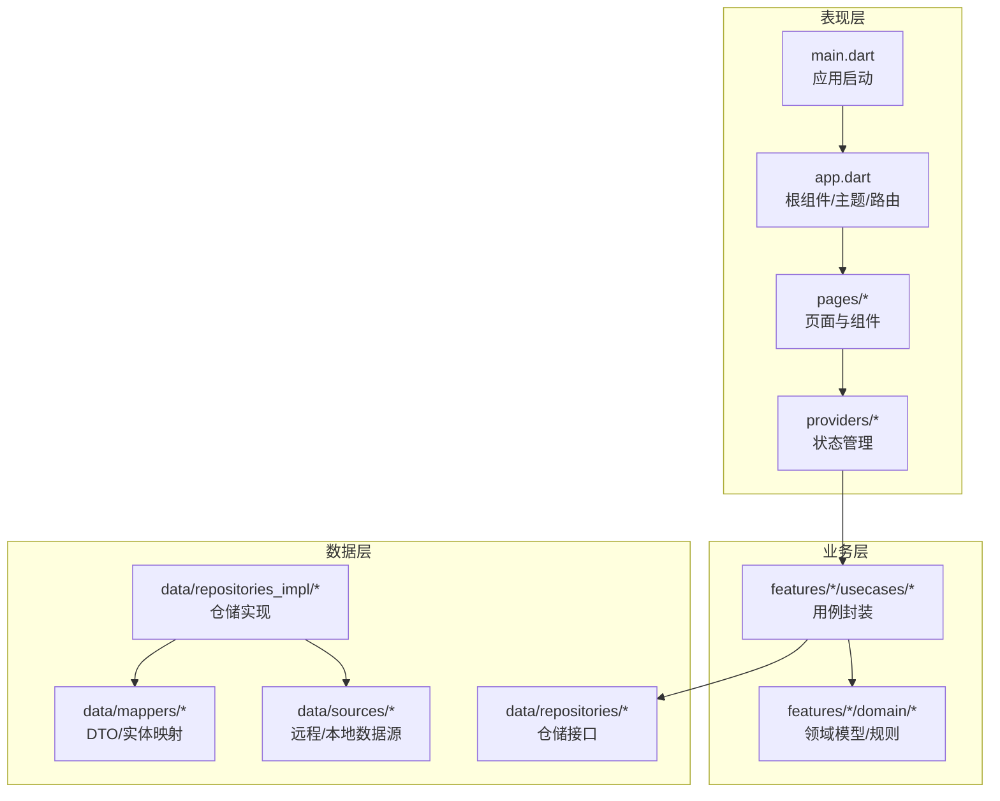
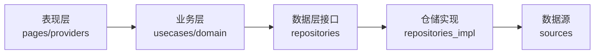
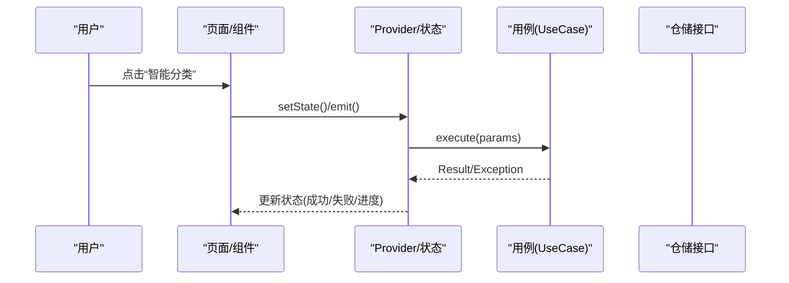
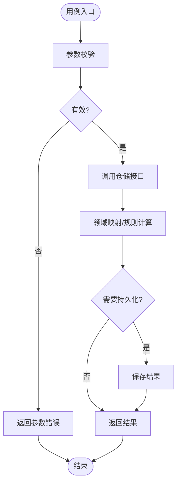
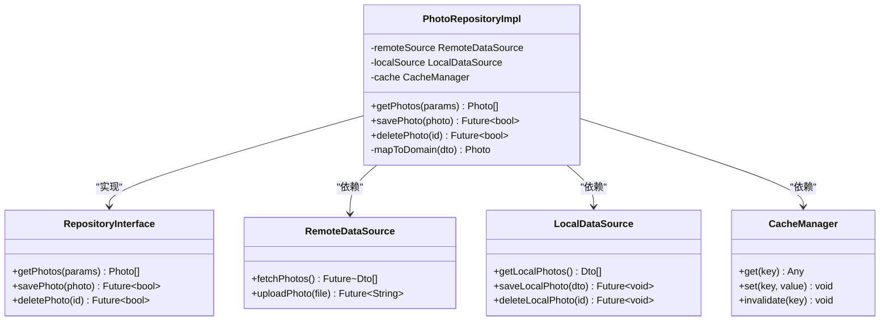
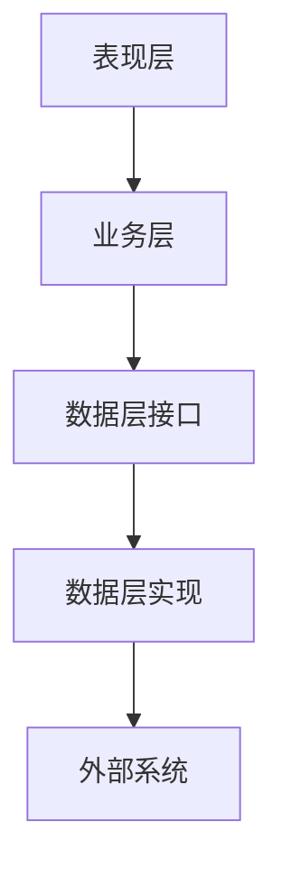

# Clean Architecture分层设计

<cite>
**本文档引用的文件**   
- [lib/main.dart](file://lib/main.dart)
- [lib/app.dart](file://lib/app.dart)
- [pubspec.yaml](file://pubspec.yaml)
- [README.md](file://README.md)
</cite>

## 目录
1. [简介](#简介)
2. [项目结构](#项目结构)
3. [核心组件](#核心组件)
4. [架构总览](#架构总览)
5. [详细组件分析](#详细组件分析)
6. [依赖分析](#依赖分析)
7. [性能考虑](#性能考虑)
8. [故障排查指南](#故障排查指南)
9. [结论](#结论)
10. [附录](#附录)

## 简介
本文件为Flutter照片整理AI应用制定Clean Architecture（整洁架构）分层设计文档，重点阐述表现层、业务层与数据层的职责边界与单向依赖原则，说明Repository模式在数据访问层的实现方式，以及Use Case模式在业务逻辑层的封装。文档包含分层架构图、数据与控制流说明、异常处理与日志策略，并提供将新功能模块接入现有架构的步骤化示例。

## 项目结构
当前仓库为Flutter工程骨架，核心代码位于lib目录，包含入口与顶层应用配置；平台相关代码位于android、ios、windows、macos、linux、web等目录。根据Clean Architecture理念，建议将lib按“表现层/业务层/数据层”进行组织：
- 表现层（Presentation Layer）：页面、路由、状态管理、UI交互
- 业务层（Business Layer）：用例（Use Case）、领域规则编排、事务边界
- 数据层（Data Layer）：仓储（Repository）接口与实现、远程/本地数据源、DTO映射

图表来源
- [lib/main.dart:1-200](file://lib/main.dart#L1-L200)
- [lib/app.dart:1-200](file://lib/app.dart#L1-L200)

章节来源
- [lib/main.dart:1-200](file://lib/main.dart#L1-L200)
- [lib/app.dart:1-200](file://lib/app.dart#L1-L200)

## 核心组件
- 入口与根应用
  - main.dart负责初始化全局设置并运行应用根组件
  - app.dart定义主题、路由、国际化等跨层共享配置
- 表现层
  - pages下按功能划分页面，使用Provider/Riverpod/Bloc等进行状态管理
  - providers下维护可被UI订阅的状态对象
- 业务层
  - features按功能域划分，每个feature包含usecases与domain
  - usecases封装单一业务目标，domain定义实体与不变式
- 数据层
  - repositories定义抽象接口，repositories_impl提供具体实现
  - sources封装网络请求、数据库读写、缓存策略
  - mappers负责DTO与领域模型的转换

章节来源
- [lib/main.dart:1-200](file://lib/main.dart#L1-L200)
- [lib/app.dart:1-200](file://lib/app.dart#L1-L200)

## 架构总览
Clean Architecture强调内层不依赖外层，外层通过接口依赖内层。在本项目中：
- 表现层仅依赖业务层接口（用例），不直接访问数据层
- 业务层定义领域模型与用例，依赖数据层接口（仓储）
- 数据层实现仓储接口，依赖外部系统（网络、存储）

图表来源
- [lib/main.dart:1-200](file://lib/main.dart#L1-L200)
- [lib/app.dart:1-200](file://lib/app.dart#L1-L200)

## 详细组件分析

### 表现层（Presentation Layer）
- 职责
  - 渲染界面、收集用户输入、展示加载/错误状态
  - 调用业务层用例，订阅状态变化
- 关键约定
  - 不直接访问仓储或数据源
  - 使用统一的错误类型与状态枚举
- 典型流程
  - 用户操作触发Provider状态更新
  - Provider调用对应UseCase
  - UseCase返回结果或异常，Provider映射到UI状态

图表来源
- [lib/main.dart:1-200](file://lib/main.dart#L1-L200)
- [lib/app.dart:1-200](file://lib/app.dart#L1-L200)

章节来源
- [lib/main.dart:1-200](file://lib/main.dart#L1-L200)
- [lib/app.dart:1-200](file://lib/app.dart#L1-L200)

### 业务层（Business Layer）
- 职责
  - 封装单一业务目标（Use Case）
  - 编排领域规则与数据获取/写入流程
  - 保证事务边界与一致性
- 关键约定
  - 只依赖仓储接口，不感知实现细节
  - 输出领域模型或DTO，避免泄露基础设施信息
- 典型流程
  - 校验输入参数
  - 调用仓储接口获取/持久化数据
  - 组合多个数据源的结果，应用领域规则
  - 返回统一结果或抛出领域异常

图表来源
- [lib/main.dart:1-200](file://lib/main.dart#L1-L200)
- [lib/app.dart:1-200](file://lib/app.dart#L1-L200)

章节来源
- [lib/main.dart:1-200](file://lib/main.dart#L1-L200)
- [lib/app.dart:1-200](file://lib/app.dart#L1-L200)

### 数据层（Data Layer）
- 职责
  - 实现仓储接口，协调多数据源（网络、本地、缓存）
  - 负责DTO与领域模型的映射
  - 处理重试、降级、缓存策略
- 关键约定
  - 对外暴露仓储接口，对内屏蔽数据源差异
  - 所有异常转换为领域异常或统一错误码
- 典型流程
  - 优先读取缓存/本地
  - 未命中则请求远程
  - 成功后写回缓存/本地
  - 统一映射为领域模型返回

图表来源
- [lib/main.dart:1-200](file://lib/main.dart#L1-L200)
- [lib/app.dart:1-200](file://lib/app.dart#L1-L200)

章节来源
- [lib/main.dart:1-200](file://lib/main.dart#L1-L200)
- [lib/app.dart:1-200](file://lib/app.dart#L1-L200)

### 异常处理、日志与错误传播
- 异常分层
  - 数据层：捕获网络/IO异常，转换为领域异常或统一错误码
  - 业务层：记录关键步骤日志，向上抛出领域异常
  - 表现层：捕获异常并映射为用户可读的错误提示
- 日志策略
  - 数据层：记录请求/响应摘要、耗时、重试次数
  - 业务层：记录用例执行轨迹、关键决策点
  - 表现层：记录用户操作上下文、崩溃堆栈
- 错误传播
  - 使用统一Result类型或异常基类
  - 上层仅依赖接口与错误语义，不感知底层实现

章节来源
- [lib/main.dart:1-200](file://lib/main.dart#L1-L200)
- [lib/app.dart:1-200](file://lib/app.dart#L1-L200)

## 依赖分析
- 单向依赖
  - 表现层依赖业务层接口
  - 业务层依赖数据层接口
  - 数据层不反向依赖上层
- 耦合与内聚
  - 用例高内聚于单一业务目标
  - 仓储接口低耦合，便于替换实现
- 外部依赖
  - 网络库、数据库、文件系统、AI服务SDK等均在数据层隔离

图表来源
- [lib/main.dart:1-200](file://lib/main.dart#L1-L200)
- [lib/app.dart:1-200](file://lib/app.dart#L1-L200)

章节来源
- [lib/main.dart:1-200](file://lib/main.dart#L1-L200)
- [lib/app.dart:1-200](file://lib/app.dart#L1-L200)

## 性能考虑
- 数据层
  - 合理缓存热点数据，减少重复请求
  - 分页与增量同步，降低内存占用
  - 批量写入与合并提交，提升I/O效率
- 业务层
  - 避免阻塞主线程，使用异步并发控制
  - 对长耗时任务进行超时与取消支持
- 表现层
  - 懒加载与按需渲染，减少首屏压力
  - 防抖/节流用户输入，降低无效调用

[本节为通用指导，无需特定文件引用]

## 故障排查指南
- 常见问题定位
  - 网络异常：检查数据层重试与降级策略
  - 数据不一致：核对缓存失效与本地同步逻辑
  - 用例失败：查看业务层日志与参数校验
  - UI无响应：确认Provider状态更新路径与异常捕获
- 调试建议
  - 在数据层打印请求摘要与耗时
  - 在业务层记录用例入参与出参
  - 在表现层捕获并上报崩溃堆栈

章节来源
- [lib/main.dart:1-200](file://lib/main.dart#L1-L200)
- [lib/app.dart:1-200](file://lib/app.dart#L1-L200)

## 结论
通过Clean Architecture的分层设计，本项目实现了清晰的职责边界与单向依赖，提升了可测试性与可维护性。Repository与Use Case模式使数据访问与业务逻辑解耦，便于扩展与替换实现。建议在新增功能时严格遵循分层契约，确保异常与日志在各层一致传递。

[本节为总结性内容，无需特定文件引用]

## 附录

### 如何将新功能模块接入现有架构（步骤化示例）
- 定义领域模型与规则（业务层）
  - 在features/new_feature/domain中创建实体与不变式
- 定义仓储接口（数据层）
  - 在data/repositories中新建接口，声明CRUD与查询方法
- 实现仓储（数据层）
  - 在data/repositories_impl中实现接口，集成远程/本地数据源
  - 完成DTO与领域模型的映射
- 编写用例（业务层）
  - 在features/new_feature/usecases中封装单一业务目标
  - 调用仓储接口，处理异常与日志
- 接入表现层（表现层）
  - 在providers中创建状态对象，调用用例并映射UI状态
  - 在pages中创建页面，绑定状态与交互
- 异常与日志
  - 数据层统一错误码与异常类型
  - 业务层记录关键步骤
  - 表现层捕获并提示用户

章节来源
- [lib/main.dart:1-200](file://lib/main.dart#L1-L200)
- [lib/app.dart:1-200](file://lib/app.dart#L1-L200)