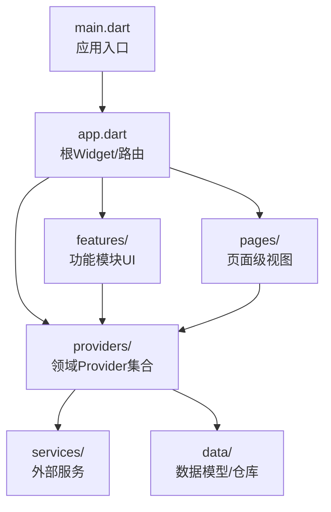
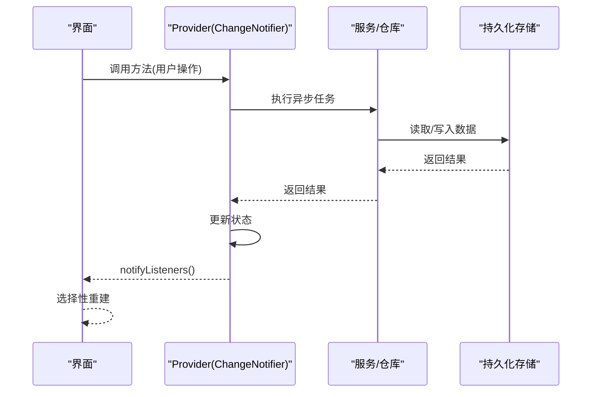
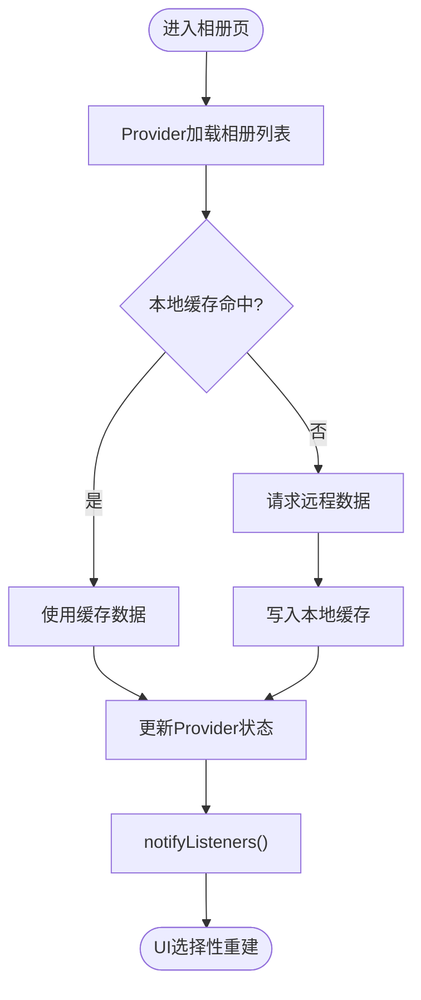
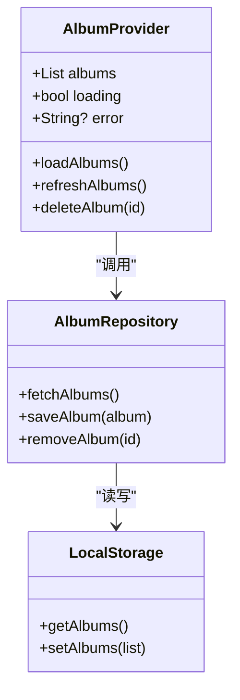
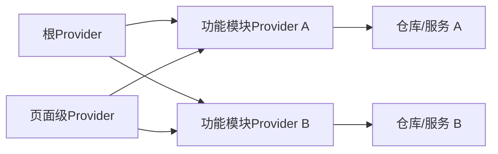

# Provider状态管理架构

<cite>
**本文档引用的文件**   
- [main.dart](file://lib/main.dart)
- [app.dart](file://lib/app.dart)
- [providers/](file://lib/providers/)
- [features/](file://lib/features/)
- [pages/](file://lib/pages/)
- [services/](file://lib/services/)
- [data/](file://lib/data/)
- [pubspec.yaml](file://pubspec.yaml)
</cite>

## 目录
1. [简介](#简介)
2. [项目结构](#项目结构)
3. [核心组件](#核心组件)
4. [架构总览](#架构总览)
5. [详细组件分析](#详细组件分析)
6. [依赖关系分析](#依赖关系分析)
7. [性能考虑](#性能考虑)
8. [故障排查指南](#故障排查指南)
9. [结论](#结论)
10. [附录](#附录)

## 简介
本文件面向Flutter照片整理AI应用，系统化阐述基于Provider的状态管理架构。内容涵盖：
- Provider模式核心理念与关键组件（ChangeNotifier、Consumer、Provider）
- 状态提升策略（全局状态、局部状态、临时状态）
- 数据流控制机制（单向数据流、异步状态更新、状态持久化）
- Provider层次结构设计（根Provider、功能模块Provider、页面级Provider）
- 状态管理与数据同步流程图
- 性能优化建议（选择性重建、懒加载、内存管理）

## 项目结构
本项目采用分层组织方式，将状态管理与业务逻辑解耦：
- lib/main.dart：应用入口，负责初始化Provider与主题等全局配置
- lib/app.dart：应用根Widget，提供路由与顶层布局
- lib/providers：按领域或功能划分的Provider实现（如相册、标签、用户设置等）
- lib/features：按功能域聚合的UI与交互逻辑，消费对应Provider
- lib/pages：页面级视图，通常仅持有少量局部状态
- lib/services：外部服务封装（网络、存储、AI推理等），被Provider调用
- lib/data：数据模型、仓库与本地缓存
- pubspec.yaml：依赖声明（包含provider等包）

图表来源
- [main.dart](file://lib/main.dart)
- [app.dart](file://lib/app.dart)
- [providers/](file://lib/providers/)
- [features/](file://lib/features/)
- [pages/](file://lib/pages/)
- [services/](file://lib/services/)
- [data/](file://lib/data/)

章节来源
- [main.dart](file://lib/main.dart)
- [app.dart](file://lib/app.dart)
- [pubspec.yaml](file://pubspec.yaml)

## 核心组件
- ChangeNotifier：状态载体，暴露可观察的数据与方法；通过notifyListeners触发重建
- ChangeNotifierProvider：将ChangeNotifier实例注入到Widget树中
- Consumer：以函数式方式订阅特定Provider，按需重建最小Widget子树
- Provider.of / context.read / context.watch：获取与监听Provider的不同方式
- MultiProvider / ProxyProvider：组合多个Provider与派生状态

使用要点
- 将“可变状态”放入ChangeNotifier子类，保持纯数据与行为分离
- 在需要读取且可能变化的位置使用Consumer或context.watch，避免不必要的重建
- 对只读场景使用context.read减少监听开销
- 通过MultiProvider集中注册根级Provider，ProxyProvider用于派生计算

章节来源
- [pubspec.yaml](file://pubspec.yaml)

## 架构总览
Provider层次设计遵循“自上而下”的依赖与可见性原则：
- 根Provider：跨应用的全局配置（主题、语言、用户登录态、全局错误处理）
- 功能模块Provider：按业务域划分（相册、标签、搜索、AI分类结果、任务队列）
- 页面级Provider：页面内短期状态（表单输入、分页游标、筛选条件）

数据流与控制流
- 单向数据流：UI事件 -> Provider方法 -> 状态变更 -> notifyListeners -> UI重建
- 异步更新：在Provider内部发起异步操作，更新状态并通知监听者
- 持久化：通过Repository/Service层读写本地存储，Provider负责协调与状态同步

图表来源
- [providers/](file://lib/providers/)
- [services/](file://lib/services/)
- [data/](file://lib/data/)

章节来源
- [providers/](file://lib/providers/)
- [services/](file://lib/services/)
- [data/](file://lib/data/)

## 详细组件分析

### 根Provider（应用级）
职责
- 应用主题、语言、国际化、用户会话、全局错误与日志
- 提供跨页面共享的配置与权限信息

组织方式
- 在app.dart中使用MultiProvider集中注册
- 通过ProxyProvider派生计算属性（例如根据用户角色决定功能开关）

最佳实践
- 根Provider尽量轻量，避免承载大量业务状态
- 对外暴露稳定的API，隐藏内部实现细节

章节来源
- [app.dart](file://lib/app.dart)
- [providers/](file://lib/providers/)

### 功能模块Provider（领域级）
职责
- 管理某一业务域的完整状态与生命周期（如相册列表、标签体系、AI分类结果、任务队列）
- 协调数据源（网络、本地缓存、AI服务）并保证一致性

典型结构
- 状态字段：列表、分页、筛选、排序、错误、加载状态
- 方法：增删改查、批量操作、刷新、重试
- 副作用：网络请求、本地缓存、事件总线

示例流程（以相册为例）

图表来源
- [providers/](file://lib/providers/)
- [services/](file://lib/services/)
- [data/](file://lib/data/)

章节来源
- [providers/](file://lib/providers/)
- [services/](file://lib/services/)
- [data/](file://lib/data/)

### 页面级Provider（局部状态）
职责
- 管理页面内的短期状态（表单、筛选器、分页游标、预览选择）
- 与功能模块Provider协作，必要时触发全局状态变更

组织方式
- 使用ChangeNotifierProvider.value包裹页面Widget树
- 通过Consumer精确订阅所需字段，避免整页重建

章节来源
- [pages/](file://lib/pages/)
- [providers/](file://lib/providers/)

### 数据流与持久化
- 单向数据流：所有状态变更必须通过Provider的方法进行，禁止直接修改状态字段
- 异步更新：在Provider中统一处理Future/Stream，确保UI始终反映最新一致状态
- 持久化：通过Repository/Service抽象数据源，Provider仅负责状态与调度

图表来源
- [providers/](file://lib/providers/)
- [services/](file://lib/services/)
- [data/](file://lib/data/)

章节来源
- [providers/](file://lib/providers/)
- [services/](file://lib/services/)
- [data/](file://lib/data/)

## 依赖关系分析
- 根Provider依赖：主题、国际化、用户会话、错误处理
- 功能模块Provider依赖：仓库/服务、本地缓存、事件总线
- 页面级Provider依赖：功能模块Provider、表单校验工具

图表来源
- [providers/](file://lib/providers/)
- [services/](file://lib/services/)
- [data/](file://lib/data/)

章节来源
- [providers/](file://lib/providers/)
- [services/](file://lib/services/)
- [data/](file://lib/data/)

## 性能考虑
- 选择性重建
  - 使用Consumer精准订阅字段，避免整树重建
  - 使用context.read替代context.watch，当不需要监听时
- 懒加载
  - 延迟创建Provider实例（如LazyProxyProvider）
  - 按需加载大型数据（分页、虚拟列表）
- 不可变数据与高效比较
  - 使用不可变数据结构，减少深层对象比较成本
  - 合理拆分状态，避免频繁notifyListeners导致的大范围重建
- 内存管理
  - 及时释放资源（取消未完成的网络请求、清理定时器）
  - 避免在Provider中持有大对象引用，必要时使用弱引用或缓存策略
- 异步更新
  - 合并多次状态更新，减少notifyListeners调用频率
  - 使用Stream/async*处理高频事件（如滚动、输入防抖）

章节来源
- [providers/](file://lib/providers/)
- [services/](file://lib/services/)

## 故障排查指南
常见问题与定位
- 状态不同步
  - 检查是否直接修改了状态字段而非通过Provider方法
  - 确认notifyListeners是否在状态变更后调用
- 过度重建
  - 使用Consumer缩小重建范围
  - 避免在build中执行昂贵计算
- 异步竞态
  - 为并发请求添加去重或取消机制
  - 使用统一的错误处理与重试策略
- 内存泄漏
  - 检查Provider生命周期，确保销毁时释放资源
  - 避免在Provider中持有Widget或Context引用

调试技巧
- 打印Provider状态变化与调用栈
- 使用DevTools的性能面板分析重建热点
- 为关键路径添加埋点与日志

章节来源
- [providers/](file://lib/providers/)
- [services/](file://lib/services/)

## 结论
通过清晰的Provider层次设计与严格的单向数据流，Flutter照片整理AI应用能够实现高内聚、低耦合的状态管理。结合选择性重建、懒加载与稳健的异步处理策略，可在保证用户体验的同时维持良好的性能与可维护性。建议在后续迭代中持续优化Provider粒度与数据流路径，确保系统可扩展性与稳定性。

## 附录
- 推荐实践清单
  - 将状态与UI解耦，使用ChangeNotifier承载状态
  - 在根层使用MultiProvider集中注册，功能域按模块拆分
  - 页面级状态尽量局部化，避免污染全局状态
  - 所有数据访问通过Repository/Service抽象，便于测试与替换
  - 对高频更新使用防抖/节流，降低重建压力
  - 使用不可变数据与合理的状态拆分，提高比较效率

章节来源
- [providers/](file://lib/providers/)
- [services/](file://lib/services/)
- [data/](file://lib/data/)