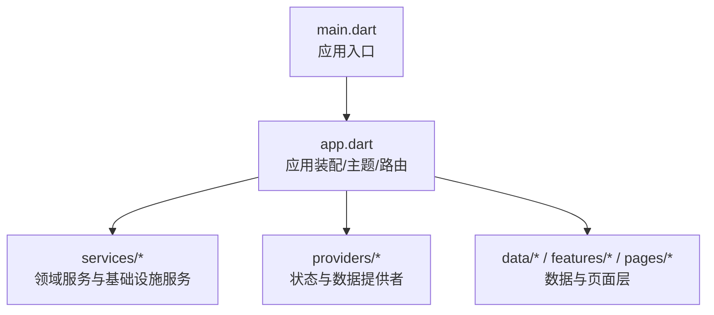
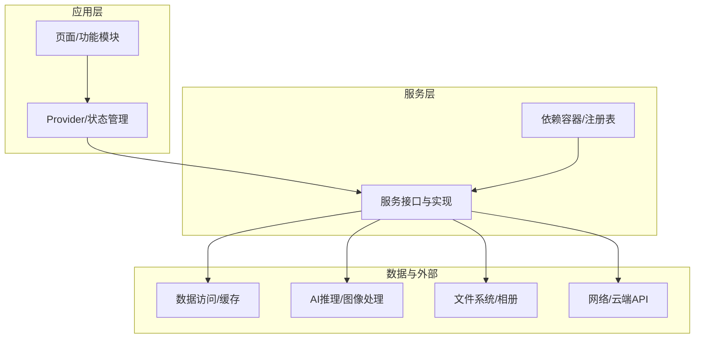
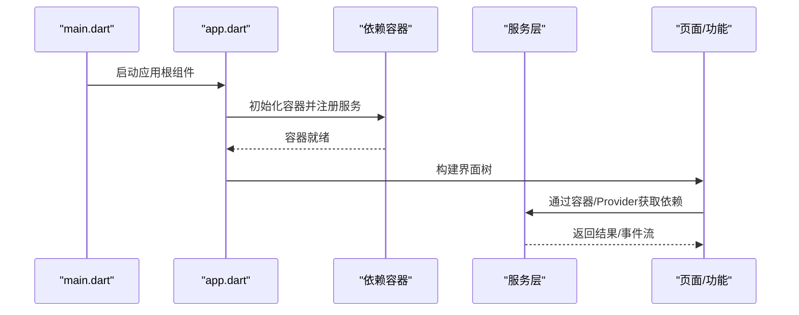
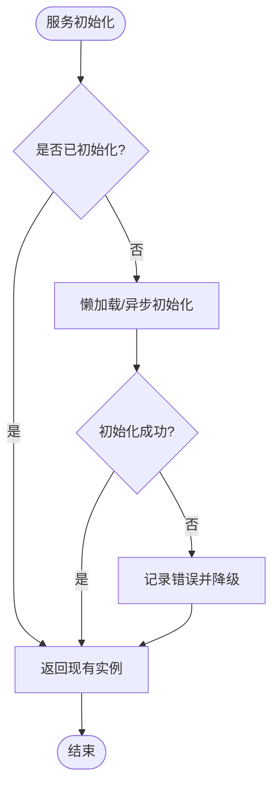
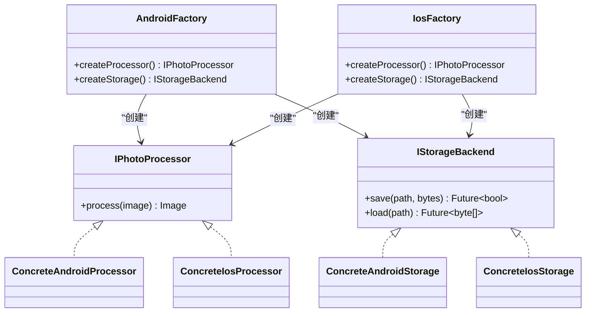
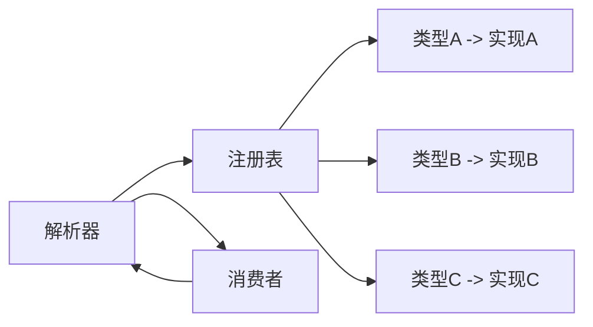
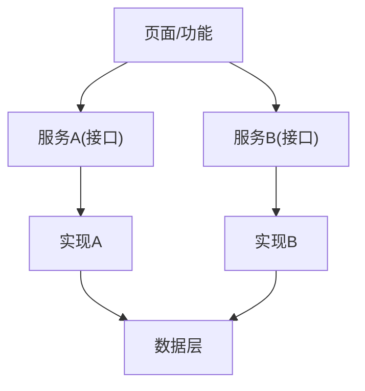

# 依赖注入模式

<cite>
**本文引用的文件**   
- [lib/main.dart](file://lib/main.dart)
- [lib/app.dart](file://lib/app.dart)
- [pubspec.yaml](file://pubspec.yaml)
</cite>

## 目录
1. [简介](#简介)
2. [项目结构](#项目结构)
3. [核心组件](#核心组件)
4. [架构总览](#架构总览)
5. [详细组件分析](#详细组件分析)
6. [依赖关系分析](#依赖关系分析)
7. [性能考虑](#性能考虑)
8. [故障排查指南](#故障排查指南)
9. [结论](#结论)
10. [附录](#附录)

## 简介
本文件面向Flutter照片整理AI应用，系统化阐述依赖注入（DI）的核心概念、设计优势与工程实践。重点覆盖：
- 松耦合、可测试性、可维护性的实现路径
- 手动DI、GetIt、Riverpod等方案的选型与配置建议
- 服务层单例的生命周期与线程安全
- 工厂与抽象工厂在对象创建中的应用
- 依赖关系图与服务注册表设计
- 最佳实践：避免循环依赖、条件注入、动态依赖解析

## 项目结构
当前仓库为Flutter多平台脚手架，Dart源码位于 lib 目录，包含入口 main.dart 与应用装配 app.dart，以及 data、features、pages、providers、services 等分层目录。依赖注入的落地通常集中在：
- 应用启动阶段：初始化容器/Provider、注册服务
- 服务层：定义接口与实现，管理生命周期
- 业务层：通过构造器或Provider获取依赖
- 测试层：使用测试替身替换真实依赖

图表来源 
- [lib/main.dart](file://lib/main.dart)
- [lib/app.dart](file://lib/app.dart)

章节来源
- [lib/main.dart](file://lib/main.dart)
- [lib/app.dart](file://lib/app.dart)

## 核心组件
- 应用入口与装配
  - 入口负责启动Flutter引擎并挂载应用根组件
  - 应用装配负责主题、路由、全局状态与依赖容器的初始化
- 服务层
  - 以接口抽象对外暴露能力，内部实现关注具体逻辑
  - 通过容器注册为单例或按需实例化
- 提供者（可选）
  - 若采用Riverpod，则通过Provider声明依赖与生命周期
- 数据与页面层
  - 仅持有对抽象接口的引用，不关心具体实现

章节来源
- [lib/main.dart](file://lib/main.dart)
- [lib/app.dart](file://lib/app.dart)

## 架构总览
下图展示基于依赖注入的典型分层与交互：入口启动后，应用装配完成容器初始化与依赖注册；页面与业务通过抽象接口消费服务；数据层与外部系统（如AI模型、文件系统、网络）由服务封装。

图表来源 
- [lib/app.dart](file://lib/app.dart)
- [pubspec.yaml](file://pubspec.yaml)

## 详细组件分析

### 应用入口与装配流程
- 入口职责
  - 启动Flutter引擎
  - 运行应用根组件
- 装配职责
  - 初始化依赖容器（手动DI或第三方容器）
  - 注册服务单例或作用域实例
  - 提供全局配置（主题、路由、国际化等）

图表来源 
- [lib/main.dart](file://lib/main.dart)
- [lib/app.dart](file://lib/app.dart)

章节来源
- [lib/main.dart](file://lib/main.dart)
- [lib/app.dart](file://lib/app.dart)

### 服务层与单例生命周期
- 单例适用场景
  - 跨模块共享的配置、日志、缓存、AI模型实例、设备信息
- 生命周期管理
  - 应用级单例：随应用进程存活
  - 作用域单例：按页面/会话生命周期
- 线程安全
  - 读写分离、不可变配置、锁保护共享资源
  - 异步初始化与懒加载，避免阻塞启动

图表来源 
- [lib/app.dart](file://lib/app.dart)

章节来源
- [lib/app.dart](file://lib/app.dart)

### 工厂与抽象工厂
- 工厂模式
  - 用于根据参数创建不同实现的服务或处理器（例如不同AI后端、不同图片格式转换器）
- 抽象工厂
  - 用于创建一组相关的产品族（例如“Android/iOS”平台特定的存储与相机服务）

图表来源 
- [lib/app.dart](file://lib/app.dart)

章节来源
- [lib/app.dart](file://lib/app.dart)

### 依赖容器与注册表设计
- 容器职责
  - 集中管理服务实例的创建、查找与销毁
  - 支持单例、作用域、工厂、条件注册
- 注册表设计
  - 类型到实现的映射
  - 初始化顺序与依赖解析
  - 调试与可视化（打印依赖树）

图表来源 
- [lib/app.dart](file://lib/app.dart)

章节来源
- [lib/app.dart](file://lib/app.dart)

### 方案选型与配置建议
- 手动DI
  - 优点：无额外依赖、透明可控、易于理解
  - 缺点：样板代码较多、大型项目易混乱
  - 适用：小型项目、快速原型、严格依赖控制
- GetIt
  - 优点：轻量、易用、支持单例与作用域
  - 缺点：运行时查找、缺少编译期检查
  - 适用：中大型Flutter项目、需要灵活注册
- Riverpod
  - 优点：类型安全、组合式、与Flutter生态集成好
  - 缺点：学习曲线、需重构部分代码
  - 适用：复杂状态管理与依赖组合

章节来源
- [pubspec.yaml](file://pubspec.yaml)

## 依赖关系分析
- 解耦原则
  - 上层只依赖抽象接口，不依赖具体实现
  - 通过容器/Provider注入具体实现
- 循环依赖规避
  - 引入中间抽象或服务编排器
  - 延迟加载与懒解析
- 条件注入与动态解析
  - 基于环境/平台/用户偏好选择实现
  - 运行时切换策略（如AI后端、存储后端）

图表来源 
- [lib/app.dart](file://lib/app.dart)

章节来源
- [lib/app.dart](file://lib/app.dart)

## 性能考虑
- 启动优化
  - 懒加载重型服务（如AI模型）
  - 减少同步初始化，拆分异步任务
- 内存与生命周期
  - 及时释放一次性资源
  - 避免长生命周期持有大对象
- 并发与线程安全
  - 读多写少场景使用不可变数据结构
  - 关键临界区加锁或使用原子操作

## 故障排查指南
- 常见问题
  - 未注册依赖导致运行时找不到实例
  - 循环依赖导致初始化卡死或崩溃
  - 单例过早初始化引发冷启动卡顿
- 定位方法
  - 打印依赖树与注册清单
  - 增加初始化日志与异常堆栈
  - 使用最小复现用例隔离问题
- 修复建议
  - 统一注册入口，避免分散注册
  - 引入服务编排器解耦初始化顺序
  - 使用条件注册与环境变量控制

## 结论
依赖注入是构建可维护、可测试、可扩展Flutter应用的关键。结合手动DI、GetIt或Riverpod，可以在不同规模项目中取得平衡。通过明确的服务边界、合理的生命周期与线程安全策略，以及工厂与抽象工厂的组织方式，可以显著提升代码质量与开发效率。

## 附录
- 最佳实践清单
  - 始终面向接口编程
  - 将容器初始化放在应用装配阶段
  - 使用作用域管理短期依赖
  - 用工厂/抽象工厂处理多实现与平台差异
  - 通过环境变量与配置中心进行条件注入
  - 建立依赖图可视化与单元测试中的替身替换机制