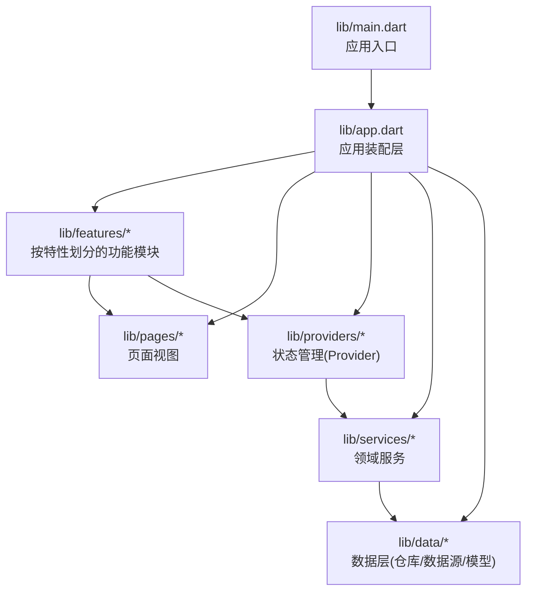
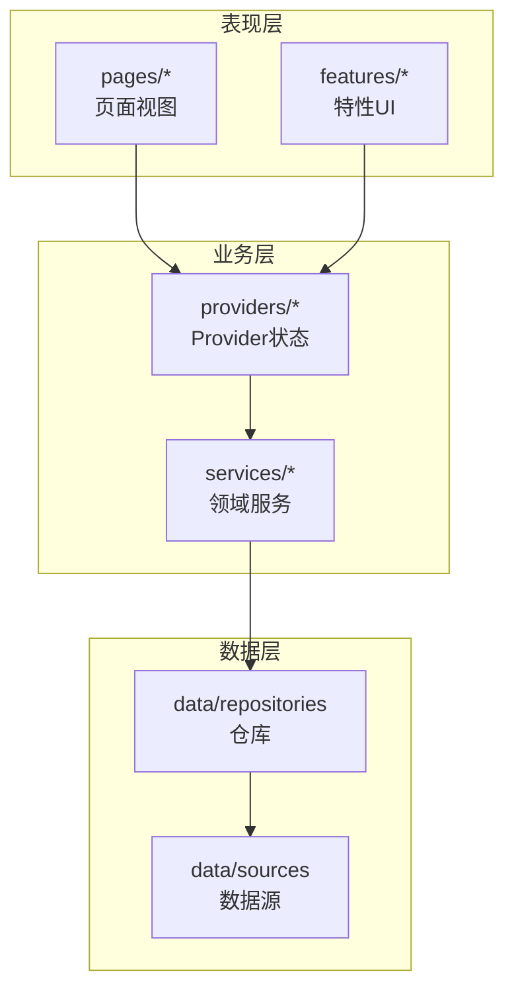
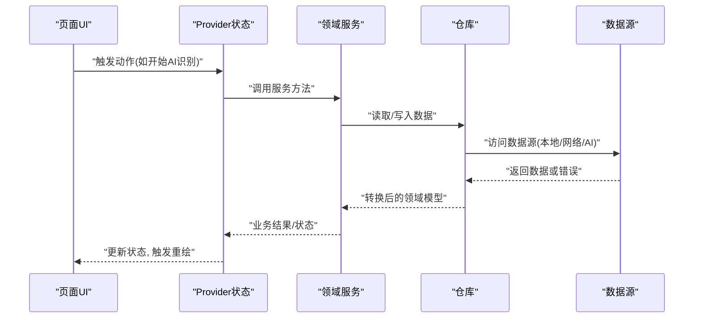
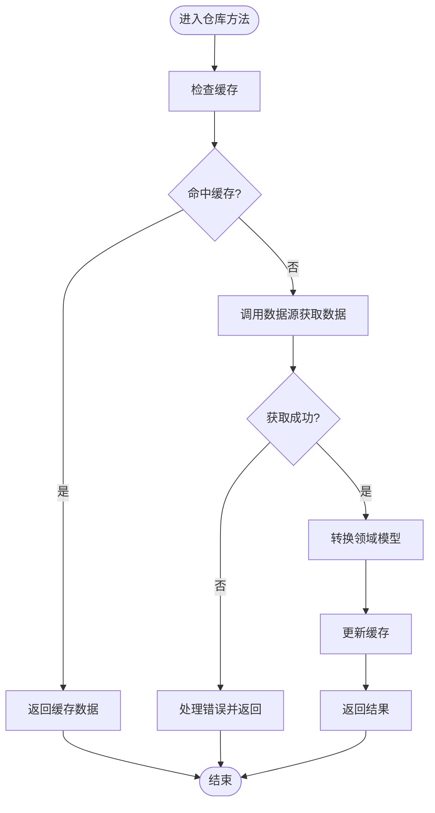
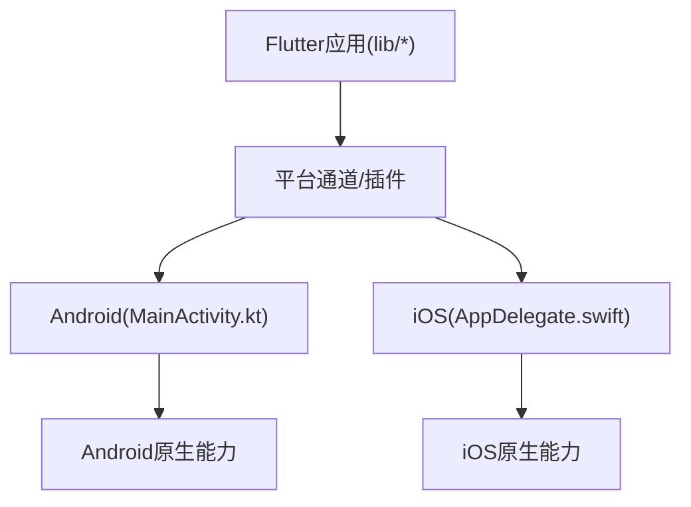
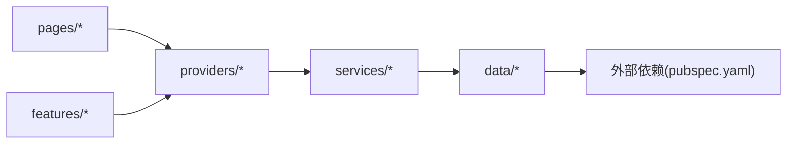

# 架构设计

<cite>
**本文档引用的文件**   
- [main.dart](file://lib/main.dart)
- [app.dart](file://lib/app.dart)
- [pubspec.yaml](file://pubspec.yaml)
- [MainActivity.kt](file://android/app/src/main/kotlin/com/example/photo_organizer_ai/MainActivity.kt)
- [AppDelegate.swift](file://ios/Runner/AppDelegate.swift)
</cite>

## 目录
1. [简介](#简介)
2. [项目结构](#项目结构)
3. [核心组件](#核心组件)
4. [架构总览](#架构总览)
5. [详细组件分析](#详细组件分析)
6. [依赖分析](#依赖分析)
7. [性能考虑](#性能考虑)
8. [故障排查指南](#故障排查指南)
9. [结论](#结论)
10. [附录](#附录)

## 简介
本文件为Flutter照片整理AI应用的架构设计文档，围绕Clean Architecture的分层理念、Provider状态管理、模块化组织、依赖注入与单例模式的使用场景进行系统化阐述。文档同时给出架构图与数据流向图，帮助读者理解表现层、业务层、数据层的职责边界与交互关系，并说明跨平台适配的架构考量与平台特定代码的处理方式。

## 项目结构
项目采用Flutter标准工程结构，并在lib目录下按功能域与层次进行划分：
- lib/main.dart：应用入口，负责初始化全局配置、依赖注入容器、主题与路由等。
- lib/app.dart：应用装配层，组合根（Root）定义页面、Provider、服务与路由。
- lib/features：按业务特性划分的模块目录，每个特性包含自身的UI、状态、服务与数据实现。
- lib/pages：页面级视图组件，通常由Provider驱动渲染。
- lib/providers：基于Provider的状态管理类，封装状态提升与数据流控制。
- lib/services：领域服务与外部能力抽象（如AI识别、图片处理、存储访问）。
- lib/data：数据层，包含数据源、仓库、模型与序列化逻辑。

图表来源
- [main.dart:1-200](file://lib/main.dart#L1-L200)
- [app.dart:1-200](file://lib/app.dart#L1-L200)

章节来源
- [main.dart:1-200](file://lib/main.dart#L1-L200)
- [app.dart:1-200](file://lib/app.dart#L1-L200)
- [pubspec.yaml:1-200](file://pubspec.yaml#L1-L200)

## 核心组件
- 应用入口与装配
  - main.dart负责启动应用、初始化全局依赖、设置主题与路由，并将Provider与服务注册到应用生命周期中。
  - app.dart作为组合根，集中声明页面、Provider、服务与路由，确保依赖注入顺序正确。
- Provider状态管理
  - providers目录下的类通过ChangeNotifier或StatefulWidget的Provider扩展，提供状态提升与数据流控制。
  - 页面通过Consumer或Selector订阅状态变化，实现单向数据流与最小化重绘。
- 服务与数据层
  - services目录暴露领域服务接口，屏蔽平台差异与第三方SDK细节。
  - data目录实现仓库与数据源，统一数据访问策略（本地缓存、网络请求、AI推理结果持久化）。

章节来源
- [main.dart:1-200](file://lib/main.dart#L1-L200)
- [app.dart:1-200](file://lib/app.dart#L1-L200)

## 架构总览
Clean Architecture在本项目中体现为三层分离：
- 表现层（UI）：pages与features中的视图组件，仅负责展示与用户交互，不直接访问数据。
- 业务层（Domain）：services与providers，封装业务规则、状态管理与编排调用。
- 数据层（Data）：data目录下的仓库与数据源，负责数据获取、转换与持久化。

图表来源
- [app.dart:1-200](file://lib/app.dart#L1-L200)
- [main.dart:1-200](file://lib/main.dart#L1-L200)

## 详细组件分析

### 表现层（pages与features）
- 职责
  - 接收用户输入，触发Provider方法；根据Provider状态渲染界面。
  - features内可按业务特性拆分页面与交互流程，保持高内聚低耦合。
- 数据流
  - 单向数据流：用户操作 → Provider状态更新 → UI重建。
  - 使用Consumer/Selector精确订阅，避免不必要的重建。
- 最佳实践
  - 页面不包含业务逻辑，仅做展示与事件转发。
  - 复杂表单或长列表使用分页与懒加载，结合Provider状态分片更新。

章节来源
- [app.dart:1-200](file://lib/app.dart#L1-L200)

### 业务层（providers与services）
- Provider状态管理
  - 将状态提升到Provider，统一管理相册扫描、分类、标签、AI识别任务队列等。
  - 通过异步方法处理耗时任务，使用Stream或Future向UI反馈进度与结果。
- 领域服务
  - 对外暴露清晰接口，内部协调多个数据源与第三方能力（如AI推理、图像压缩）。
  - 支持可插拔的数据源实现，便于单元测试与Mock。
- 错误处理
  - 在Provider层捕获异常并转换为UI友好的状态（加载中、失败、重试）。
  - 服务层记录关键日志与指标，便于问题定位。

图表来源
- [app.dart:1-200](file://lib/app.dart#L1-L200)
- [main.dart:1-200](file://lib/main.dart#L1-L200)

章节来源
- [app.dart:1-200](file://lib/app.dart#L1-L200)
- [main.dart:1-200](file://lib/main.dart#L1-L200)

### 数据层（repositories与sources）
- 仓库（Repositories）
  - 聚合多个数据源，提供统一的领域接口给上层使用。
  - 处理缓存策略、重试机制、数据一致性。
- 数据源（Sources）
  - 本地存储（SQLite/SharedPreferences）、网络请求、AI推理服务。
  - 对平台差异进行封装，向上层暴露一致的API。
- 模型与序列化
  - 定义清晰的领域模型，与外部DTO之间进行映射转换。

图表来源
- [app.dart:1-200](file://lib/app.dart#L1-L200)

章节来源
- [app.dart:1-200](file://lib/app.dart#L1-L200)

### 依赖注入与单例模式
- 依赖注入
  - 在app.dart中集中注册Provider与服务实例，确保生命周期一致。
  - 使用工厂或单例模式创建不可变配置对象，避免重复初始化。
- 单例模式
  - 适用于全局配置、日志器、AI引擎初始化等需要唯一实例的场景。
  - 注意线程安全与延迟初始化，避免启动阻塞。

章节来源
- [app.dart:1-200](file://lib/app.dart#L1-L200)

### 跨平台适配
- Android与iOS平台特定代码
  - MainActivity.kt与AppDelegate.swift负责平台初始化与插件注册。
  - Flutter侧通过Platform Channel或插件封装平台能力，保持业务层无关性。
- 适配策略
  - 在services层抽象平台差异，向下调用平台通道或原生库。
  - 针对权限、存储路径、相机与相册访问进行差异化处理。

图表来源
- [MainActivity.kt:1-200](file://android/app/src/main/kotlin/com/example/photo_organizer_ai/MainActivity.kt#L1-L200)
- [AppDelegate.swift:1-200](file://ios/Runner/AppDelegate.swift#L1-L200)

章节来源
- [MainActivity.kt:1-200](file://android/app/src/main/kotlin/com/example/photo_organizer_ai/MainActivity.kt#L1-L200)
- [AppDelegate.swift:1-200](file://ios/Runner/AppDelegate.swift#L1-L200)

## 依赖分析
- 模块间依赖方向
  - 表现层依赖业务层（Provider/Service），不直接依赖数据层。
  - 业务层依赖数据层接口，通过仓库抽象解耦具体实现。
- 外部依赖
  - pubspec.yaml声明Flutter插件与第三方库，按需引入以减少包体积。
- 潜在循环依赖
  - 通过接口隔离与依赖倒置原则避免循环引用。

图表来源
- [pubspec.yaml:1-200](file://pubspec.yaml#L1-L200)
- [app.dart:1-200](file://lib/app.dart#L1-L200)

章节来源
- [pubspec.yaml:1-200](file://pubspec.yaml#L1-L200)
- [app.dart:1-200](file://lib/app.dart#L1-L200)

## 性能考虑
- 状态更新粒度
  - 使用Selector精准订阅，减少无用重建。
  - 大列表采用分页与虚拟滚动，结合Provider状态分片。
- 异步与并发
  - 将耗时任务放入后台执行，避免阻塞UI线程。
  - 合理设置超时与重试策略，提升用户体验。
- 资源管理
  - 及时释放图片内存与AI模型资源，避免内存泄漏。
  - 缓存热点数据，降低重复计算与IO开销。

## 故障排查指南
- 常见问题
  - 状态未更新：检查Provider是否正确通知监听者，是否使用了正确的选择器。
  - 数据不一致：确认仓库缓存策略与数据源一致性校验。
  - 平台权限：检查Android/iOS权限申请与运行时授权流程。
- 调试建议
  - 在Provider层打印关键状态变更日志。
  - 使用DevTools监控Widget树与内存占用。
  - 针对平台问题，查看原生日志与崩溃堆栈。

## 结论
本项目以Clean Architecture为核心，结合Provider状态管理与模块化组织，实现了清晰的分层与良好的可扩展性。通过依赖注入与单例模式，提升了代码的可维护性与测试友好度。跨平台适配在业务层进行抽象，保证了Flutter侧的统一体验。建议在后续迭代中持续优化状态更新粒度与资源管理，进一步提升性能与稳定性。

## 附录
- 术语表
  - Clean Architecture：分层架构思想，强调关注点分离与依赖倒置。
  - Provider：Flutter状态管理方案，支持状态提升与数据流控制。
  - 仓库模式：聚合数据源，提供统一接口给上层使用。
- 参考文件
  - [main.dart](file://lib/main.dart)
  - [app.dart](file://lib/app.dart)
  - [pubspec.yaml](file://pubspec.yaml)
  - [MainActivity.kt](file://android/app/src/main/kotlin/com/example/photo_organizer_ai/MainActivity.kt)
  - [AppDelegate.swift](file://ios/Runner/AppDelegate.swift)