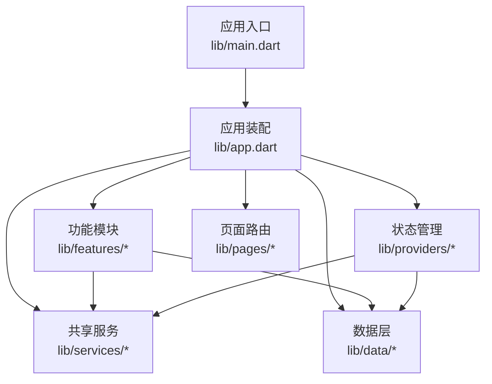
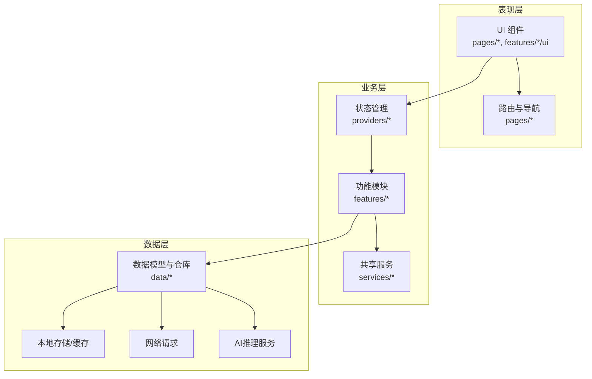
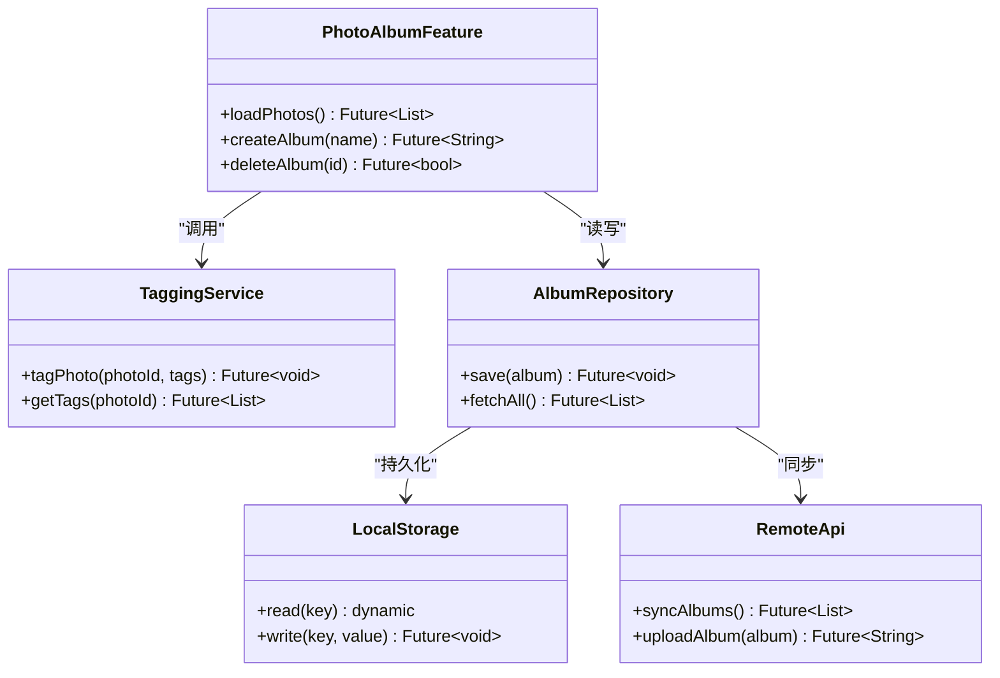
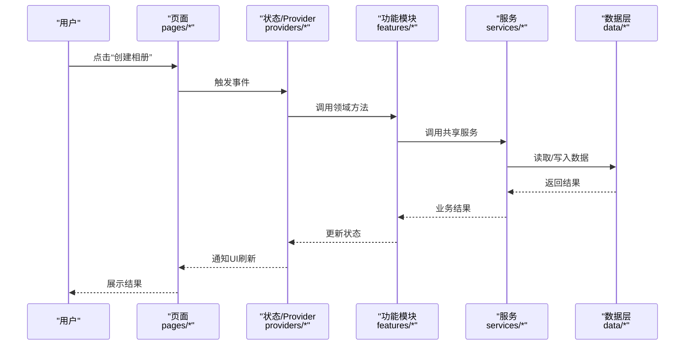
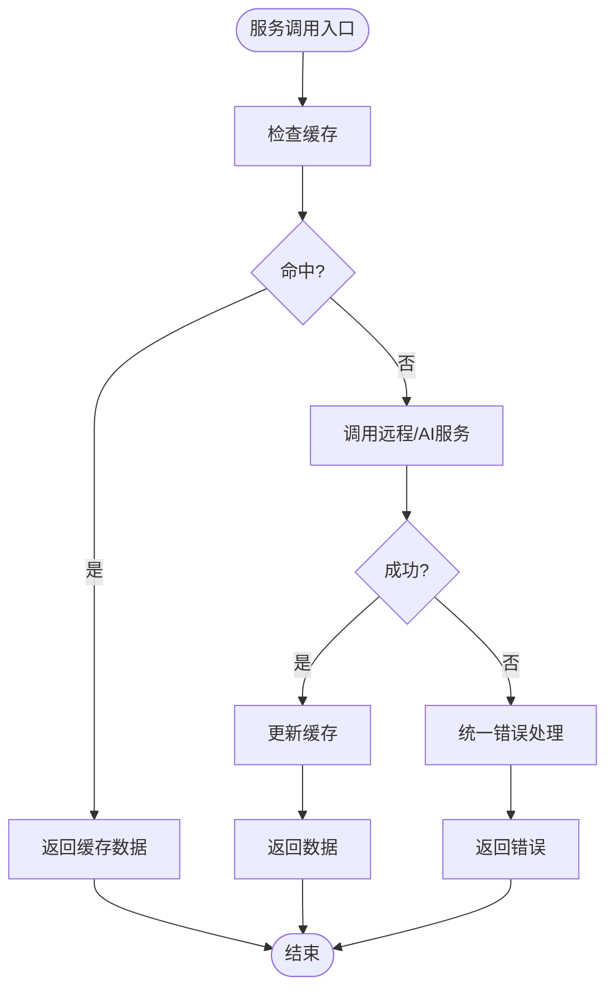
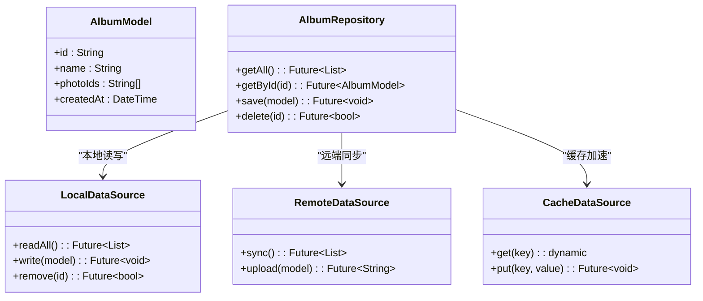
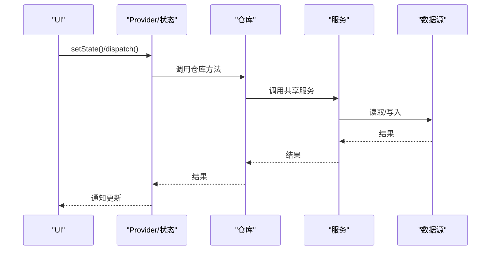
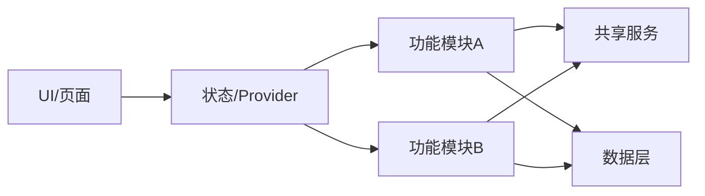
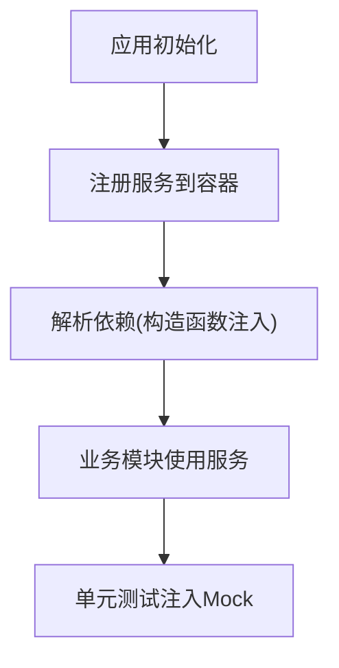

# 模块化设计原则

<cite>
**本文档引用的文件**   
- [main.dart](file://lib/main.dart)
- [app.dart](file://lib/app.dart)
- [pubspec.yaml](file://pubspec.yaml)
</cite>

## 目录
1. [简介](#简介)
2. [项目结构](#项目结构)
3. [核心组件](#核心组件)
4. [架构总览](#架构总览)
5. [详细组件分析](#详细组件分析)
6. [依赖分析](#依赖分析)
7. [性能考虑](#性能考虑)
8. [故障排查指南](#故障排查指南)
9. [结论](#结论)
10. [附录](#附录)

## 简介
本文件面向Flutter照片整理AI应用，提供一套可落地的模块化设计原则与实施指南。重点包括：
- 按功能模块组织代码的策略（features目录的功能隔离与依赖管理）
- pages、services、data等目录的职责划分与模块间通信机制
- 模块接口定义规范（公共API暴露与内部实现隐藏）
- 依赖注入的实现方式（服务定位器模式与构造函数注入）
- 模块依赖图与接口契约定义
- 模块扩展指南（新增功能模块不影响现有代码）
- 模块测试策略与Mock对象使用

## 项目结构
当前仓库采用分层+分层的混合组织方式，核心目录职责如下：
- lib/main.dart：应用入口，负责初始化依赖、启动根Widget
- lib/app.dart：应用配置与路由/主题等全局装配
- features：按业务域划分的功能模块（如相册、标签、AI识别等），每个子模块应自包含UI、状态、数据访问与服务调用
- services：跨模块共享的服务（网络、存储、AI推理、日志等）
- data：数据层（模型、仓库、数据源、序列化等）
- providers：状态管理与Provider相关装配（可选，视具体实现）
- pages：页面级路由与导航（若未完全下沉到features，则保留此目录作为路由入口）

图表来源
- [main.dart:1-200](file://lib/main.dart#L1-L200)
- [app.dart:1-200](file://lib/app.dart#L1-L200)

章节来源
- [main.dart:1-200](file://lib/main.dart#L1-L200)
- [app.dart:1-200](file://lib/app.dart#L1-L200)

## 核心组件
- 应用入口 main.dart
  - 职责：初始化全局依赖（如日志、国际化、网络、存储服务）、启动根Widget
  - 关键点：避免在入口中承载业务逻辑；仅做装配与启动
- 应用装配 app.dart
  - 职责：主题、路由、全局状态、依赖注册（服务定位器或Provider）
  - 关键点：对外暴露稳定的AppConfig/Router/ServiceProvider等接口

章节来源
- [main.dart:1-200](file://lib/main.dart#L1-L200)
- [app.dart:1-200](file://lib/app.dart#L1-L200)

## 架构总览
整体遵循“表现层—业务层—数据层”的清晰分层，并通过features进行功能域隔离。各层之间通过明确的接口契约通信，禁止跨层直接耦合。

图表来源
- [main.dart:1-200](file://lib/main.dart#L1-L200)
- [app.dart:1-200](file://lib/app.dart#L1-L200)

## 详细组件分析

### 功能模块（features）
- 目标：按业务域隔离代码，确保高内聚、低耦合
- 建议结构（每个feature一个子目录）：
  - ui：页面、组件、样式
  - state：状态类、事件处理
  - repository：领域仓库，聚合数据源
  - service：领域服务（可复用业务逻辑）
  - model：领域模型
  - data：数据源（本地/远程/缓存）
- 依赖规则：
  - 只能依赖services与data，不能反向依赖
  - 对外只暴露接口（抽象类或协议），内部实现私有化

图表来源
- [app.dart:1-200](file://lib/app.dart#L1-L200)

章节来源
- [app.dart:1-200](file://lib/app.dart#L1-L200)

### 页面层（pages）
- 职责：路由定义、页面组装、参数传递与生命周期管理
- 与features的关系：仅持有路由与导航逻辑，不承载业务；页面通过Provider/StatefulWidget调用features中的状态或服务

图表来源
- [main.dart:1-200](file://lib/main.dart#L1-L200)
- [app.dart:1-200](file://lib/app.dart#L1-L200)

章节来源
- [main.dart:1-200](file://lib/main.dart#L1-L200)
- [app.dart:1-200](file://lib/app.dart#L1-L200)

### 服务层（services）
- 职责：跨模块共享能力（网络、存储、AI推理、日志、配置等）
- 设计要点：
  - 以接口形式暴露能力，便于替换与Mock
  - 单例或依赖注入获取实例
  - 错误统一封装与重试策略

图表来源
- [app.dart:1-200](file://lib/app.dart#L1-L200)

章节来源
- [app.dart:1-200](file://lib/app.dart#L1-L200)

### 数据层（data）
- 职责：数据模型、仓库、数据源（本地/远程/缓存）、序列化
- 设计要点：
  - 仓库聚合多个数据源，向上提供统一的领域接口
  - 数据源对上层透明，支持热插拔（如切换SQLite与云存储）
  - 错误与异常标准化

图表来源
- [app.dart:1-200](file://lib/app.dart#L1-L200)

章节来源
- [app.dart:1-200](file://lib/app.dart#L1-L200)

### 状态管理（providers）
- 职责：将业务状态与UI解耦，提供响应式更新
- 设计要点：
  - 按feature拆分状态类，避免全局大状态
  - 通过构造函数注入服务与仓库，便于测试

图表来源
- [main.dart:1-200](file://lib/main.dart#L1-L200)
- [app.dart:1-200](file://lib/app.dart#L1-L200)

章节来源
- [main.dart:1-200](file://lib/main.dart#L1-L200)
- [app.dart:1-200](file://lib/app.dart#L1-L200)

## 依赖分析
- 依赖方向：UI → 状态 → 功能模块 → 服务/数据层
- 禁止反向依赖：数据层不应依赖业务层或UI
- 模块边界：features之间通过服务或事件总线通信，避免直接互相引用

图表来源
- [main.dart:1-200](file://lib/main.dart#L1-L200)
- [app.dart:1-200](file://lib/app.dart#L1-L200)

章节来源
- [main.dart:1-200](file://lib/main.dart#L1-L200)
- [app.dart:1-200](file://lib/app.dart#L1-L200)

## 性能考虑
- 懒加载与按需加载：路由与模块按需加载，减少冷启动时间
- 缓存策略：热点数据优先从缓存读取，降低网络与IO压力
- 异步与并发：合理拆分任务，避免阻塞主线程；使用流式更新UI
- 资源管理：图片与媒体资源及时释放，避免内存泄漏
- 依赖注入优化：避免重复创建实例，使用单例或容器管理生命周期

[本节为通用指导，无需特定文件来源]

## 故障排查指南
- 常见问题
  - 循环依赖：检查模块间导入关系，必要时引入接口或事件总线
  - 服务未初始化：确认应用启动顺序与依赖注册时机
  - 状态不同步：检查Provider订阅与更新路径
  - 数据不一致：核对缓存与远端一致性策略
- 调试建议
  - 增加结构化日志与埋点
  - 使用断言与单元测试快速定位问题
  - 对关键路径编写集成测试

[本节为通用指导，无需特定文件来源]

## 结论
通过清晰的层次划分与功能域隔离，结合严格的接口契约与依赖注入，可实现高内聚、低耦合的可维护架构。遵循本指南可在不破坏现有代码的前提下持续扩展新功能，并提升测试覆盖率与系统稳定性。

[本节为总结性内容，无需特定文件来源]

## 附录

### 模块接口定义规范
- 对外暴露：以抽象类或接口定义公共API，明确输入输出与异常约定
- 内部实现：实现类放在模块内部，不对外暴露；通过工厂或容器注册
- 版本兼容：接口变更需保持向后兼容，废弃字段标记弃用说明

### 依赖注入实现方式
- 服务定位器模式：集中注册与获取服务，适合全局共享服务
- 构造函数注入：在类构造时传入依赖，利于测试与替换

图表来源
- [main.dart:1-200](file://lib/main.dart#L1-L200)
- [app.dart:1-200](file://lib/app.dart#L1-L200)

### 模块扩展指南（新增功能模块）
- 步骤
  1. 在features下新建模块目录，规划ui/state/repository/service/model/data
  2. 定义对外接口与领域服务，隐藏内部实现
  3. 在app中注册新服务与路由
  4. 在入口完成必要的初始化
  5. 编写单元与集成测试，覆盖关键路径
- 注意事项
  - 避免跨模块直接依赖，使用服务或事件通信
  - 保持接口稳定，变更需评估影响面

### 模块测试策略与Mock对象
- 单元测试：针对服务、仓库、状态类，使用Mock替代外部依赖
- 集成测试：验证模块间协作与数据流
- Mock策略：为服务与数据源定义接口，测试时注入Mock实现

章节来源
- [pubspec.yaml:1-200](file://pubspec.yaml#L1-L200)