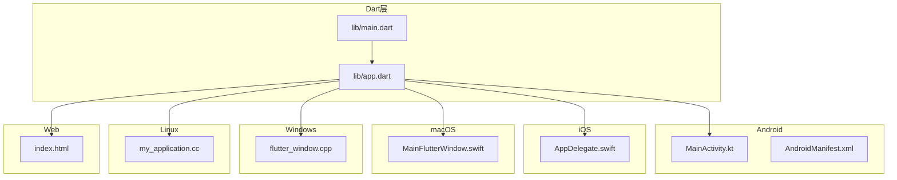
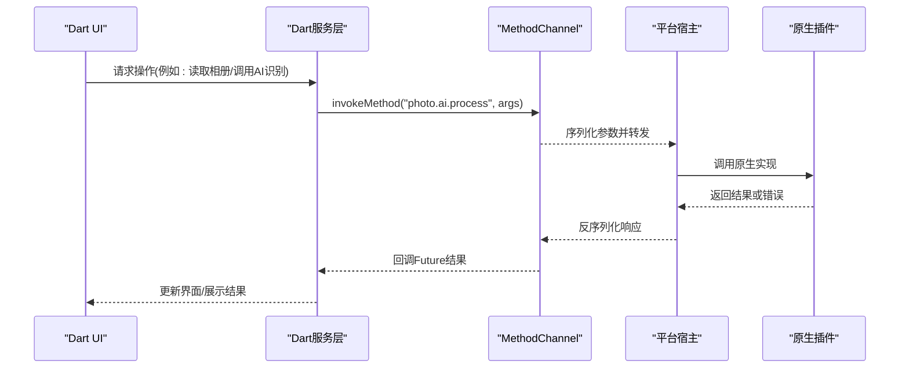
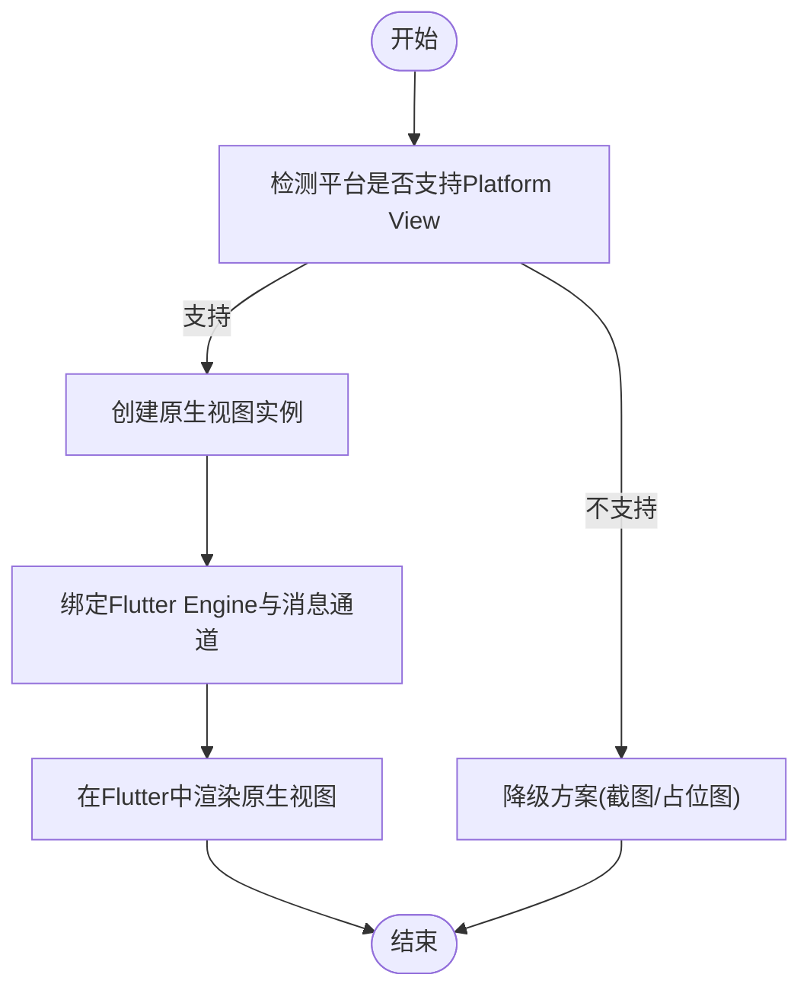
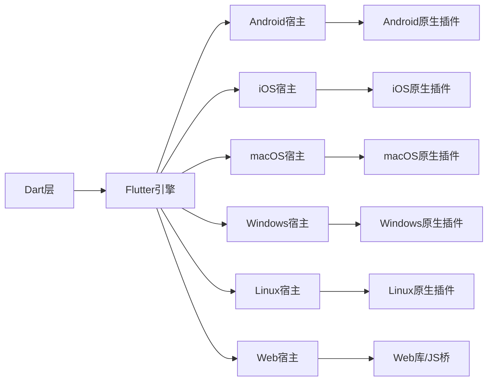

# 跨平台架构适配

<cite>
**本文引用的文件**   
- [lib/main.dart](file://lib/main.dart)
- [lib/app.dart](file://lib/app.dart)
- [android/app/src/main/kotlin/com/example/photo_organizer_ai/MainActivity.kt](file://android/app/src/main/kotlin/com/example/photo_organizer_ai/MainActivity.kt)
- [android/app/src/main/AndroidManifest.xml](file://android/app/src/main/AndroidManifest.xml)
- [ios/Runner/AppDelegate.swift](file://ios/Runner/AppDelegate.swift)
- [macos/Runner/MainFlutterWindow.swift](file://macos/Runner/MainFlutterWindow.swift)
- [windows/runner/flutter_window.cpp](file://windows/runner/flutter_window.cpp)
- [linux/runner/my_application.cc](file://linux/runner/my_application.cc)
- [web/index.html](file://web/index.html)
</cite>

## 目录
1. [简介](#简介)
2. [项目结构](#项目结构)
3. [核心组件](#核心组件)
4. [架构总览](#架构总览)
5. [详细组件分析](#详细组件分析)
6. [依赖关系分析](#依赖关系分析)
7. [性能考虑](#性能考虑)
8. [故障排查指南](#故障排查指南)
9. [结论](#结论)
10. [附录](#附录)

## 简介
本文件面向“Flutter照片整理AI应用”的跨平台架构适配，系统阐述Flutter在Android、iOS、macOS、Windows、Linux与Web上的运行原理与适配要点。重点覆盖：
- Flutter渲染与执行模型：Skia渲染引擎与Dart VM/编译器的作用边界
- 平台特定代码集成：Platform Channel、Method Channel、Platform View
- 条件编译与平台检测：kIsWeb、Platform.isAndroid等
- 原生插件开发流程：Android Kotlin/Java与iOS Swift/Objective-C集成
- 架构图与通信流程图
- 性能优化策略与内存管理
- 各平台限制与解决方案

## 项目结构
该Flutter工程采用标准多端模板结构，包含：
- lib：Dart业务与UI层（入口main.dart、应用配置app.dart）
- android/ios/macos/windows/linux/web：各平台宿主工程与启动入口
- pubspec.yaml：依赖与资源声明（未在本文件中直接引用）



图表来源
- [lib/main.dart](file://lib/main.dart)
- [lib/app.dart](file://lib/app.dart)
- [android/app/src/main/kotlin/com/example/photo_organizer_ai/MainActivity.kt](file://android/app/src/main/kotlin/com/example/photo_organizer_ai/MainActivity.kt)
- [android/app/src/main/AndroidManifest.xml](file://android/app/src/main/AndroidManifest.xml)
- [ios/Runner/AppDelegate.swift](file://ios/Runner/AppDelegate.swift)
- [macos/Runner/MainFlutterWindow.swift](file://macos/Runner/MainFlutterWindow.swift)
- [windows/runner/flutter_window.cpp](file://windows/runner/flutter_window.cpp)
- [linux/runner/my_application.cc](file://linux/runner/my_application.cc)
- [web/index.html](file://web/index.html)

章节来源
- [lib/main.dart](file://lib/main.dart)
- [lib/app.dart](file://lib/app.dart)
- [android/app/src/main/kotlin/com/example/photo_organizer_ai/MainActivity.kt](file://android/app/src/main/kotlin/com/example/photo_organizer_ai/MainActivity.kt)
- [android/app/src/main/AndroidManifest.xml](file://android/app/src/main/AndroidManifest.xml)
- [ios/Runner/AppDelegate.swift](file://ios/Runner/AppDelegate.swift)
- [macos/Runner/MainFlutterWindow.swift](file://macos/Runner/MainFlutterWindow.swift)
- [windows/runner/flutter_window.cpp](file://windows/runner/flutter_window.cpp)
- [linux/runner/my_application.cc](file://linux/runner/my_application.cc)
- [web/index.html](file://web/index.html)

## 核心组件
- Dart应用入口与初始化：负责构建应用、注册路由、主题与全局状态，并在不同平台上触发对应的宿主初始化逻辑
- 平台宿主窗口：各平台的窗口创建与Flutter Engine生命周期管理
- 平台通道：用于Dart与原生之间的方法调用与事件传递
- 平台视图：将原生控件嵌入Flutter UI中（如相机预览、地图等）

章节来源
- [lib/main.dart](file://lib/main.dart)
- [lib/app.dart](file://lib/app.dart)
- [android/app/src/main/kotlin/com/example/photo_organizer_ai/MainActivity.kt](file://android/app/src/main/kotlin/com/example/photo_organizer_ai/MainActivity.kt)
- [android/app/src/main/AndroidManifest.xml](file://android/app/src/main/AndroidManifest.xml)
- [ios/Runner/AppDelegate.swift](file://ios/Runner/AppDelegate.swift)
- [macos/Runner/MainFlutterWindow.swift](file://macos/Runner/MainFlutterWindow.swift)
- [windows/runner/flutter_window.cpp](file://windows/runner/flutter_window.cpp)
- [linux/runner/my_application.cc](file://linux/runner/my_application.cc)
- [web/index.html](file://web/index.html)

## 架构总览
下图展示Flutter跨平台架构的核心分层与数据流向：Dart层通过Flutter Engine与Skia进行渲染；平台宿主负责窗口与生命周期；平台通道桥接Dart与原生能力。

```mermaid
graph TB
subgraph "Dart层"
dart_ui["Dart UI<br/>Widgets/RenderObjects"]
dart_vm["Dart VM / AOT编译器"]
end
subgraph "Flutter引擎"
engine["Flutter Engine<br/>Skia/GPU/IO/Platform Channels"]
end
subgraph "平台宿主"
host_android["Android宿主<br/>Activity/View"]
host_ios["iOS宿主<br/>UIViewController"]
host_macos["macOS宿主<br/>NSWindow"]
host_windows["Windows宿主<br/>Win32 Window"]
host_linux["Linux宿主<br/>GTK Window"]
host_web["Web宿主<br/>HTML/Canvas/WebGL"]
end
subgraph "原生能力"
native_plugins["原生插件<br/>Kotlin/Swift/ObjC/C++"]
end
dart_ui --> dart_vm
dart_vm --> engine
engine --> host_android
engine --> host_ios
engine --> host_macos
engine --> host_windows
engine --> host_linux
engine --> host_web
engine < --> native_plugins
```

图表来源
- [lib/main.dart](file://lib/main.dart)
- [lib/app.dart](file://lib/app.dart)
- [android/app/src/main/kotlin/com/example/photo_organizer_ai/MainActivity.kt](file://android/app/src/main/kotlin/com/example/photo_organizer_ai/MainActivity.kt)
- [android/app/src/main/AndroidManifest.xml](file://android/app/src/main/AndroidManifest.xml)
- [ios/Runner/AppDelegate.swift](file://ios/Runner/AppDelegate.swift)
- [macos/Runner/MainFlutterWindow.swift](file://macos/Runner/MainFlutterWindow.swift)
- [windows/runner/flutter_window.cpp](file://windows/runner/flutter_window.cpp)
- [linux/runner/my_application.cc](file://linux/runner/my_application.cc)
- [web/index.html](file://web/index.html)

## 详细组件分析

### Dart层与应用入口
- 职责：构建应用、设置主题与路由、初始化服务、处理平台差异
- 关键点：
  - 入口函数初始化并运行应用
  - 根据平台特性启用或禁用功能
  - 与平台通道交互以获取设备能力或调用原生API

章节来源
- [lib/main.dart](file://lib/main.dart)
- [lib/app.dart](file://lib/app.dart)

### Android平台宿主与清单
- MainActivity：作为Android Activity承载Flutter Engine，处理生命周期回调与平台通道注册
- AndroidManifest：声明权限、组件与启动项，影响相机、存储等AI照片处理能力

章节来源
- [android/app/src/main/kotlin/com/example/photo_organizer_ai/MainActivity.kt](file://android/app/src/main/kotlin/com/example/photo_organizer_ai/MainActivity.kt)
- [android/app/src/main/AndroidManifest.xml](file://android/app/src/main/AndroidManifest.xml)

### iOS平台宿主
- AppDelegate：初始化Flutter Engine、处理应用生命周期、注册插件与平台通道

章节来源
- [ios/Runner/AppDelegate.swift](file://ios/Runner/AppDelegate.swift)

### macOS平台宿主
- MainFlutterWindow：创建Flutter窗口并管理Engine生命周期

章节来源
- [macos/Runner/MainFlutterWindow.swift](file://macos/Runner/MainFlutterWindow.swift)

### Windows平台宿主
- flutter_window.cpp：基于Win32创建窗口、绑定Flutter Engine与消息循环

章节来源
- [windows/runner/flutter_window.cpp](file://windows/runner/flutter_window.cpp)

### Linux平台宿主
- my_application.cc：基于GTK创建窗口、绑定Flutter Engine与事件循环

章节来源
- [linux/runner/my_application.cc](file://linux/runner/my_application.cc)

### Web平台宿主
- index.html：加载Flutter Web运行时、挂载画布与脚本，决定Web端渲染路径

章节来源
- [web/index.html](file://web/index.html)

### 平台通道与方法通道通信流程
下图展示Dart与原生之间通过Method Channel的典型调用序列，适用于相册访问、AI识别结果回传等场景。



图表来源
- [lib/main.dart](file://lib/main.dart)
- [lib/app.dart](file://lib/app.dart)
- [android/app/src/main/kotlin/com/example/photo_organizer_ai/MainActivity.kt](file://android/app/src/main/kotlin/com/example/photo_organizer_ai/MainActivity.kt)
- [android/app/src/main/AndroidManifest.xml](file://android/app/src/main/AndroidManifest.xml)
- [ios/Runner/AppDelegate.swift](file://ios/Runner/AppDelegate.swift)
- [macos/Runner/MainFlutterWindow.swift](file://macos/Runner/MainFlutterWindow.swift)
- [windows/runner/flutter_window.cpp](file://windows/runner/flutter_window.cpp)
- [linux/runner/my_application.cc](file://linux/runner/my_application.cc)
- [web/index.html](file://web/index.html)

### 平台视图（Platform View）集成流程
当需要嵌入原生控件（如相机预览、地图）时，使用Platform View将原生视图嵌入Flutter UI。



图表来源
- [android/app/src/main/kotlin/com/example/photo_organizer_ai/MainActivity.kt](file://android/app/src/main/kotlin/com/example/photo_organizer_ai/MainActivity.kt)
- [ios/Runner/AppDelegate.swift](file://ios/Runner/AppDelegate.swift)
- [macos/Runner/MainFlutterWindow.swift](file://macos/Runner/MainFlutterWindow.swift)
- [windows/runner/flutter_window.cpp](file://windows/runner/flutter_window.cpp)
- [linux/runner/my_application.cc](file://linux/runner/my_application.cc)
- [web/index.html](file://web/index.html)

### 条件编译与平台检测机制
- kIsWeb：用于区分Web与非Web环境，控制Web特有逻辑（如浏览器权限、IndexedDB）
- Platform.isAndroid/iOS等：判断具体移动平台，启用相应原生能力
- 建议：在Dart层统一封装平台检测，避免散落的条件分支

章节来源
- [lib/main.dart](file://lib/main.dart)
- [lib/app.dart](file://lib/app.dart)

### 原生插件开发流程（Android与iOS）
- Android：
  - 在MainActivity中注册插件与MethodChannel
  - 使用Kotlin/Java实现相册访问、AI推理接口
  - 在AndroidManifest中声明必要权限（相机、存储）
- iOS：
  - 在AppDelegate中注册插件与MethodChannel
  - 使用Swift/Objective-C实现相册访问、AI推理接口
  - 在Info.plist中声明隐私权限（相机、相册）

章节来源
- [android/app/src/main/kotlin/com/example/photo_organizer_ai/MainActivity.kt](file://android/app/src/main/kotlin/com/example/photo_organizer_ai/MainActivity.kt)
- [android/app/src/main/AndroidManifest.xml](file://android/app/src/main/AndroidManifest.xml)
- [ios/Runner/AppDelegate.swift](file://ios/Runner/AppDelegate.swift)

## 依赖关系分析
- Dart层依赖Flutter Engine提供的平台通道与渲染能力
- 各平台宿主负责窗口创建与生命周期管理
- 原生插件通过平台通道与Dart交互，提供相册、AI推理等能力
- Web端通过HTML/Canvas/WebGL替代Skia渲染路径



图表来源
- [lib/main.dart](file://lib/main.dart)
- [lib/app.dart](file://lib/app.dart)
- [android/app/src/main/kotlin/com/example/photo_organizer_ai/MainActivity.kt](file://android/app/src/main/kotlin/com/example/photo_organizer_ai/MainActivity.kt)
- [android/app/src/main/AndroidManifest.xml](file://android/app/src/main/AndroidManifest.xml)
- [ios/Runner/AppDelegate.swift](file://ios/Runner/AppDelegate.swift)
- [macos/Runner/MainFlutterWindow.swift](file://macos/Runner/MainFlutterWindow.swift)
- [windows/runner/flutter_window.cpp](file://windows/runner/flutter_window.cpp)
- [linux/runner/my_application.cc](file://linux/runner/my_application.cc)
- [web/index.html](file://web/index.html)

章节来源
- [lib/main.dart](file://lib/main.dart)
- [lib/app.dart](file://lib/app.dart)
- [android/app/src/main/kotlin/com/example/photo_organizer_ai/MainActivity.kt](file://android/app/src/main/kotlin/com/example/photo_organizer_ai/MainActivity.kt)
- [android/app/src/main/AndroidManifest.xml](file://android/app/src/main/AndroidManifest.xml)
- [ios/Runner/AppDelegate.swift](file://ios/Runner/AppDelegate.swift)
- [macos/Runner/MainFlutterWindow.swift](file://macos/Runner/MainFlutterWindow.swift)
- [windows/runner/flutter_window.cpp](file://windows/runner/flutter_window.cpp)
- [linux/runner/my_application.cc](file://linux/runner/my_application.cc)
- [web/index.html](file://web/index.html)

## 性能考虑
- 渲染路径选择：
  - 移动端优先使用Skia硬件加速（GPU）
  - Web端评估Canvas vs WebGL，必要时启用Offscreen Canvas
- 内存管理：
  - 大图处理采用分块解码与流式读取
  - AI推理结果及时释放，避免长时间持有大对象
  - 使用缓存策略减少重复计算与IO
- 平台特定优化：
  - Android：合理设置Bitmap采样率，避免OOM
  - iOS：使用PhotoKit高效访问相册，注意后台任务限制
  - Web：利用IndexedDB缓存元数据，减少网络请求
- 线程与异步：
  - 将耗时任务下沉到原生线程或后台队列
  - Dart侧使用Isolate处理CPU密集型任务

[本节为通用指导，不直接分析具体文件]

## 故障排查指南
- 平台通道异常：
  - 检查MethodChannel名称与方法名一致性
  - 确认原生端已正确注册与返回值类型匹配
- 权限问题：
  - Android：确保在Manifest中声明相机与存储权限
  - iOS：确保在Info.plist中声明相机与相册权限
- 平台视图不可见：
  - 检查Platform View创建与绑定顺序
  - 确认宿主窗口尺寸与布局约束
- Web端兼容：
  - 检查浏览器对WebGL/Canvas的支持
  - 验证权限弹窗与用户交互流程

章节来源
- [android/app/src/main/AndroidManifest.xml](file://android/app/src/main/AndroidManifest.xml)
- [ios/Runner/AppDelegate.swift](file://ios/Runner/AppDelegate.swift)
- [web/index.html](file://web/index.html)

## 结论
本文件从架构、组件、通信、性能与排错五个维度系统阐述了Flutter跨平台适配的关键点。对于照片整理AI应用，建议在Dart层统一抽象平台能力，借助Method Channel与Platform View实现原生能力的高效集成，并结合各平台特性进行性能优化与限制规避。

[本节为总结性内容，不直接分析具体文件]

## 附录
- 术语表：
  - Skia：高性能2D图形库，负责Flutter的渲染
  - Dart VM/AOT：Dart运行时与Ahead-of-Time编译器
  - Method Channel：Dart与原生间的方法调用通道
  - Platform View：将原生视图嵌入Flutter UI的机制
- 参考实践：
  - 在入口集中进行平台检测与能力开关
  - 将AI推理与相册访问下沉至原生层，提升性能与稳定性

[本节为补充信息，不直接分析具体文件]