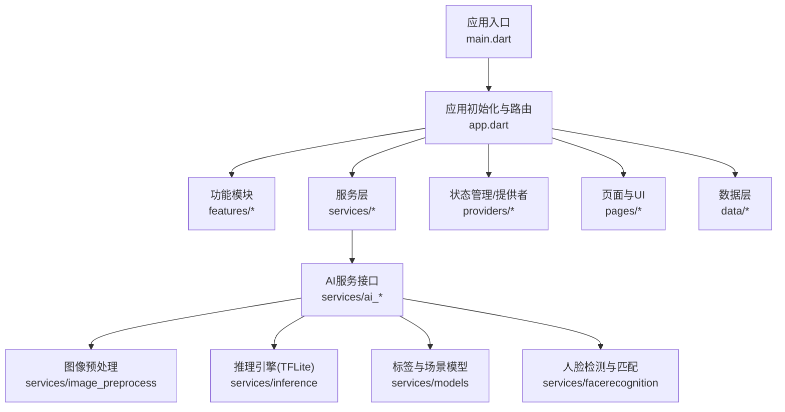
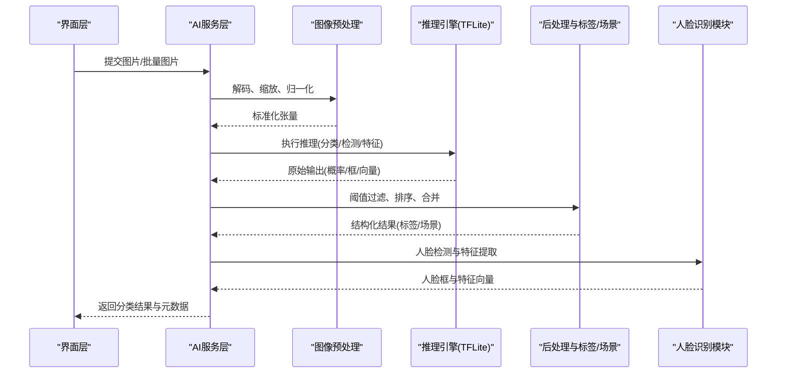
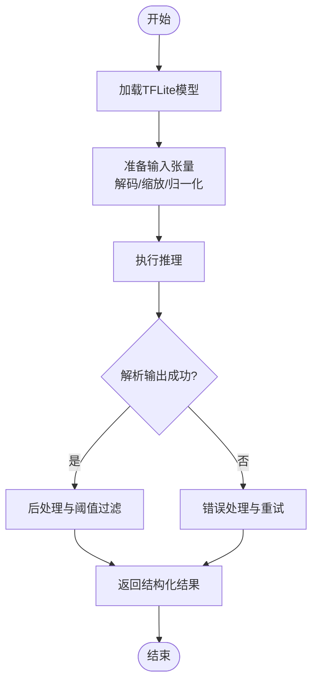
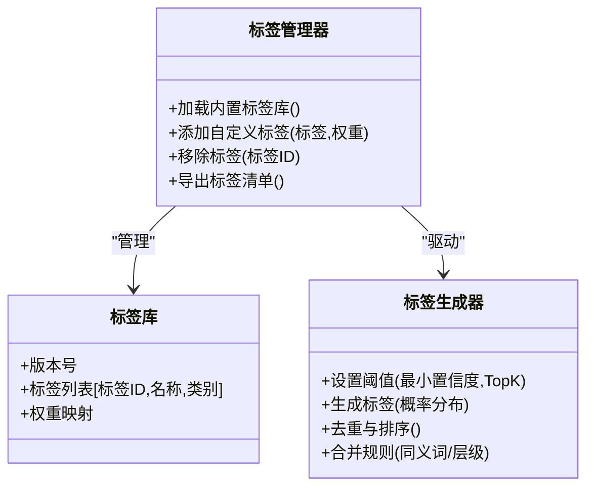
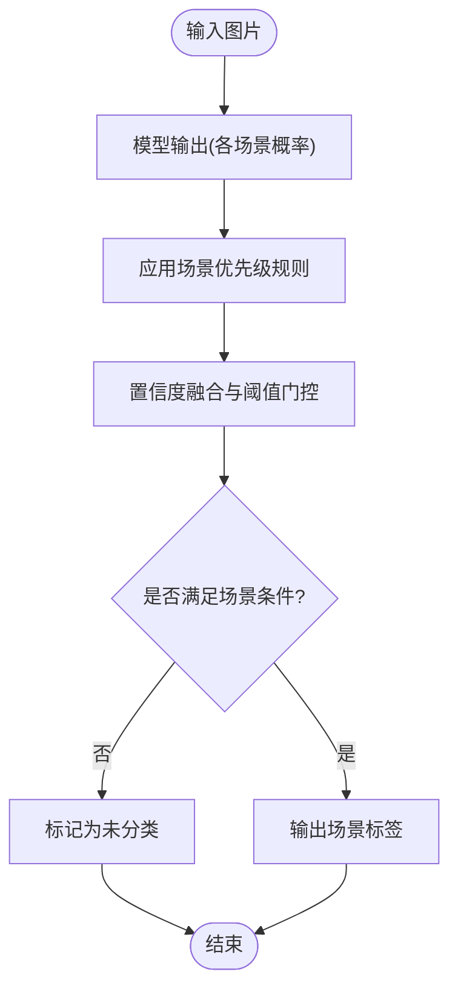
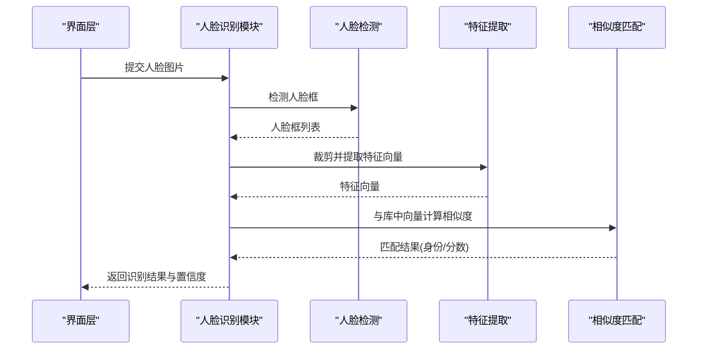
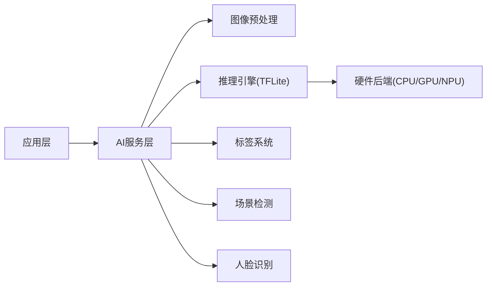

# AI智能分类系统

<cite>
**本文档引用的文件**   
- [README.md](file://README.md)
- [pubspec.yaml](file://pubspec.yaml)
- [lib/main.dart](file://lib/main.dart)
- [lib/app.dart](file://lib/app.dart)
</cite>

## 目录
1. [简介](#简介)
2. [项目结构](#项目结构)
3. [核心组件](#核心组件)
4. [架构总览](#架构总览)
5. [详细组件分析](#详细组件分析)
6. [依赖分析](#依赖分析)
7. [性能考虑](#性能考虑)
8. [故障排除指南](#故障排除指南)
9. [结论](#结论)
10. [附录](#附录)

## 简介
本文件为Flutter照片整理AI应用的“AI智能分类系统”提供系统化文档。内容覆盖图像识别引擎集成与使用（TensorFlow Lite模型加载、推理与优化）、自动标签系统（标签生成算法、标签库管理、自定义标签扩展）、场景检测（风景、人物、食物、建筑等）、人脸识别（人脸检测、特征提取、相似度匹配），以及AI服务配置选项、性能优化建议与故障排除指南。

## 项目结构
当前仓库包含跨平台Flutter工程骨架，Android、iOS、Linux、macOS、Windows、Web等平台支持已就绪。核心应用入口位于lib目录，业务逻辑按features、services、providers、pages、data分层组织。AI相关能力通常通过插件或本地推理模块集成，并在服务层统一暴露接口供上层调用。

图表来源
- [lib/main.dart:1-200](file://lib/main.dart#L1-L200)
- [lib/app.dart:1-200](file://lib/app.dart#L1-L200)

章节来源
- [README.md](file://README.md)
- [pubspec.yaml](file://pubspec.yaml)
- [lib/main.dart:1-200](file://lib/main.dart#L1-L200)
- [lib/app.dart:1-200](file://lib/app.dart#L1-L200)

## 核心组件
- 图像预处理：负责图片解码、缩放、归一化、通道转换等，确保输入符合TFLite模型期望格式。
- 推理引擎：封装TFLite解释器，提供异步推理、批处理、线程池与内存管理。
- 标签系统：内置标签库、标签生成策略、阈值过滤、置信度排序与自定义标签扩展机制。
- 场景检测：基于多任务分类模型输出，结合后处理规则对风景、人物、食物、建筑等场景进行判定。
- 人脸识别：人脸检测框定位、特征向量提取、相似度计算与匹配策略（如Top-K、阈值门控）。
- 配置中心：集中管理模型路径、设备后端选择、线程数、量化开关、缓存策略等。

章节来源
- [lib/main.dart:1-200](file://lib/main.dart#L1-L200)
- [lib/app.dart:1-200](file://lib/app.dart#L1-L200)

## 架构总览
AI智能分类系统采用“服务层抽象 + 引擎实现”的分层架构。上层通过统一的AI服务接口发起请求，服务层协调预处理、推理、后处理与结果聚合；底层对接TFLite推理引擎与可选的硬件加速后端。

图表来源
- [lib/main.dart:1-200](file://lib/main.dart#L1-L200)
- [lib/app.dart:1-200](file://lib/app.dart#L1-L200)

## 详细组件分析

### 图像识别引擎（TensorFlow Lite）
- 模型加载：支持从assets或文件系统加载.tflite模型，按需选择CPU/GPU/NPU后端。
- 推理流程：输入张量准备 -> 解释器运行 -> 输出解析 -> 错误捕获与重试。
- 优化手段：模型量化（INT8/FP16）、输入尺寸裁剪、批处理、线程池复用、内存池。
- 关键接口：加载模型、设置输入形状、执行推理、获取输出、释放资源。

图表来源
- [lib/main.dart:1-200](file://lib/main.dart#L1-L200)
- [lib/app.dart:1-200](file://lib/app.dart#L1-L200)

章节来源
- [lib/main.dart:1-200](file://lib/main.dart#L1-L200)
- [lib/app.dart:1-200](file://lib/app.dart#L1-L200)

### 自动标签系统
- 标签生成算法：基于分类概率输出，结合动态阈值与NMS-like去重策略，生成最终标签集合。
- 标签库管理：内置通用标签集（动物、植物、物体、场景等），支持版本化管理与增量更新。
- 自定义标签扩展：允许用户新增标签类别、映射规则与权重，支持热更新与回滚。
- 置信度与排序：按得分降序排列，支持Top-K限制与最小置信度门控。

图表来源
- [lib/main.dart:1-200](file://lib/main.dart#L1-L200)
- [lib/app.dart:1-200](file://lib/app.dart#L1-L200)

章节来源
- [lib/main.dart:1-200](file://lib/main.dart#L1-L200)
- [lib/app.dart:1-200](file://lib/app.dart#L1-L200)

### 场景检测算法
- 场景类型：风景、人物、食物、建筑、室内、户外等。
- 识别流程：多任务分类模型输出 -> 场景优先级规则 -> 置信度融合 -> 最终场景标签。
- 后处理策略：冲突消解（如人物+食物优先判定为食物场景）、平滑滤波（时间序列稳定）。

图表来源
- [lib/main.dart:1-200](file://lib/main.dart#L1-L200)
- [lib/app.dart:1-200](file://lib/app.dart#L1-L200)

章节来源
- [lib/main.dart:1-200](file://lib/main.dart#L1-L200)
- [lib/app.dart:1-200](file://lib/app.dart#L1-L200)

### 人脸识别功能
- 人脸检测：基于检测模型输出边界框，结合非极大值抑制去除冗余框。
- 特征提取：将人脸区域输入特征网络，得到固定维度向量。
- 相似度匹配：余弦相似度或欧氏距离，设定阈值进行身份判定与Top-K推荐。
- 存储与索引：特征向量持久化，支持快速检索与增量更新。

图表来源
- [lib/main.dart:1-200](file://lib/main.dart#L1-L200)
- [lib/app.dart:1-200](file://lib/app.dart#L1-L200)

章节来源
- [lib/main.dart:1-200](file://lib/main.dart#L1-L200)
- [lib/app.dart:1-200](file://lib/app.dart#L1-L200)

### AI服务配置选项
- 模型配置：模型路径、输入尺寸、量化模式、后端选择（CPU/GPU/NPU）。
- 推理参数：线程数、批大小、超时时间、重试次数。
- 标签与场景：阈值、Top-K、优先级规则、自定义标签权重。
- 人脸识别：相似度阈值、Top-K、特征存储路径、索引策略。
- 缓存策略：中间结果缓存、模型预热、内存上限。

章节来源
- [lib/main.dart:1-200](file://lib/main.dart#L1-L200)
- [lib/app.dart:1-200](file://lib/app.dart#L1-L200)

## 依赖分析
- 外部依赖：TFLite运行时、图像处理库、可选硬件加速SDK（GPU/NPU）。
- 内部依赖：服务层依赖预处理、推理引擎、标签与场景模块、人脸识别模块。
- 耦合关系：服务层作为统一入口，降低上层与具体实现的耦合；模块间通过接口通信，便于替换与测试。

图表来源
- [lib/main.dart:1-200](file://lib/main.dart#L1-L200)
- [lib/app.dart:1-200](file://lib/app.dart#L1-L200)

章节来源
- [pubspec.yaml](file://pubspec.yaml)
- [lib/main.dart:1-200](file://lib/main.dart#L1-L200)
- [lib/app.dart:1-200](file://lib/app.dart#L1-L200)

## 性能考虑
- 模型层面：优先使用量化模型（INT8/FP16），减少内存占用与推理时延。
- 输入层面：合理缩放与裁剪，避免过大分辨率导致内存峰值过高。
- 推理层面：启用批处理与线程池，复用解释器实例，减少初始化开销。
- 内存管理：及时释放中间张量与模型资源，设置合理的内存上限与缓存淘汰策略。
- 硬件加速：在可用设备上启用GPU/NPU后端，提升吞吐与能效。

## 故障排除指南
- 模型加载失败：检查模型路径与权限，确认模型格式与输入形状一致；查看日志中的异常堆栈。
- 推理崩溃或超时：降低输入尺寸或批大小，增加超时时间；排查内存不足与线程竞争。
- 标签不准确：调整阈值与Top-K，检查标签库版本与权重配置；引入更多样本进行微调。
- 场景误判：优化优先级规则与置信度融合策略，加入时序平滑以减少抖动。
- 人脸识别失败：检查人脸框质量与光照条件，调整相似度阈值与特征提取参数；确保特征库更新。

章节来源
- [lib/main.dart:1-200](file://lib/main.dart#L1-L200)
- [lib/app.dart:1-200](file://lib/app.dart#L1-L200)

## 结论
本AI智能分类系统以清晰的服务层抽象与模块化设计，实现了图像识别、自动标签、场景检测与人脸识别等核心能力。通过合理的配置与优化策略，可在移动端设备上取得良好的性能与准确性。建议持续迭代模型与规则，结合用户反馈优化标签与场景判定，提升整体体验。

## 附录
- 术语表：TFLite、量化、NMS、Top-K、置信度、特征向量、相似度阈值等。
- 参考链接：TFLite官方文档、Flutter图像处理插件、人脸检测与识别开源方案。