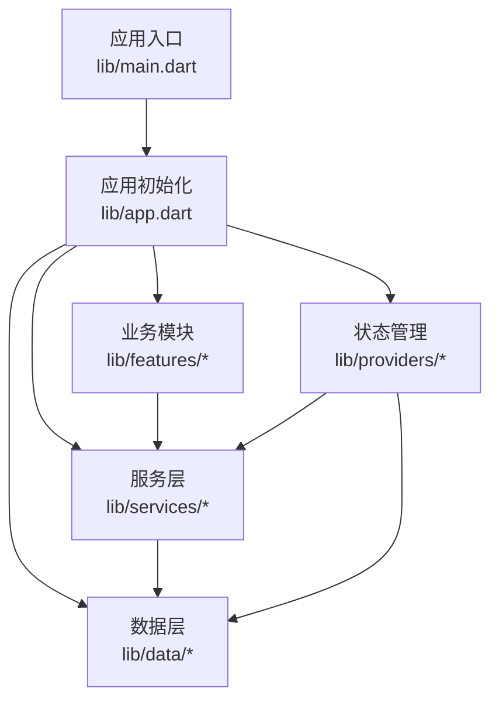
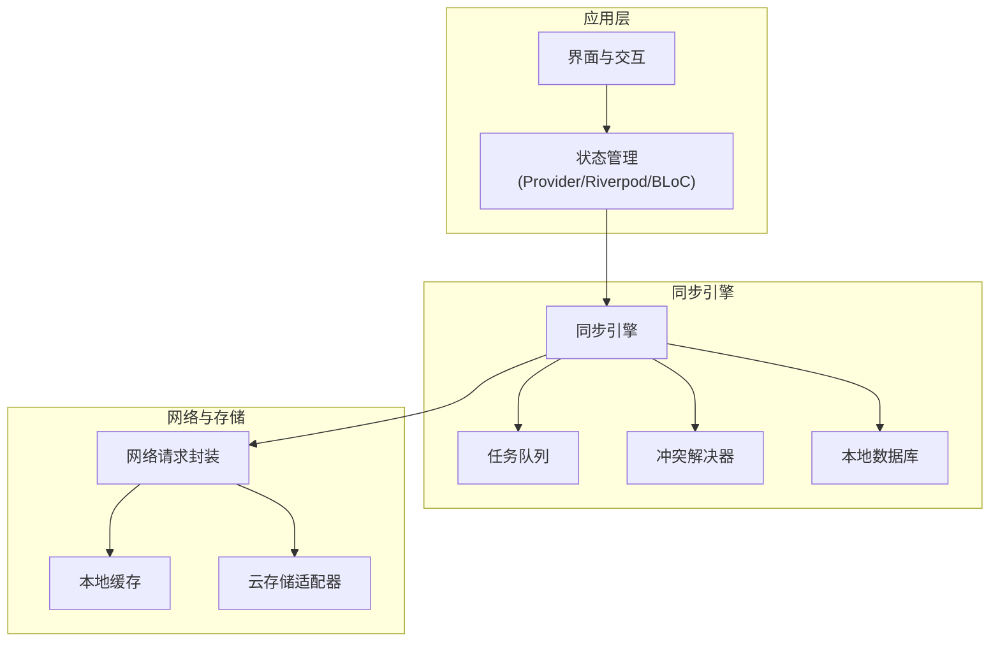
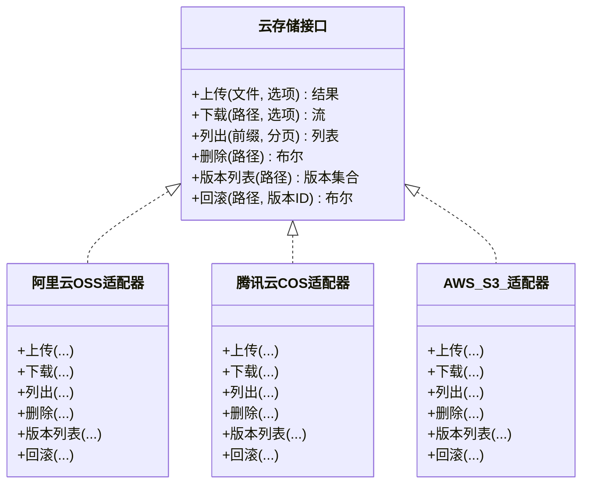
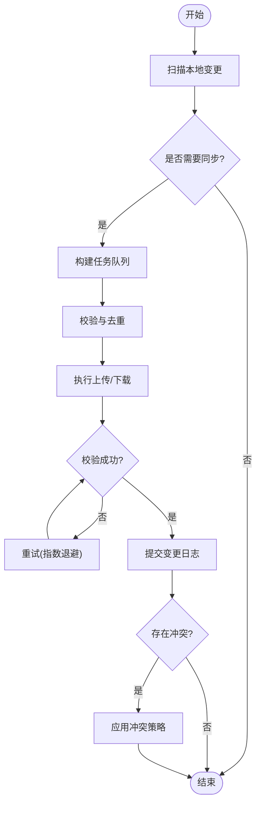
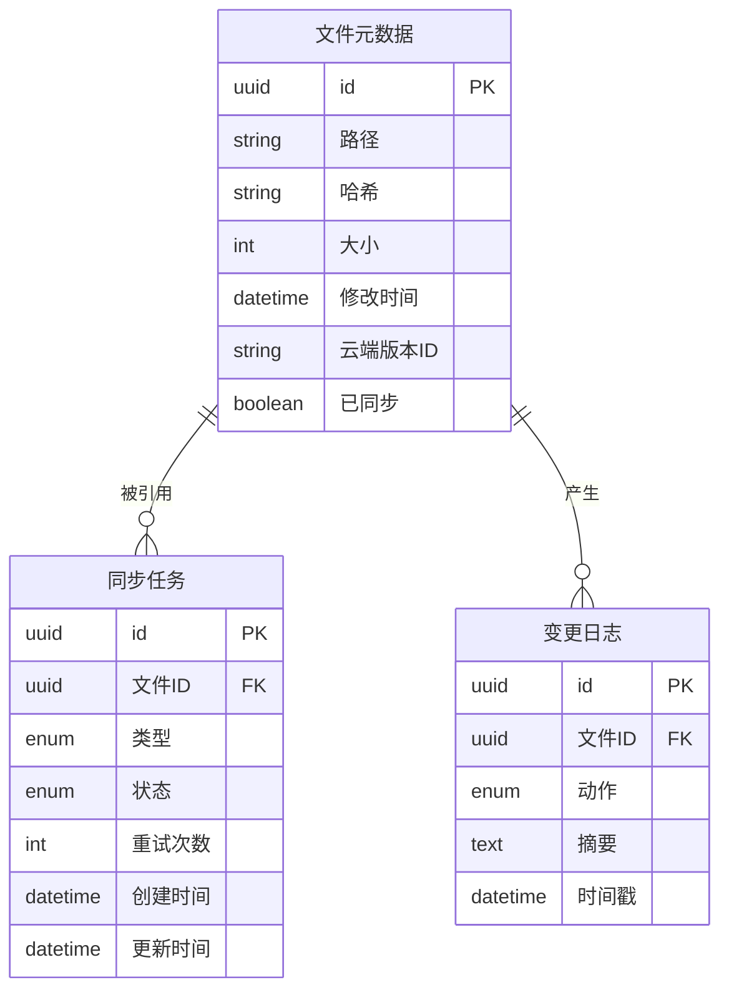
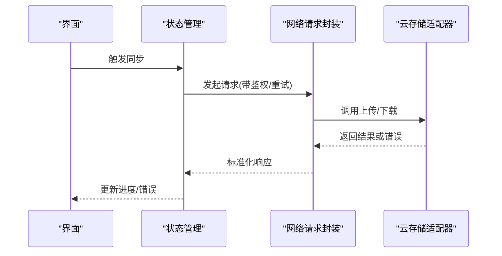
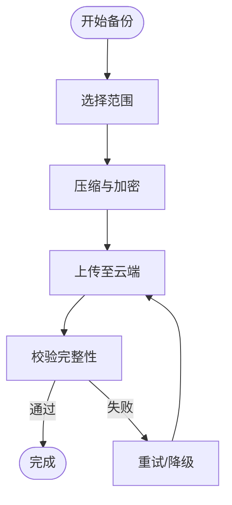
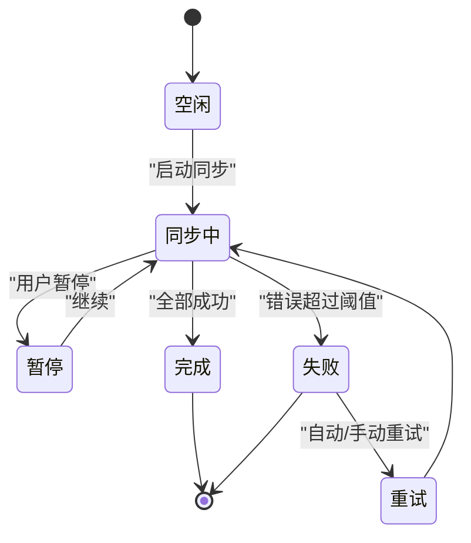
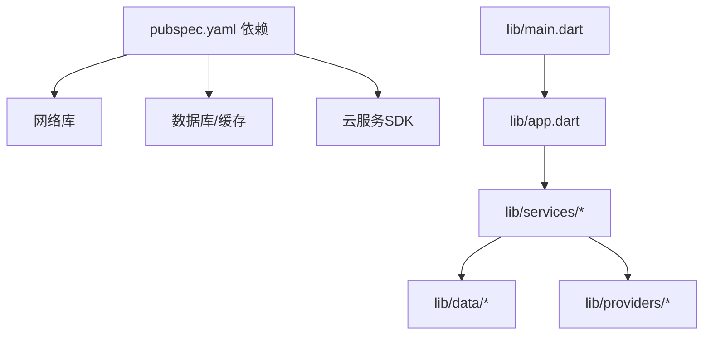

# 数据同步机制

<cite>
**本文档引用的文件**   
- [README.md](file://README.md)
- [pubspec.yaml](file://pubspec.yaml)
- [lib/main.dart](file://lib/main.dart)
- [lib/app.dart](file://lib/app.dart)
</cite>

## 目录
1. [简介](#简介)
2. [项目结构](#项目结构)
3. [核心组件](#核心组件)
4. [架构总览](#架构总览)
5. [详细组件分析](#详细组件分析)
6. [依赖分析](#依赖分析)
7. [性能考虑](#性能考虑)
8. [故障排查指南](#故障排查指南)
9. [结论](#结论)
10. [附录](#附录)

## 简介
本文件为Flutter照片整理AI应用的数据同步机制提供系统化文档，覆盖云存储集成、多设备同步、备份恢复、同步状态管理以及网络请求封装与缓存策略等关键主题。由于当前仓库尚未包含具体实现代码，本文基于通用工程结构与最佳实践给出可落地的设计方案与实施建议，便于后续在lib/services、lib/data、lib/providers等目录中逐步落地。

## 项目结构
从仓库根目录可见典型的Flutter多平台工程布局：
- lib：应用核心逻辑（入口、页面、服务、数据层、提供者等）
- android/ios/windows/macos/linux：各平台原生配置与插件注册
- pubspec.yaml：依赖声明与构建配置
- README.md：项目说明

图表来源
- [lib/main.dart](file://lib/main.dart)
- [lib/app.dart](file://lib/app.dart)

章节来源
- [README.md](file://README.md)
- [pubspec.yaml](file://pubspec.yaml)
- [lib/main.dart](file://lib/main.dart)
- [lib/app.dart](file://lib/app.dart)

## 核心组件
围绕数据同步，建议将系统拆分为以下核心组件：
- 云存储适配器：统一抽象不同云服务（如阿里云OSS、腾讯云COS、AWS S3、Google Drive、OneDrive），暴露一致的上传/下载/版本管理接口。
- 同步引擎：负责增量同步、冲突检测与解决、队列调度、重试与退避。
- 本地持久化：SQLite或Isar用于元数据、任务队列、变更日志与离线缓存。
- 网络请求封装：统一的HTTP客户端，支持鉴权、重试、超时、断点续传、并发控制。
- 状态管理：集中式同步状态（进度、错误、队列长度）、UI联动与用户反馈。
- 备份恢复：自动/手动备份策略、压缩打包、校验与回滚。

章节来源
- [lib/main.dart](file://lib/main.dart)
- [lib/app.dart](file://lib/app.dart)

## 架构总览
下图展示数据同步的总体架构与交互关系：

图表来源
- [lib/main.dart](file://lib/main.dart)
- [lib/app.dart](file://lib/app.dart)

## 详细组件分析

### 云存储适配器
- 目标：屏蔽不同云服务的SDK差异，提供统一的文件操作能力。
- 关键能力：
  - 上传：分片上传、断点续传、并发限制、签名鉴权。
  - 下载：范围下载、断点续传、校验（MD5/SHA）。
  - 版本管理：对象版本列表、回滚到指定版本、删除旧版本。
  - 元数据：标签、分类、时间戳、哈希值、缩略图生成。
- 设计要点：
  - 定义统一接口（上传、下载、列出、删除、版本操作）。
  - 针对每个云服务实现适配器，处理特有参数与错误码映射。
  - 失败时返回标准化错误类型，便于上层重试与降级。

图表来源
- [lib/main.dart](file://lib/main.dart)
- [lib/app.dart](file://lib/app.dart)

章节来源
- [pubspec.yaml](file://pubspec.yaml)

### 同步引擎
- 目标：协调本地与云端的数据一致性，保证可靠、高效、可观测的同步过程。
- 关键能力：
  - 增量同步：基于变更日志与哈希对比，仅传输差异。
  - 冲突解决：时间戳优先、内容合并、人工介入提示。
  - 任务队列：优先级、去重、批处理、限速。
  - 重试与退避：指数退避、最大重试次数、失败隔离。
  - 离线处理：离线写入本地队列，联网后自动回放。
- 流程概览：

图表来源
- [lib/main.dart](file://lib/main.dart)
- [lib/app.dart](file://lib/app.dart)

章节来源
- [lib/main.dart](file://lib/main.dart)
- [lib/app.dart](file://lib/app.dart)

### 本地持久化与缓存
- 本地数据库：存储元数据、任务队列、变更日志、同步位点。
- 缓存策略：
  - 图片缩略图与预览缓存，按大小与访问频率淘汰。
  - 元数据缓存，减少重复查询。
  - 读写分离：写先入队，读优先命中缓存。
- 一致性保证：事务性更新、幂等键、版本号/哈希校验。

图表来源
- [lib/main.dart](file://lib/main.dart)
- [lib/app.dart](file://lib/app.dart)

章节来源
- [lib/main.dart](file://lib/main.dart)
- [lib/app.dart](file://lib/app.dart)

### 网络请求封装
- 目标：统一HTTP调用，提供鉴权、重试、超时、取消、监控。
- 关键能力：
  - 鉴权：Token刷新、签名生成、会话保持。
  - 重试：指数退避、抖动、最大重试次数、失败熔断。
  - 超时与取消：请求级超时、全局取消令牌。
  - 监控：成功率、延迟、错误分类上报。
- 错误处理：标准化错误码与消息，区分网络错误、服务端错误、业务错误。

图表来源
- [lib/main.dart](file://lib/main.dart)
- [lib/app.dart](file://lib/app.dart)

章节来源
- [pubspec.yaml](file://pubspec.yaml)

### 备份恢复
- 自动备份策略：
  - 定时触发（空闲时段、低电量保护）。
  - 增量备份（仅备份变更部分）。
  - 压缩与加密（可选）。
- 手动备份：
  - 选择范围（相册、日期、标签）。
  - 导出格式（ZIP/TAR+清单）。
  - 校验与完整性检查。
- 恢复流程：
  - 导入清单与校验。
  - 顺序回放任务队列。
  - 冲突与失败处理（跳过/重试/回滚）。

图表来源
- [lib/main.dart](file://lib/main.dart)
- [lib/app.dart](file://lib/app.dart)

章节来源
- [lib/main.dart](file://lib/main.dart)
- [lib/app.dart](file://lib/app.dart)

### 同步状态管理
- 状态维度：
  - 总体进度（百分比、剩余量）。
  - 队列长度与吞吐。
  - 错误统计与分类。
  - 最近一次同步时间与原因。
- UI联动：
  - 实时进度条、通知栏更新。
  - 错误提示与一键重试。
  - 离线模式指示。
- 可靠性：
  - 持久化状态，重启后恢复。
  - 幂等操作避免重复执行。

图表来源
- [lib/main.dart](file://lib/main.dart)
- [lib/app.dart](file://lib/app.dart)

章节来源
- [lib/main.dart](file://lib/main.dart)
- [lib/app.dart](file://lib/app.dart)

## 依赖分析
- 外部依赖：
  - Flutter插件：网络、存储、数据库、加密、压缩等。
  - 云服务SDK：各云厂商官方SDK或HTTP API。
- 内部依赖：
  - 服务层依赖数据层与状态管理。
  - 同步引擎依赖网络封装与本地持久化。
  - 云存储适配器依赖网络封装与缓存。

图表来源
- [pubspec.yaml](file://pubspec.yaml)
- [lib/main.dart](file://lib/main.dart)
- [lib/app.dart](file://lib/app.dart)

章节来源
- [pubspec.yaml](file://pubspec.yaml)
- [lib/main.dart](file://lib/main.dart)
- [lib/app.dart](file://lib/app.dart)

## 性能考虑
- 并发与限流：
  - 上传/下载并发数可控，避免阻塞主线程。
  - 带宽自适应，根据网络质量调整速率。
- 内存与I/O：
  - 大文件流式处理，避免一次性加载。
  - 合理缓存缩略图与元数据，设置LRU淘汰。
- 电池与后台：
  - 仅在充电与Wi-Fi环境下进行大批量同步。
  - 使用系统后台任务与权限管理。
- 可观测性：
  - 指标采集（QPS、延迟、错误率）。
  - 日志分级与采样，避免过多IO。

[本节为通用指导，不直接分析具体文件]

## 故障排查指南
- 常见问题定位：
  - 网络错误：检查鉴权、超时、DNS、代理。
  - 上传失败：确认分片大小、并发限制、存储空间。
  - 冲突频发：审查时间戳策略与合并规则。
  - 内存溢出：优化流式处理与缓存上限。
- 调试手段：
  - 启用详细日志与请求追踪。
  - 模拟弱网与高延迟环境。
  - 使用沙箱账号与测试桶。
- 恢复策略：
  - 失败任务隔离与重试。
  - 回滚到上一稳定版本。
  - 清理损坏缓存并重建索引。

[本节为通用指导，不直接分析具体文件]

## 结论
本方案为照片整理AI应用的数据同步提供了完整的架构蓝图与实施要点，涵盖云存储适配、增量同步、冲突解决、备份恢复、状态管理与网络封装。建议在lib/services与lib/data目录下逐步落地上述组件，并通过单元测试与端到端测试验证可靠性与性能。

[本节为总结，不直接分析具体文件]

## 附录
- 推荐插件与库（示例，需结合项目实际选型）：
  - 网络：dio/http
  - 数据库：sqflite/isar
  - 缓存：shared_preferences/hive
  - 压缩：archive/path_provider
  - 加密：encrypt/dart_frog_crypto
- 参考实现位置（待落地）：
  - lib/services/cloud_storage_adapter.dart
  - lib/services/sync_engine.dart
  - lib/data/local_db.dart
  - lib/providers/sync_state.dart
  - lib/utils/network_client.dart

[本节为补充信息，不直接分析具体文件]