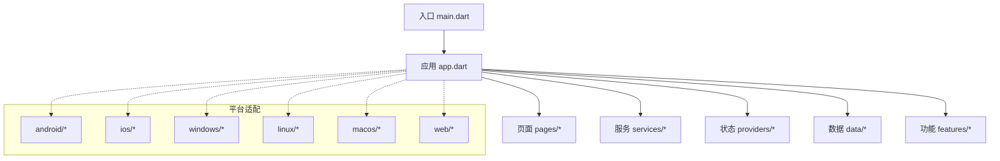
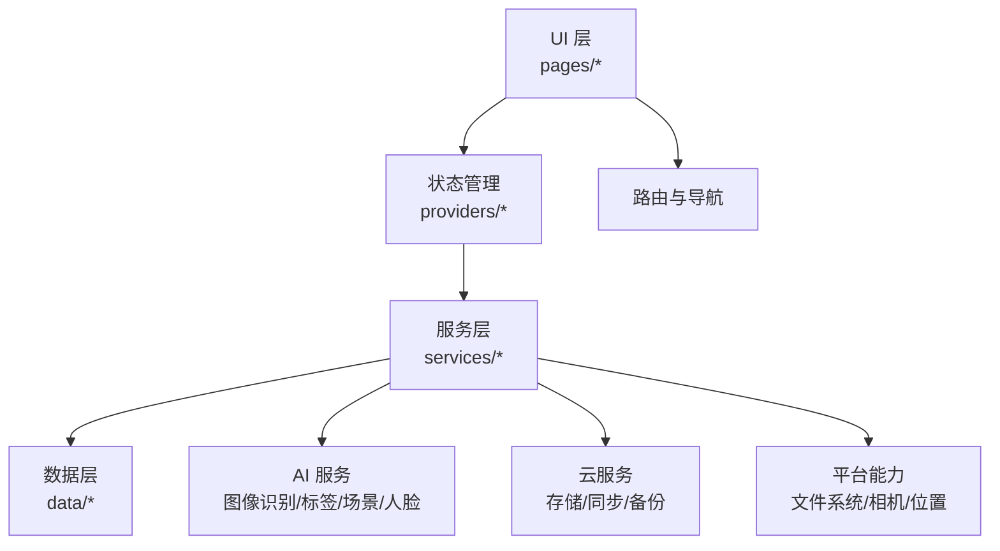
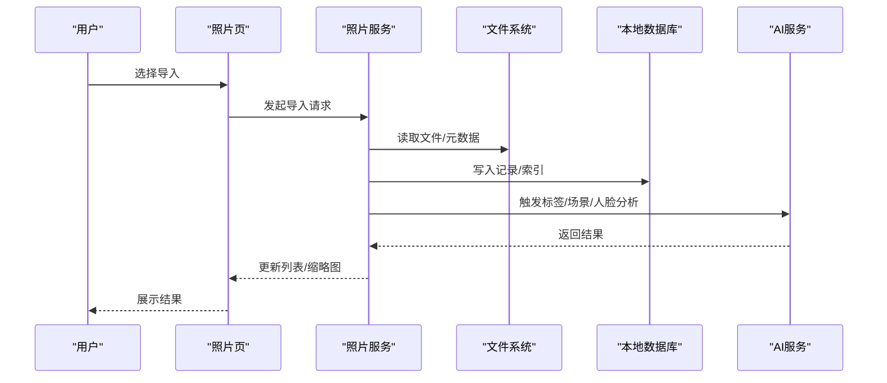
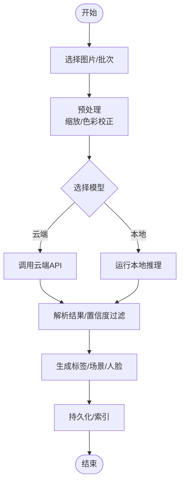
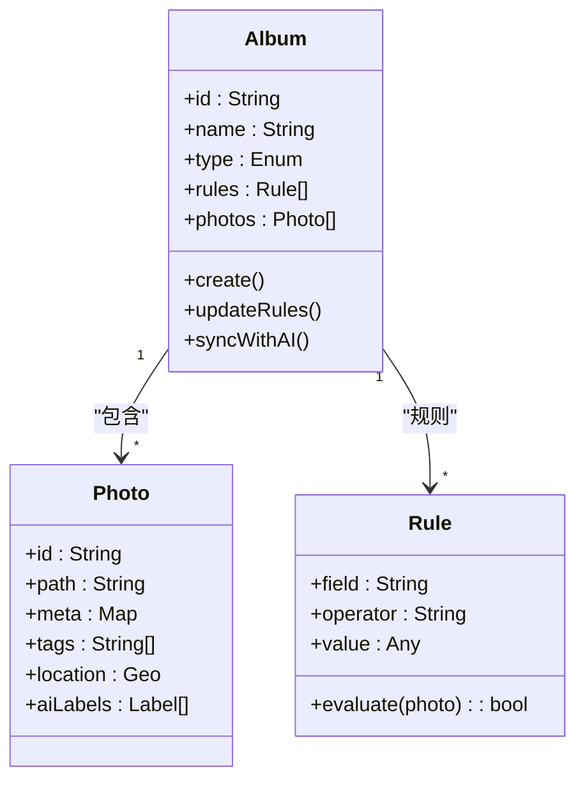
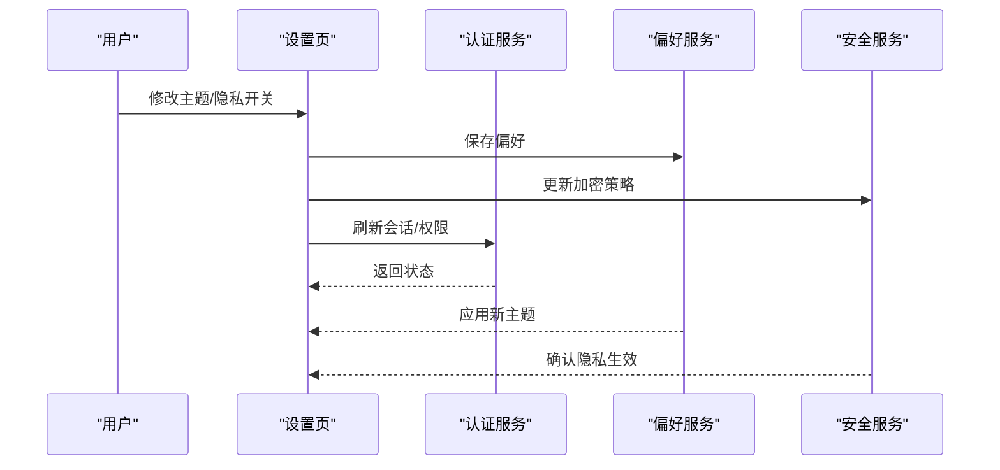
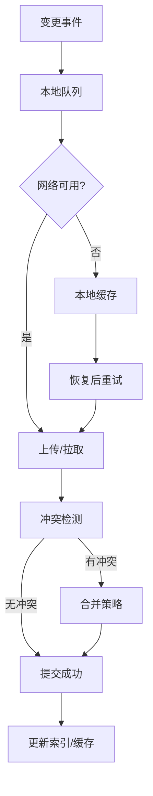
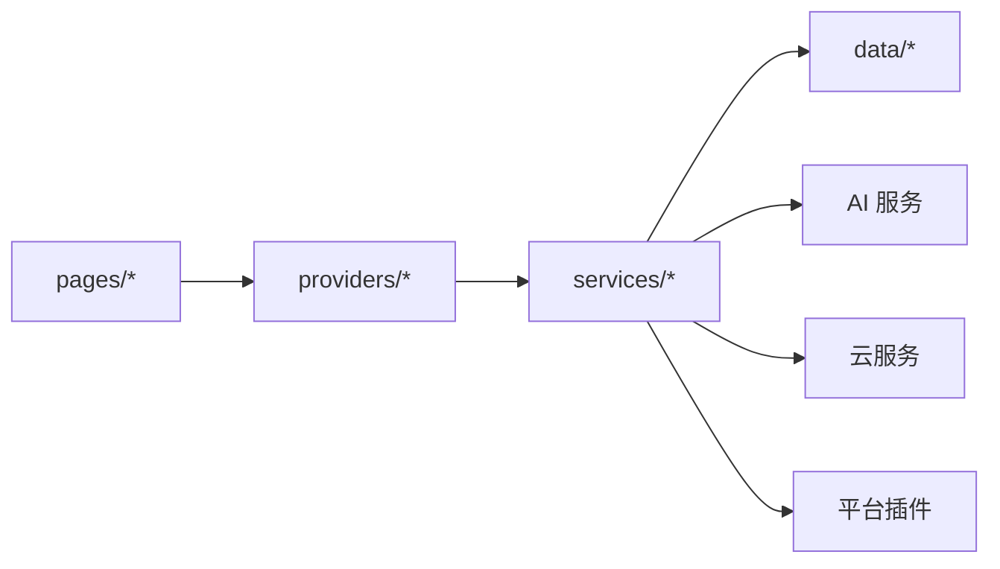

# 核心功能模块

<cite>
**本文引用的文件**   
- [README.md](file://README.md)
- [pubspec.yaml](file://pubspec.yaml)
- [lib/main.dart](file://lib/main.dart)
- [lib/app.dart](file://lib/app.dart)
</cite>

## 目录
1. [简介](#简介)
2. [项目结构](#项目结构)
3. [核心组件](#核心组件)
4. [架构总览](#架构总览)
5. [详细组件分析](#详细组件分析)
6. [依赖分析](#依赖分析)
7. [性能考虑](#性能考虑)
8. [故障排查指南](#故障排查指南)
9. [结论](#结论)
10. [附录](#附录)

## 简介
本文件面向Flutter照片整理AI应用的核心功能模块，围绕照片导入、浏览、编辑、删除，AI智能分类（图像识别、自动标签、场景检测、人脸识别），相册组织（智能分组、时间线视图、地理位置分类、自定义相册），用户管理（账户、偏好、主题、隐私），以及数据同步（云存储、多设备同步、备份恢复）等能力进行系统化说明。文档以“从概念到实现”的方式展开，既提供高层架构图与流程图，也给出落地建议、配置项与最佳实践，帮助读者快速理解并高效扩展该应用。

## 项目结构
本项目为跨平台Flutter工程，包含Android、iOS、macOS、Windows、Linux与Web等多端支持。核心业务代码位于lib目录下，按职责划分为data、features、pages、providers、services等模块；入口文件为main.dart，应用初始化与路由由app.dart负责。

图表来源 
- [lib/main.dart](file://lib/main.dart)
- [lib/app.dart](file://lib/app.dart)

章节来源
- [README.md](file://README.md)
- [pubspec.yaml](file://pubspec.yaml)
- [lib/main.dart](file://lib/main.dart)
- [lib/app.dart](file://lib/app.dart)

## 核心组件
- 照片管理：覆盖导入、浏览、编辑、删除等基础能力，强调性能与体验优化。
- AI智能分类：集成图像识别、自动标签、场景检测、人脸识别等能力，提供可插拔的模型/服务接入点。
- 相册组织：支持智能分组、时间线视图、地理位置分类与自定义相册，提升检索效率。
- 用户管理：账户体系、偏好设置、主题定制与隐私控制，保障个性化与安全合规。
- 数据同步：云存储对接、多设备同步、增量同步与冲突解决、备份恢复策略。

章节来源
- [README.md](file://README.md)
- [pubspec.yaml](file://pubspec.yaml)

## 架构总览
整体采用分层架构与模块化设计：UI层通过Provider或类似状态管理访问Service层，Service层协调Data层与外部AI/云服务。平台差异通过Flutter插件与原生桥接处理。

图表来源 
- [lib/app.dart](file://lib/app.dart)
- [lib/main.dart](file://lib/main.dart)

## 详细组件分析

### 照片管理系统
- 导入
  - 支持本地相册选择、批量导入、元数据读取（EXIF）、去重校验。
  - 异步队列处理大文件，避免阻塞UI；失败重试与断点续传。
- 浏览
  - 网格/列表/时间线视图；懒加载与缩略图缓存；搜索与筛选（日期、地点、标签）。
- 编辑
  - 裁剪、旋转、滤镜、标注；撤销/重做历史；导出格式与质量可调。
- 删除
  - 软删除与回收站；批量操作；权限与确认流程。

图表来源 
- [lib/app.dart](file://lib/app.dart)
- [lib/main.dart](file://lib/main.dart)

章节来源
- [README.md](file://README.md)
- [pubspec.yaml](file://pubspec.yaml)

### AI智能分类系统
- 图像识别与自动标签
  - 基于云端或本地模型，输出类别、置信度、关键词；支持自定义标签库与权重调整。
- 场景检测
  - 识别风景、室内、人像、运动等场景，辅助分组与推荐。
- 人脸识别
  - 人脸检测、聚类与匹配；隐私开关与本地化处理选项。
- 集成方式
  - 统一AI接口抽象，便于替换不同供应商；任务队列与并发控制；结果缓存与回退策略。

图表来源 
- [lib/app.dart](file://lib/app.dart)
- [lib/main.dart](file://lib/main.dart)

章节来源
- [README.md](file://README.md)
- [pubspec.yaml](file://pubspec.yaml)

### 相册组织功能
- 智能分组
  - 基于时间、地点、标签、人物、相似度的自动分组；规则引擎支持自定义条件。
- 时间线视图
  - 按年/月/日聚合；关键帧抽取；滑动流畅性与内存优化。
- 地理位置分类
  - 结合GPS与地名反查；地图模式查看；离线降级。
- 自定义相册
  - 手动创建、拖拽排序、共享与协作；权限与可见性控制。

图表来源 
- [lib/app.dart](file://lib/app.dart)
- [lib/main.dart](file://lib/main.dart)

章节来源
- [README.md](file://README.md)
- [pubspec.yaml](file://pubspec.yaml)

### 用户管理功能
- 账户管理
  - 注册/登录、多账号切换、会话管理、安全退出。
- 偏好设置
  - 语言、时区、显示密度、缩略图质量、AI精度阈值。
- 主题定制
  - 明暗主题、品牌色、图标风格、动态壁纸。
- 隐私控制
  - 敏感数据加密、本地/云端可见性、人脸与位置开关、审计日志。

图表来源 
- [lib/app.dart](file://lib/app.dart)
- [lib/main.dart](file://lib/main.dart)

章节来源
- [README.md](file://README.md)
- [pubspec.yaml](file://pubspec.yaml)

### 数据同步机制
- 云存储集成
  - 支持主流云厂商SDK；上传/下载/版本管理；断点续传与并发限制。
- 多设备同步
  - 增量同步、冲突检测与合并策略；离线优先与在线补偿。
- 备份恢复
  - 定时快照、选择性恢复、完整性校验、恢复进度提示。

图表来源 
- [lib/app.dart](file://lib/app.dart)
- [lib/main.dart](file://lib/main.dart)

章节来源
- [README.md](file://README.md)
- [pubspec.yaml](file://pubspec.yaml)

## 依赖分析
- 内部依赖
  - UI层依赖状态管理与服务层；服务层依赖数据层与外部AI/云服务；数据层依赖本地存储与缓存。
- 外部依赖
  - Flutter插件用于相机、相册、文件系统、网络、位置、加密等；AI与云服务通过HTTP/SDK接入。
- 耦合与内聚
  - 通过接口抽象降低耦合；服务层集中编排；数据层封装存储细节。

图表来源 
- [lib/app.dart](file://lib/app.dart)
- [lib/main.dart](file://lib/main.dart)

章节来源
- [README.md](file://README.md)
- [pubspec.yaml](file://pubspec.yaml)

## 性能考虑
- 图片处理
  - 缩略图生成与缓存；按需解码；内存池复用；后台线程处理。
- 列表渲染
  - 分页加载；虚拟滚动；占位图与骨架屏；防抖与节流。
- AI推理
  - 批处理与流水线；结果缓存；降级到轻量模型；超时与取消。
- 同步与IO
  - 增量同步；压缩传输；连接池与重试；磁盘I/O限流。

[本节为通用指导，不直接分析具体文件]

## 故障排查指南
- 常见问题
  - 导入失败：检查权限、存储空间、文件格式与大小限制。
  - AI结果异常：核对模型版本、网络连通、输入预处理与阈值设置。
  - 同步冲突：查看冲突日志，确认合并策略与优先级。
  - 隐私问题：验证加密开关、可见性设置与审计日志。
- 调试建议
  - 启用详细日志与埋点；使用模拟器与真机对比；隔离第三方服务。

章节来源
- [README.md](file://README.md)
- [pubspec.yaml](file://pubspec.yaml)

## 结论
本应用以模块化与分层架构为基础，将照片管理、AI分类、相册组织、用户管理与数据同步有机整合。通过清晰的接口与可扩展的设计，既能满足当前需求，也为未来能力演进预留空间。建议在开发中遵循性能与隐私优先原则，持续优化用户体验与系统稳定性。

[本节为总结性内容，不直接分析具体文件]

## 附录
- 使用示例
  - 导入：选择相册→批量勾选→设置AI精度→开始导入→查看结果。
  - 浏览：切换到时间线→按月份筛选→点击缩略图查看详情。
  - 编辑：打开图片→裁剪/滤镜→预览→导出至指定相册。
  - 删除：多选→移至回收站→清空回收站。
- 配置选项
  - AI：模型选择、置信度阈值、是否启用人脸与场景检测。
  - 同步：云服务商、同步频率、冲突策略、带宽限制。
  - 主题：明暗模式、主色调、字体大小。
- 最佳实践
  - 合理设置缩略图尺寸与缓存策略；对AI任务设置超时与重试；对用户敏感数据默认加密；定期备份与恢复演练。

[本节为补充信息，不直接分析具体文件]