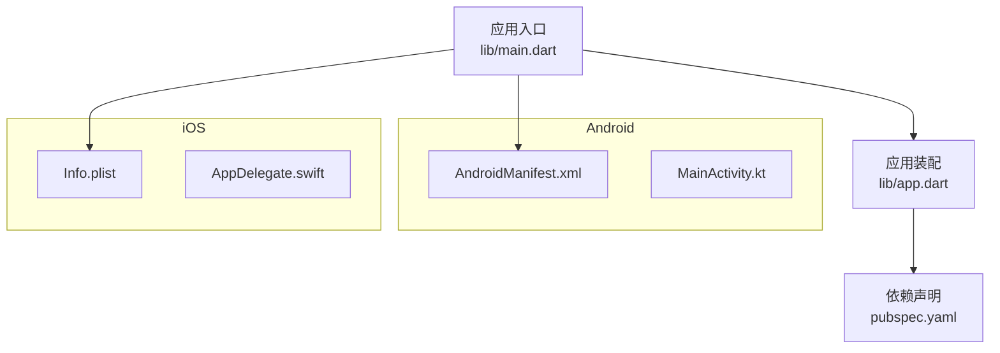
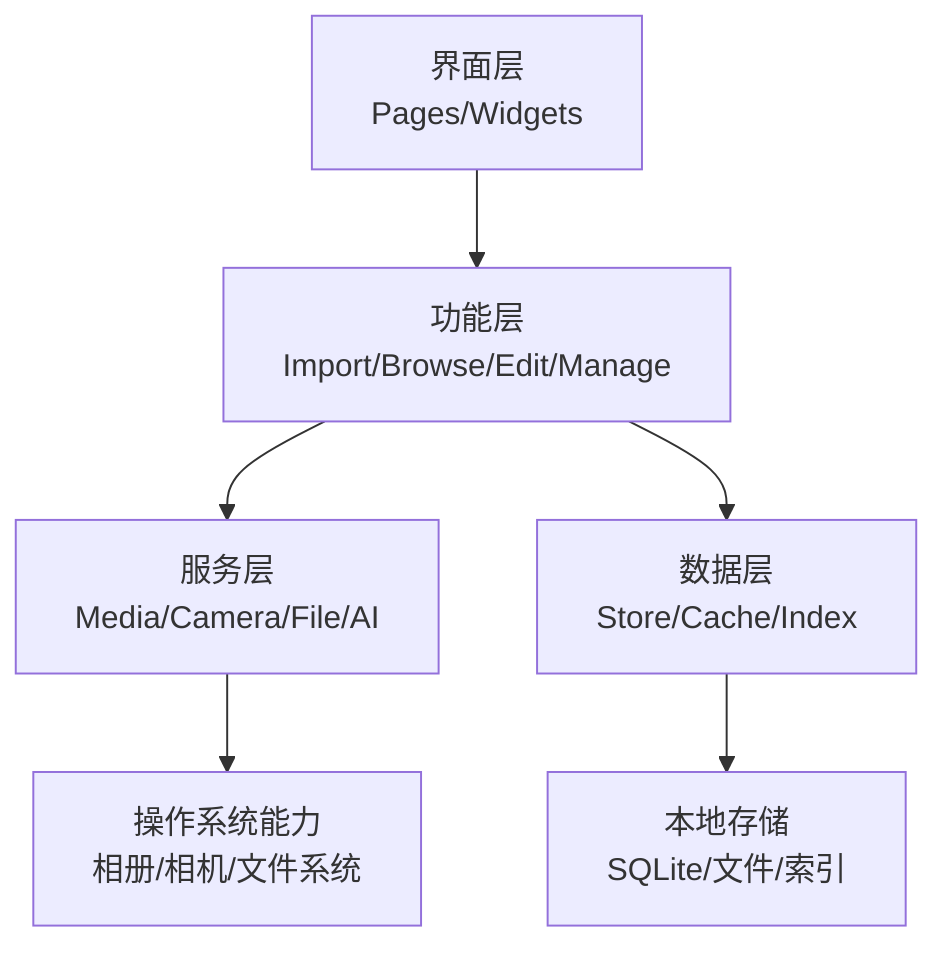
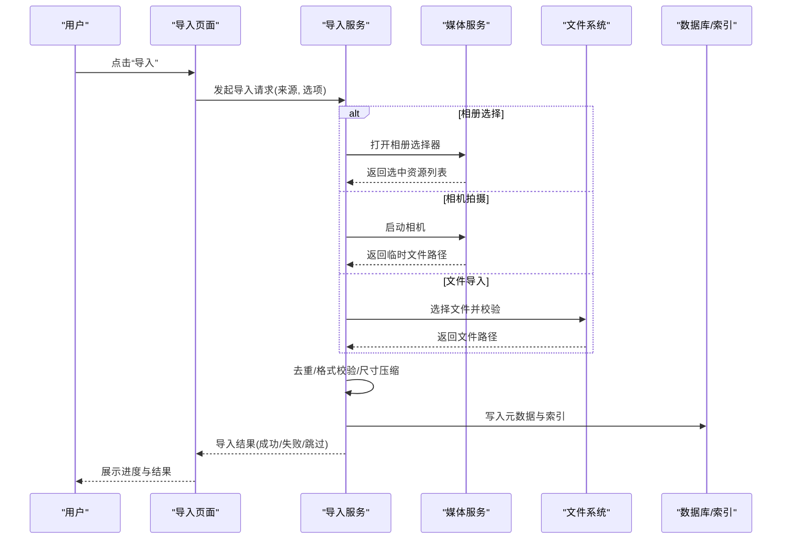
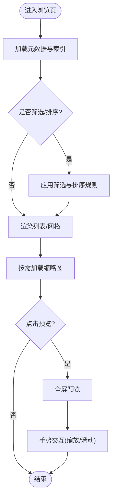
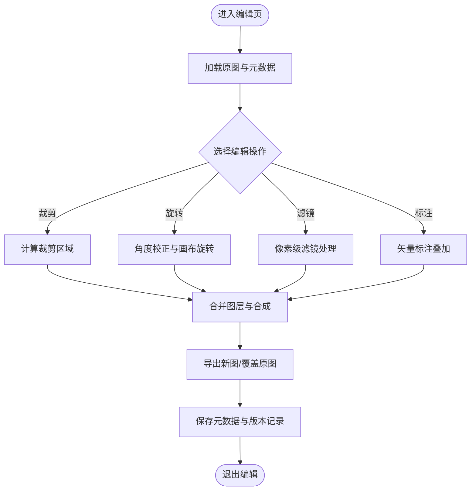
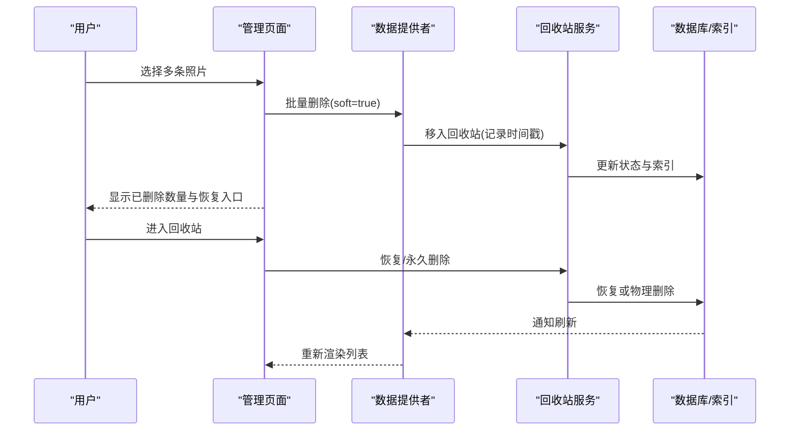
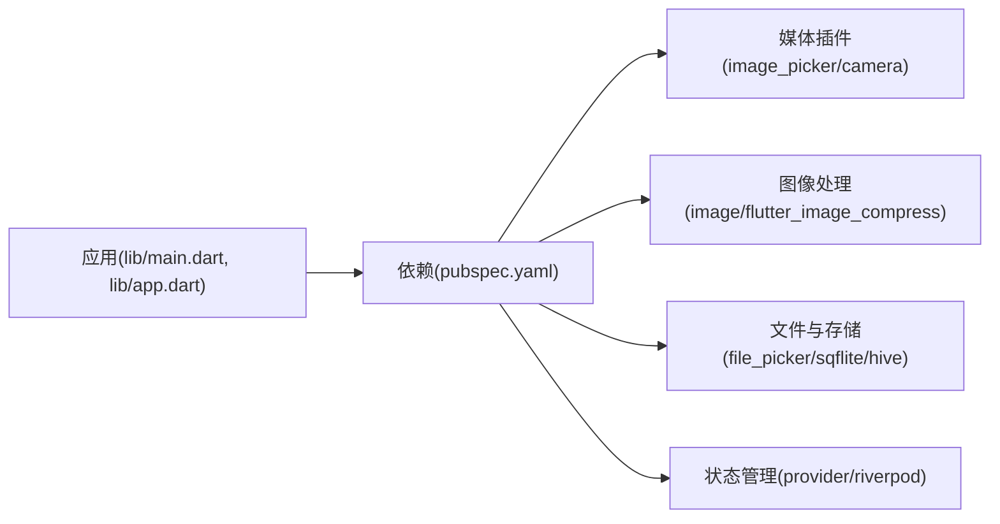

# 照片管理系统

<cite>
**本文引用的文件**   
- [main.dart](file://lib/main.dart)
- [app.dart](file://lib/app.dart)
- [pubspec.yaml](file://pubspec.yaml)
</cite>

## 目录
1. [简介](#简介)
2. [项目结构](#项目结构)
3. [核心组件](#核心组件)
4. [架构总览](#架构总览)
5. [详细组件分析](#详细组件分析)
6. [依赖分析](#依赖分析)
7. [性能考虑](#性能考虑)
8. [故障排查指南](#故障排查指南)
9. [结论](#结论)
10. [附录](#附录)

## 简介
本文件为 Flutter 照片整理 AI 应用的“照片管理系统”提供系统化文档。围绕以下能力展开：
- 照片导入：设备相册选择、相机拍摄、文件导入等
- 照片浏览：网格视图、列表视图、全屏预览
- 照片编辑：裁剪、旋转、滤镜、标注
- 照片删除与管理：批量操作、回收站、恢复机制

说明中会给出实现思路、API 接口约定与最佳实践，并配合架构图与流程图帮助理解。由于当前仓库尚未包含具体业务代码，本文以架构设计与集成方案为主，待代码落地后可按相同结构补充具体实现细节。

## 项目结构
基于现有工程骨架，Flutter 应用入口位于 lib 目录，平台相关配置在 android/ 与 ios/ 下，依赖管理通过 pubspec.yaml。建议将照片管理功能按“特性（feature）+服务（service）+数据（data）+页面（pages）+提供者（providers）”分层组织，便于扩展与维护。

图表来源
- [main.dart](file://lib/main.dart)
- [app.dart](file://lib/app.dart)
- [pubspec.yaml](file://pubspec.yaml)

章节来源
- [main.dart](file://lib/main.dart)
- [app.dart](file://lib/app.dart)
- [pubspec.yaml](file://pubspec.yaml)

## 核心组件
- 导入模块（Import）
  - 相册选择：调用系统相册或媒体库，支持多选、过滤类型（图片/视频）、权限申请
  - 相机拍摄：调用系统相机或第三方相机插件，支持拍照后压缩与元数据读取
  - 文件导入：从文件系统导入图片，支持拖拽（桌面端）与文件选择器（移动端）
- 浏览模块（Browse）
  - 网格视图：瀑布流或固定列数网格，懒加载缩略图，支持排序与筛选
  - 列表视图：紧凑展示，适合快速浏览与批量操作
  - 全屏预览：沉浸式查看大图，支持手势缩放、滑动切换、元数据显示
- 编辑模块（Edit）
  - 基础变换：裁剪、旋转、翻转
  - 效果处理：滤镜、亮度/对比度调整
  - 标注：文本、形状、画笔、马赛克
- 管理与删除（Manage/Delete）
  - 批量操作：全选、反选、按条件筛选后批量删除/移动/标记
  - 回收站：软删除与定时清理策略
  - 恢复机制：基于时间戳或版本快照的恢复

章节来源
- [pubspec.yaml](file://pubspec.yaml)

## 架构总览
采用分层架构与状态管理分离：
- 表现层（UI）：页面与组件负责交互与渲染
- 业务层（Feature）：封装导入、浏览、编辑、管理等用例
- 数据层（Data）：本地存储、缓存、索引与同步
- 服务层（Service）：系统能力封装（相册、相机、文件系统、AI 处理）
- 提供者（Provider）：跨组件状态共享与响应式更新

[该图为概念性架构示意，不直接映射到具体源文件]

## 详细组件分析

### 导入模块（Import）
- 能力范围
  - 相册选择：支持多图片选择、格式过滤、大小限制、权限校验
  - 相机拍摄：拍照回调、自动压缩、EXIF 读取、失败重试
  - 文件导入：路径合法性校验、重复检测、并发导入控制
- 关键流程（序列图）

图表来源
- [pubspec.yaml](file://pubspec.yaml)

- API 接口约定（示例）
  - 导入入口
    - 方法：importPhotos(source, options)
    - 参数：source（album/camera/file），options（maxCount, formats, maxSize, compressQuality）
    - 返回：Promise<Result[]>，Result{path, meta, status}
  - 进度回调
    - onProgress(percent, current, total)
  - 错误码
    - 1001 权限不足；1002 无可用媒体；1003 文件损坏；1004 超出大小限制

- 最佳实践
  - 统一权限申请与提示文案
  - 大文件异步处理，避免阻塞主线程
  - 导入前进行去重与格式校验，减少无效 IO
  - 失败重试与断点续传（长任务场景）

章节来源
- [pubspec.yaml](file://pubspec.yaml)

### 浏览模块（Browse）
- 展示模式
  - 网格视图：自适应列数，缩略图懒加载，占位图与骨架屏
  - 列表视图：信息密度高，支持排序（日期/名称/大小）
  - 全屏预览：双指缩放、左右滑动切换、长按菜单
- 数据流（流程图）

图表来源
- [pubspec.yaml](file://pubspec.yaml)

- 关键组件职责
  - PhotoGrid：网格布局、分页加载、选择状态
  - PhotoList：列表渲染、排序与筛选
  - PhotoViewer：全屏预览、手势处理、元数据展示
  - PhotoProvider：数据源、状态管理、事件分发

- 最佳实践
  - 使用分页与虚拟列表优化大数据量渲染
  - 缩略图缓存与内存管理，避免 OOM
  - 预取下一页数据，提升滑动流畅度

章节来源
- [pubspec.yaml](file://pubspec.yaml)

### 编辑模块（Edit）
- 编辑能力
  - 几何变换：裁剪、旋转、翻转
  - 色彩与滤镜：亮度/对比度/饱和度、预设滤镜
  - 标注：文本、图形、画笔、马赛克
- 处理管线（流程图）

图表来源
- [pubspec.yaml](file://pubspec.yaml)

- 关键接口
  - applyOperation(operation, params)：执行单一编辑操作
  - renderPreview()：生成预览图
  - export(format, quality)：导出最终图像
  - undo()/redo()：撤销/重做栈

- 最佳实践
  - 非破坏性编辑：保留原始图与操作历史
  - 增量渲染：仅重绘变更区域
  - 内存池与对象复用，降低 GC 压力

章节来源
- [pubspec.yaml](file://pubspec.yaml)

### 管理与删除（Manage/Delete）
- 能力范围
  - 批量操作：多选、全选、反选、按标签/日期/大小筛选
  - 回收站：软删除、保留期、自动清理
  - 恢复机制：基于时间戳或版本快照恢复
- 管理流程（序列图）

图表来源
- [pubspec.yaml](file://pubspec.yaml)

- 关键接口
  - batchDelete(ids, soft)：批量删除（软/硬）
  - moveToTrash(ids)：移入回收站
  - restoreFromTrash(ids)：从回收站恢复
  - purgeTrash(days)：清理超过保留期的回收站条目

- 最佳实践
  - 软删除优先，确保可恢复
  - 回收站定期清理任务，避免无限增长
  - 批量操作事务化，保证一致性

章节来源
- [pubspec.yaml](file://pubspec.yaml)

## 依赖分析
- 外部依赖
  - 媒体访问：相册与相机能力（如 image_picker、camera）
  - 图像处理：裁剪、滤镜、标注（如 image、flutter_image_compress）
  - 文件与存储：文件选择与本地持久化（如 file_picker、sqflift/hive）
  - 状态管理：跨组件状态共享（如 provider/riverpod）
- 依赖关系图

图表来源
- [pubspec.yaml](file://pubspec.yaml)

章节来源
- [pubspec.yaml](file://pubspec.yaml)

## 性能考虑
- 导入阶段
  - 分块处理与并发上限控制，避免 IO 风暴
  - 缩略图与低分辨率预览先行，大图后台生成
- 浏览阶段
  - 虚拟列表与分页加载，减少首屏渲染压力
  - 图片缓存（内存+磁盘）与 LRU 淘汰策略
- 编辑阶段
  - 非破坏性编辑与增量渲染
  - 使用 GPU 加速（如 shader）处理滤镜与变换
- 存储阶段
  - 索引表设计合理，避免全表扫描
  - 回收站清理任务异步化，避免阻塞 UI

[本节为通用指导，不直接分析具体文件]

## 故障排查指南
- 权限问题
  - 现象：无法访问相册或相机
  - 排查：检查 AndroidManifest 与 Info.plist 权限声明与应用内授权流程
- 导入失败
  - 现象：部分文件导入失败或卡住
  - 排查：文件格式不支持、文件损坏、大小超限；检查去重逻辑与异常重试
- 内存溢出
  - 现象：大图预览卡顿或崩溃
  - 排查：缩略图尺寸过大、未释放引用；启用内存监控与泄漏检测
- 数据不一致
  - 现象：删除后仍显示或恢复失败
  - 排查：索引更新与 UI 刷新不同步；确认事务与事件广播机制

[本节为通用指导，不直接分析具体文件]

## 结论
本文围绕照片导入、浏览、编辑与管理四大能力，给出了完整的架构设计与实现要点。后续可在各模块中补充具体代码实现与单元测试，确保功能稳定与性能达标。建议在开发过程中持续进行性能分析与内存监控，结合真实设备测试优化用户体验。

[本节为总结性内容，不直接分析具体文件]

## 附录
- 术语
  - 软删除：标记删除但保留数据，支持恢复
  - 缩略图：低分辨率预览图，用于快速渲染
  - 非破坏性编辑：保留原始数据，仅记录操作历史
- 参考实现位置（待补充）
  - 导入服务：services/import_service.dart
  - 浏览组件：features/browse/photo_grid.dart、photo_list.dart、photo_viewer.dart
  - 编辑服务：services/edit_service.dart
  - 管理模块：features/manage/batch_manager.dart、trash_service.dart

[本节为附录信息，不直接分析具体文件]