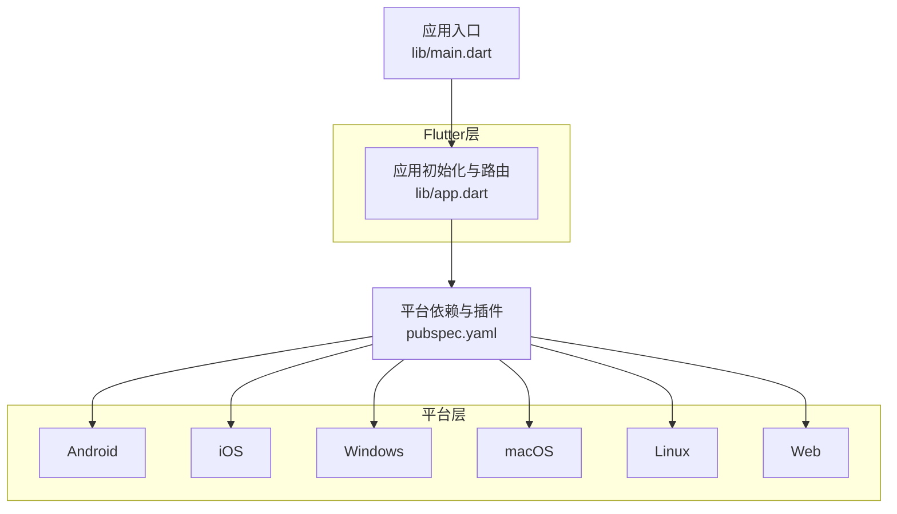
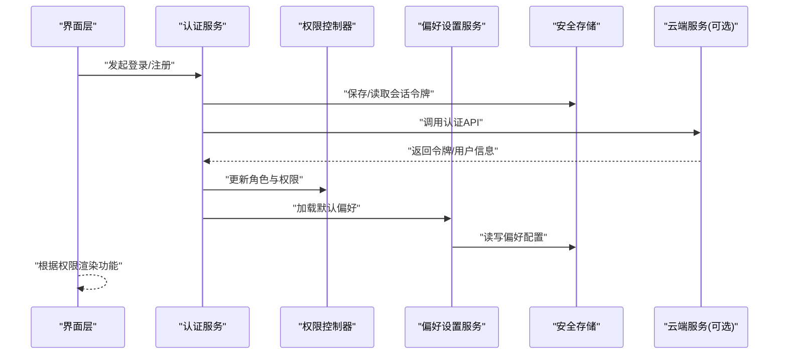
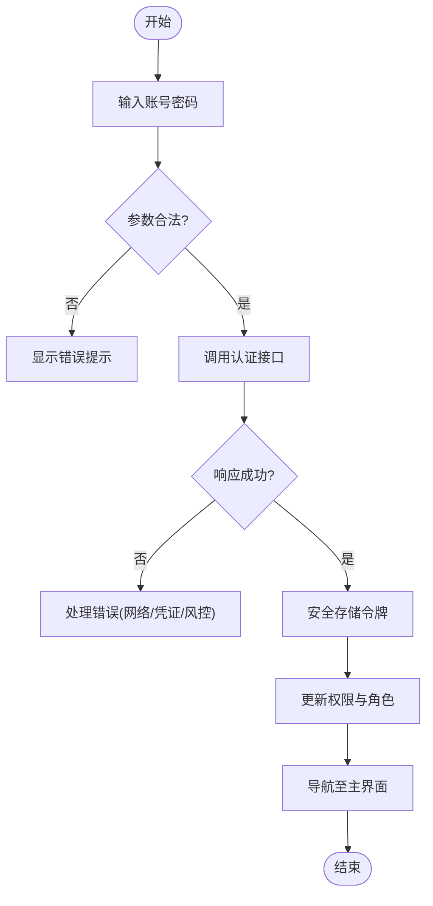
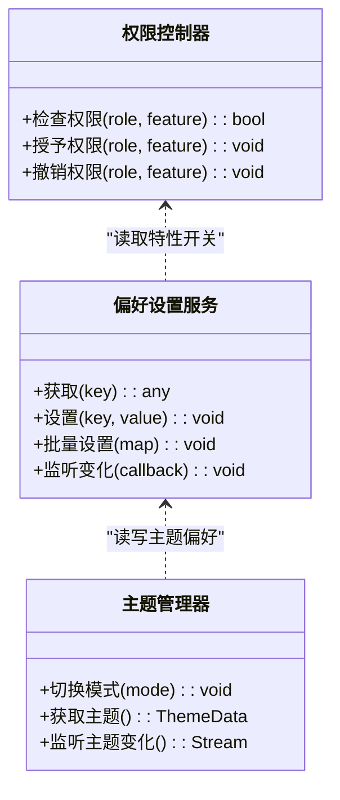
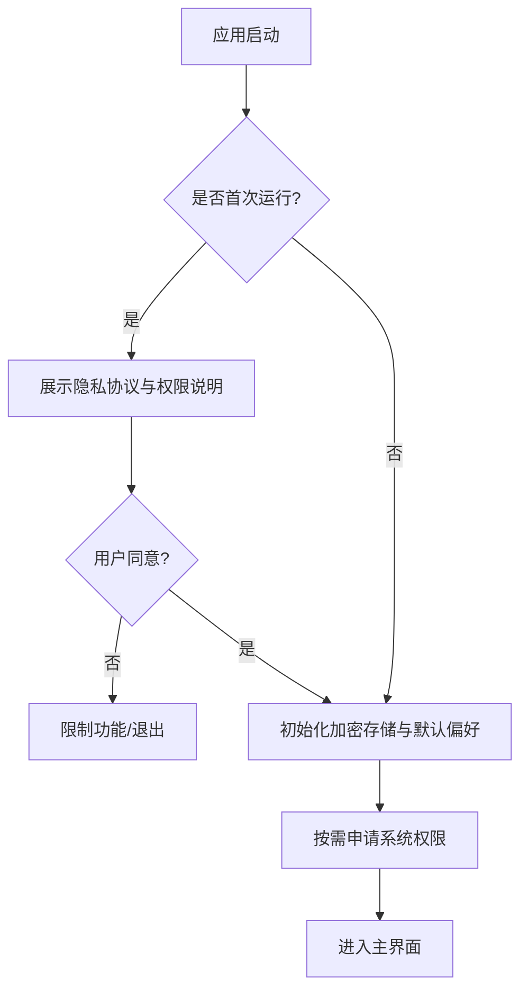
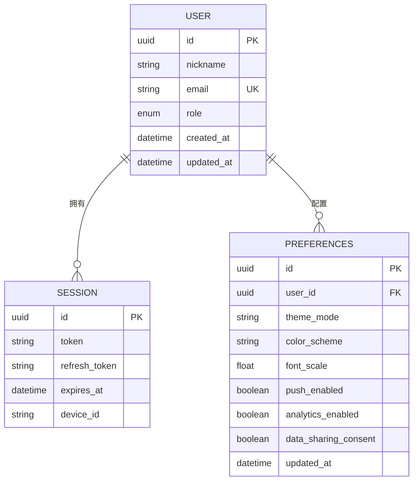
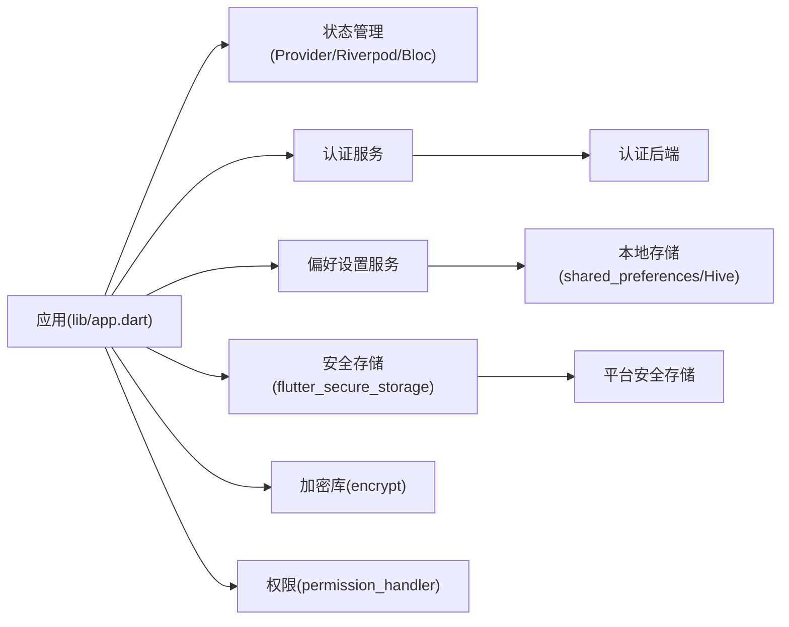

# 用户管理功能

<cite>
**本文引用的文件**   
- [lib/main.dart](file://lib/main.dart)
- [lib/app.dart](file://lib/app.dart)
- [pubspec.yaml](file://pubspec.yaml)
</cite>

## 目录
1. [简介](#简介)
2. [项目结构](#项目结构)
3. [核心组件](#核心组件)
4. [架构总览](#架构总览)
5. [详细组件分析](#详细组件分析)
6. [依赖分析](#依赖分析)
7. [性能考虑](#性能考虑)
8. [故障排查指南](#故障排查指南)
9. [结论](#结论)
10. [附录](#附录) 

## 简介
本文件面向Flutter照片整理AI应用的“用户管理”能力，聚焦以下目标：
- 用户账户管理：注册、登录、身份验证与权限控制的安全机制设计。
- 偏好设置系统：界面定制、通知设置、隐私选项等个性化配置。
- 主题定制：深色模式、颜色方案、字体设置等UI个性化。
- 隐私控制：数据加密、访问权限、本地存储保护等安全措施。
- 数据模型与状态管理：用户数据模型设计、状态管理与持久化存储的技术实现。

说明：当前仓库中尚未包含具体的用户管理业务代码（如认证服务、偏好设置、主题管理等），因此本文以架构设计与最佳实践为主，给出可落地的模块划分、数据流与集成点建议，便于后续快速实现与扩展。

## 项目结构
从仓库结构看，应用采用Flutter标准分层组织：
- lib/ 为Dart源码根目录，包含入口与页面、提供者、服务等模块。
- android/、ios/、windows/、macos/、linux/、web/ 为各平台原生或运行时适配。
- pubspec.yaml 用于声明依赖与资源。

图表来源
- [lib/main.dart:1-200](file://lib/main.dart#L1-L200)
- [lib/app.dart:1-200](file://lib/app.dart#L1-L200)
- [pubspec.yaml:1-200](file://pubspec.yaml#L1-L200)

章节来源
- [lib/main.dart:1-200](file://lib/main.dart#L1-L200)
- [lib/app.dart:1-200](file://lib/app.dart#L1-L200)
- [pubspec.yaml:1-200](file://pubspec.yaml#L1-L200)

## 核心组件
围绕用户管理，建议拆分为以下核心组件（概念性设计）：
- 认证与会话管理：负责注册、登录、令牌刷新、会话生命周期与退出。
- 权限与授权：基于角色的功能访问控制与敏感操作校验。
- 偏好设置与主题：用户界面与行为偏好（语言、主题、通知开关、隐私策略）。
- 隐私与安全：本地数据加密、密钥管理、权限申请与最小化采集。
- 数据模型与状态：用户实体、偏好实体、状态容器与持久化。
- 存储与同步：本地安全存储、云端同步与冲突解决。

说明：以上为推荐的分层与职责边界，便于在现有lib目录下按feature或layer进行组织。

## 架构总览
下图展示用户管理的端到端流程：从界面触发到认证、权限、偏好与存储的交互。

图表来源
- [lib/app.dart:1-200](file://lib/app.dart#L1-L200)
- [pubspec.yaml:1-200](file://pubspec.yaml#L1-L200)

## 详细组件分析

### 认证与会话管理
- 职责
  - 处理注册、登录、密码重置、多因素认证（可选）。
  - 管理JWT或会话令牌的生命周期（获取、刷新、过期处理、登出）。
  - 维护登录态并驱动界面跳转。
- 关键流程
  - 登录：输入凭证 -> 服务端校验 -> 下发令牌 -> 本地安全存储 -> 更新权限 -> 导航至主页。
  - 令牌刷新：拦截请求失败 -> 静默刷新 -> 重试原请求。
  - 登出：清除本地令牌与敏感缓存 -> 恢复未登录视图。
- 错误处理
  - 网络异常、凭证错误、令牌过期、服务端不可用等统一封装与提示。
- 安全要点
  - 使用平台安全存储（如flutter_secure_storage）保存令牌。
  - 避免明文日志记录敏感信息。
  - 支持设备绑定与风控（可选）。

### 权限与授权
- 职责
  - 基于用户角色或特性开关控制页面/功能可见性与可用性。
  - 对敏感操作（如删除相册、导出数据）进行二次确认与权限校验。
- 实现要点
  - 集中式权限表与动态特性开关。
  - 在路由守卫与服务调用前进行鉴权拦截。
- 常见场景
  - 普通用户 vs 管理员；订阅等级解锁高级功能。

### 偏好设置与主题
- 职责
  - 管理界面主题（浅色/深色）、颜色方案、字体大小、语言、通知开关、隐私策略同意等。
  - 提供统一的偏好读写接口，并在应用启动时加载。
- 实现要点
  - 使用独立的服务层封装偏好读写，结合Provider/Riverpod/Bloc等状态管理。
  - 主题切换应即时生效并持久化。
- 数据结构建议
  - 主题：themeMode、colorScheme、fontScale、locale。
  - 通知：pushEnabled、badgeEnabled、soundEnabled。
  - 隐私：analyticsEnabled、crashReportingEnabled、dataSharingConsent。

### 隐私与安全
- 职责
  - 本地数据加密（相册索引、标签、元数据等）。
  - 敏感权限申请（相机、相册、通知）与最小化采集。
  - 合规的用户同意与撤回机制。
- 实现要点
  - 使用平台安全存储与加密库（如encrypt）。
  - 通过平台通道或插件申请系统权限，并提供清晰的用途说明。
  - 提供隐私面板，允许用户查看与导出/删除个人数据。

### 数据模型与状态管理
- 数据模型
  - 用户：id、昵称、头像、邮箱、角色、创建时间、更新时间。
  - 会话：token、refreshToken、expiresAt、deviceId。
  - 偏好：主题、通知、隐私开关、语言等。
- 状态管理
  - 使用Provider/Riverpod/Bloc等统一管理用户状态、偏好与主题。
  - 将易变状态（如登录态、主题模式）与持久化状态（偏好）解耦。
- 持久化
  - 本地：SharedPreferences/Hive/Isar 用于非敏感配置；Secure Storage用于敏感数据。
  - 云端：可选的用户配置同步与备份。

### 集成点与外部依赖
- 认证后端：OAuth2/OIDC或自定义JWT服务。
- 安全存储：flutter_secure_storage（跨平台安全存储）。
- 加密：encrypt（AES/GCM等）。
- 权限：permission_handler（相机、相册、通知等）。
- 状态管理：provider/riverpod/bloc（任选其一）。
- 本地存储：shared_preferences/hive/isar（非敏感数据）。

章节来源
- [pubspec.yaml:1-200](file://pubspec.yaml#L1-L200)

## 依赖分析
- 直接依赖
  - Flutter框架与平台插件（由pubspec.yaml声明）。
  - 第三方库：认证、安全存储、加密、权限、状态管理与本地存储。
- 间接依赖
  - 平台SDK（Android/iOS/桌面/Web）提供的安全存储与权限能力。
- 潜在风险
  - 循环依赖：确保服务层单向依赖，避免UI直接访问底层存储。
  - 版本兼容：关注插件与Flutter版本的兼容性矩阵。

图表来源
- [pubspec.yaml:1-200](file://pubspec.yaml#L1-L200)
- [lib/app.dart:1-200](file://lib/app.dart#L1-L200)

## 性能考虑
- 懒加载与按需初始化：仅在需要时加载偏好与主题，减少冷启动耗时。
- 异步I/O：所有IO操作（网络、存储）必须异步，避免阻塞UI线程。
- 缓存策略：对只读偏好与主题配置进行内存缓存，降低频繁读写。
- 节流与去抖：高频设置变更（如字体缩放）合并写入。
- 大对象处理：避免在状态树中传递大对象，必要时使用引用或分片存储。

## 故障排查指南
- 常见问题
  - 登录失败：检查网络连通性、凭证格式、服务端状态码与错误码映射。
  - 令牌过期：确认刷新逻辑是否被触发，刷新失败时的降级策略。
  - 偏好不生效：检查读写路径是否正确，是否存在并发写入冲突。
  - 权限被拒：引导用户前往系统设置开启，并提供清晰的原因说明。
- 调试建议
  - 启用详细日志（脱敏），定位问题阶段（网络/存储/权限）。
  - 使用平台调试工具（Android Studio/Xcode）观察权限弹窗与存储文件。
  - 编写单元测试与集成测试覆盖认证、权限与偏好读写路径。

## 结论
本文给出了Flutter照片整理AI应用中用户管理功能的完整架构设计与实现建议，涵盖认证与会话、权限控制、偏好与主题、隐私与安全、数据模型与状态管理、以及依赖与性能优化。由于当前仓库尚未包含具体业务代码，建议在lib下按feature或layer新增相应模块，逐步落地上述设计，并通过测试保障质量与稳定性。

## 附录
- 建议的文件组织
  - lib/features/auth：认证与会话相关。
  - lib/features/preferences：偏好设置与主题管理。
  - lib/services：认证服务、偏好服务、权限服务等。
  - lib/models：用户、会话、偏好等数据模型。
  - lib/utils：加密、安全存储封装、权限工具。
- 参考实现清单（待补充）
  - 认证服务接口与实现
  - 偏好设置服务与主题管理器
  - 权限控制器与路由守卫
  - 数据模型定义与序列化
  - 安全存储与加密工具类