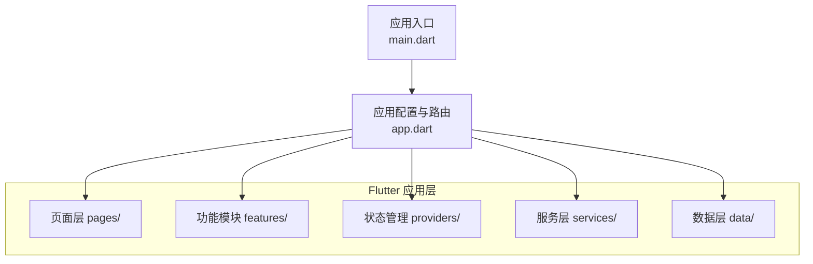
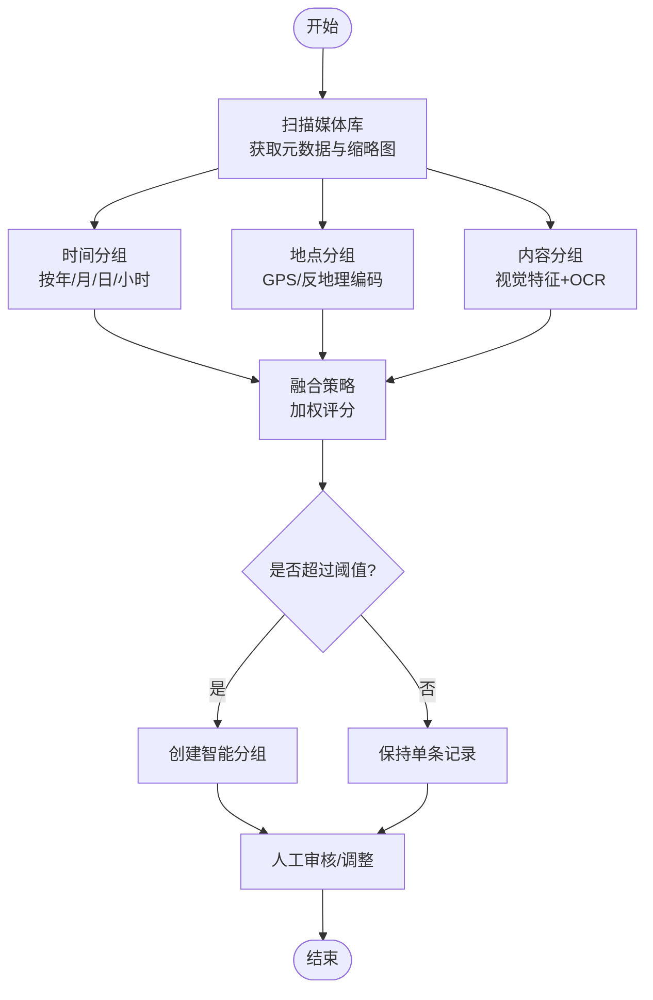
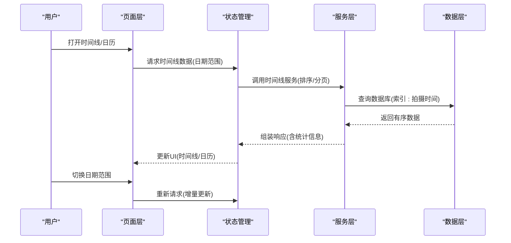
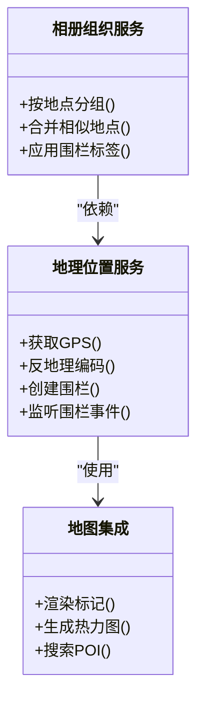
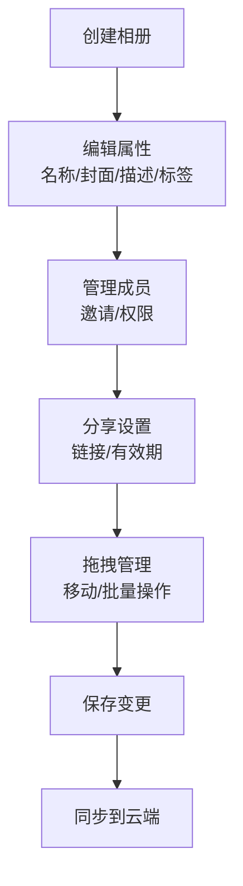
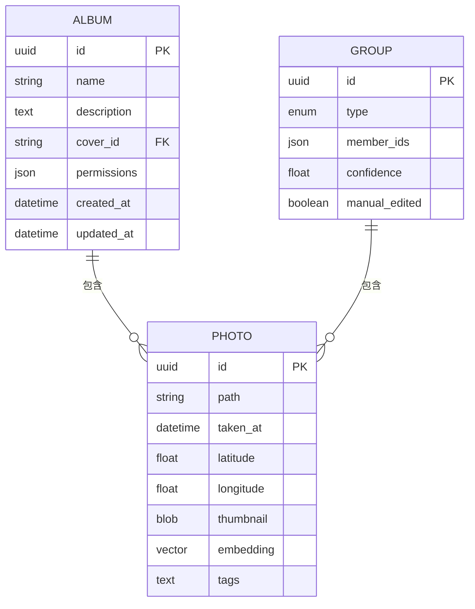
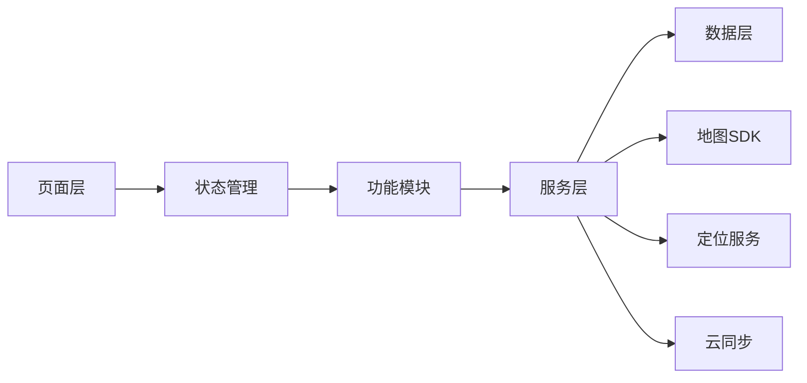

# 相册组织功能

<cite>
**本文档引用的文件**   
- [README.md](file://README.md)
- [pubspec.yaml](file://pubspec.yaml)
- [lib/main.dart](file://lib/main.dart)
- [lib/app.dart](file://lib/app.dart)
</cite>

## 目录
1. [简介](#简介)
2. [项目结构](#项目结构)
3. [核心组件](#核心组件)
4. [架构总览](#架构总览)
5. [详细组件分析](#详细组件分析)
6. [依赖关系分析](#依赖关系分析)
7. [性能考虑](#性能考虑)
8. [故障排查指南](#故障排查指南)
9. [结论](#结论)
10. [附录](#附录)

## 简介
本文件面向Flutter照片整理AI应用的“相册组织”功能，聚焦以下目标：
- 智能分组策略：基于时间、地点、内容、相似度的自动分组算法说明与实现要点。
- 时间线视图：按日期排序、日历视图、时间范围筛选等交互与数据流。
- 地理位置分类系统：GPS信息提取、地图集成、地理围栏能力。
- 自定义相册：手动创建、拖拽管理、共享设置等操作。
- 数据模型与存储：相册/照片的数据结构设计、本地存储策略与同步机制。

由于当前仓库中尚未包含具体的业务代码（lib下data/features/pages/providers/services为空），本文以架构设计与最佳实践为主，给出可落地的技术蓝图与实现建议，便于后续开发快速落地。

## 项目结构
从仓库结构看，这是一个标准的Flutter多端工程，应用入口位于lib目录下，平台相关代码在android/ios等目录。当前lib目录下的业务模块尚未填充，因此“相册组织”功能的实现将在后续逐步加入data、features、pages、providers、services等分层。



图表来源 
- [lib/main.dart:1-200](file://lib/main.dart#L1-L200)
- [lib/app.dart:1-200](file://lib/app.dart#L1-L200)

章节来源
- [README.md:1-200](file://README.md#L1-L200)
- [pubspec.yaml:1-200](file://pubspec.yaml#L1-L200)
- [lib/main.dart:1-200](file://lib/main.dart#L1-L200)
- [lib/app.dart:1-200](file://lib/app.dart#L1-L200)

## 核心组件
围绕“相册组织”功能，建议采用分层架构与清晰职责划分：
- 页面层（pages）：时间线视图、日历视图、相册列表、相册详情、编辑与共享设置等UI。
- 功能模块（features）：相册组织、智能分组、地理分类、时间线浏览等特性封装。
- 状态管理（providers）：相册集合、分组结果、筛选条件、用户偏好等状态。
- 服务层（services）：媒体扫描、元数据提取、图像相似度计算、地图与定位服务、同步服务。
- 数据层（data）：相册/照片实体定义、本地存储（SQLite/Isar/Hive）、缓存与索引、同步队列。

章节来源
- [lib/main.dart:1-200](file://lib/main.dart#L1-L200)
- [lib/app.dart:1-200](file://lib/app.dart#L1-L200)

## 架构总览
下图展示“相册组织”功能在Flutter应用中的整体架构与关键交互：

```mermaid
graph TB
UI["页面层<br/>时间线/日历/相册详情"] --> Provider["状态管理<br/>Provider/Bloc/Riverpod"]
Provider --> Feature["功能模块<br/>智能分组/地理分类/时间线"]
Feature --> Service["服务层<br/>媒体扫描/元数据/相似度/地图/同步"]
Service --> Data["数据层<br/>实体/存储/缓存/索引"]
Data --> Storage["本地存储<br/>SQLite/Isar/Hive"]
Service --> External["外部服务<br/>地图API/云同步/权限"]
UI <- --> Provider
```

图表来源 
- [lib/main.dart:1-200](file://lib/main.dart#L1-L200)
- [lib/app.dart:1-200](file://lib/app.dart#L1-L200)

## 详细组件分析

### 智能分组策略（时间、地点、内容、相似度）
- 时间分组
  - 依据拍摄时间或修改时间进行聚合，支持按年/月/日/小时维度分组。
  - 对无时间信息的媒体，使用文件创建时间或导入时间作为降级策略。
- 地点分组
  - 优先读取EXIF GPS坐标；若无则回退到网络位置或IP推断。
  - 将相近坐标聚类为“地点”，支持地名解析与别名合并。
- 内容分组
  - 基于图像特征（颜色直方图、SIFT/ORB描述子、深度学习嵌入向量）进行相似度匹配。
  - 结合OCR文本识别结果，对含文字的图片进行主题聚类。
- 相似度分组
  - 设定阈值与权重，综合时间邻近度、空间距离、视觉相似度，输出候选组。
  - 提供人工修正接口，允许用户合并/拆分分组。



图表来源 
- [lib/main.dart:1-200](file://lib/main.dart#L1-L200)
- [lib/app.dart:1-200](file://lib/app.dart#L1-L200)

章节来源
- [lib/main.dart:1-200](file://lib/main.dart#L1-L200)
- [lib/app.dart:1-200](file://lib/app.dart#L1-L200)

### 时间线视图（按日期排序、日历视图、时间范围筛选）
- 按日期排序
  - 后端返回有序的时间线数据，前端分页加载，支持无限滚动。
  - 对缺失时间的条目，使用默认时间占位并标注“未知时间”。
- 日历视图
  - 以月视图展示有照片的日期，点击日期跳转至对应时间线片段。
  - 支持周/日视图切换，显示当日照片数量与缩略图预览。
- 时间范围筛选
  - 提供起止时间选择器，支持快捷范围（今天、本周、本月、去年）。
  - 筛选条件变化时触发增量更新，避免全量重算。



图表来源 
- [lib/main.dart:1-200](file://lib/main.dart#L1-L200)
- [lib/app.dart:1-200](file://lib/app.dart#L1-L200)

章节来源
- [lib/main.dart:1-200](file://lib/main.dart#L1-L200)
- [lib/app.dart:1-200](file://lib/app.dart#L1-L200)

### 地理位置分类系统（GPS提取、地图集成、地理围栏）
- GPS信息提取
  - 读取EXIF GPS字段，若缺失则尝试设备最近一次定位或网络位置。
  - 坐标清洗与去噪（异常值过滤、重复点合并）。
- 地图集成
  - 使用地图SDK展示照片位置，支持热力图与标记密度。
  - 地名解析与POI关联，提升可读性。
- 地理围栏
  - 定义区域（家、公司、常去地），当新照片进入区域时自动打标。
  - 支持围栏事件回调与批量处理。



图表来源 
- [lib/main.dart:1-200](file://lib/main.dart#L1-L200)
- [lib/app.dart:1-200](file://lib/app.dart#L1-L200)

章节来源
- [lib/main.dart:1-200](file://lib/main.dart#L1-L200)
- [lib/app.dart:1-200](file://lib/app.dart#L1-L200)

### 自定义相册（手动创建、拖拽管理、共享设置）
- 手动创建
  - 支持命名、封面选择、描述、标签、可见性设置。
- 拖拽管理
  - 支持跨相册移动、批量操作、撤销/重做。
- 共享设置
  - 邀请成员、权限控制（只读/编辑）、分享链接有效期。



图表来源 
- [lib/main.dart:1-200](file://lib/main.dart#L1-L200)
- [lib/app.dart:1-200](file://lib/app.dart#L1-L200)

章节来源
- [lib/main.dart:1-200](file://lib/main.dart#L1-L200)
- [lib/app.dart:1-200](file://lib/app.dart#L1-L200)

### 相册数据模型设计、存储策略与同步机制
- 数据模型
  - 照片实体：唯一ID、路径/URL、拍摄时间、位置、缩略图、特征向量、标签。
  - 相册实体：唯一ID、名称、描述、封面、成员、权限、创建/更新时间。
  - 分组实体：类型（时间/地点/内容/相似度）、成员ID集合、置信度、人工修正标记。
- 存储策略
  - 本地数据库：SQLite/Isar/Hive，建立时间、地点、标签索引，支持高效查询。
  - 缓存层：缩略图与特征向量缓存，LRU淘汰策略。
  - 索引优化：全文检索（标题/描述/OCR文本）、向量索引（近似最近邻）。
- 同步机制
  - 增量同步：基于时间戳与版本号，冲突解决策略（最后写入胜出/合并）。
  - 离线优先：本地可写，网络恢复后自动同步，失败重试与幂等性保证。
  - 安全传输：HTTPS/TLS，端到端加密可选。



图表来源 
- [lib/main.dart:1-200](file://lib/main.dart#L1-L200)
- [lib/app.dart:1-200](file://lib/app.dart#L1-L200)

章节来源
- [lib/main.dart:1-200](file://lib/main.dart#L1-L200)
- [lib/app.dart:1-200](file://lib/app.dart#L1-L200)

## 依赖关系分析
- 内部依赖
  - 页面层依赖状态管理与服务层，服务层依赖数据层与外部服务。
  - 功能模块通过服务层解耦具体实现，便于替换与测试。
- 外部依赖
  - 地图SDK、定位服务、媒体库访问、云同步服务。
  - 权限管理（相机、相册、位置、网络）。



图表来源 
- [lib/main.dart:1-200](file://lib/main.dart#L1-L200)
- [lib/app.dart:1-200](file://lib/app.dart#L1-L200)

章节来源
- [lib/main.dart:1-200](file://lib/main.dart#L1-L200)
- [lib/app.dart:1-200](file://lib/app.dart#L1-L200)

## 性能考虑
- 媒体扫描与缩略图生成应异步化，避免阻塞主线程。
- 使用分页与懒加载减少内存占用，合理设置缓存大小。
- 图像相似度计算可采用GPU加速或轻量模型，降低CPU压力。
- 数据库查询需利用索引，避免全表扫描；复杂查询拆分为多次简单查询。
- 同步任务后台执行，支持断点续传与冲突合并。

## 故障排查指南
- 权限问题
  - 检查相册、位置、网络权限是否授予；在设置中确认授权状态。
- 数据不一致
  - 核对本地与云端版本，检查同步日志与错误码；必要时执行强制同步。
- 性能卡顿
  - 监控内存与CPU使用，定位热点函数；优化图片解码与缓存策略。
- 地图与定位
  - 验证GPS精度与反地理编码结果；检查地图SDK初始化与密钥配置。

## 结论
本文给出了“相册组织”功能的完整架构蓝图与实现要点，涵盖智能分组、时间线视图、地理位置分类、自定义相册以及数据模型与同步机制。尽管当前仓库尚未包含具体业务代码，但上述设计可直接指导后续开发落地，确保功能可扩展、性能可控、用户体验良好。

## 附录
- 推荐插件与库
  - 媒体访问：image_picker, gallery_saver
  - 地图与定位：google_maps_flutter, geolocator
  - 本地存储：sqflite, isar, hive
  - 状态管理：provider, bloc, riverpod
- 参考文档
  - Flutter官方文档
  - 各平台SDK文档（Android/iOS）