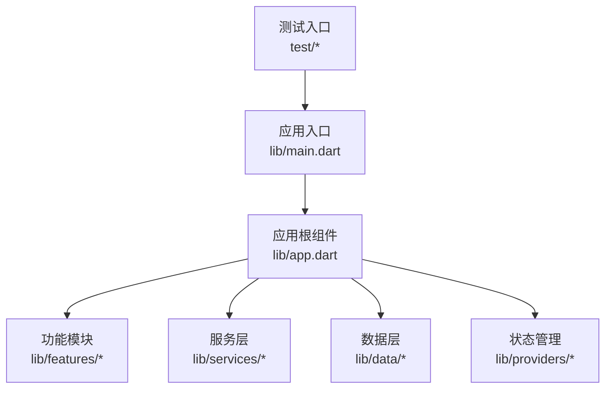
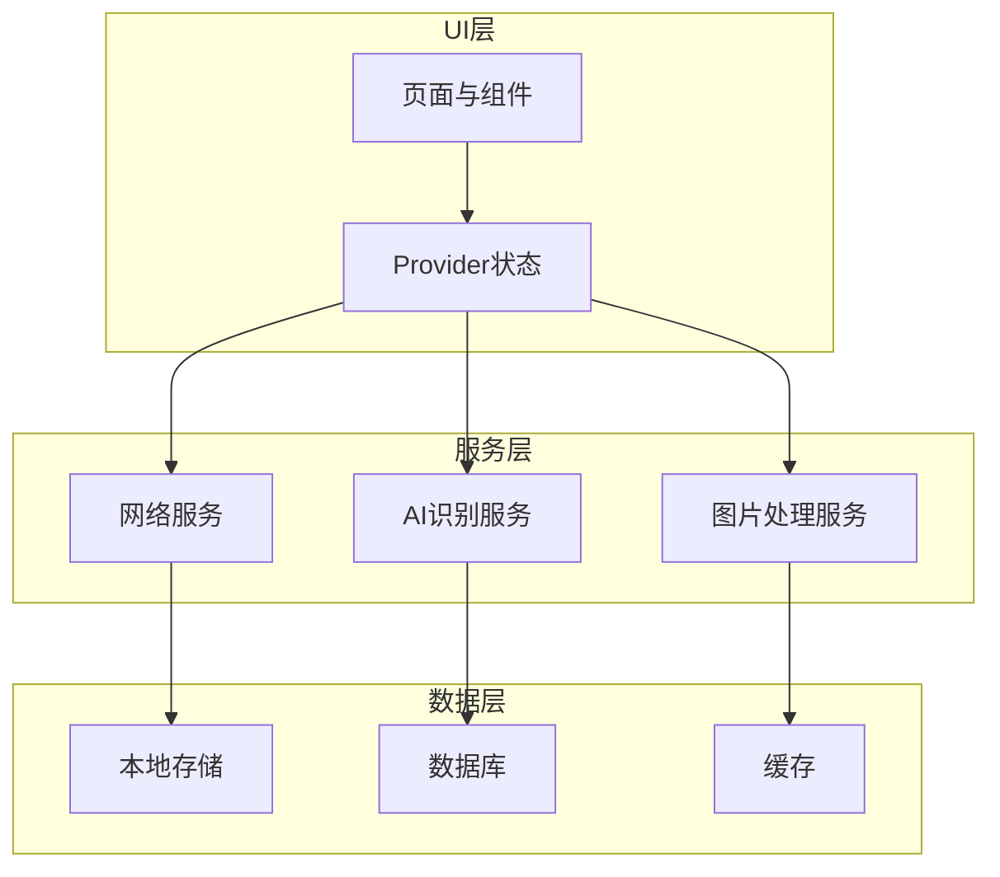
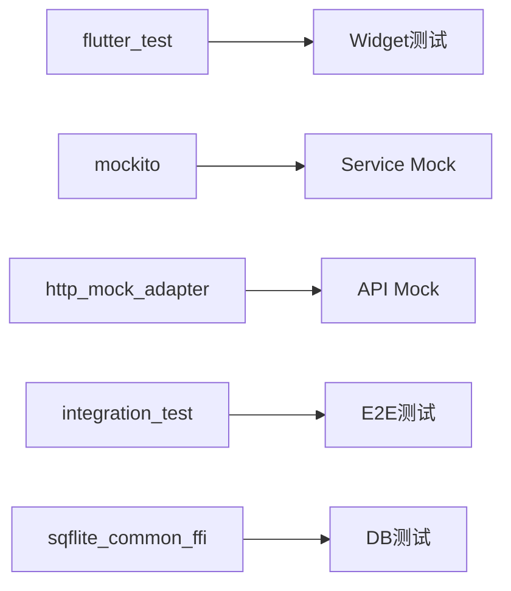

# 测试策略

<cite>
**本文引用的文件**   
- [README.md](file://README.md)
- [pubspec.yaml](file://pubspec.yaml)
- [analysis_options.yaml](file://analysis_options.yaml)
- [lib/main.dart](file://lib/main.dart)
- [lib/app.dart](file://lib/app.dart)
- [android/app/src/main/AndroidManifest.xml](file://android/app/src/main/AndroidManifest.xml)
- [ios/Runner/Info.plist](file://ios/Runner/Info.plist)
- [test/](file://test/)
</cite>

## 目录
1. [简介](#简介)
2. [项目结构](#项目结构)
3. [核心组件](#核心组件)
4. [架构总览](#架构总览)
5. [详细组件分析](#详细组件分析)
6. [依赖分析](#依赖分析)
7. [性能考虑](#性能考虑)
8. [故障排查指南](#故障排查指南)
9. [结论](#结论)
10. [附录](#附录)

## 简介
本测试策略文档面向Flutter照片整理AI应用，覆盖单元测试、集成测试与端到端测试的完整方案。内容包含：
- 单元测试：Widget测试、Provider状态管理测试、Service层测试、Data层测试
- 集成测试：页面流程测试、API集成测试、数据库操作测试
- 端到端测试：用户交互模拟、跨页面流程、自动化脚本
- 测试数据与Mock：假数据生成、外部服务模拟、依赖注入
- 测试环境搭建：测试配置、测试数据库、测试服务器
- 持续集成：自动化流水线、测试结果报告、质量门禁
- 最佳实践与示例指引（以路径引用代替代码片段）

## 项目结构
该Flutter工程采用多平台结构，核心业务位于lib目录，测试入口在test目录。关键文件包括：
- lib/main.dart：应用启动入口
- lib/app.dart：应用根组件与路由配置
- pubspec.yaml：依赖声明与测试相关包
- analysis_options.yaml：静态分析与测试规范约束
- android/ios等平台的清单与权限配置，影响测试环境与权限行为

图表来源
- [lib/main.dart:1-200](file://lib/main.dart#L1-L200)
- [lib/app.dart:1-200](file://lib/app.dart#L1-L200)

章节来源
- [pubspec.yaml:1-200](file://pubspec.yaml#L1-L200)
- [lib/main.dart:1-200](file://lib/main.dart#L1-L200)
- [lib/app.dart:1-200](file://lib/app.dart#L1-L200)

## 核心组件
- 应用入口与根组件：负责初始化依赖、配置主题与路由，为测试提供可替换的根Widget
- 状态管理（Provider）：集中管理相册、分类、标签等状态，便于在测试中注入Mock或假数据
- 服务层：封装网络请求、AI识别服务、图片处理等能力，适合通过接口抽象进行Mock
- 数据层：本地存储、缓存、数据库访问，适合使用内存实现或SQLite内存库进行测试

章节来源
- [lib/main.dart:1-200](file://lib/main.dart#L1-L200)
- [lib/app.dart:1-200](file://lib/app.dart#L1-L200)

## 架构总览
整体架构遵循分层设计：UI层通过Provider消费状态，调用Service完成业务逻辑，Service再访问Data层进行持久化或网络交互。测试策略按层次隔离依赖，确保各层独立验证。

图表来源
- [lib/app.dart:1-200](file://lib/app.dart#L1-L200)
- [lib/main.dart:1-200](file://lib/main.dart#L1-L200)

## 详细组件分析

### Widget测试策略
- 目标：验证界面渲染、交互响应、状态更新是否正确
- 方法：
  - 使用flutter_test框架构建Widget树，驱动点击、输入等操作
  - 使用finders定位元素，断言文本、颜色、可见性变化
  - 对异步加载使用pump和pumpUntil等待状态稳定
- 建议：
  - 将复杂Widget拆分为小组件，提升可测性
  - 使用MaterialApp/MockNavigator包装路由，避免真实跳转
  - 针对图片展示组件，使用假图或占位符替代真实资源

章节来源
- [lib/app.dart:1-200](file://lib/app.dart#L1-L200)

### Provider测试策略
- 目标：验证状态变更、副作用触发、依赖注入正确性
- 方法：
  - 使用ProviderContainer或TestWidgetsFlutterBinding.setupHandler创建测试容器
  - 注入Mock服务或假数据Provider，断言状态流符合预期
  - 对异步操作使用fake_async或mockito模拟Future返回值
- 建议：
  - 将Provider与UI解耦，便于单独测试状态逻辑
  - 对网络/IO副作用统一抽象到Service层，避免在Provider中直接耦合

章节来源
- [lib/app.dart:1-200](file://lib/app.dart#L1-L200)

### Service测试策略
- 目标：验证业务逻辑、错误处理、重试机制
- 方法：
  - 使用http_mock_adapter或dio_mock模拟HTTP响应
  - 对AI识别服务使用假模型返回固定结果
  - 对图片处理服务使用内存图像或字节数组
- 建议：
  - 定义清晰的接口契约，便于Mock实现
  - 对超时、网络异常、解析失败等边界条件编写用例

章节来源
- [lib/main.dart:1-200](file://lib/main.dart#L1-L200)

### Data层测试策略
- 目标：验证数据存取、缓存策略、事务一致性
- 方法：
  - 使用SQLite内存库或InMemoryStorage实现本地存储
  - 对JSON序列化/反序列化使用假数据进行断言
  - 对并发写入使用锁或队列模拟
- 建议：
  - 将数据访问抽象为Repository接口，便于替换实现
  - 对迁移脚本编写回滚与升级用例

章节来源
- [lib/main.dart:1-200](file://lib/main.dart#L1-L200)

### 集成测试策略
- 目标：验证页面流程、API交互、数据库操作的端到端一致性
- 方法：
  - 使用integration_test框架驱动真实设备或模拟器
  - 使用MockServer或本地测试服务器拦截API请求
  - 使用测试数据库预置数据，验证查询与更新
- 建议：
  - 对长流程拆分多个小步骤，提高稳定性
  - 对敏感操作（如删除）添加确认断言

章节来源
- [test/:1-200](file://test/#L1-L200)

### 端到端测试策略
- 目标：模拟真实用户行为，覆盖跨页面流程
- 方法：
  - 使用Flutter Driver或integration_test进行自动化脚本编写
  - 对AI识别流程使用固定输入图片与期望输出
  - 对权限请求（相机、存储）使用测试模式绕过
- 建议：
  - 对慢操作添加等待策略，避免随机失败
  - 记录测试日志与截图，便于问题定位

章节来源
- [test/:1-200](file://test/#L1-L200)

### 测试数据管理与Mock策略
- 假数据生成：
  - 使用faker或自定义工厂生成相册、标签、元数据
  - 对图片使用占位图或内存字节数组
- 外部服务模拟：
  - 使用http_mock_adapter或dio_mock拦截网络请求
  - 对AI服务返回固定分类结果
- 依赖注入：
  - 使用Provider的overrideWith或TestContainer注入Mock实现
  - 对全局单例使用测试专用实例

章节来源
- [pubspec.yaml:1-200](file://pubspec.yaml#L1-L200)

### 测试环境搭建
- 测试配置：
  - 在pubspec.yaml中声明测试依赖（flutter_test、mockito、http_mock_adapter等）
  - 在analysis_options.yaml中启用严格规则，确保测试代码质量
- 测试数据库：
  - 使用SQLite内存库或测试专用数据库文件
  - 预置必要数据，清理测试后自动释放
- 测试服务器：
  - 使用本地MockServer或Dio的FakeClient拦截请求
  - 对AI服务使用本地JSON响应文件

章节来源
- [pubspec.yaml:1-200](file://pubspec.yaml#L1-L200)
- [analysis_options.yaml:1-200](file://analysis_options.yaml#L1-L200)

### 持续集成中的测试执行
- 自动化流水线：
  - 在CI中安装Flutter SDK与依赖，运行单元测试与集成测试
  - 并行执行不同平台的测试任务（Android/iOS/Web）
- 测试结果报告：
  - 生成JUnit XML或HTML报告，上传至CI平台
  - 对失败用例自动截图与日志归档
- 质量门禁：
  - 设置覆盖率阈值（如80%），低于阈值阻断合并
  - 对静态分析失败或测试失败阻止发布

章节来源
- [pubspec.yaml:1-200](file://pubspec.yaml#L1-L200)

## 依赖分析
测试依赖主要集中在测试工具与Mock库，确保与生产代码解耦。关键依赖包括：
- flutter_test：基础测试框架
- mockito：Mock对象生成
- http_mock_adapter/dio_mock：网络请求模拟
- integration_test：端到端测试框架
- sqflite_common_ffi：SQLite内存支持

图表来源
- [pubspec.yaml:1-200](file://pubspec.yaml#L1-L200)

章节来源
- [pubspec.yaml:1-200](file://pubspec.yaml#L1-L200)

## 性能考虑
- 单元测试应快速执行，避免IO与网络调用
- 集成测试尽量使用内存数据库与Mock服务
- 端到端测试避免频繁重启应用，复用测试会话
- 对耗时操作使用异步断言与超时控制

[本节为通用指导，无需特定文件来源]

## 故障排查指南
- 常见问题：
  - Widget测试找不到元素：检查finders选择器与pump时机
  - Provider状态未更新：确认TestContainer与overrideWith使用正确
  - API测试失败：检查MockServer端口与请求匹配规则
  - 数据库测试不一致：确保事务提交与数据清理
- 调试技巧：
  - 使用print或logging输出关键状态
  - 对异步操作使用expectLater与pumpUntil
  - 对网络请求打印URL与响应体

章节来源
- [lib/main.dart:1-200](file://lib/main.dart#L1-L200)
- [lib/app.dart:1-200](file://lib/app.dart#L1-L200)

## 结论
本测试策略覆盖了从单元到端到端的完整测试体系，通过分层Mock与依赖注入确保测试稳定性与可维护性。建议在开发过程中同步编写测试，结合持续集成实现质量门禁，保障照片整理AI应用的可靠性与可扩展性。

[本节为总结性内容，无需特定文件来源]

## 附录
- 测试命令参考：
  - 单元测试：flutter test
  - 集成测试：flutter test integration_test
  - 覆盖率：flutter test --coverage
- 最佳实践清单：
  - 每个公共函数应有对应测试用例
  - 对边界条件与异常路径进行覆盖
  - 使用描述性测试名称，便于定位问题
  - 定期清理过时测试，保持测试集精简

[本节为补充信息，无需特定文件来源]