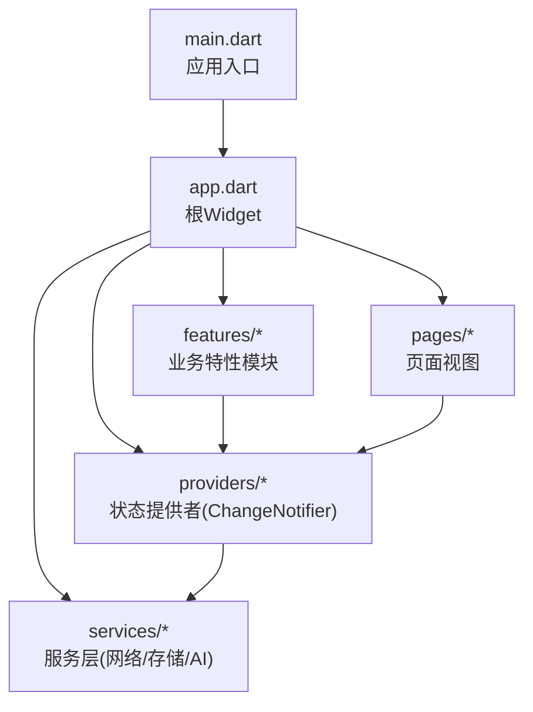
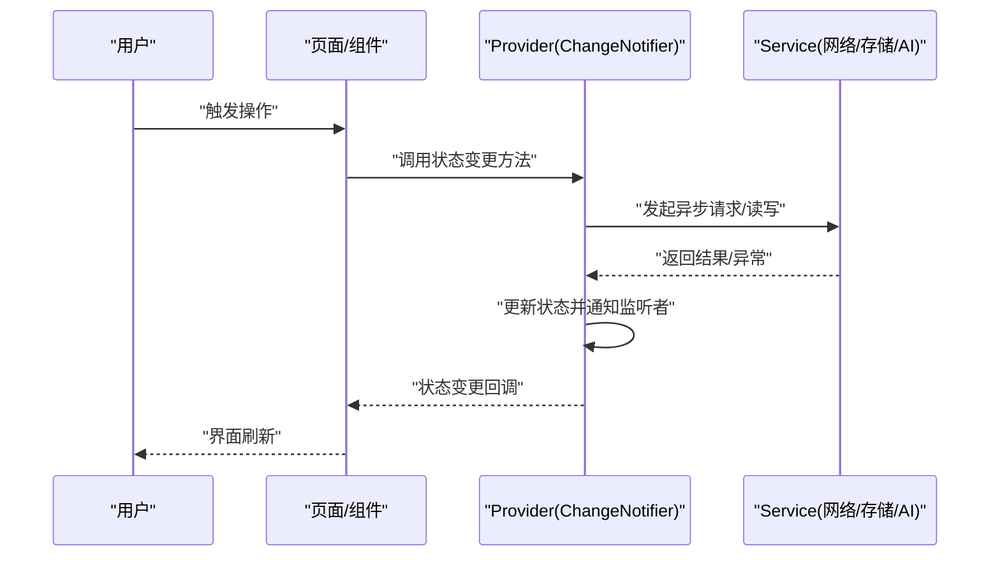
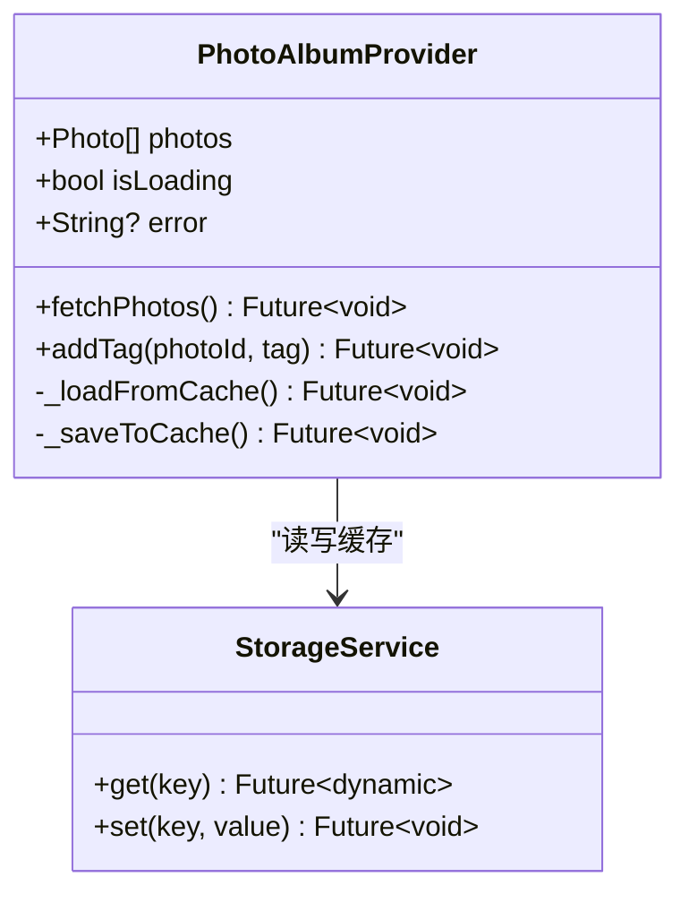
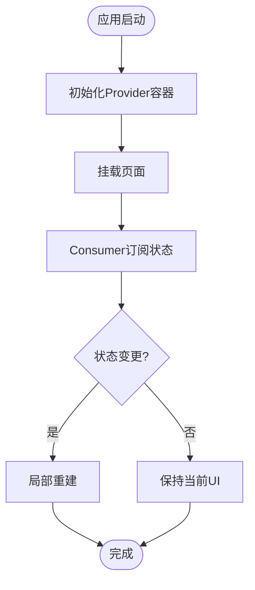
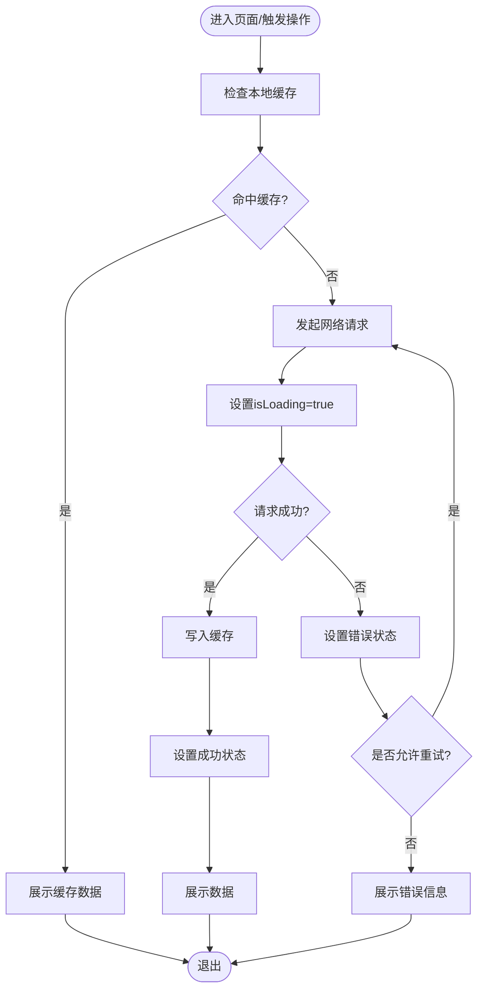
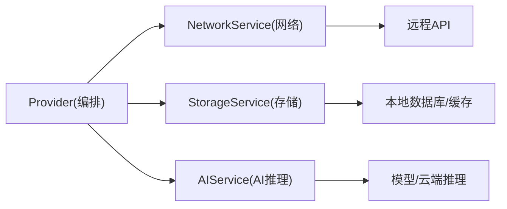
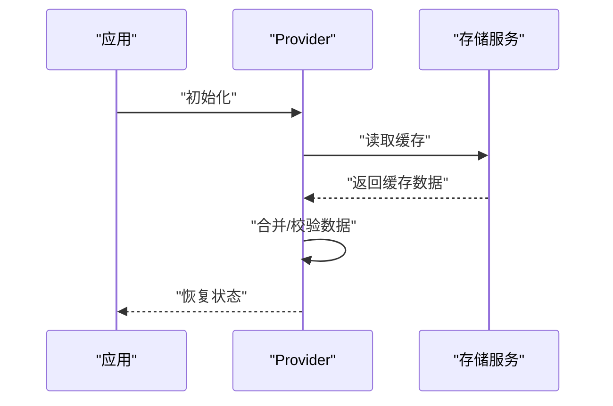
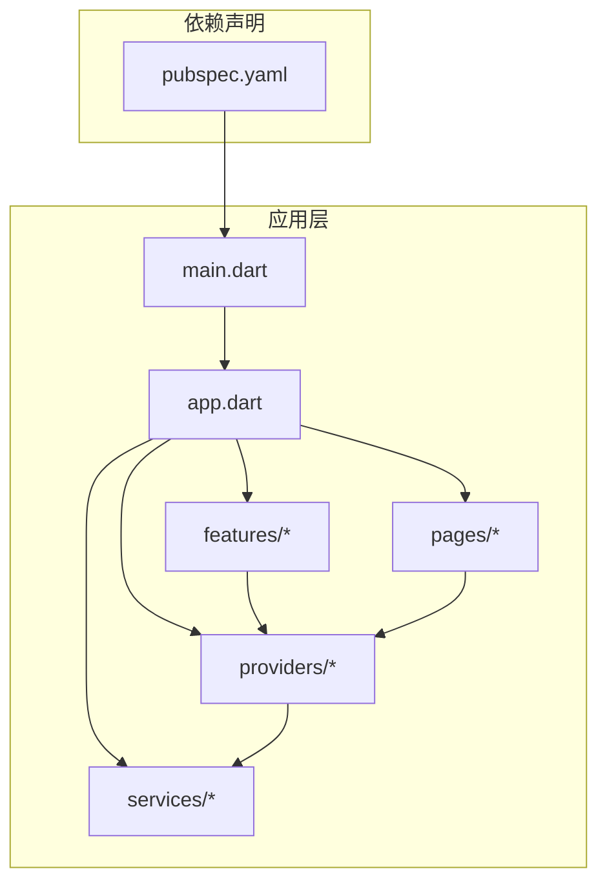

# 状态管理

<cite>
**本文引用的文件**   
- [pubspec.yaml](file://pubspec.yaml)
- [main.dart](file://lib/main.dart)
- [app.dart](file://lib/app.dart)
- [providers/](file://lib/providers/)
- [services/](file://lib/services/)
- [features/](file://lib/features/)
- [pages/](file://lib/pages/)
</cite>

## 目录
1. [简介](#简介)
2. [项目结构](#项目结构)
3. [核心组件](#核心组件)
4. [架构总览](#架构总览)
5. [详细组件分析](#详细组件分析)
6. [依赖分析](#依赖分析)
7. [性能考虑](#性能考虑)
8. [故障排查指南](#故障排查指南)
9. [结论](#结论)
10. [附录](#附录)

## 简介
本技术文档面向Flutter照片整理AI应用的状态管理，围绕Provider模式展开，系统阐述ChangeNotifier、Consumer、Provider容器等核心概念的使用；说明状态设计模式（状态提升、单向数据流、状态不可变性）；解释业务逻辑封装与异步状态处理（加载/错误/成功统一）；给出状态持久化策略（本地缓存、状态恢复）；并提供常见使用模式与最佳实践、性能优化技巧与调试方法。

## 项目结构
本项目采用分层组织：
- lib/main.dart：应用入口，负责初始化Provider容器与全局配置
- lib/app.dart：应用根Widget，装配路由与主题
- lib/providers/*：按功能域划分的状态提供者（ChangeNotifier子类），暴露状态与变更方法
- lib/services/*：网络、存储、AI服务等基础设施，被Provider调用
- lib/features/*：按业务特性聚合的UI与交互
- lib/pages/*：页面级视图，通过Consumer或context.read/watch获取状态

图表来源
- [main.dart](file://lib/main.dart)
- [app.dart](file://lib/app.dart)
- [providers/](file://lib/providers/)
- [services/](file://lib/services/)
- [features/](file://lib/features/)
- [pages/](file://lib/pages/)

章节来源
- [pubspec.yaml](file://pubspec.yaml)
- [main.dart](file://lib/main.dart)
- [app.dart](file://lib/app.dart)

## 核心组件
- ChangeNotifier：状态载体，封装业务状态与变更方法，触发UI更新
- Provider容器：在应用树中注入状态实例，供子树消费
- Consumer：以声明式方式订阅特定状态，最小化重建范围
- 组合式Provider：将多个状态提供者组合为单一上下文，简化读取
- 异步状态：在ChangeNotifier中使用Future/Stream统一管理加载、错误、成功状态
- 持久化：结合本地存储（如SharedPreferences/SQLite/Isar）实现状态恢复

章节来源
- [pubspec.yaml](file://pubspec.yaml)
- [main.dart](file://lib/main.dart)
- [app.dart](file://lib/app.dart)

## 架构总览
Provider驱动的单向数据流：
- UI通过Consumer或context.watch/read访问状态
- 用户操作触发Provider中的方法
- Provider调用Service进行IO或计算
- Service返回结果后，Provider更新内部状态并notifyListeners
- UI自动响应变化并重建

图表来源
- [providers/](file://lib/providers/)
- [services/](file://lib/services/)
- [pages/](file://lib/pages/)

## 详细组件分析

### 状态提供者（ChangeNotifier）设计
- 职责边界清晰：每个Provider聚焦一个业务域（如相册、标签、AI分类）
- 状态不可变：对外暴露只读快照，内部维护可变副本，避免共享突变
- 方法命名规范：fetch/load/update/save/reset等动词明确意图
- 错误处理：统一捕获异常，设置错误状态，提供重试机制
- 日志与可观测性：关键路径打印日志，便于调试

图表来源
- [providers/](file://lib/providers/)
- [services/](file://lib/services/)

章节来源
- [providers/](file://lib/providers/)
- [services/](file://lib/services/)

### 消费者（Consumer）与Provider容器
- 使用Consumer包裹需要订阅的Widget树，减少不必要的重建
- 使用MultiProvider组合多个状态，避免嵌套过深
- 使用context.read进行一次性读取（不订阅），context.watch用于订阅
- 按需拆分Provider粒度，平衡可读性与性能

图表来源
- [main.dart](file://lib/main.dart)
- [app.dart](file://lib/app.dart)
- [providers/](file://lib/providers/)

章节来源
- [main.dart](file://lib/main.dart)
- [app.dart](file://lib/app.dart)
- [providers/](file://lib/providers/)

### 异步状态处理（加载/错误/成功）
- 统一状态模型：isLoading、error、data三态
- 生命周期：开始→加载中→成功/失败→可选重试
- 防抖与取消：对频繁操作进行节流，支持取消进行中请求
- 错误提示：区分网络错误、业务错误、解析错误，提供友好提示

图表来源
- [providers/](file://lib/providers/)
- [services/](file://lib/services/)

章节来源
- [providers/](file://lib/providers/)
- [services/](file://lib/services/)

### 业务逻辑封装与服务层
- 服务层职责：网络请求、数据库存取、AI推理调用、第三方SDK集成
- Provider仅编排调用流程与状态转换，不包含具体IO细节
- 接口抽象：通过抽象类/接口隔离实现，便于测试替换
- 错误映射：将底层异常映射为领域错误类型，向上抛出

图表来源
- [services/](file://lib/services/)
- [providers/](file://lib/providers/)

章节来源
- [services/](file://lib/services/)
- [providers/](file://lib/providers/)

### 状态持久化与恢复
- 缓存策略：热数据短期缓存（内存）、冷数据长期缓存（磁盘）
- 序列化：定义清晰的DTO与版本兼容策略
- 恢复时机：应用启动时恢复关键状态，保证用户体验连续性
- 一致性：写回顺序与幂等性，避免脏数据

图表来源
- [providers/](file://lib/providers/)
- [services/](file://lib/services/)

章节来源
- [providers/](file://lib/providers/)
- [services/](file://lib/services/)

### 常见使用模式与最佳实践
- 小粒度Provider：按功能域拆分，避免单例过大
- 不可变状态：对外暴露只读快照，内部变更后再notify
- 精确订阅：使用Consumer限定重建范围，避免全局重建
- 统一错误：集中处理异常，提供重试与降级
- 可测试性：通过Mock服务与独立测试Provider逻辑

章节来源
- [providers/](file://lib/providers/)
- [services/](file://lib/services/)
- [pages/](file://lib/pages/)

## 依赖分析
- 外部依赖：通过pubspec.yaml声明Provider及相关插件
- 内部依赖：Provider依赖Service，UI依赖Provider
- 循环依赖：避免Provider之间直接互相引用，必要时通过事件总线或中间层解耦

图表来源
- [pubspec.yaml](file://pubspec.yaml)
- [main.dart](file://lib/main.dart)
- [app.dart](file://lib/app.dart)
- [providers/](file://lib/providers/)
- [services/](file://lib/services/)
- [features/](file://lib/features/)
- [pages/](file://lib/pages/)

章节来源
- [pubspec.yaml](file://pubspec.yaml)
- [main.dart](file://lib/main.dart)
- [app.dart](file://lib/app.dart)

## 性能考虑
- 细粒度订阅：使用Consumer包裹最小必要区域，避免整页重建
- 惰性加载：按需初始化Provider与资源，减少启动开销
- 缓存优先：先读缓存再请求网络，降低延迟与带宽
- 批量更新：合并多次状态变更，减少notify次数
- 图片优化：缩略图、懒加载、内存回收
- 调试工具：使用Provider调试面板观察状态变化与重建次数

[本节为通用指导，不直接分析具体文件]

## 故障排查指南
- 常见问题
  - 状态未更新：确认是否正确notifyListeners或使用watch
  - 重复请求：检查防抖/去重逻辑与取消机制
  - 缓存不一致：确保写回顺序与版本号一致
  - 内存泄漏：注意订阅生命周期与清理
- 定位手段
  - 打印关键路径日志
  - 使用断点与变量监视
  - 借助Provider调试面板观察状态树
- 修复建议
  - 统一错误处理与重试
  - 引入幂等与补偿机制
  - 增加单元测试与集成测试覆盖

章节来源
- [providers/](file://lib/providers/)
- [services/](file://lib/services/)

## 结论
通过Provider模式构建的照片整理AI应用，实现了清晰的状态管理与单向数据流。ChangeNotifier承载状态与变更，Consumer精准订阅，Provider容器统一装配；服务层封装IO与AI能力，保障UI简洁与可维护性。配合统一的异步状态、持久化策略与性能优化，可在复杂业务场景下保持稳定与高效。

[本节为总结，不直接分析具体文件]

## 附录
- 术语表
  - 状态提升：将状态上移到更高层级，使多组件共享
  - 单向数据流：数据从顶层流向底层，变更自顶向下传播
  - 状态不可变性：对外只读，内部变更后再通知
- 参考路径
  - 入口与容器：[main.dart](file://lib/main.dart)、[app.dart](file://lib/app.dart)
  - 状态提供者：[providers/](file://lib/providers/)
  - 服务层：[services/](file://lib/services/)
  - 页面与特性：[pages/](file://lib/pages/)、[features/](file://lib/features/)

[本节为附录，不直接分析具体文件]