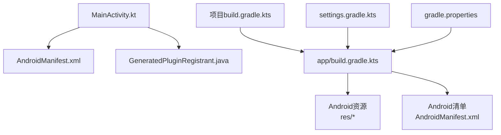
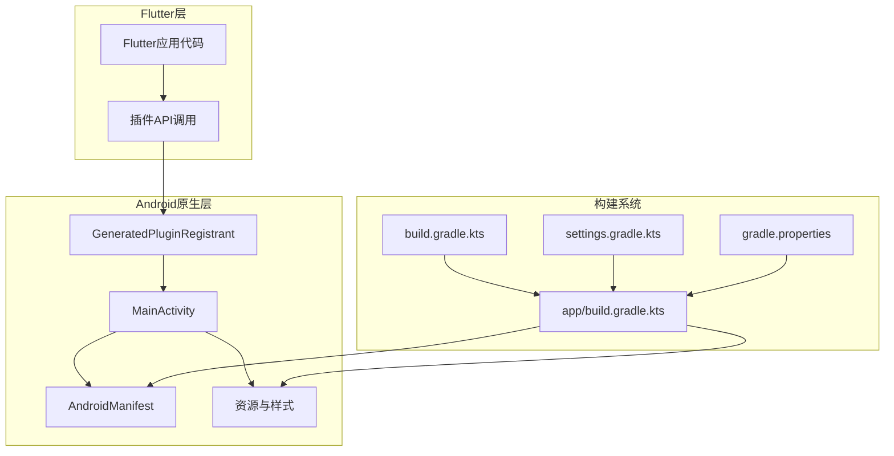
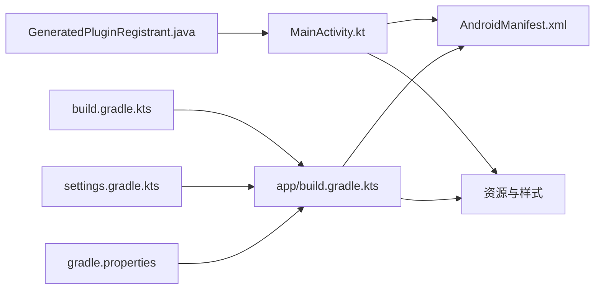

# Android平台开发

<cite>
**本文引用的文件**   
- [MainActivity.kt](file://android/app/src/main/kotlin/com/example/photo_organizer_ai/MainActivity.kt)
- [AndroidManifest.xml](file://android/app/src/main/AndroidManifest.xml)
- [build.gradle.kts（应用）](file://android/app/build.gradle.kts)
- [build.gradle.kts（项目根）](file://android/build.gradle.kts)
- [settings.gradle.kts](file://android/settings.gradle.kts)
- [gradle.properties](file://android/gradle.properties)
- [styles.xml](file://android/app/src/main/res/values/styles.xml)
- [launch_background.xml](file://android/app/src/main/res/drawable/launch_background.xml)
- [GeneratedPluginRegistrant.java](file://android/app/src/main/java/io/flutter/plugins/GeneratedPluginRegistrant.java)
</cite>

## 目录
1. [简介](#简介)
2. [项目结构](#项目结构)
3. [核心组件](#核心组件)
4. [架构总览](#架构总览)
5. [详细组件分析](#详细组件分析)
6. [依赖关系分析](#依赖关系分析)
7. [性能考虑](#性能考虑)
8. [故障排查指南](#故障排查指南)
9. [结论](#结论)
10. [附录](#附录)

## 简介
本技术文档面向Flutter照片整理AI应用的Android平台开发，聚焦于Android原生侧的实现与配置。内容涵盖：
- MainActivity的自定义配置、权限管理、系统服务集成
- Gradle构建脚本、依赖管理、签名设置、资源管理
- Android特定功能：相机访问、文件存储、通知服务、后台任务
- 性能优化：内存管理、图片加载优化、启动速度优化
- 调试与测试：Logcat使用、性能分析、单元测试
- 常见问题的配置示例与解决方案

## 项目结构
Android模块采用标准Flutter工程结构，关键目录与职责如下：
- android/app/src/main/kotlin/.../MainActivity.kt：应用入口Activity，承载Flutter引擎生命周期与原生桥接逻辑
- android/app/src/main/AndroidManifest.xml：应用清单，声明权限、组件、Intent过滤器等
- android/app/build.gradle.kts：应用级Gradle构建脚本，定义编译选项、依赖、签名、资源打包等
- android/build.gradle.kts：项目级Gradle脚本，统一Kotlin/AGP/Gradle版本与仓库配置
- android/settings.gradle.kts：工程设置，包含Flutter插件与本地模块解析
- android/gradle.properties：Gradle全局属性，如JVM参数、并行构建、AndroidX开关等
- android/app/src/main/res/*：资源文件，包括启动页样式、图标、主题等
- GeneratedPluginRegistrant.java：Flutter插件自动注册生成类，避免手动维护插件注册

图表来源
- [MainActivity.kt](file://android/app/src/main/kotlin/com/example/photo_organizer_ai/MainActivity.kt)
- [AndroidManifest.xml](file://android/app/src/main/AndroidManifest.xml)
- [build.gradle.kts（应用）](file://android/app/build.gradle.kts)
- [build.gradle.kts（项目根）](file://android/build.gradle.kts)
- [settings.gradle.kts](file://android/settings.gradle.kts)
- [gradle.properties](file://android/gradle.properties)

章节来源
- [MainActivity.kt](file://android/app/src/main/kotlin/com/example/photo_organizer_ai/MainActivity.kt)
- [AndroidManifest.xml](file://android/app/src/main/AndroidManifest.xml)
- [build.gradle.kts（应用）](file://android/app/build.gradle.kts)
- [build.gradle.kts（项目根）](file://android/build.gradle.kts)
- [settings.gradle.kts](file://android/settings.gradle.kts)
- [gradle.properties](file://android/gradle.properties)

## 核心组件
- MainActivity：作为Flutter宿主Activity，负责初始化Flutter引擎、处理生命周期事件、与原生能力交互（如权限、相机、存储、通知、后台任务）。
- AndroidManifest：声明应用所需权限（相机、存储、网络、通知等）、组件、Intent过滤器、启动项等。
- GeneratedPluginRegistrant：由Flutter工具链自动生成，用于在运行时注册已使用的插件，确保Dart侧插件调用能正确路由到Android实现。
- Gradle构建脚本：统一管理编译环境、依赖库、签名、资源打包、产物输出等。

章节来源
- [MainActivity.kt](file://android/app/src/main/kotlin/com/example/photo_organizer_ai/MainActivity.kt)
- [AndroidManifest.xml](file://android/app/src/main/AndroidManifest.xml)
- [GeneratedPluginRegistrant.java](file://android/app/src/main/java/io/flutter/plugins/GeneratedPluginRegistrant.java)
- [build.gradle.kts（应用）](file://android/app/build.gradle.kts)
- [build.gradle.kts（项目根）](file://android/build.gradle.kts)
- [settings.gradle.kts](file://android/settings.gradle.kts)

## 架构总览
下图展示Flutter与Android原生层的关键交互路径：MainActivity作为入口，通过GeneratedPluginRegistrant完成插件注册；应用清单声明权限与组件；Gradle脚本负责构建与打包。

图表来源
- [MainActivity.kt](file://android/app/src/main/kotlin/com/example/photo_organizer_ai/MainActivity.kt)
- [GeneratedPluginRegistrant.java](file://android/app/src/main/java/io/flutter/plugins/GeneratedPluginRegistrant.java)
- [AndroidManifest.xml](file://android/app/src/main/AndroidManifest.xml)
- [build.gradle.kts（应用）](file://android/app/build.gradle.kts)
- [build.gradle.kts（项目根）](file://android/build.gradle.kts)
- [settings.gradle.kts](file://android/settings.gradle.kts)
- [gradle.properties](file://android/gradle.properties)

## 详细组件分析

### MainActivity自定义配置与生命周期
- 作用：作为Flutter宿主Activity，负责启动Flutter引擎、处理窗口状态变化、与原生能力对接（权限、相机、存储、通知、后台任务）。
- 建议实践：
  - 在onCreate中完成必要的原生初始化（如权限检查、系统服务准备）。
  - 在onResume/onPause中处理前台/后台切换相关的状态同步。
  - 如需拦截返回键或处理系统UI，重写对应生命周期方法。
  - 与Dart侧通过MethodChannel或PlatformChannel进行通信。

章节来源
- [MainActivity.kt](file://android/app/src/main/kotlin/com/example/photo_organizer_ai/MainActivity.kt)

### 权限管理与系统服务集成
- 权限声明：在AndroidManifest中声明相机、存储、网络、通知等权限。
- 运行时权限：对危险权限（如相机、存储）需在运行时动态申请并处理用户授权结果。
- 系统服务：根据业务需要集成通知、后台任务、媒体扫描等服务。
- 最佳实践：
  - 最小化权限范围，按需申请。
  - 提供清晰的权限说明与引导。
  - 对未授权场景提供降级方案。

章节来源
- [AndroidManifest.xml](file://android/app/src/main/AndroidManifest.xml)

### 构建配置与依赖管理
- 应用级构建脚本（app/build.gradle.kts）：
  - 指定编译SDK、目标SDK、最小SDK版本。
  - 配置依赖库（第三方库、插件依赖）。
  - 配置签名信息（debug/release）。
  - 资源与清单合并策略。
- 项目级构建脚本（build.gradle.kts）：
  - 统一AGP、Kotlin、Gradle版本。
  - 配置仓库源（Google、Maven Central等）。
- settings.gradle.kts：
  - 引入Flutter插件与本地模块。
- gradle.properties：
  - 设置JVM参数、并行构建、AndroidX开关等。

章节来源
- [build.gradle.kts（应用）](file://android/app/build.gradle.kts)
- [build.gradle.kts（项目根）](file://android/build.gradle.kts)
- [settings.gradle.kts](file://android/settings.gradle.kts)
- [gradle.properties](file://android/gradle.properties)

### 资源管理与启动体验
- 资源组织：res目录下按类型划分（drawable、mipmap、values等）。
- 启动页样式：通过styles.xml与launch_background.xml控制启动画面与主题。
- 多密度适配：为不同屏幕密度提供图标与资源。
- 夜间模式：values-night下提供夜间主题资源。

章节来源
- [styles.xml](file://android/app/src/main/res/values/styles.xml)
- [launch_background.xml](file://android/app/src/main/res/drawable/launch_background.xml)

### 插件注册机制
- GeneratedPluginRegistrant由Flutter工具链生成，负责在应用启动时自动注册已使用的插件。
- 优势：无需手动维护插件注册列表，减少出错概率。
- 注意：新增插件后需重新构建以更新该文件。

章节来源
- [GeneratedPluginRegistrant.java](file://android/app/src/main/java/io/flutter/plugins/GeneratedPluginRegistrant.java)

## 依赖关系分析
下图展示Android模块内主要文件的依赖关系：MainActivity依赖清单与资源；构建脚本依赖Gradle属性与设置；插件注册类由Flutter工具链生成并被MainActivity间接使用。

图表来源
- [MainActivity.kt](file://android/app/src/main/kotlin/com/example/photo_organizer_ai/MainActivity.kt)
- [AndroidManifest.xml](file://android/app/src/main/AndroidManifest.xml)
- [build.gradle.kts（应用）](file://android/app/build.gradle.kts)
- [build.gradle.kts（项目根）](file://android/build.gradle.kts)
- [settings.gradle.kts](file://android/settings.gradle.kts)
- [gradle.properties](file://android/gradle.properties)
- [GeneratedPluginRegistrant.java](file://android/app/src/main/java/io/flutter/plugins/GeneratedPluginRegistrant.java)

章节来源
- [MainActivity.kt](file://android/app/src/main/kotlin/com/example/photo_organizer_ai/MainActivity.kt)
- [AndroidManifest.xml](file://android/app/src/main/AndroidManifest.xml)
- [build.gradle.kts（应用）](file://android/app/build.gradle.kts)
- [build.gradle.kts（项目根）](file://android/build.gradle.kts)
- [settings.gradle.kts](file://android/settings.gradle.kts)
- [gradle.properties](file://android/gradle.properties)
- [GeneratedPluginRegistrant.java](file://android/app/src/main/java/io/flutter/plugins/GeneratedPluginRegistrant.java)

## 性能考虑
- 内存管理
  - 避免大图直接加载到内存，使用缩略图与缓存策略。
  - 及时释放不再使用的Bitmap与资源引用。
  - 合理设置堆大小与GC行为，避免频繁GC导致卡顿。
- 图片加载优化
  - 使用高效的图片加载库（如Glide/Picasso），启用磁盘与内存缓存。
  - 按需解码与采样，降低分辨率与色彩深度。
  - 预加载热门图片，减少首屏等待时间。
- 启动速度优化
  - 延迟非关键初始化，优先渲染首帧。
  - 精简MainActivity中的初始化逻辑，避免阻塞主线程。
  - 使用ProGuard/R8混淆与裁剪无用代码。
- 构建与运行优化
  - 启用增量编译与并行构建。
  - 合理配置Gradle JVM参数，提升构建速度。
  - 使用Android Studio Profiler进行CPU、内存、网络分析。

[本节为通用指导，不直接分析具体文件]

## 故障排查指南
- Logcat使用
  - 过滤应用包名与Tag，定位关键日志。
  - 区分Debug与Release日志级别，避免泄露敏感信息。
- 权限问题
  - 检查AndroidManifest中权限声明是否正确。
  - 确认运行时权限申请流程与回调处理。
- 构建失败
  - 检查Gradle版本与AGP/Kotlin版本兼容性。
  - 清理缓存并重新构建（./gradlew clean build）。
- 崩溃与ANR
  - 使用Android Studio Crash Analyzer分析堆栈。
  - 检查主线程耗时操作，避免ANR。
- 插件相关
  - 确认GeneratedPluginRegistrant是否最新。
  - 检查插件依赖是否与当前AGP/Gradle版本兼容。

章节来源
- [AndroidManifest.xml](file://android/app/src/main/AndroidManifest.xml)
- [build.gradle.kts（应用）](file://android/app/build.gradle.kts)
- [build.gradle.kts（项目根）](file://android/build.gradle.kts)
- [settings.gradle.kts](file://android/settings.gradle.kts)
- [gradle.properties](file://android/gradle.properties)
- [GeneratedPluginRegistrant.java](file://android/app/src/main/java/io/flutter/plugins/GeneratedPluginRegistrant.java)

## 结论
本文围绕Flutter照片整理AI应用的Android平台开发，系统梳理了MainActivity配置、权限与系统服务集成、Gradle构建与依赖管理、资源与启动体验、插件注册机制，以及性能优化与调试测试方法。遵循本文建议，可显著提升应用的稳定性、性能与可维护性。

[本节为总结，不直接分析具体文件]

## 附录
- 常见问题与解决方案
  - 相机无法打开：检查权限与设备支持，确保相机权限已授予。
  - 存储写入失败：确认存储权限与外部存储可用性。
  - 通知不显示：检查通知渠道与权限，确保前台服务可用。
  - 后台任务被杀：合理使用WorkManager与前台服务，避免被系统回收。
  - 构建速度慢：启用并行构建、增量编译与缓存。
  - 插件冲突：统一依赖版本，避免重复与冲突。

[本节为通用指导，不直接分析具体文件]