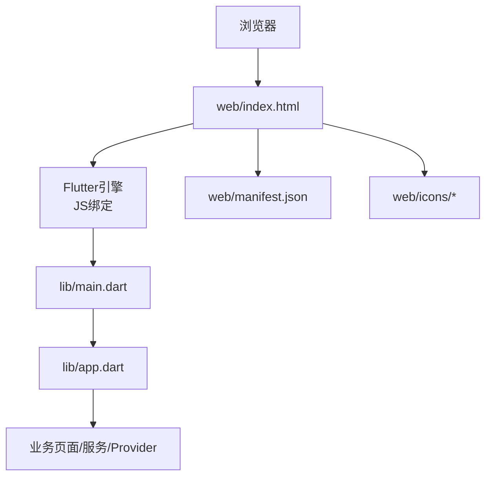
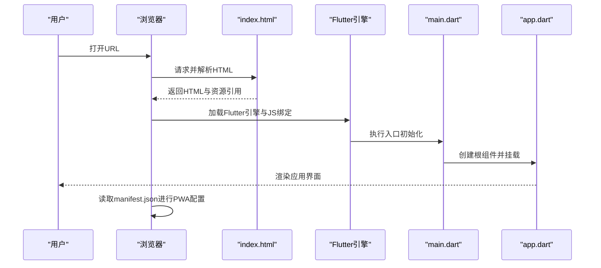
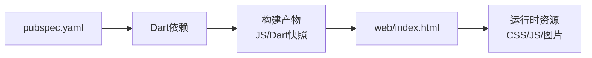

# Web平台开发

<cite>
**本文引用的文件**   
- [index.html](file://web/index.html)
- [manifest.json](file://web/manifest.json)
- [pubspec.yaml](file://pubspec.yaml)
- [main.dart](file://lib/main.dart)
- [app.dart](file://lib/app.dart)
</cite>

## 目录
1. [简介](#简介)
2. [项目结构](#项目结构)
3. [核心组件](#核心组件)
4. [架构总览](#架构总览)
5. [详细组件分析](#详细组件分析)
6. [依赖分析](#依赖分析)
7. [性能考虑](#性能考虑)
8. [故障排查指南](#故障排查指南)
9. [结论](#结论)
10. [附录](#附录)

## 简介
本技术文档面向Flutter照片整理AI应用的Web平台开发，聚焦以下目标：
- 说明Web入口与PWA配置：index.html、manifest.json、图标资源管理。
- 解释Web限制与替代方案：文件系统访问、相机能力、存储配额等。
- 提供Web性能优化策略：资源压缩、懒加载、缓存策略。
- 给出部署与SEO建议：服务器配置、CDN、SEO基础。
- 介绍调试与测试方法：开发者工具、性能分析、兼容性测试。
- 提供可操作的配置示例与常见问题解决方案。

## 项目结构
Flutter Web工程的关键目录与文件如下：
- web/index.html：Web应用入口HTML，注入Flutter运行时与资源。
- web/manifest.json：PWA清单，定义应用名称、主题色、启动画面、图标等。
- web/icons：Web端图标资源（推荐包含多种尺寸）。
- lib/main.dart：Flutter应用入口，初始化路由、主题、插件等。
- lib/app.dart：应用根组件，组织页面与功能模块。
- pubspec.yaml：Dart依赖与构建配置，影响Web产物大小与特性开关。

图表来源
- [index.html](file://web/index.html)
- [manifest.json](file://web/manifest.json)
- [main.dart](file://lib/main.dart)
- [app.dart](file://lib/app.dart)

章节来源
- [index.html](file://web/index.html)
- [manifest.json](file://web/manifest.json)
- [pubspec.yaml](file://pubspec.yaml)
- [main.dart](file://lib/main.dart)
- [app.dart](file://lib/app.dart)

## 核心组件
- Web入口HTML（index.html）
  - 负责引入Flutter JS引导脚本、设置viewport、favicon、PWA manifest路径、初始标题与元信息。
  - 建议通过环境变量或构建参数注入API基地址、功能开关等。
- PWA清单（manifest.json）
  - 定义应用名、短名、描述、主题色、背景色、启动页、显示模式、语言、方向、图标集合等。
  - 图标需覆盖常用尺寸，确保在不同设备与安装场景下清晰显示。
- Flutter入口（main.dart / app.dart）
  - main.dart负责初始化Flutter运行环境、注册全局配置、启动根组件。
  - app.dart作为根Widget，组织路由、主题、国际化、错误边界等。

章节来源
- [index.html](file://web/index.html)
- [manifest.json](file://web/manifest.json)
- [main.dart](file://lib/main.dart)
- [app.dart](file://lib/app.dart)

## 架构总览
Web端整体流程：浏览器加载index.html，解析并加载Flutter引擎与打包后的JS/Dart产物；随后执行main.dart初始化应用，渲染app.dart根组件，进入业务逻辑。PWA清单由浏览器读取，用于安装与应用壳展示。

图表来源
- [index.html](file://web/index.html)
- [manifest.json](file://web/manifest.json)
- [main.dart](file://lib/main.dart)
- [app.dart](file://lib/app.dart)

## 详细组件分析

### Web入口HTML（index.html）
职责与建议：
- 设置正确的viewport、字符集、主题色、初始标题。
- 引入Flutter引导脚本与必要的polyfill（如需兼容旧版浏览器）。
- 指定PWA manifest路径与图标。
- 预留环境变量注入点（如API_BASE_URL、FEATURE_FLAGS），便于不同环境差异化配置。
- SEO相关meta标签（title、description、og:image等）应在此处配置。

注意事项：
- 避免在HTML中直接嵌入大体积资源，优先使用外部资源与按需加载。
- 若使用Service Worker，需在HTML中正确注册。

章节来源
- [index.html](file://web/index.html)

### PWA清单（manifest.json）
字段要点：
- name/short_name/description：应用名称与描述，影响安装与搜索展示。
- start_url：应用启动路径，通常指向index.html。
- display：推荐“standalone”以获得沉浸式体验。
- theme_color/background_color：主题与背景色，提升视觉一致性。
- icons：提供多尺寸图标（如192x192、512x512），确保安装与任务栏显示质量。
- lang/direction：本地化与文本方向。

最佳实践：
- 将图标放入web/icons并按约定命名，便于构建工具处理。
- 使用相对路径引用图标，保证部署到子路径时仍有效。

章节来源
- [manifest.json](file://web/manifest.json)

### 图标资源管理
- 尺寸建议：至少包含192x192与512x512，必要时补充其他尺寸。
- 格式建议：PNG或WebP，兼顾兼容性与体积。
- 命名规范：统一前缀与后缀，便于自动化替换与校验。
- 生成工具：可使用在线或命令行工具批量生成多尺寸图标。

章节来源
- [manifest.json](file://web/manifest.json)

### Flutter入口与根组件（main.dart / app.dart）
- main.dart：初始化Flutter、注册全局配置、启动根组件。
- app.dart：定义主题、路由、国际化、错误边界、Provider/状态管理等。
- Web特定初始化：根据平台判断是否启用Web专属功能（如Web Storage API、File System Access API的可用性检测）。

章节来源
- [main.dart](file://lib/main.dart)
- [app.dart](file://lib/app.dart)

### Web特定的限制与解决方案
- 文件系统访问限制
  - 限制：Web沙箱不允许直接访问本地文件系统。
  - 方案：使用File API与<input type="file">选择文件；对需要持久化的数据使用IndexedDB或LocalStorage；敏感数据避免明文存储。
- 相机功能替代方案
  - 限制：Web端无法直接调用原生相机。
  - 方案：使用navigator.mediaDevices.getUserMedia实现摄像头捕获；或使用<input type="file" accept="image/*" capture="environment">触发系统拍照/相册。
- 存储限制
  - 限制：LocalStorage容量有限且同步阻塞；Cookie有大小与数量限制。
  - 方案：优先使用IndexedDB存储大量结构化数据；结合Cache API缓存静态资源；注意配额管理与清理策略。
- 跨域与安全
  - 限制：同源策略与CORS限制。
  - 方案：服务端开启必要CORS头；使用HTTPS；避免内联脚本与不安全混合内容。

章节来源
- [index.html](file://web/index.html)
- [manifest.json](file://web/manifest.json)
- [main.dart](file://lib/main.dart)
- [app.dart](file://lib/app.dart)

### Web性能优化技巧
- 资源压缩与打包
  - 使用构建工具的代码分割与Tree Shaking，减少包体。
  - 图片采用WebP/AVIF，视频使用自适应码率与懒加载。
- 懒加载与按需加载
  - 路由级懒加载：仅在进入页面时加载对应模块。
  - 组件级懒加载：大图、第三方库按需引入。
- 缓存策略
  - 静态资源使用强缓存（带版本号或哈希）。
  - Service Worker缓存关键资源，离线可用。
  - API响应合理设置HTTP缓存头（ETag、Cache-Control）。
- 首屏优化
  - 预加载关键字体与样式。
  - 延迟非关键脚本与统计代码。
  - 使用骨架屏提升感知速度。

章节来源
- [pubspec.yaml](file://pubspec.yaml)
- [index.html](file://web/index.html)

### Web部署配置
- 服务器配置
  - 启用Gzip/Brotli压缩。
  - 设置正确的Content-Type与缓存头。
  - 配置HTTPS与HSTS。
- CDN设置
  - 静态资源上CDN，开启边缘缓存与版本化。
  - 配置回源规则与缓存失效策略。
- SEO优化
  - 完善title、description、Open Graph标签。
  - 生成sitemap.xml与robots.txt。
  - 使用语义化HTML与结构化数据（JSON-LD）。

章节来源
- [index.html](file://web/index.html)
- [manifest.json](file://web/manifest.json)

### Web调试与测试方法
- 浏览器开发者工具
  - Network面板：检查资源加载顺序、大小、缓存命中。
  - Performance面板：录制首帧与交互性能，定位长任务。
  - Application面板：查看Storage、IndexedDB、Service Worker缓存。
  - Lighthouse：自动评估性能、可访问性、SEO与PWA指标。
- 兼容性测试
  - 使用BrowserStack或Sauce Labs进行多浏览器/设备测试。
  - 关注iOS Safari与Android Chrome的差异。
- 单元测试与集成测试
  - Dart测试框架验证业务逻辑。
  - 使用integration_test或Web Driver进行端到端测试。

章节来源
- [index.html](file://web/index.html)
- [manifest.json](file://web/manifest.json)

## 依赖分析
Flutter Web构建依赖主要由pubspec.yaml管理，包括UI框架、网络库、状态管理、图片处理等。构建产物会生成JS与Dart快照，影响首次加载与内存占用。

图表来源
- [pubspec.yaml](file://pubspec.yaml)
- [index.html](file://web/index.html)

章节来源
- [pubspec.yaml](file://pubspec.yaml)

## 性能考虑
- 包体控制：移除未使用的依赖，启用最小化与混淆。
- 首屏时间：减少主线程工作，拆分路由与组件。
- 缓存命中率：为静态资源添加版本号，利用浏览器缓存。
- 图片与媒体：使用响应式图片与懒加载，降低带宽消耗。
- 监控与度量：接入性能埋点与错误上报，持续优化。

[本节为通用指导，不直接分析具体文件]

## 故障排查指南
常见问题与解决思路：
- PWA无法安装
  - 检查manifest.json路径与字段完整性，确保HTTPS与Service Worker注册成功。
- 图片加载失败
  - 确认路径与权限，检查CDN与CORS配置。
- IndexedDB不可用
  - 检查浏览器隐私模式与配额限制，降级至LocalStorage。
- 首屏过慢
  - 使用Performance面板定位瓶颈，优化资源加载顺序与体积。
- 跨域错误
  - 核对后端CORS配置与请求头，确保协议与域名一致。

章节来源
- [index.html](file://web/index.html)
- [manifest.json](file://web/manifest.json)

## 结论
Web平台是Flutter照片整理AI应用的重要扩展。通过合理的HTML入口与PWA配置、针对Web限制的替代方案、完善的性能优化与部署策略，以及系统的调试与测试方法，可以显著提升用户体验与可维护性。建议在迭代过程中持续监控性能指标与用户反馈，逐步优化。

[本节为总结，不直接分析具体文件]

## 附录
- 配置示例清单
  - index.html：viewport、meta、manifest路径、环境变量注入点。
  - manifest.json：name、start_url、display、icons、theme_color。
  - 服务器：Gzip/Brotli、HTTPS、缓存头、CORS。
  - CDN：静态资源路径、缓存策略、版本化。
  - SEO：title、description、OG标签、sitemap、robots。
- 参考链接
  - MDN Web Docs：Manifest、Service Worker、IndexedDB。
  - Google Lighthouse：性能与PWA审计。
  - Flutter Web文档：构建与部署指南。

[本节为参考资料，不直接分析具体文件]