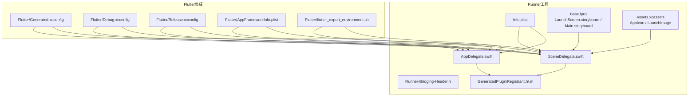
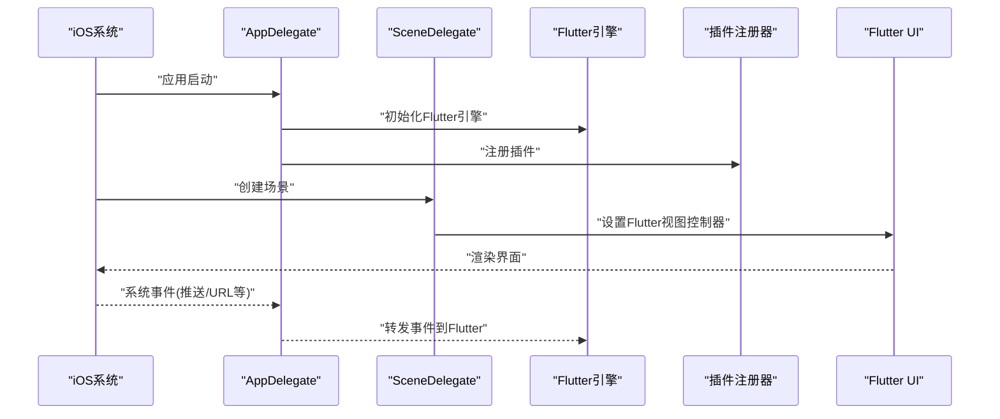
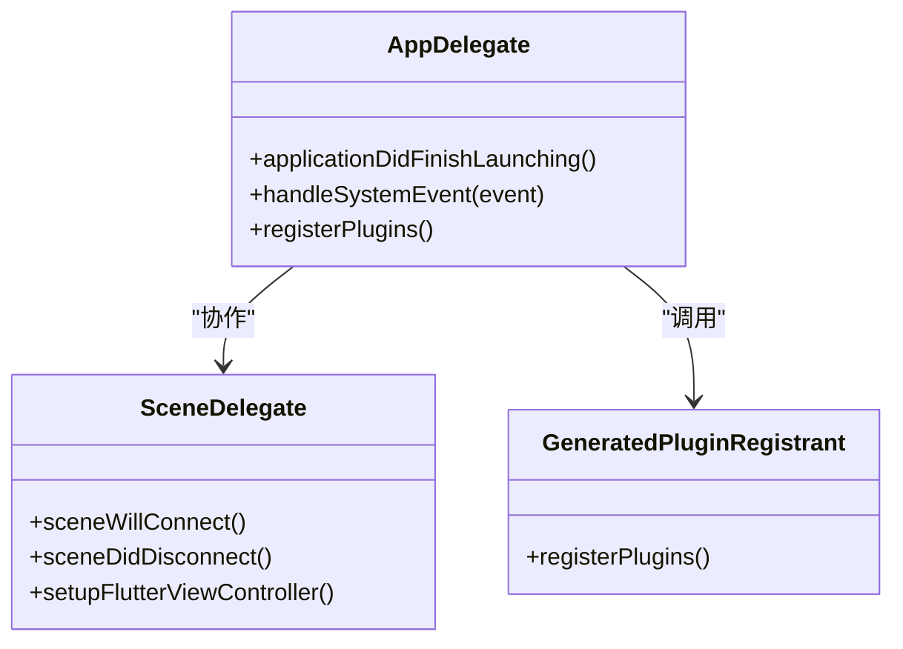
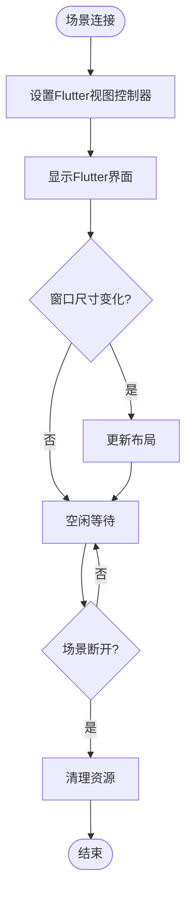
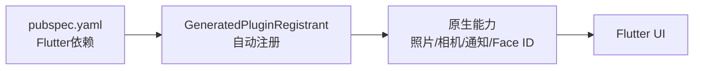

# iOS平台开发

<cite>
**本文引用的文件**   
- [AppDelegate.swift](file://ios/Runner/AppDelegate.swift)
- [SceneDelegate.swift](file://ios/Runner/SceneDelegate.swift)
- [Info.plist](file://ios/Runner/Info.plist)
- [AppFrameworkInfo.plist](file://ios/Flutter/AppFrameworkInfo.plist)
- [Generated.xcconfig](file://ios/Flutter/Generated.xcconfig)
- [Debug.xcconfig](file://ios/Flutter/Debug.xcconfig)
- [Release.xcconfig](file://ios/Flutter/Release.xcconfig)
- [flutter_export_environment.sh](file://ios/Flutter/flutter_export_environment.sh)
- [Runner-Bridging-Header.h](file://ios/Runner/Runner-Bridging-Header.h)
- [GeneratedPluginRegistrant.h](file://ios/Runner/GeneratedPluginRegistrant.h)
- [GeneratedPluginRegistrant.m](file://ios/Runner/GeneratedPluginRegistrant.m)
- [LaunchScreen.storyboard](file://ios/Runner/Base.lproj/LaunchScreen.storyboard)
- [Main.storyboard](file://ios/Runner/Base.lproj/Main.storyboard)
- [Contents.json（应用图标）](file://ios/Runner/Assets.xcassets/AppIcon.appiconset/Contents.json)
- [README.md（启动图资源说明）](file://ios/Runner/Assets.xcassets/LaunchImage.imageset/README.md)
- [pubspec.yaml](file://pubspec.yaml)
</cite>

## 目录
1. [简介](#简介)
2. [项目结构](#项目结构)
3. [核心组件](#核心组件)
4. [架构总览](#架构总览)
5. [详细组件分析](#详细组件分析)
6. [依赖关系分析](#依赖关系分析)
7. [性能优化](#性能优化)
8. [调试与测试](#调试与测试)
9. [常见问题排查](#常见问题排查)
10. [结论](#结论)
11. [附录：配置清单与示例](#附录配置清单与示例)

## 简介
本技术文档面向Flutter照片整理AI应用的iOS平台开发，聚焦于iOS原生层实现与工程配置。内容涵盖AppDelegate与SceneDelegate的职责划分、权限处理流程、Xcode工程与构建配置、Info.plist与资源管理、系统级能力接入（照片库、相机、推送通知、Face ID等）、性能优化策略以及调试与测试方法。文档同时提供可操作的配置清单与故障排除指南，帮助开发者快速搭建并稳定运行iOS端应用。

## 项目结构
iOS端代码位于ios目录，核心入口在Runner工程中：
- Runner：应用主工程，包含Swift源文件、Storyboard、资源与配置文件
- Flutter：Flutter框架生成文件与xcconfig配置
- RunnerTests：单元测试目标
- Assets.xcassets：应用图标与启动图资源
- Base.lproj：界面故事板
- Info.plist：应用元数据与权限声明
- xcconfig：构建变量与环境导出脚本

图表来源
- [AppDelegate.swift](file://ios/Runner/AppDelegate.swift)
- [SceneDelegate.swift](file://ios/Runner/SceneDelegate.swift)
- [Info.plist](file://ios/Runner/Info.plist)
- [AppFrameworkInfo.plist](file://ios/Flutter/AppFrameworkInfo.plist)
- [Generated.xcconfig](file://ios/Flutter/Generated.xcconfig)
- [Debug.xcconfig](file://ios/Flutter/Debug.xcconfig)
- [Release.xcconfig](file://ios/Flutter/Release.xcconfig)
- [flutter_export_environment.sh](file://ios/Flutter/flutter_export_environment.sh)
- [Runner-Bridging-Header.h](file://ios/Runner/Runner-Bridging-Header.h)
- [GeneratedPluginRegistrant.h](file://ios/Runner/GeneratedPluginRegistrant.h)
- [GeneratedPluginRegistrant.m](file://ios/Runner/GeneratedPluginRegistrant.m)
- [LaunchScreen.storyboard](file://ios/Runner/Base.lproj/LaunchScreen.storyboard)
- [Main.storyboard](file://ios/Runner/Base.lproj/Main.storyboard)
- [Contents.json（应用图标）](file://ios/Runner/Assets.xcassets/AppIcon.appiconset/Contents.json)
- [README.md（启动图资源说明）](file://ios/Runner/Assets.xcassets/LaunchImage.imageset/README.md)

章节来源
- [AppDelegate.swift](file://ios/Runner/AppDelegate.swift)
- [SceneDelegate.swift](file://ios/Runner/SceneDelegate.swift)
- [Info.plist](file://ios/Runner/Info.plist)
- [AppFrameworkInfo.plist](file://ios/Flutter/AppFrameworkInfo.plist)
- [Generated.xcconfig](file://ios/Flutter/Generated.xcconfig)
- [Debug.xcconfig](file://ios/Flutter/Debug.xcconfig)
- [Release.xcconfig](file://ios/Flutter/Release.xcconfig)
- [flutter_export_environment.sh](file://ios/Flutter/flutter_export_environment.sh)
- [Runner-Bridging-Header.h](file://ios/Runner/Runner-Bridging-Header.h)
- [GeneratedPluginRegistrant.h](file://ios/Runner/GeneratedPluginRegistrant.h)
- [GeneratedPluginRegistrant.m](file://ios/Runner/GeneratedPluginRegistrant.m)
- [LaunchScreen.storyboard](file://ios/Runner/Base.lproj/LaunchScreen.storyboard)
- [Main.storystoryboard](file://ios/Runner/Base.lproj/Main.storyboard)
- [Contents.json（应用图标）](file://ios/Runner/Assets.xcassets/AppIcon.appiconset/Contents.json)
- [README.md（启动图资源说明）](file://ios/Runner/Assets.xcassets/LaunchImage.imageset/README.md)

## 核心组件
- AppDelegate：应用生命周期入口，负责初始化Flutter引擎、注册插件、处理系统事件（如推送、URL Scheme等）。
- SceneDelegate：窗口与场景管理，负责设置Flutter视图控制器、处理多场景生命周期（若启用多场景）。
- Info.plist：应用元数据、权限声明（如相册、相机、通知、生物识别等）、URL Scheme、后台模式等。
- xcconfig与导出脚本：构建变量、编译选项、环境变量注入，确保Flutter与原生侧一致。
- GeneratedPluginRegistrant：自动生成的插件注册逻辑，将Flutter插件桥接到原生运行时。
- Storyboard与资源：启动画面与应用图标，影响用户体验与上架审核。

章节来源
- [AppDelegate.swift](file://ios/Runner/AppDelegate.swift)
- [SceneDelegate.swift](file://ios/Runner/SceneDelegate.swift)
- [Info.plist](file://ios/Runner/Info.plist)
- [GeneratedPluginRegistrant.h](file://ios/Runner/GeneratedPluginRegistrant.h)
- [GeneratedPluginRegistrant.m](file://ios/Runner/GeneratedPluginRegistrant.m)
- [Generated.xcconfig](file://ios/Flutter/Generated.xcconfig)
- [Debug.xcconfig](file://ios/Flutter/Debug.xcconfig)
- [Release.xcconfig](file://ios/Flutter/Release.xcconfig)
- [flutter_export_environment.sh](file://ios/Flutter/flutter_export_environment.sh)

## 架构总览
iOS端采用Flutter + 原生桥接的混合架构。应用启动时由AppDelegate创建Flutter引擎，SceneDelegate加载Flutter视图；插件通过GeneratedPluginRegistrant自动注册；权限与系统能力通过Info.plist声明并在运行时请求。

图表来源
- [AppDelegate.swift](file://ios/Runner/AppDelegate.swift)
- [SceneDelegate.swift](file://ios/Runner/SceneDelegate.swift)
- [GeneratedPluginRegistrant.h](file://ios/Runner/GeneratedPluginRegistrant.h)
- [GeneratedPluginRegistrant.m](file://ios/Runner/GeneratedPluginRegistrant.m)

## 详细组件分析

### AppDelegate组件分析
职责：
- 初始化Flutter引擎与插件注册
- 处理系统回调（如推送通知、URL Scheme、后台任务等）
- 与SceneDelegate协作完成应用生命周期管理

关键流程：
- 应用启动时创建Flutter引擎并注入环境参数
- 插件自动注册，使Flutter侧可通过平台通道调用原生能力
- 系统事件回调中转发至Flutter或执行原生逻辑

图表来源
- [AppDelegate.swift](file://ios/Runner/AppDelegate.swift)
- [SceneDelegate.swift](file://ios/Runner/SceneDelegate.swift)
- [GeneratedPluginRegistrant.h](file://ios/Runner/GeneratedPluginRegistrant.h)
- [GeneratedPluginRegistrant.m](file://ios/Runner/GeneratedPluginRegistrant.m)

章节来源
- [AppDelegate.swift](file://ios/Runner/AppDelegate.swift)
- [SceneDelegate.swift](file://ios/Runner/SceneDelegate.swift)
- [GeneratedPluginRegistrant.h](file://ios/Runner/GeneratedPluginRegistrant.h)
- [GeneratedPluginRegistrant.m](file://ios/Runner/GeneratedPluginRegistrant.m)

### SceneDelegate组件分析
职责：
- 管理应用场景生命周期
- 设置Flutter视图控制器作为根控制器
- 处理窗口尺寸变化、多场景切换等

关键流程：
- 场景连接时创建并显示Flutter视图
- 场景断开时释放资源
- 与AppDelegate协调生命周期事件

图表来源
- [SceneDelegate.swift](file://ios/Runner/SceneDelegate.swift)

章节来源
- [SceneDelegate.swift](file://ios/Runner/SceneDelegate.swift)

### Info.plist与权限配置
权限与元数据：
- 照片库访问：NSPhotoLibraryUsageDescription
- 相机使用：NSCameraUsageDescription
- 麦克风使用（如需录制视频）：NSMicrophoneUsageDescription
- 推送通知：NSUserNotificationsUsageDescription（配合Capabilities开启）
- Face ID：NSFaceIDUsageDescription
- URL Scheme、后台模式、Bundle标识等

建议：
- 所有权限描述需清晰说明用途，避免被拒审
- 按需开启Capabilities（如Push Notifications、Background Modes）
- 保持Bundle ID与签名证书一致

章节来源
- [Info.plist](file://ios/Runner/Info.plist)

### 构建配置与xcconfig
- Generated.xcconfig：Flutter生成的通用构建变量
- Debug.xcconfig / Release.xcconfig：调试与发布构建差异（符号、优化、日志级别）
- flutter_export_environment.sh：导出环境变量供Xcode使用
- AppFrameworkInfo.plist：Flutter框架元数据

最佳实践：
- 在Debug中启用更多日志与调试信息
- 在Release中启用优化与Strip Symbols
- 统一版本号与Build Number管理

章节来源
- [Generated.xcconfig](file://ios/Flutter/Generated.xcconfig)
- [Debug.xcconfig](file://ios/Flutter/Debug.xcconfig)
- [Release.xcconfig](file://ios/Flutter/Release.xcconfig)
- [flutter_export_environment.sh](file://ios/Flutter/flutter_export_environment.sh)
- [AppFrameworkInfo.plist](file://ios/Flutter/AppFrameworkInfo.plist)

### 资源管理与Storyboards
- LaunchScreen.storyboard：启动画面，提升首屏体验
- Main.storyboard：原生界面（如有）
- Assets.xcassets：应用图标与启动图资源，支持多分辨率与深色模式

注意事项：
- 启动图需覆盖常见设备尺寸
- 应用图标需提供不同密度版本
- 资源命名规范与分类管理

章节来源
- [LaunchScreen.storyboard](file://ios/Runner/Base.lproj/LaunchScreen.storyboard)
- [Main.storyboard](file://ios/Runner/Base.lproj/Main.storyboard)
- [Contents.json（应用图标）](file://ios/Runner/Assets.xcassets/AppIcon.appiconset/Contents.json)
- [README.md（启动图资源说明）](file://ios/Runner/Assets.xcassets/LaunchImage.imageset/README.md)

### 插件桥接与Bridging Header
- GeneratedPluginRegistrant：自动生成插件注册逻辑
- Runner-Bridging-Header.h：Objective-C与Swift互操作头文件

作用：
- 确保Flutter插件在原生侧正确初始化
- 提供C/Objective-C接口给Swift调用

章节来源
- [GeneratedPluginRegistrant.h](file://ios/Runner/GeneratedPluginRegistrant.h)
- [GeneratedPluginRegistrant.m](file://ios/Runner/GeneratedPluginRegistrant.m)
- [Runner-Bridging-Header.h](file://ios/Runner/Runner-Bridging-Header.h)

## 依赖关系分析
Flutter与原生依赖通过插件机制解耦。Pub依赖在pubspec.yaml中声明，iOS端通过GeneratedPluginRegistrant自动注册。

图表来源
- [pubspec.yaml](file://pubspec.yaml)
- [GeneratedPluginRegistrant.h](file://ios/Runner/GeneratedPluginRegistrant.h)
- [GeneratedPluginRegistrant.m](file://ios/Runner/GeneratedPluginRegistrant.m)

章节来源
- [pubspec.yaml](file://pubspec.yaml)
- [GeneratedPluginRegistrant.h](file://ios/Runner/GeneratedPluginRegistrant.h)
- [GeneratedPluginRegistrant.m](file://ios/Runner/GeneratedPluginRegistrant.m)

## 性能优化
内存管理：
- 避免大图常驻内存，使用流式读取与缓存
- 及时释放不再使用的图像与临时文件
- 监控内存峰值，避免OOM

图片缓存：
- 使用磁盘缓存与内存缓存结合
- 按分辨率与质量分级缓存
- 定期清理过期缓存

启动优化：
- 精简启动逻辑，延迟非关键初始化
- 使用预编译与静态库减少链接时间
- 合理配置Debug/Release构建选项

网络与I/O：
- 批量请求与合并响应
- 使用异步I/O与队列控制并发
- 本地数据库索引优化

章节来源
- [Debug.xcconfig](file://ios/Flutter/Debug.xcconfig)
- [Release.xcconfig](file://ios/Flutter/Release.xcconfig)

## 调试与测试
Instruments使用：
- Time Profiler：定位CPU热点
- Allocations/Memory Graph：分析内存泄漏
- Network：监控网络请求
- Energy Log：评估功耗

模拟器调试：
- 切换设备与系统版本
- 模拟低内存与弱网环境
- 使用Xcode控制台输出日志

单元测试：
- 编写插件单元测试用例
- 模拟系统权限与硬件行为
- 持续集成自动化测试

章节来源
- [Generated.xcconfig](file://ios/Flutter/Generated.xcconfig)
- [Debug.xcconfig](file://ios/Flutter/Debug.xcconfig)
- [Release.xcconfig](file://ios/Flutter/Release.xcconfig)

## 常见问题排查
权限问题：
- 检查Info.plist权限描述是否完整
- 确认用户已授权且未拒绝
- 使用系统设置重新授权

构建失败：
- 清理DerivedData与Pods
- 检查Bundle ID与签名一致性
- 验证xcconfig变量是否正确

崩溃与卡顿：
- 使用Instruments定位热点
- 检查大对象与循环引用
- 优化图片加载与缓存策略

章节来源
- [Info.plist](file://ios/Runner/Info.plist)
- [Generated.xcconfig](file://ios/Flutter/Generated.xcconfig)
- [Debug.xcconfig](file://ios/Flutter/Debug.xcconfig)
- [Release.xcconfig](file://ios/Flutter/Release.xcconfig)

## 结论
本文系统梳理了Flutter照片整理AI应用在iOS平台的原生实现与工程配置。通过明确AppDelegate与SceneDelegate职责、完善权限与构建配置、优化性能与调试流程，可有效提升开发效率与产品质量。建议在实际项目中结合具体需求进行定制化扩展，并遵循Apple审核指南与最佳实践。

## 附录：配置清单与示例
- 权限声明示例（Info.plist）：
  - NSPhotoLibraryUsageDescription：用于整理与分类照片
  - NSCameraUsageDescription：用于拍摄新照片
  - NSMicrophoneUsageDescription：用于录制视频
  - NSUserNotificationsUsageDescription：用于推送提醒
  - NSFaceIDUsageDescription：用于安全验证

- 构建配置建议（xcconfig）：
  - Debug：启用Symbol、调试日志、慢启动检测
  - Release：启用优化、Strip Symbols、最小化体积

- 资源管理建议：
  - 启动图覆盖iPhone与iPad常见尺寸
  - 应用图标提供@1x/@2x/@3x版本
  - 使用Xcode Asset Catalog统一管理

章节来源
- [Info.plist](file://ios/Runner/Info.plist)
- [Generated.xcconfig](file://ios/Flutter/Generated.xcconfig)
- [Debug.xcconfig](file://ios/Flutter/Debug.xcconfig)
- [Release.xcconfig](file://ios/Flutter/Release.xcconfig)
- [Contents.json（应用图标）](file://ios/Runner/Assets.xcassets/AppIcon.appiconset/Contents.json)
- [README.md（启动图资源说明）](file://ios/Runner/Assets.xcassets/LaunchImage.imageset/README.md)