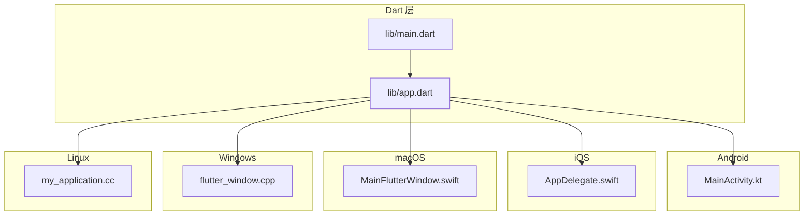
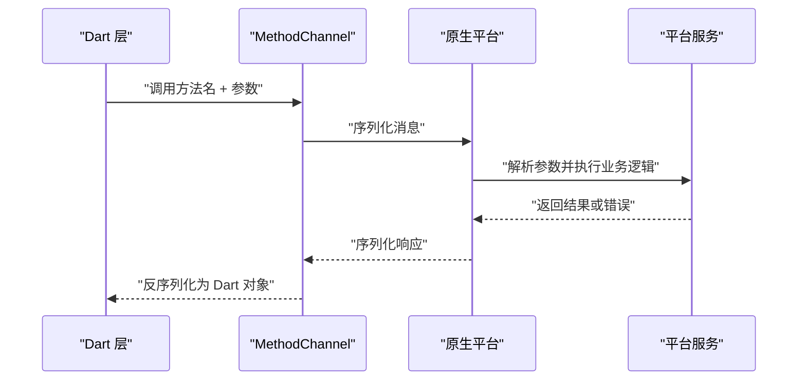
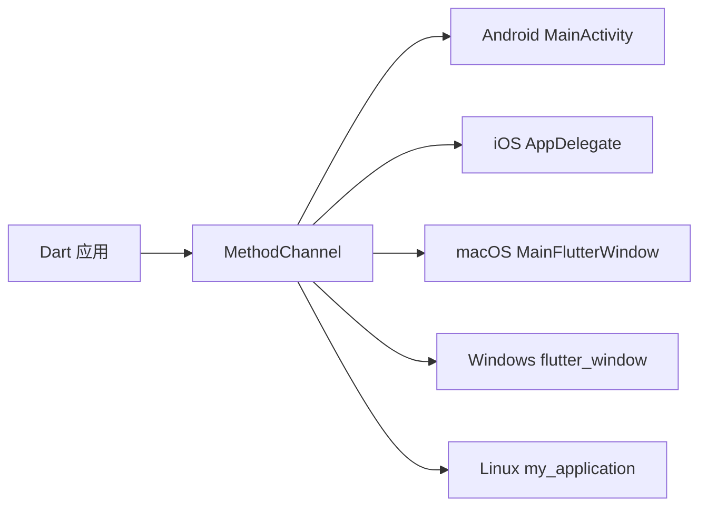

# 平台通信机制

<cite>
**本文引用的文件**   
- [lib/main.dart](file://lib/main.dart)
- [lib/app.dart](file://lib/app.dart)
- [android/app/src/main/kotlin/com/example/photo_organizer_ai/MainActivity.kt](file://android/app/src/main/kotlin/com/example/photo_organizer_ai/MainActivity.kt)
- [ios/Runner/AppDelegate.swift](file://ios/Runner/AppDelegate.swift)
- [macos/Runner/MainFlutterWindow.swift](file://macos/Runner/MainFlutterWindow.swift)
- [windows/runner/flutter_window.cpp](file://windows/runner/flutter_window.cpp)
- [linux/runner/my_application.cc](file://linux/runner/my_application.cc)
</cite>

## 目录
1. [简介](#简介)
2. [项目结构](#项目结构)
3. [核心组件](#核心组件)
4. [架构总览](#架构总览)
5. [详细组件分析](#详细组件分析)
6. [依赖关系分析](#依赖关系分析)
7. [性能考虑](#性能考虑)
8. [故障排查指南](#故障排查指南)
9. [结论](#结论)
10. [附录](#附录)

## 简介
本技术文档聚焦于 Flutter 照片整理 AI 应用的平台通信机制，围绕 MethodChannel 的使用与最佳实践展开。内容涵盖 Dart 与原生（Android/iOS/macOS/Windows/Linux）之间的双向通信、参数传递与类型转换、错误处理策略、异步调用模式、数据序列化规范、平台特定服务封装、插件开发模式（第三方集成与自定义插件）、以及性能优化（批量调用、连接复用、错误恢复）。文档同时提供调试技巧与实践建议，帮助读者在跨端场景中稳定高效地实现平台能力调用。

## 项目结构
本项目采用 Flutter 标准工程结构，Dart 层位于 lib 目录，各平台原生入口分别位于 android、ios、macos、windows、linux 目录。平台通信通常通过 MethodChannel 在 Dart 与原生之间建立通道，由各自平台的注册器或主窗口类进行初始化与消息路由。

图表来源
- [lib/main.dart](file://lib/main.dart)
- [lib/app.dart](file://lib/app.dart)
- [android/app/src/main/kotlin/com/example/photo_organizer_ai/MainActivity.kt](file://android/app/src/main/kotlin/com/example/photo_organizer_ai/MainActivity.kt)
- [ios/Runner/AppDelegate.swift](file://ios/Runner/AppDelegate.swift)
- [macos/Runner/MainFlutterWindow.swift](file://macos/Runner/MainFlutterWindow.swift)
- [windows/runner/flutter_window.cpp](file://windows/runner/flutter_window.cpp)
- [linux/runner/my_application.cc](file://linux/runner/my_application.cc)

章节来源
- [lib/main.dart](file://lib/main.dart)
- [lib/app.dart](file://lib/app.dart)
- [android/app/src/main/kotlin/com/example/photo_organizer_ai/MainActivity.kt](file://android/app/src/main/kotlin/com/example/photo_organizer_ai/MainActivity.kt)
- [ios/Runner/AppDelegate.swift](file://ios/Runner/AppDelegate.swift)
- [macos/Runner/MainFlutterWindow.swift](file://macos/Runner/MainFlutterWindow.swift)
- [windows/runner/flutter_window.cpp](file://windows/runner/flutter_window.cpp)
- [linux/runner/my_application.cc](file://linux/runner/my_application.cc)

## 核心组件
- Dart 侧入口与初始化：通常在 main.dart 中启动应用并配置全局设置；app.dart 负责构建应用界面与业务编排。
- Android 侧：MainActivity.kt 作为 Activity 入口，可在此注册 MethodChannel 处理器，接收来自 Dart 的方法调用并返回结果。
- iOS 侧：AppDelegate.swift 为应用生命周期入口，可在此初始化平台通道与事件流。
- macOS 侧：MainFlutterWindow.swift 管理 Flutter 窗口与平台桥接。
- Windows 侧：flutter_window.cpp 负责 Flutter 引擎与平台窗口的交互。
- Linux 侧：my_application.cc 是 GTK 应用的入口，承载 Flutter 引擎与平台集成。

章节来源
- [lib/main.dart](file://lib/main.dart)
- [lib/app.dart](file://lib/app.dart)
- [android/app/src/main/kotlin/com/example/photo_organizer_ai/MainActivity.kt](file://android/app/src/main/kotlin/com/example/photo_organizer_ai/MainActivity.kt)
- [ios/Runner/AppDelegate.swift](file://ios/Runner/AppDelegate.swift)
- [macos/Runner/MainFlutterWindow.swift](file://macos/Runner/MainFlutterWindow.swift)
- [windows/runner/flutter_window.cpp](file://windows/runner/flutter_window.cpp)
- [linux/runner/my_application.cc](file://linux/runner/my_application.cc)

## 架构总览
MethodChannel 的通信流程遵循“Dart 发起调用 -> 平台通道序列化 -> 原生处理器解析执行 -> 结果回传 -> Dart 反序列化处理”的模式。为保证稳定性，建议在 Dart 与原生两端均实现错误码约定、超时控制与重试策略。

图表来源
- [lib/app.dart](file://lib/app.dart)
- [android/app/src/main/kotlin/com/example/photo_organizer_ai/MainActivity.kt](file://android/app/src/main/kotlin/com/example/photo_organizer_ai/MainActivity.kt)
- [ios/Runner/AppDelegate.swift](file://ios/Runner/AppDelegate.swift)

## 详细组件分析

### Dart 侧 MethodChannel 使用要点
- 通道命名：建议使用统一前缀避免冲突，如 “photo_organizer_ai/methods”。
- 参数传递：优先使用 Map、List、String、int、double、bool 等基础类型；复杂对象需序列化为 JSON 字符串。
- 异步调用：使用 await 调用 channel.invokeMethod，确保 UI 线程不被阻塞。
- 错误处理：捕获 PlatformException，区分错误码与消息，必要时触发重试或降级。
- 事件流：如需原生主动推送，可使用 EventChannel 或 MethodChannel 的事件回调。

章节来源
- [lib/app.dart](file://lib/app.dart)

### Android 侧 MethodChannel 处理器
- 在 MainActivity.kt 中创建 MethodChannel 并设置 setMethodCallHandler。
- 根据 method 名称分发到对应处理函数，执行平台 API 或本地逻辑。
- 返回值使用 Result.success()/Result.error() 明确成功与失败路径。
- 注意线程模型：耗时操作应放在后台线程，结果回调在主线程。

章节来源
- [android/app/src/main/kotlin/com/example/photo_organizer_ai/MainActivity.kt](file://android/app/src/main/kotlin/com/example/photo_organizer_ai/MainActivity.kt)

### iOS 侧平台通道初始化
- 在 AppDelegate.swift 中初始化 Flutter 引擎后，注册 MethodChannel 处理器。
- 使用 FlutterMethodChannel 接收 Dart 调用，按方法名分派到具体实现。
- 错误处理使用 FlutterError 或 NSError，保持错误码一致。

章节来源
- [ios/Runner/AppDelegate.swift](file://ios/Runner/AppDelegate.swift)

### macOS 侧窗口与通道管理
- MainFlutterWindow.swift 负责 Flutter 窗口生命周期，可在窗口初始化时注册通道。
- 与 iOS 类似，使用 FlutterMethodChannel 处理 Dart 调用。

章节来源
- [macos/Runner/MainFlutterWindow.swift](file://macos/Runner/MainFlutterWindow.swift)

### Windows 侧平台集成
- flutter_window.cpp 中集成 Flutter 引擎，可在此注册平台通道处理器。
- 使用 C++ 与 Flutter Engine 交互，处理 Dart 方法调用并返回结果。

章节来源
- [windows/runner/flutter_window.cpp](file://windows/runner/flutter_window.cpp)

### Linux 侧平台集成
- my_application.cc 作为 GTK 应用入口，可在此注册平台通道处理器。
- 与 Windows 类似，需在引擎初始化后绑定 MethodChannel。

章节来源
- [linux/runner/my_application.cc](file://linux/runner/my_application.cc)

### 平台特定服务封装
- 统一接口设计：在 Dart 层定义抽象服务接口，隐藏平台差异。
- 错误处理：统一错误码映射，将平台异常转换为业务异常。
- 重试机制：对网络或系统调用实现指数退避重试。
- 缓存策略：对频繁调用的平台能力增加本地缓存。

章节来源
- [lib/app.dart](file://lib/app.dart)

### 插件开发模式
- 第三方插件集成：在 pubspec.yaml 声明依赖，按需配置权限与原生初始化。
- 自定义插件开发：创建 plugin 包，实现 Dart 接口与原生平台代码，遵循 Flutter 插件规范。
- 插件生命周期：在 onAttachedToEngine 中注册通道，在 onDetachedFromEngine 中清理资源。

章节来源
- [pubspec.yaml](file://pubspec.yaml)

## 依赖关系分析
MethodChannel 的依赖关系集中在 Dart 与原生入口之间，各平台入口负责通道注册与消息路由。

图表来源
- [lib/app.dart](file://lib/app.dart)
- [android/app/src/main/kotlin/com/example/photo_organizer_ai/MainActivity.kt](file://android/app/src/main/kotlin/com/example/photo_organizer_ai/MainActivity.kt)
- [ios/Runner/AppDelegate.swift](file://ios/Runner/AppDelegate.swift)
- [macos/Runner/MainFlutterWindow.swift](file://macos/Runner/MainFlutterWindow.swift)
- [windows/runner/flutter_window.cpp](file://windows/runner/flutter_window.cpp)
- [linux/runner/my_application.cc](file://linux/runner/my_application.cc)

章节来源
- [lib/app.dart](file://lib/app.dart)
- [android/app/src/main/kotlin/com/example/photo_organizer_ai/MainActivity.kt](file://android/app/src/main/kotlin/com/example/photo_organizer_ai/MainActivity.kt)
- [ios/Runner/AppDelegate.swift](file://ios/Runner/AppDelegate.swift)
- [macos/Runner/MainFlutterWindow.swift](file://macos/Runner/MainFlutterWindow.swift)
- [windows/runner/flutter_window.cpp](file://windows/runner/flutter_window.cpp)
- [linux/runner/my_application.cc](file://linux/runner/my_application.cc)

## 性能考虑
- 批量调用：将多个小任务合并为一次通道调用，减少序列化与上下文切换开销。
- 连接复用：复用 MethodChannel 实例，避免重复创建与销毁。
- 错误恢复：实现自动重试与降级策略，提升用户体验。
- 数据序列化：尽量使用轻量级数据结构，避免大对象频繁传输。
- 线程模型：原生侧耗时操作放后台，及时回调主线程更新 UI。

[本节为通用指导，不直接分析具体文件]

## 故障排查指南
- 常见问题：
  - 通道未注册：检查原生入口是否正确初始化并注册 MethodChannel。
  - 参数类型不匹配：确认 Dart 与原生两侧数据类型一致。
  - 异步未等待：确保 Dart 侧使用 await 等待结果。
  - 错误码不一致：统一错误码定义与映射。
- 调试技巧：
  - 在 Dart 侧打印调用日志与异常信息。
  - 在原生侧记录方法名、参数与返回值。
  - 使用平台调试工具（Android Studio、Xcode）观察通道消息。

章节来源
- [lib/app.dart](file://lib/app.dart)
- [android/app/src/main/kotlin/com/example/photo_organizer_ai/MainActivity.kt](file://android/app/src/main/kotlin/com/example/photo_organizer_ai/MainActivity.kt)
- [ios/Runner/AppDelegate.swift](file://ios/Runner/AppDelegate.swift)

## 结论
通过规范的 MethodChannel 使用与平台服务封装，Flutter 应用可以稳定高效地与原生平台通信。结合统一的错误处理、重试机制与性能优化策略，能够显著提升跨端集成的可靠性与用户体验。在实际项目中，建议从接口设计入手，逐步完善平台适配与插件生态。

[本节为总结性内容，不直接分析具体文件]

## 附录
- 参考文件路径：
  - Dart 入口：[lib/main.dart](file://lib/main.dart)、[lib/app.dart](file://lib/app.dart)
  - Android：[MainActivity.kt](file://android/app/src/main/kotlin/com/example/photo_organizer_ai/MainActivity.kt)
  - iOS：[AppDelegate.swift](file://ios/Runner/AppDelegate.swift)
  - macOS：[MainFlutterWindow.swift](file://macos/Runner/MainFlutterWindow.swift)
  - Windows：[flutter_window.cpp](file://windows/runner/flutter_window.cpp)
  - Linux：[my_application.cc](file://linux/runner/my_application.cc)

[本节为附录说明，不直接分析具体文件]