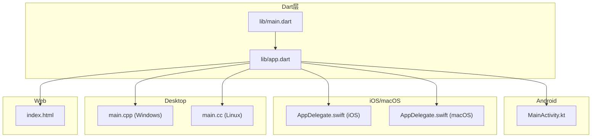
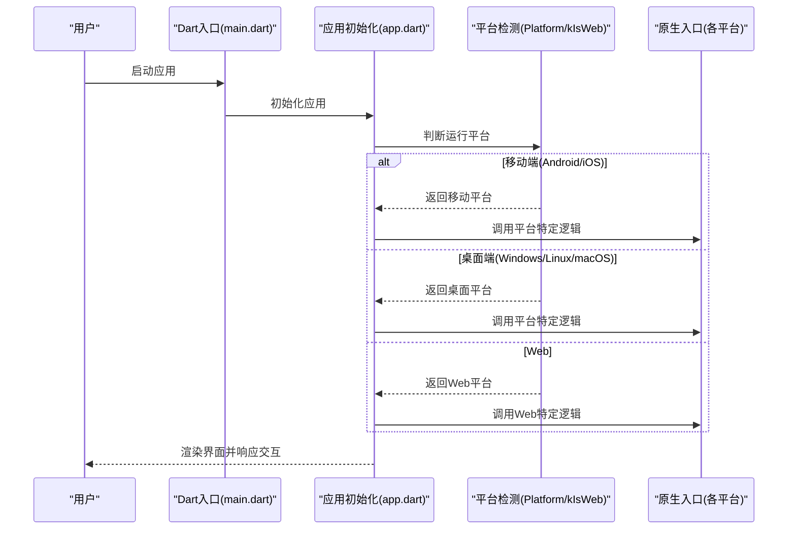
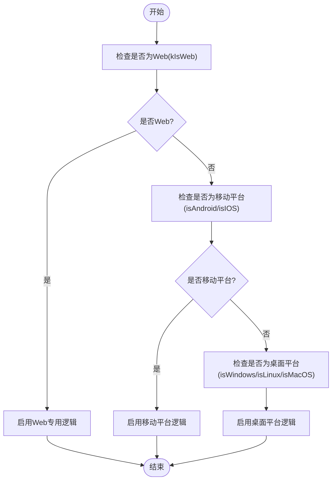
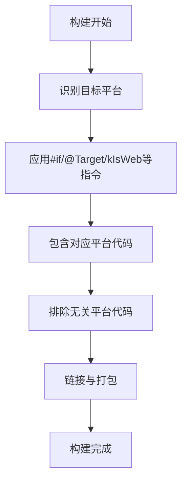
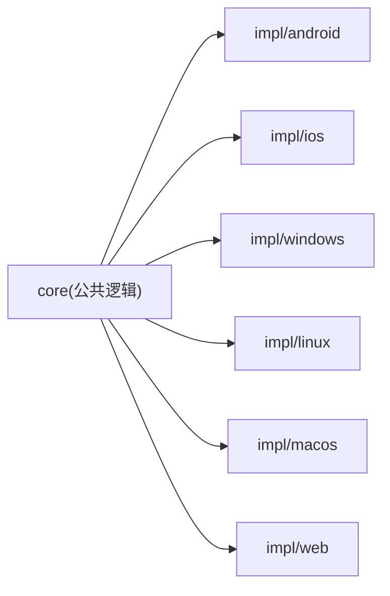
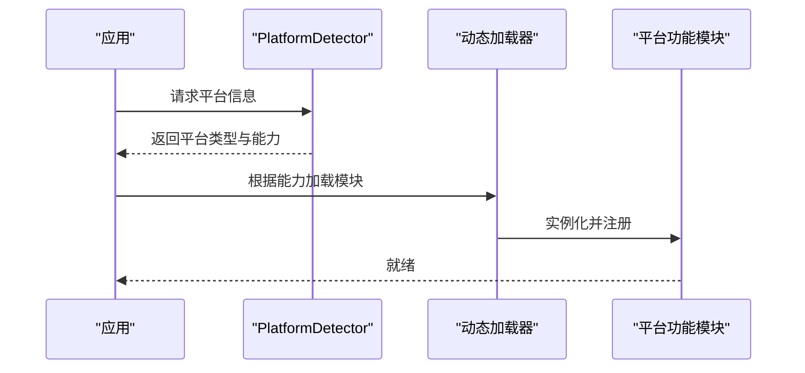
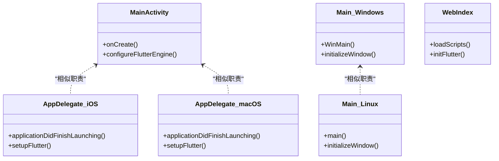
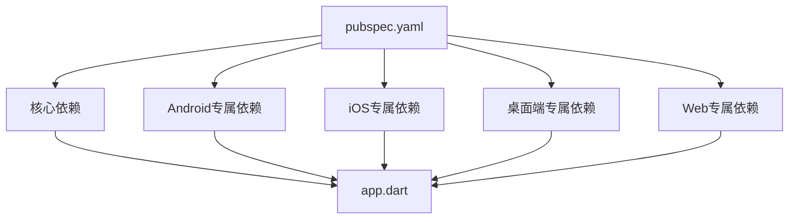

# 条件编译与平台判断

<cite>
**本文档引用的文件**   
- [lib/main.dart](file://lib/main.dart)
- [lib/app.dart](file://lib/app.dart)
- [pubspec.yaml](file://pubspec.yaml)
- [android/app/src/main/kotlin/com/example/photo_organizer_ai/MainActivity.kt](file://android/app/src/main/kotlin/com/example/photo_organizer_ai/MainActivity.kt)
- [ios/Runner/AppDelegate.swift](file://ios/Runner/AppDelegate.swift)
- [macos/Runner/AppDelegate.swift](file://macos/Runner/AppDelegate.swift)
- [windows/runner/main.cpp](file://windows/runner/main.cpp)
- [linux/runner/main.cc](file://linux/runner/main.cc)
- [web/index.html](file://web/index.html)
</cite>

## 目录
1. [简介](#简介)
2. [项目结构](#项目结构)
3. [核心组件](#核心组件)
4. [架构总览](#架构总览)
5. [详细组件分析](#详细组件分析)
6. [依赖分析](#依赖分析)
7. [性能考虑](#性能考虑)
8. [故障排查指南](#故障排查指南)
9. [结论](#结论)
10. [附录](#附录)

## 简介
本技术文档面向Flutter照片整理AI应用，聚焦“条件编译与平台判断”的完整实践。内容涵盖：
- dart:io中的Platform类使用（如Android、iOS等平台判断）
- 条件编译指令（#if、@Target、kIsWeb等）
- 平台特定代码的组织方式（目录结构、命名规范、模块分离）
- 运行时平台检测（PlatformDetector、动态功能加载）
- 最佳实践（代码复用、避免重复、可维护性）
- 具体示例路径与常见陷阱规避

## 项目结构
本项目为多端Flutter工程，包含Android、iOS、macOS、Windows、Linux与Web目标。关键入口与平台相关代码分布如下：
- Dart入口：lib/main.dart、lib/app.dart
- Android：android/app/src/main/kotlin/.../MainActivity.kt
- iOS/macOS：ios/Runner/AppDelegate.swift、macos/Runner/AppDelegate.swift
- Windows/Linux：windows/runner/main.cpp、linux/runner/main.cc
- Web：web/index.html

图表来源
- [lib/main.dart](file://lib/main.dart)
- [lib/app.dart](file://lib/app.dart)
- [android/app/src/main/kotlin/com/example/photo_organizer_ai/MainActivity.kt](file://android/app/src/main/kotlin/com/example/photo_organizer_ai/MainActivity.kt)
- [ios/Runner/AppDelegate.swift](file://ios/Runner/AppDelegate.swift)
- [macos/Runner/AppDelegate.swift](file://macos/Runner/AppDelegate.swift)
- [windows/runner/main.cpp](file://windows/runner/main.cpp)
- [linux/runner/main.cc](file://linux/runner/main.cc)
- [web/index.html](file://web/index.html)

章节来源
- [lib/main.dart](file://lib/main.dart)
- [lib/app.dart](file://lib/app.dart)
- [pubspec.yaml](file://pubspec.yaml)

## 核心组件
- 平台检测与条件编译：在Dart侧通过dart:io的Platform类进行运行时判断；在构建期通过#if、@Target、kIsWeb等进行编译期裁剪。
- 平台特定实现：按平台拆分原生入口或配置，保证Dart层统一调用。
- 动态功能加载：根据平台特性按需引入插件或能力。

章节来源
- [lib/main.dart](file://lib/main.dart)
- [lib/app.dart](file://lib/app.dart)
- [pubspec.yaml](file://pubspec.yaml)

## 架构总览
下图展示从Dart入口到各平台原生入口的调用关系，以及条件编译与平台判断如何影响最终产物。

图表来源
- [lib/main.dart](file://lib/main.dart)
- [lib/app.dart](file://lib/app.dart)
- [android/app/src/main/kotlin/com/example/photo_organizer_ai/MainActivity.kt](file://android/app/src/main/kotlin/com/example/photo_organizer_ai/MainActivity.kt)
- [ios/Runner/AppDelegate.swift](file://ios/Runner/AppDelegate.swift)
- [macos/Runner/AppDelegate.swift](file://macos/Runner/AppDelegate.swift)
- [windows/runner/main.cpp](file://windows/runner/main.cpp)
- [linux/runner/main.cc](file://linux/runner/main.cc)
- [web/index.html](file://web/index.html)

## 详细组件分析

### Platform类与运行时平台检测
- 常用属性与方法：
  - isAndroid、isIOS、isWindows、isLinux、isMacOS、isWeb等布尔属性用于快速判断当前运行环境。
  - platformName、operatingSystemVersion等可用于更详细的诊断信息。
- 使用建议：
  - 优先使用Platform.*属性进行分支控制，避免硬编码字符串比较。
  - 对Web平台需结合kIsWeb进行构建期裁剪，减少无用代码进入产物。
- 典型流程：
  - 在应用初始化阶段获取平台信息，决定后续功能开关与UI适配策略。

图表来源
- [lib/main.dart](file://lib/main.dart)
- [lib/app.dart](file://lib/app.dart)

章节来源
- [lib/main.dart](file://lib/main.dart)
- [lib/app.dart](file://lib/app.dart)

### 条件编译指令与构建期裁剪
- #if条件编译：
  - 使用const表达式在编译期决定是否包含某段代码，例如基于常量判断平台或构建模式。
- @Target注解：
  - 限制代码仅对特定目标生效，避免无关平台编译错误。
- kIsWeb常量：
  - 在Web构建时可用，常用于区分Web与非Web行为，配合import show进行选择性导入。
- 最佳实践：
  - 将平台差异封装在独立模块中，通过条件编译选择实现。
  - 避免在业务逻辑中散落大量平台分支，尽量上移到基础设施层。

图表来源
- [lib/main.dart](file://lib/main.dart)
- [lib/app.dart](file://lib/app.dart)

章节来源
- [lib/main.dart](file://lib/main.dart)
- [lib/app.dart](file://lib/app.dart)

### 平台特定代码组织方式
- 目录结构建议：
  - 将平台差异放在platforms或platform/目录下，按平台子目录划分（android、ios、windows、linux、macos、web）。
  - 每个平台提供统一的接口抽象，Dart层通过工厂或策略模式选择实现。
- 文件命名规范：
  - 以平台前缀或后缀标识（如android_storage.dart、ios_storage.dart），便于检索与维护。
- 模块分离策略：
  - 公共逻辑放入core模块，平台差异放入impl模块，通过条件编译或运行时检测装配。

[本图为概念图，不直接映射具体源文件]

### 运行时平台检测与动态功能加载
- PlatformDetector：
  - 若项目中存在自定义PlatformDetector，可在运行时动态探测平台特征，驱动功能开关。
- 动态功能加载：
  - 根据平台检测结果按需加载插件或本地库，避免不必要的依赖体积。
- 安全边界：
  - 对未实现的平台能力提供降级方案或明确错误提示。

图表来源
- [lib/main.dart](file://lib/main.dart)
- [lib/app.dart](file://lib/app.dart)

章节来源
- [lib/main.dart](file://lib/main.dart)
- [lib/app.dart](file://lib/app.dart)

### 原生入口与平台集成点
- Android：
  - MainActivity负责Flutter引擎与Android系统桥接，必要时在此注入平台能力。
- iOS/macOS：
  - AppDelegate处理生命周期事件与系统通知，适合放置平台特定初始化。
- Windows/Linux：
  - main.cpp/main.cc作为桌面端入口，可进行窗口与资源初始化。
- Web：
  - index.html定义Web页面结构与脚本加载，适合注入Web特有配置。

图表来源
- [android/app/src/main/kotlin/com/example/photo_organizer_ai/MainActivity.kt](file://android/app/src/main/kotlin/com/example/photo_organizer_ai/MainActivity.kt)
- [ios/Runner/AppDelegate.swift](file://ios/Runner/AppDelegate.swift)
- [macos/Runner/AppDelegate.swift](file://macos/Runner/AppDelegate.swift)
- [windows/runner/main.cpp](file://windows/runner/main.cpp)
- [linux/runner/main.cc](file://linux/runner/main.cc)
- [web/index.html](file://web/index.html)

章节来源
- [android/app/src/main/kotlin/com/example/photo_organizer_ai/MainActivity.kt](file://android/app/src/main/kotlin/com/example/photo_organizer_ai/MainActivity.kt)
- [ios/Runner/AppDelegate.swift](file://ios/Runner/AppDelegate.swift)
- [macos/Runner/AppDelegate.swift](file://macos/Runner/AppDelegate.swift)
- [windows/runner/main.cpp](file://windows/runner/main.cpp)
- [linux/runner/main.cc](file://linux/runner/main.cc)
- [web/index.html](file://web/index.html)

## 依赖分析
- 平台依赖管理：
  - 通过pubspec.yaml声明跨平台依赖，针对特定平台使用platforms字段限定范围。
- 条件导入：
  - 使用import ... show/hide与kIsWeb组合，仅在需要的平台引入模块。
- 避免循环依赖：
  - 将平台差异下沉至独立模块，保持Dart核心层稳定。

图表来源
- [pubspec.yaml](file://pubspec.yaml)
- [lib/app.dart](file://lib/app.dart)

章节来源
- [pubspec.yaml](file://pubspec.yaml)
- [lib/app.dart](file://lib/app.dart)

## 性能考虑
- 构建期裁剪：
  - 合理使用#if与kIsWeb减少产物体积，避免无用平台代码进入包。
- 运行时开销：
  - 平台检测应在初始化阶段集中执行，避免在热路径频繁判断。
- 内存与启动时间：
  - 按需加载平台模块，延迟初始化非关键能力。

[本节为通用指导，无需引用具体文件]

## 故障排查指南
- 常见问题：
  - 平台判断不准确：确认Platform属性与kIsWeb的使用场景，避免混用。
  - 条件编译未生效：检查#if表达式与常量定义是否正确，确保构建目标一致。
  - 平台特定代码缺失：核对目录结构与命名规范，确保导入路径正确。
- 调试技巧：
  - 在应用启动时输出平台信息与能力清单，辅助定位问题。
  - 使用不同构建目标（debug/profile/release）验证行为一致性。

章节来源
- [lib/main.dart](file://lib/main.dart)
- [lib/app.dart](file://lib/app.dart)

## 结论
通过合理运用Platform类与条件编译指令，可以在Flutter应用中优雅地处理多平台差异。建议将平台逻辑收敛到基础设施层，采用清晰的目录结构与命名规范，结合运行时检测与构建期裁剪，提升代码复用性与可维护性。遵循本文的最佳实践与陷阱规避方法，可有效降低跨平台开发的复杂度与风险。

[本节为总结性内容，无需引用具体文件]

## 附录
- 参考文件路径：
  - Dart入口与初始化：lib/main.dart、lib/app.dart
  - 平台原生入口：Android MainActivity、iOS/macOS AppDelegate、Windows/Linux main、Web index.html
  - 依赖管理：pubspec.yaml

[本节为索引性内容，无需引用具体文件]