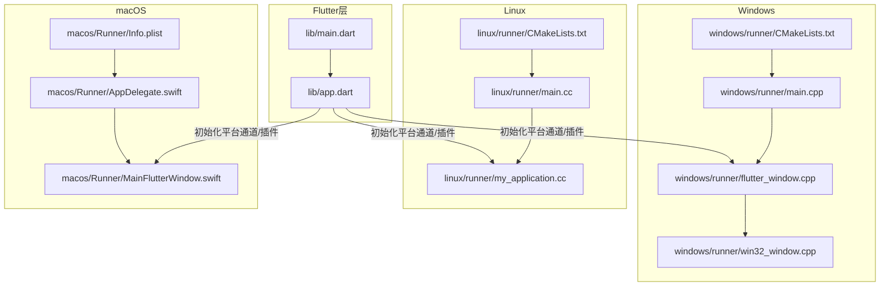
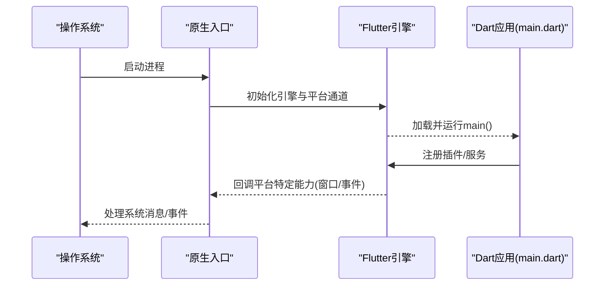
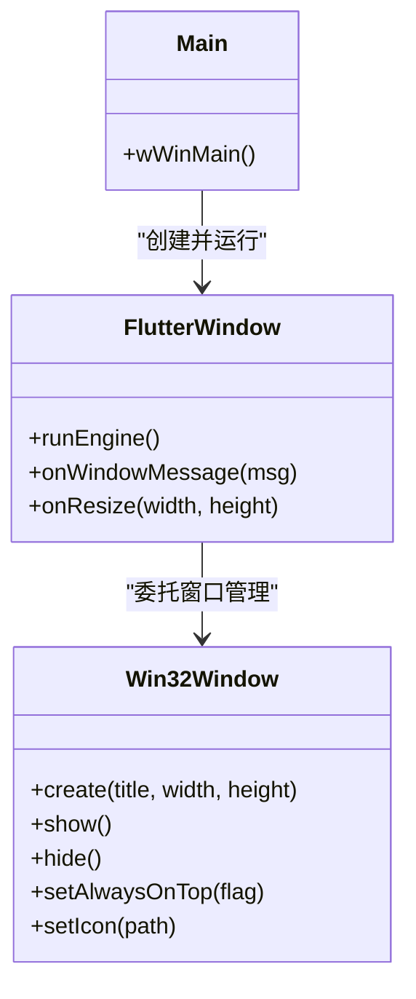
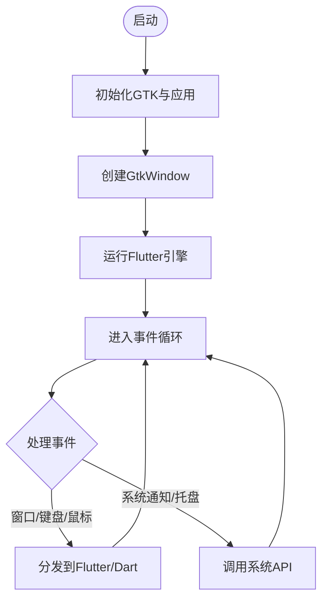
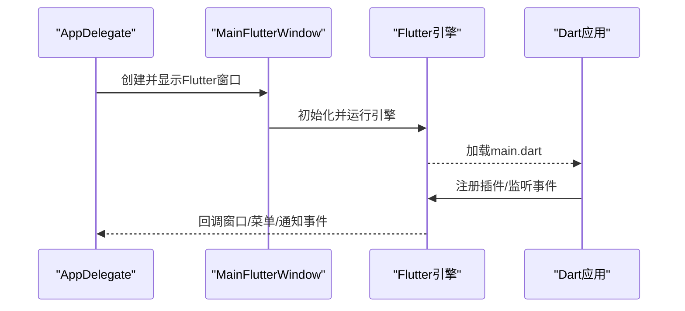
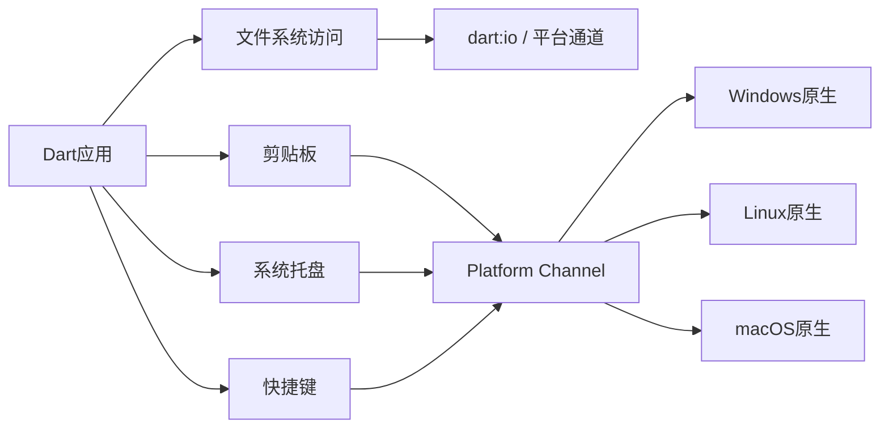

# 桌面平台开发

<cite>
**本文引用的文件**   
- [README.md](file://README.md)
- [pubspec.yaml](file://pubspec.yaml)
- [lib/main.dart](file://lib/main.dart)
- [lib/app.dart](file://lib/app.dart)
- [linux/CMakeLists.txt](file://linux/CMakeLists.txt)
- [linux/runner/CMakeLists.txt](file://linux/runner/CMakeLists.txt)
- [linux/runner/main.cc](file://linux/runner/main.cc)
- [linux/runner/my_application.h](file://linux/runner/my_application.h)
- [linux/runner/my_application.cc](file://linux/runner/my_application.cc)
- [macos/Runner/AppDelegate.swift](file://macos/Runner/AppDelegate.swift)
- [macos/Runner/MainFlutterWindow.swift](file://macos/Runner/MainFlutterWindow.swift)
- [macos/Runner/Info.plist](file://macos/Runner/Info.plist)
- [windows/runner/CMakeLists.txt](file://windows/runner/CMakeLists.txt)
- [windows/runner/main.cpp](file://windows/runner/main.cpp)
- [windows/runner/flutter_window.cpp](file://windows/runner/flutter_window.cpp)
- [windows/runner/win32_window.cpp](file://windows/runner/win32_window.cpp)
</cite>

## 目录
1. [简介](#简介)
2. [项目结构](#项目结构)
3. [核心组件](#核心组件)
4. [架构总览](#架构总览)
5. [详细组件分析](#详细组件分析)
6. [依赖分析](#依赖分析)
7. [性能考虑](#性能考虑)
8. [故障排查指南](#故障排查指南)
9. [结论](#结论)
10. [附录](#附录)

## 简介
本技术文档面向Flutter照片整理AI应用的桌面端（Windows、Linux、macOS）开发与集成，聚焦以下目标：
- 各平台构建配置与原生入口差异
- 窗口管理与生命周期控制
- 文件系统访问、剪贴板操作、系统托盘、快捷键等桌面能力适配
- 拖拽、批量操作、多窗口管理等桌面特有功能实现思路
- 内存管理、渲染优化、启动速度等性能策略
- 调试与测试方法（含跨平台兼容性）
- 具体配置示例与跨平台适配指南

## 项目结构
本项目为典型的Flutter工程，包含Android、iOS、Web以及三个桌面平台（Windows、Linux、macOS）的独立原生工程。桌面端关键目录如下：
- linux: CMake构建脚本与原生入口（main.cc、my_application.*）
- macos: Xcode工程与Swift原生入口（AppDelegate.swift、MainFlutterWindow.swift）
- windows: CMake构建脚本与Win32原生入口（main.cpp、flutter_window.*、win32_window.*）
- lib: Flutter应用代码（main.dart、app.dart等）
- pubspec.yaml: 依赖与插件声明

图表来源 
- [windows/runner/main.cpp](file://windows/runner/main.cpp)
- [windows/runner/flutter_window.cpp](file://windows/runner/flutter_window.cpp)
- [windows/runner/win32_window.cpp](file://windows/runner/win32_window.cpp)
- [linux/runner/main.cc](file://linux/runner/main.cc)
- [linux/runner/my_application.cc](file://linux/runner/my_application.cc)
- [macos/Runner/AppDelegate.swift](file://macos/Runner/AppDelegate.swift)
- [macos/Runner/MainFlutterWindow.swift](file://macos/Runner/MainFlutterWindow.swift)

章节来源
- [README.md](file://README.md)
- [pubspec.yaml](file://pubspec.yaml)
- [lib/main.dart](file://lib/main.dart)
- [lib/app.dart](file://lib/app.dart)

## 核心组件
- 应用入口与路由
  - main.dart负责初始化Flutter引擎并运行应用根组件
  - app.dart定义应用主题、路由、全局状态等
- 桌面原生入口
  - Windows: main.cpp创建Win32窗口并托管Flutter引擎
  - Linux: main.cc与my_application.cc管理GTK窗口与事件循环
  - macOS: AppDelegate.swift与MainFlutterWindow.swift管理NSApplication与Flutter视图
- 构建系统
  - CMake（Windows/Linux）与Xcode（macOS）分别管理编译、链接与资源打包

章节来源
- [lib/main.dart](file://lib/main.dart)
- [lib/app.dart](file://lib/app.dart)
- [windows/runner/main.cpp](file://windows/runner/main.cpp)
- [linux/runner/main.cc](file://linux/runner/main.cc)
- [linux/runner/my_application.cc](file://linux/runner/my_application.cc)
- [macos/Runner/AppDelegate.swift](file://macos/Runner/AppDelegate.swift)
- [macos/Runner/MainFlutterWindow.swift](file://macos/Runner/MainFlutterWindow.swift)

## 架构总览
下图展示从原生入口到Flutter层的调用链，以及各平台差异点。

图表来源 
- [windows/runner/main.cpp](file://windows/runner/main.cpp)
- [linux/runner/main.cc](file://linux/runner/main.cc)
- [macos/Runner/AppDelegate.swift](file://macos/Runner/AppDelegate.swift)
- [lib/main.dart](file://lib/main.dart)

## 详细组件分析

### Windows平台
- 构建与入口
  - CMakeLists.txt定义可执行目标、源文件与依赖
  - main.cpp创建Win32窗口并启动Flutter引擎
  - flutter_window.cpp封装Flutter窗口生命周期
  - win32_window.cpp提供Win32窗口抽象与消息循环
- 窗口管理
  - 通过Win32 API创建主窗口，设置样式、尺寸、图标
  - 支持最小化、最大化、关闭、置顶等常见行为
- 系统集成
  - 可通过平台通道调用系统托盘、快捷键、剪贴板、文件选择器等
  - 建议将平台相关逻辑封装在Dart侧的服务类中，使用MethodChannel通信

图表来源 
- [windows/runner/win32_window.cpp](file://windows/runner/win32_window.cpp)
- [windows/runner/flutter_window.cpp](file://windows/runner/flutter_window.cpp)
- [windows/runner/main.cpp](file://windows/runner/main.cpp)

章节来源
- [windows/runner/CMakeLists.txt](file://windows/runner/CMakeLists.txt)
- [windows/runner/main.cpp](file://windows/runner/main.cpp)
- [windows/runner/flutter_window.cpp](file://windows/runner/flutter_window.cpp)
- [windows/runner/win32_window.cpp](file://windows/runner/win32_window.cpp)

### Linux平台
- 构建与入口
  - CMakeLists.txt定义C++目标与依赖
  - main.cc作为程序入口，初始化GTK与Flutter引擎
  - my_application.cc实现MyApplication类，管理窗口与事件
- 窗口管理
  - 基于GTK/GNOME栈，窗口由GtkApplication与GtkWindow组合
  - 支持菜单、工具栏、通知、拖放等桌面特性
- 系统集成
  - 通过平台通道或原生插件访问文件管理器、剪贴板、快捷键等

图表来源 
- [linux/runner/main.cc](file://linux/runner/main.cc)
- [linux/runner/my_application.cc](file://linux/runner/my_application.cc)
- [linux/runner/CMakeLists.txt](file://linux/runner/CMakeLists.txt)

章节来源
- [linux/runner/CMakeLists.txt](file://linux/runner/CMakeLists.txt)
- [linux/runner/main.cc](file://linux/runner/main.cc)
- [linux/runner/my_application.cc](file://linux/runner/my_application.cc)

### macOS平台
- 构建与入口
  - AppDelegate.swift管理NSApplication生命周期
  - MainFlutterWindow.swift创建Flutter视图并嵌入到NSWindow
  - Info.plist定义应用元数据、权限与URL Scheme等
- 窗口管理
  - 基于Cocoa框架，支持NSWindow、NSViewController、菜单栏、Dock图标等
- 系统集成
  - 通过Objective-C/Swift桥接调用系统服务（如剪贴板、通知、快捷指令等）

图表来源 
- [macos/Runner/AppDelegate.swift](file://macos/Runner/AppDelegate.swift)
- [macos/Runner/MainFlutterWindow.swift](file://macos/Runner/MainFlutterWindow.swift)
- [macos/Runner/Info.plist](file://macos/Runner/Info.plist)

章节来源
- [macos/Runner/AppDelegate.swift](file://macos/Runner/AppDelegate.swift)
- [macos/Runner/MainFlutterWindow.swift](file://macos/Runner/MainFlutterWindow.swift)
- [macos/Runner/Info.plist](file://macos/Runner/Info.plist)

## 依赖分析
- 插件与能力
  - 文件访问：建议使用dart:io与路径规范化；大文件扫描采用异步流式读取
  - 剪贴板：使用flutter_clipboard或平台通道直接调用系统API
  - 系统托盘：Windows使用system_tray，macOS使用NSStatusItem，Linux使用libayatana-appindicator或gtk-tray
  - 快捷键：Windows使用RegisterHotKey，macOS使用NSEvent/NSSystemDefined，Linux使用GDK加速器
- 构建依赖
  - Windows/Linux通过CMake管理第三方库（如图像处理、压缩、加密）
  - macOS通过Xcode与Package Manager管理依赖

图表来源 
- [lib/main.dart](file://lib/main.dart)
- [windows/runner/main.cpp](file://windows/runner/main.cpp)
- [linux/runner/main.cc](file://linux/runner/main.cc)
- [macos/Runner/AppDelegate.swift](file://macos/Runner/AppDelegate.swift)

章节来源
- [pubspec.yaml](file://pubspec.yaml)
- [windows/runner/CMakeLists.txt](file://windows/runner/CMakeLists.txt)
- [linux/runner/CMakeLists.txt](file://linux/runner/CMakeLists.txt)

## 性能考虑
- 内存管理
  - 图片解码：按需解码、限制分辨率、使用缓存池（LRU）
  - 大文件处理：分块读取、后台任务队列、避免阻塞UI线程
  - 对象回收：及时释放Bitmap/图像句柄，避免内存泄漏
- 渲染优化
  - 使用RepaintBoundary隔离重绘区域
  - 列表虚拟化（ListView.builder）与分页加载
  - 减少不必要的setState，使用ValueNotifier/Provider/Riverpod
- 启动速度
  - 延迟初始化重型服务（如AI模型、索引器）
  - 预加载常用资源与字体
  - 精简插件与native库体积
- 平台差异
  - Windows：注意DPI缩放与高DPI下的渲染质量
  - Linux：不同发行版GTK版本差异，需兼容测试
  - macOS：沙盒与权限限制，确保正确配置Entitlements

[本节为通用指导，不直接分析具体文件]

## 故障排查指南
- 常见问题定位
  - 启动崩溃：检查原生入口日志（Windows事件查看器、Linux dmesg/journalctl、macOS Console）
  - 窗口异常：验证窗口样式、DPI、全屏模式与多显示器适配
  - 插件失败：确认platform channel命名一致、权限配置正确
- 调试与测试
  - 断点调试：IDE附加到Flutter与原生进程
  - 性能分析：DevTools CPU/内存火焰图、帧率监控
  - 兼容性测试：多版本系统、多分辨率、多语言环境
- 日志与错误上报
  - 统一日志格式与级别
  - 捕获未处理异常并上报（脱敏）

[本节为通用指导，不直接分析具体文件]

## 结论
本指南梳理了Flutter照片整理AI应用在Windows、Linux、macOS三大桌面的构建、原生集成与窗口管理要点，并给出文件系统、剪贴板、托盘、快捷键等能力的适配思路与性能优化策略。建议在实现时遵循“Dart业务+平台通道”的分层设计，保证跨平台一致性与可维护性。

[本节为总结，不直接分析具体文件]

## 附录
- 构建命令参考
  - Windows: flutter build windows
  - Linux: flutter build linux
  - macOS: flutter build macos
- 发布与签名
  - Windows: 使用signtool对exe签名
  - macOS: 使用codesign与notarytool进行签名与公证
  - Linux: 打包为AppImage/Flatpak并校验依赖
- 跨平台适配清单
  - 路径分隔符与大小写敏感
  - 文件扩展名与MIME类型映射
  - 系统托盘图标与菜单布局
  - 快捷键冲突与平台差异

[本节为补充信息，不直接分析具体文件]