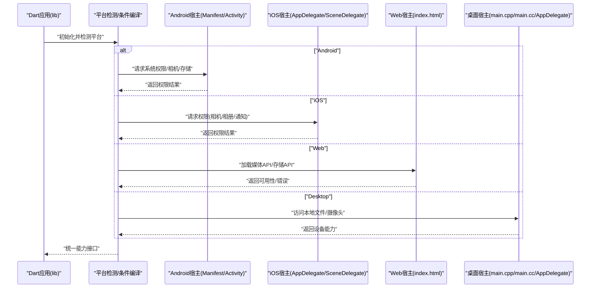
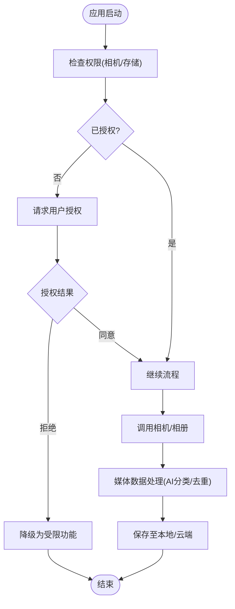
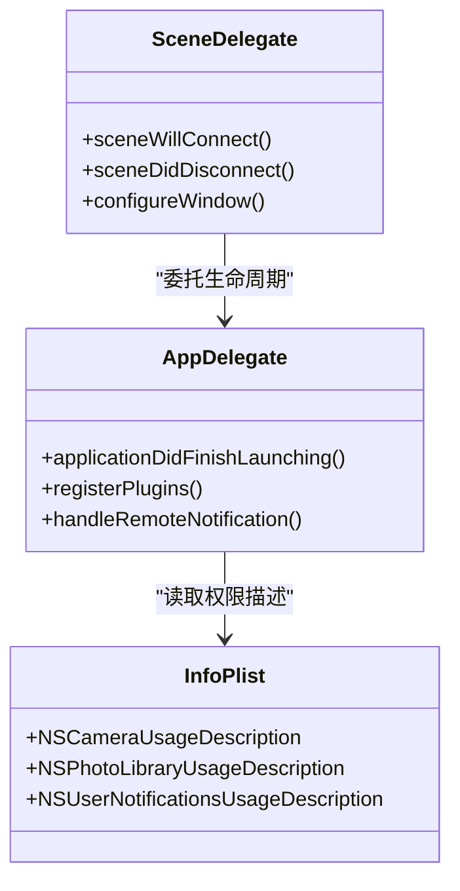
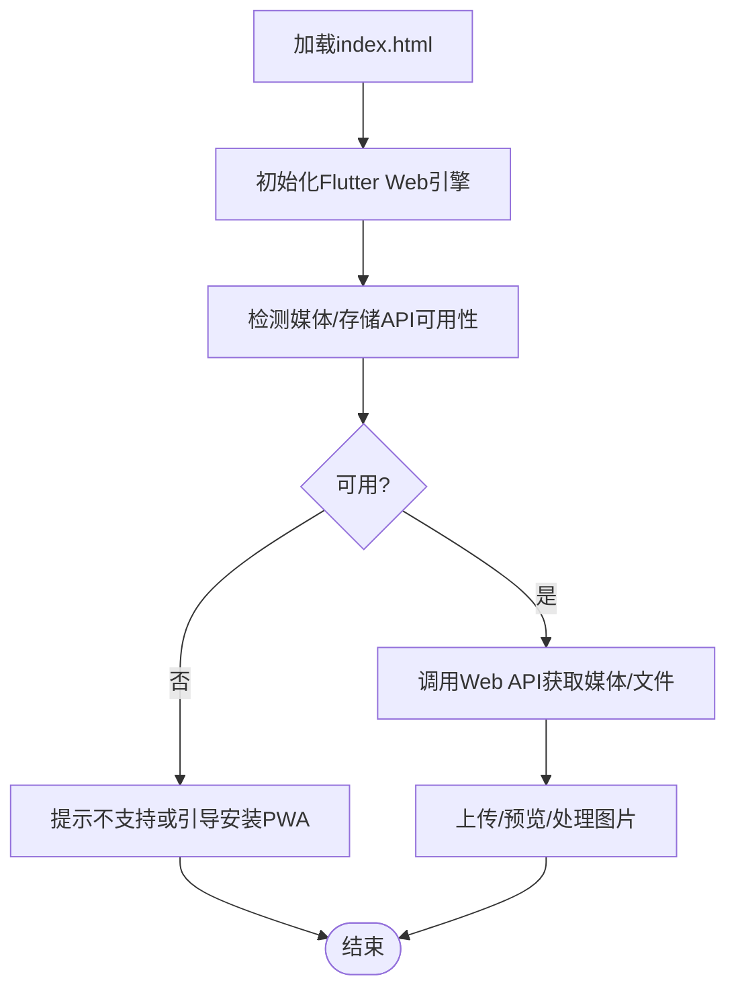
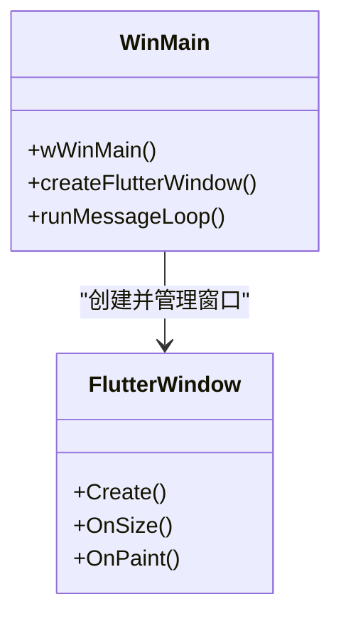
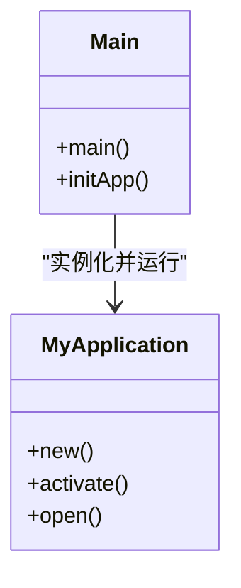
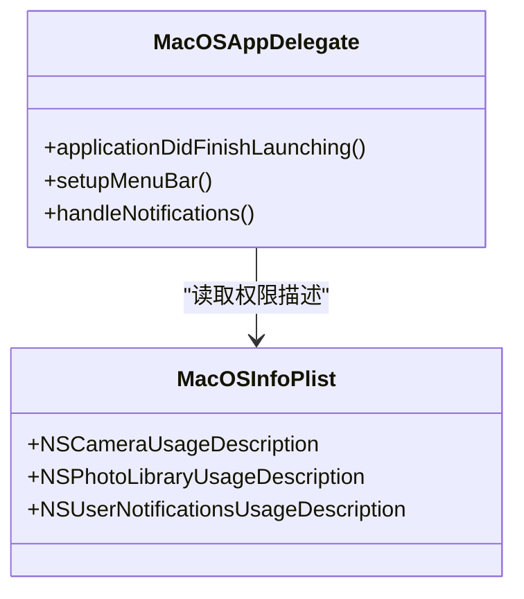
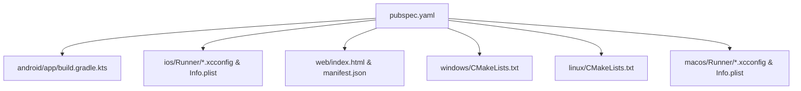

# 跨平台开发

<cite>
**本文引用的文件**   
- [pubspec.yaml](file://pubspec.yaml)
- [lib/main.dart](file://lib/main.dart)
- [lib/app.dart](file://lib/app.dart)
- [android/app/build.gradle.kts](file://android/app/build.gradle.kts)
- [android/build.gradle.kts](file://android/build.gradle.kts)
- [android/gradle.properties](file://android/gradle.properties)
- [android/settings.gradle.kts](file://android/settings.gradle.kts)
- [android/app/src/main/AndroidManifest.xml](file://android/app/src/main/AndroidManifest.xml)
- [android/app/src/main/kotlin/com/example/photo_organizer_ai/MainActivity.kt](file://android/app/src/main/kotlin/com/example/photo_organizer_ai/MainActivity.kt)
- [android/app/src/debug/AndroidManifest.xml](file://android/app/src/debug/AndroidManifest.xml)
- [android/app/src/profile/AndroidManifest.xml](file://android/app/src/profile/AndroidManifest.xml)
- [ios/Runner/Info.plist](file://ios/Runner/Info.plist)
- [ios/Runner/AppDelegate.swift](file://ios/Runner/AppDelegate.swift)
- [ios/Runner/SceneDelegate.swift](file://ios/Runner/SceneDelegate.swift)
- [ios/Runner/Base.lproj/LaunchScreen.storyboard](file://ios/Runner/Base.lproj/LaunchScreen.storyboard)
- [ios/Runner/Base.lproj/Main.storyboard](file://ios/Runner/Base.lproj/Main.storyboard)
- [web/index.html](file://web/index.html)
- [web/manifest.json](file://web/manifest.json)
- [windows/runner/flutter_window.h](file://windows/runner/flutter_window.h)
- [windows/runner/main.cpp](file://windows/runner/main.cpp)
- [linux/runner/my_application.h](file://linux/runner/my_application.h)
- [linux/runner/main.cc](file://linux/runner/main.cc)
- [macos/Runner/AppDelegate.swift](file://macos/Runner/AppDelegate.swift)
- [macos/Runner/Info.plist](file://macos/Runner/Info.plist)
</cite>

## 目录
1. [简介](#简介)
2. [项目结构](#项目结构)
3. [核心组件](#核心组件)
4. [架构总览](#架构总览)
5. [详细组件分析](#详细组件分析)
6. [依赖分析](#依赖分析)
7. [性能考虑](#性能考虑)
8. [故障排除指南](#故障排除指南)
9. [结论](#结论)
10. [附录](#附录)

## 简介
本技术文档面向Flutter照片整理AI应用的跨平台开发，聚焦于：
- 平台特定代码实现（Android、iOS、Web、Windows、Linux、macOS）
- 条件编译与平台判断技巧（如Platform.isAndroid、Platform.isIOS等）
- 原生功能集成（相机访问、文件系统权限、推送通知等系统级能力）
- 构建配置管理（各平台构建脚本、签名配置、资源管理）
- 平台差异处理（UI适配、性能优化、功能降级策略）
- 插件开发与集成（第三方插件使用与自定义插件开发）
- 跨平台调试与测试（模拟器、真机调试、性能分析）
- 具体配置示例与故障排除

## 项目结构
该Flutter工程遵循标准多平台布局，包含以下关键目录与文件：
- lib：Dart应用入口与业务逻辑
- android：Android原生工程与Gradle构建配置
- ios：iOS原生工程与Xcode配置文件
- web：Web端入口与清单
- windows/linux/macos：桌面端原生宿主与CMake/Xcode配置
- pubspec.yaml：Dart依赖与资源声明

```mermaid
graph TB
subgraph "Dart层"
main["lib/main.dart"]
app["lib/app.dart"]
features["features/*"]
services["services/*"]
providers["providers/*"]
pages["pages/*"]
end
subgraph "Android"
a_main["android/app/src/main/AndroidManifest.xml"]
a_gradle["android/app/build.gradle.kts"]
a_activity["MainActivity.kt"]
end
subgraph "iOS"
i_info["ios/Runner/Info.plist"]
i_appdelegate["AppDelegate.swift"]
i_scenedelegate["SceneDelegate.swift"]
end
subgraph "Web"
w_index["web/index.html"]
w_manifest["web/manifest.json"]
end
subgraph "Windows"
w_main["windows/runner/main.cpp"]
w_window["flutter_window.h"]
end
subgraph "Linux"
l_main["linux/runner/main.cc"]
l_app["my_application.h"]
end
subgraph "macOS"
m_appdelegate["macos/Runner/AppDelegate.swift"]
m_info["macos/Runner/Info.plist"]
end
main --> app
app --> features
app --> services
app --> providers
app --> pages
main --> a_main
main --> i_info
main --> w_index
main --> w_main
main --> l_main
main --> m_appdelegate
```

**图表来源** 
- [lib/main.dart](file://lib/main.dart)
- [lib/app.dart](file://lib/app.dart)
- [android/app/src/main/AndroidManifest.xml](file://android/app/src/main/AndroidManifest.xml)
- [android/app/build.gradle.kts](file://android/app/build.gradle.kts)
- [android/app/src/main/kotlin/com/example/photo_organizer_ai/MainActivity.kt](file://android/app/src/main/kotlin/com/example/photo_organizer_ai/MainActivity.kt)
- [ios/Runner/Info.plist](file://ios/Runner/Info.plist)
- [ios/Runner/AppDelegate.swift](file://ios/Runner/AppDelegate.swift)
- [ios/Runner/SceneDelegate.swift](file://ios/Runner/SceneDelegate.swift)
- [web/index.html](file://web/index.html)
- [web/manifest.json](file://web/manifest.json)
- [windows/runner/main.cpp](file://windows/runner/main.cpp)
- [windows/runner/flutter_window.h](file://windows/runner/flutter_window.h)
- [linux/runner/main.cc](file://linux/runner/main.cc)
- [linux/runner/my_application.h](file://linux/runner/my_application.h)
- [macos/Runner/AppDelegate.swift](file://macos/Runner/AppDelegate.swift)
- [macos/Runner/Info.plist](file://macos/Runner/Info.plist)

**章节来源**
- [pubspec.yaml](file://pubspec.yaml)
- [lib/main.dart](file://lib/main.dart)
- [lib/app.dart](file://lib/app.dart)

## 核心组件
- 应用入口与路由初始化：位于lib/main.dart与lib/app.dart，负责启动Flutter引擎、注册全局主题、路由与Provider状态。
- Android宿主：MainActivity.kt作为Activity入口；AndroidManifest.xml声明权限、组件与Intent过滤器。
- iOS宿主：AppDelegate.swift与SceneDelegate.swift管理生命周期；Info.plist声明权限与特性。
- Web宿主：index.html与manifest.json定义页面元数据与图标。
- 桌面端宿主：Windows的main.cpp与flutter_window.h，Linux的main.cc与my_application.h，macOS的AppDelegate.swift与Info.plist。

这些组件共同构成跨平台运行时桥接点，使Dart层通过平台通道或插件调用系统能力。

**章节来源**
- [lib/main.dart](file://lib/main.dart)
- [lib/app.dart](file://lib/app.dart)
- [android/app/src/main/kotlin/com/example/photo_organizer_ai/MainActivity.kt](file://android/app/src/main/kotlin/com/example/photo_organizer_ai/MainActivity.kt)
- [android/app/src/main/AndroidManifest.xml](file://android/app/src/main/AndroidManifest.xml)
- [ios/Runner/AppDelegate.swift](file://ios/Runner/AppDelegate.swift)
- [ios/Runner/SceneDelegate.swift](file://ios/Runner/SceneDelegate.swift)
- [ios/Runner/Info.plist](file://ios/Runner/Info.plist)
- [web/index.html](file://web/index.html)
- [web/manifest.json](file://web/manifest.json)
- [windows/runner/main.cpp](file://windows/runner/main.cpp)
- [windows/runner/flutter_window.h](file://windows/runner/flutter_window.h)
- [linux/runner/main.cc](file://linux/runner/main.cc)
- [linux/runner/my_application.h](file://linux/runner/my_application.h)
- [macos/Runner/AppDelegate.swift](file://macos/Runner/AppDelegate.swift)
- [macos/Runner/Info.plist](file://macos/Runner/Info.plist)

## 架构总览
下图展示从Dart层到各平台宿主的调用路径与职责划分：

**图表来源** 
- [lib/main.dart](file://lib/main.dart)
- [android/app/src/main/AndroidManifest.xml](file://android/app/src/main/AndroidManifest.xml)
- [android/app/src/main/kotlin/com/example/photo_organizer_ai/MainActivity.kt](file://android/app/src/main/kotlin/com/example/photo_organizer_ai/MainActivity.kt)
- [ios/Runner/Info.plist](file://ios/Runner/Info.plist)
- [ios/Runner/AppDelegate.swift](file://ios/Runner/AppDelegate.swift)
- [web/index.html](file://web/index.html)
- [windows/runner/main.cpp](file://windows/runner/main.cpp)
- [linux/runner/main.cc](file://linux/runner/main.cc)
- [macos/Runner/AppDelegate.swift](file://macos/Runner/AppDelegate.swift)

## 详细组件分析

### Android平台
- 构建配置：android/app/build.gradle.kts与android/build.gradle.kts管理模块依赖、编译选项与签名；gradle.properties与settings.gradle.kts控制Gradle行为与子模块。
- 权限与组件：AndroidManifest.xml声明相机、存储、网络等权限；debug/profile变体可覆盖默认配置。
- 宿主Activity：MainActivity.kt作为Flutter Activity入口，可在此桥接原生能力（如相机、文件选择）。

**图表来源** 
- [android/app/src/main/AndroidManifest.xml](file://android/app/src/main/AndroidManifest.xml)
- [android/app/build.gradle.kts](file://android/app/build.gradle.kts)
- [android/build.gradle.kts](file://android/build.gradle.kts)
- [android/gradle.properties](file://android/gradle.properties)
- [android/settings.gradle.kts](file://android/settings.gradle.kts)
- [android/app/src/debug/AndroidManifest.xml](file://android/app/src/debug/AndroidManifest.xml)
- [android/app/src/profile/AndroidManifest.xml](file://android/app/src/profile/AndroidManifest.xml)
- [android/app/src/main/kotlin/com/example/photo_organizer_ai/MainActivity.kt](file://android/app/src/main/kotlin/com/example/photo_organizer_ai/MainActivity.kt)

**章节来源**
- [android/app/build.gradle.kts](file://android/app/build.gradle.kts)
- [android/build.gradle.kts](file://android/build.gradle.kts)
- [android/gradle.properties](file://android/gradle.properties)
- [android/settings.gradle.kts](file://android/settings.gradle.kts)
- [android/app/src/main/AndroidManifest.xml](file://android/app/src/main/AndroidManifest.xml)
- [android/app/src/debug/AndroidManifest.xml](file://android/app/src/debug/AndroidManifest.xml)
- [android/app/src/profile/AndroidManifest.xml](file://android/app/src/profile/AndroidManifest.xml)
- [android/app/src/main/kotlin/com/example/photo_organizer_ai/MainActivity.kt](file://android/app/src/main/kotlin/com/example/photo_organizer_ai/MainActivity.kt)

### iOS平台
- 权限与特性：Info.plist声明相机、相册、通知等权限；LaunchScreen与Main.storyboard定义启动界面。
- 生命周期：AppDelegate.swift与SceneDelegate.swift管理应用生命周期，适合接入系统服务（如推送、后台任务）。

**图表来源** 
- [ios/Runner/AppDelegate.swift](file://ios/Runner/AppDelegate.swift)
- [ios/Runner/SceneDelegate.swift](file://ios/Runner/SceneDelegate.swift)
- [ios/Runner/Info.plist](file://ios/Runner/Info.plist)
- [ios/Runner/Base.lproj/LaunchScreen.storyboard](file://ios/Runner/Base.lproj/LaunchScreen.storyboard)
- [ios/Runner/Base.lproj/Main.storyboard](file://ios/Runner/Base.lproj/Main.storyboard)

**章节来源**
- [ios/Runner/Info.plist](file://ios/Runner/Info.plist)
- [ios/Runner/AppDelegate.swift](file://ios/Runner/AppDelegate.swift)
- [ios/Runner/SceneDelegate.swift](file://ios/Runner/SceneDelegate.swift)
- [ios/Runner/Base.lproj/LaunchScreen.storyboard](file://ios/Runner/Base.lproj/LaunchScreen.storyboard)
- [ios/Runner/Base.lproj/Main.storyboard](file://ios/Runner/Base.lproj/Main.storyboard)

### Web平台
- 入口与清单：index.html定义页面结构与脚本加载；manifest.json提供应用名称、图标与主题色。
- 能力限制：Web端受浏览器沙箱限制，需通过Web API（如MediaDevices、File System Access）访问媒体与存储。

**图表来源** 
- [web/index.html](file://web/index.html)
- [web/manifest.json](file://web/manifest.json)

**章节来源**
- [web/index.html](file://web/index.html)
- [web/manifest.json](file://web/manifest.json)

### Windows平台
- 宿主与窗口：main.cpp作为Win32入口；flutter_window.h封装Flutter窗口创建与消息循环。

**图表来源** 
- [windows/runner/main.cpp](file://windows/runner/main.cpp)
- [windows/runner/flutter_window.h](file://windows/runner/flutter_window.h)

**章节来源**
- [windows/runner/main.cpp](file://windows/runner/main.cpp)
- [windows/runner/flutter_window.h](file://windows/runner/flutter_window.h)

### Linux平台
- 宿主与应用：main.cc为GTK/GNOME入口；my_application.h定义应用类与生命周期。

**图表来源** 
- [linux/runner/main.cc](file://linux/runner/main.cc)
- [linux/runner/my_application.h](file://linux/runner/my_application.h)

**章节来源**
- [linux/runner/main.cc](file://linux/runner/main.cc)
- [linux/runner/my_application.h](file://linux/runner/my_application.h)

### macOS平台
- 宿主与权限：AppDelegate.swift管理应用生命周期；Info.plist声明权限与特性。

**图表来源** 
- [macos/Runner/AppDelegate.swift](file://macos/Runner/AppDelegate.swift)
- [macos/Runner/Info.plist](file://macos/Runner/Info.plist)

**章节来源**
- [macos/Runner/AppDelegate.swift](file://macos/Runner/AppDelegate.swift)
- [macos/Runner/Info.plist](file://macos/Runner/Info.plist)

## 依赖分析
- Dart依赖：pubspec.yaml集中声明Flutter/Dart包与平台插件，确保跨平台一致性。
- 平台依赖：Android Gradle、iOS Xcode、Web/桌面CMake分别管理各自生态依赖。

**图表来源** 
- [pubspec.yaml](file://pubspec.yaml)
- [android/app/build.gradle.kts](file://android/app/build.gradle.kts)
- [ios/Runner/Info.plist](file://ios/Runner/Info.plist)
- [web/index.html](file://web/index.html)
- [web/manifest.json](file://web/manifest.json)
- [windows/runner/main.cpp](file://windows/runner/main.cpp)
- [linux/runner/main.cc](file://linux/runner/main.cc)
- [macos/Runner/AppDelegate.swift](file://macos/Runner/AppDelegate.swift)

**章节来源**
- [pubspec.yaml](file://pubspec.yaml)
- [android/app/build.gradle.kts](file://android/app/build.gradle.kts)
- [ios/Runner/Info.plist](file://ios/Runner/Info.plist)
- [web/index.html](file://web/index.html)
- [web/manifest.json](file://web/manifest.json)
- [windows/runner/main.cpp](file://windows/runner/main.cpp)
- [linux/runner/main.cc](file://linux/runner/main.cc)
- [macos/Runner/AppDelegate.swift](file://macos/Runner/AppDelegate.swift)

## 性能考虑
- 图片处理：优先在原生侧进行解码与压缩（Android MediaStore/iOS Photos.framework），减少Dart层内存占用。
- 异步与并发：使用Isolate处理AI推理与批量任务，避免阻塞UI线程。
- 缓存策略：本地SQLite/Isar缓存缩略图与元数据，按需加载大图。
- 平台差异：Web端采用懒加载与分片上传；移动端启用硬件加速渲染与GPU纹理。

[本节为通用指导，不直接分析具体文件]

## 故障排除指南
- Android权限问题：确认AndroidManifest.xml中权限声明与动态请求流程；检查debug/profile变体是否覆盖默认配置。
- iOS权限弹窗未出现：检查Info.plist中的权限描述键值；确认首次触发时用户交互上下文。
- Web媒体不可用：检查浏览器兼容性；必要时提示安装PWA或使用替代方案。
- 桌面端摄像头/文件访问：确认平台安全策略与沙箱限制，必要时调整权限或改用系统对话框。

**章节来源**
- [android/app/src/main/AndroidManifest.xml](file://android/app/src/main/AndroidManifest.xml)
- [android/app/src/debug/AndroidManifest.xml](file://android/app/src/debug/AndroidManifest.xml)
- [android/app/src/profile/AndroidManifest.xml](file://android/app/src/profile/AndroidManifest.xml)
- [ios/Runner/Info.plist](file://ios/Runner/Info.plist)
- [web/index.html](file://web/index.html)

## 结论
本技术文档围绕Flutter照片整理AI应用的跨平台开发，系统梳理了平台特定代码、条件编译、原生能力集成、构建配置、平台差异处理、插件开发与调试方法。通过统一的架构设计与分层职责，可在保证一致用户体验的同时，充分利用各平台优势。

[本节为总结性内容，不直接分析具体文件]

## 附录
- 条件编译与平台判断：在Dart中使用Platform.isAndroid、Platform.isIOS等进行分支逻辑；在平台通道中根据平台分发调用。
- 插件开发要点：定义MethodChannel/EventChannel接口；在各平台实现对应能力；在pubspec中声明平台支持。
- 调试与测试：使用Flutter DevTools进行性能分析；结合平台模拟器与真机验证权限与媒体能力；编写单元测试与集成测试覆盖关键路径。

[本节为补充信息，不直接分析具体文件]