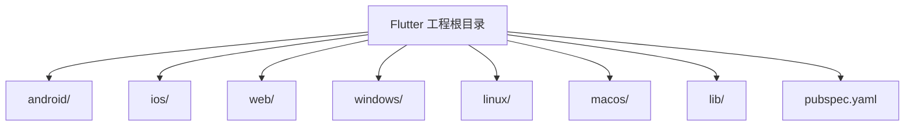
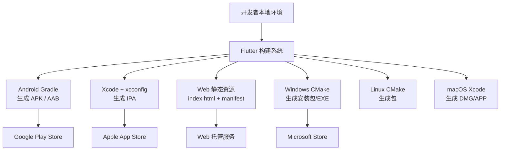
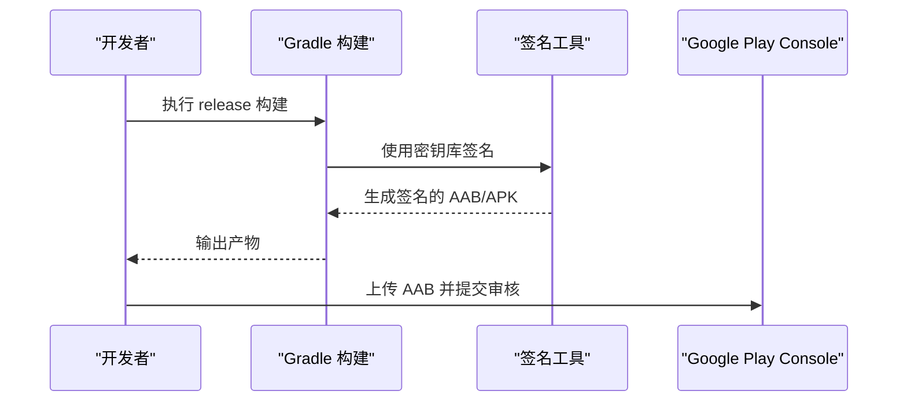
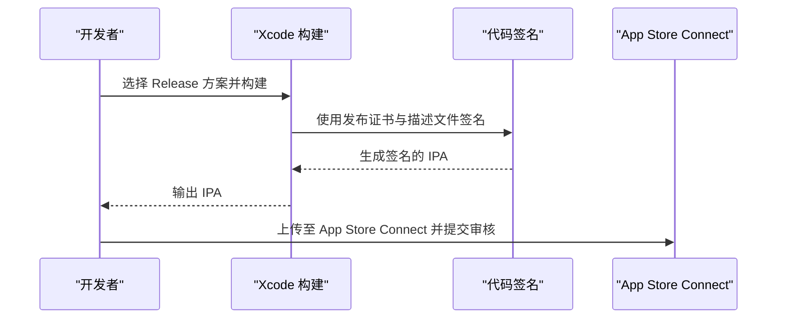
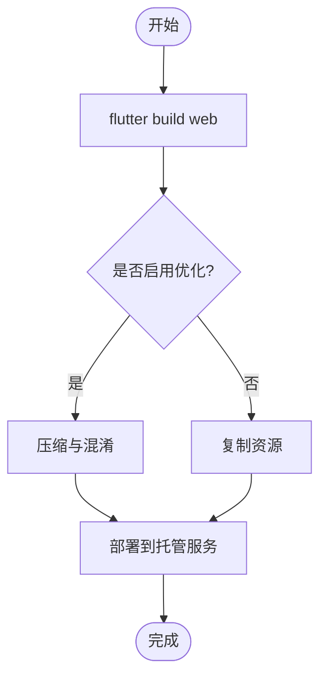
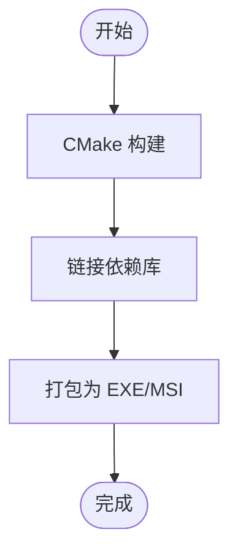
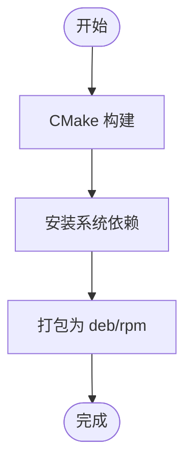
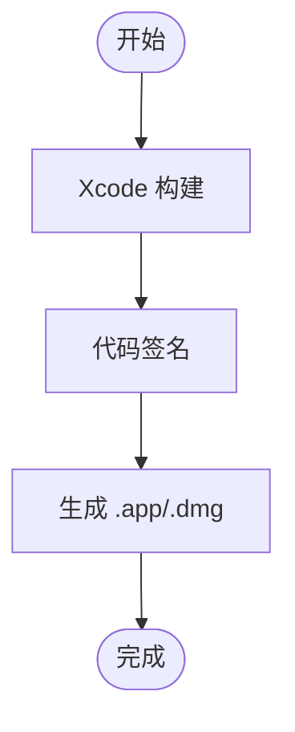
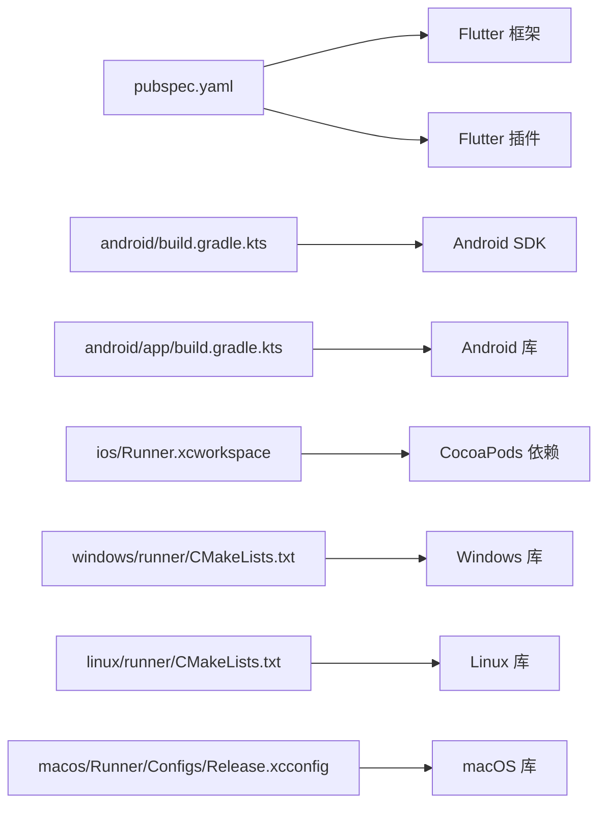

# 部署发布

<cite>
**本文引用的文件**   
- [pubspec.yaml](file://pubspec.yaml)
- [android/app/build.gradle.kts](file://android/app/build.gradle.kts)
- [android/build.gradle.kts](file://android/build.gradle.kts)
- [android/gradle.properties](file://android/gradle.properties)
- [android/local.properties](file://android/local.properties)
- [android/app/src/main/AndroidManifest.xml](file://android/app/src/main/AndroidManifest.xml)
- [ios/Runner/Info.plist](file://ios/Runner/Info.plist)
- [ios/Flutter/Release.xcconfig](file://ios/Flutter/Release.xcconfig)
- [web/index.html](file://web/index.html)
- [web/manifest.json](file://web/manifest.json)
- [windows/runner/CMakeLists.txt](file://windows/runner/CMakeLists.txt)
- [linux/runner/CMakeLists.txt](file://linux/runner/CMakeLists.txt)
- [macos/Runner/Configs/Release.xcconfig](file://macos/Runner/Configs/Release.xcconfig)
- [README.md](file://README.md)
</cite>

## 目录
1. [简介](#简介)
2. [项目结构](#项目结构)
3. [核心组件](#核心组件)
4. [架构总览](#架构总览)
5. [详细组件分析](#详细组件分析)
6. [依赖分析](#依赖分析)
7. [性能考虑](#性能考虑)
8. [故障排除指南](#故障排除指南)
9. [结论](#结论)
10. [附录](#附录)

## 简介
本文件面向Flutter照片整理AI应用，提供端到端的部署与发布指南。内容覆盖多平台构建（Android、iOS、Web、Windows、Linux、macOS）、应用商店提交流程（Google Play Store、Apple App Store、Microsoft Store等）、签名与证书管理、CI/CD流水线搭建、版本管理与发布策略，以及生产环境监控与日志收集。文档以仓库中的实际配置文件为依据，确保可操作性和一致性。

## 项目结构
本项目为标准的Flutter工程，包含以下关键目录：
- android：Android原生工程与Gradle构建配置
- ios：iOS原生工程与Xcode配置
- web：Web前端资源与清单
- windows/linux/macos：桌面端构建与打包配置
- lib：Flutter业务代码入口与模块组织
- pubspec.yaml：Dart依赖与元信息定义

图表来源
- [pubspec.yaml](file://pubspec.yaml)
- [android/app/build.gradle.kts](file://android/app/build.gradle.kts)
- [ios/Runner/Info.plist](file://ios/Runner/Info.plist)
- [web/index.html](file://web/index.html)
- [windows/runner/CMakeLists.txt](file://windows/runner/CMakeLists.txt)
- [linux/runner/CMakeLists.txt](file://linux/runner/CMakeLists.txt)
- [macos/Runner/Configs/Release.xcconfig](file://macos/Runner/Configs/Release.xcconfig)

章节来源
- [README.md](file://README.md)
- [pubspec.yaml](file://pubspec.yaml)

## 核心组件
- 应用元信息与依赖：通过pubspec.yaml统一管理包名、版本号、图标、权限声明及第三方依赖。
- Android构建：使用Gradle Kotlin DSL，支持debug/profile/release三种构建变体，输出APK/AAB。
- iOS构建：使用Xcode工作区与xcconfig进行Release配置，生成IPA。
- Web构建：基于web/index.html与manifest.json，输出静态站点。
- 桌面端构建：Windows/Linux/macOS分别通过CMake或Xcode进行编译打包。

章节来源
- [pubspec.yaml](file://pubspec.yaml)
- [android/app/build.gradle.kts](file://android/app/build.gradle.kts)
- [android/build.gradle.kts](file://android/build.gradle.kts)
- [android/gradle.properties](file://android/gradle.properties)
- [android/local.properties](file://android/local.properties)
- [ios/Runner/Info.plist](file://ios/Runner/Info.plist)
- [ios/Flutter/Release.xcconfig](file://ios/Flutter/Release.xcconfig)
- [web/index.html](file://web/index.html)
- [web/manifest.json](file://web/manifest.json)
- [windows/runner/CMakeLists.txt](file://windows/runner/CMakeLists.txt)
- [linux/runner/CMakeLists.txt](file://linux/runner/CMakeLists.txt)
- [macos/Runner/Configs/Release.xcconfig](file://macos/Runner/Configs/Release.xcconfig)

## 架构总览
下图展示从源码到各平台产物的整体构建与发布路径，包括本地构建与CI/CD自动化流程的关键节点。

图表来源
- [android/app/build.gradle.kts](file://android/app/build.gradle.kts)
- [ios/Flutter/Release.xcconfig](file://ios/Flutter/Release.xcconfig)
- [web/index.html](file://web/index.html)
- [web/manifest.json](file://web/manifest.json)
- [windows/runner/CMakeLists.txt](file://windows/runner/CMakeLists.txt)
- [linux/runner/CMakeLists.txt](file://linux/runner/CMakeLists.txt)
- [macos/Runner/Configs/Release.xcconfig](file://macos/Runner/Configs/Release.xcconfig)

## 详细组件分析

### Android 构建与发布
- 构建目标
  - debug：用于开发与调试
  - profile：用于性能分析
  - release：用于发布，需签名并优化
- 产物格式
  - APK：适用于测试与侧载
  - AAB：Google Play推荐上传格式
- 关键配置
  - app/build.gradle.kts：定义应用ID、版本、签名、构建变体、依赖
  - build.gradle.kts：顶层Gradle配置，统一插件与版本
  - gradle.properties：JVM参数、Gradle缓存、签名属性
  - local.properties：Android SDK路径
  - AndroidManifest.xml：权限、启动Activity、网络与安全策略

图表来源
- [android/app/build.gradle.kts](file://android/app/build.gradle.kts)
- [android/build.gradle.kts](file://android/build.gradle.kts)
- [android/gradle.properties](file://android/gradle.properties)
- [android/local.properties](file://android/local.properties)
- [android/app/src/main/AndroidManifest.xml](file://android/app/src/main/AndroidManifest.xml)

章节来源
- [android/app/build.gradle.kts](file://android/app/build.gradle.kts)
- [android/build.gradle.kts](file://android/build.gradle.kts)
- [android/gradle.properties](file://android/gradle.properties)
- [android/local.properties](file://android/local.properties)
- [android/app/src/main/AndroidManifest.xml](file://android/app/src/main/AndroidManifest.xml)

### iOS 构建与发布
- 构建目标
  - Debug/Profile/Release：对应不同构建模式
- 产物格式
  - IPA：App Store提交与TestFlight分发
- 关键配置
  - Info.plist：应用元数据、权限、URL Scheme等
  - Release.xcconfig：Release模式下的编译选项与符号化设置
  - Runner.xcworkspace：Xcode工作区，包含所有目标与依赖

图表来源
- [ios/Runner/Info.plist](file://ios/Runner/Info.plist)
- [ios/Flutter/Release.xcconfig](file://ios/Flutter/Release.xcconfig)

章节来源
- [ios/Runner/Info.plist](file://ios/Runner/Info.plist)
- [ios/Flutter/Release.xcconfig](file://ios/Flutter/Release.xcconfig)

### Web 部署
- 构建目标
  - 生成静态HTML、JS、CSS等资源
- 关键配置
  - index.html：页面入口与初始化脚本
  - manifest.json：Web应用清单（名称、图标、主题色）

图表来源
- [web/index.html](file://web/index.html)
- [web/manifest.json](file://web/manifest.json)

章节来源
- [web/index.html](file://web/index.html)
- [web/manifest.json](file://web/manifest.json)

### Windows 桌面构建
- 构建目标
  - 生成Windows可执行程序或安装包
- 关键配置
  - runner/CMakeLists.txt：CMake构建规则与链接选项

图表来源
- [windows/runner/CMakeLists.txt](file://windows/runner/CMakeLists.txt)

章节来源
- [windows/runner/CMakeLists.txt](file://windows/runner/CMakeLists.txt)

### Linux 桌面构建
- 构建目标
  - 生成Linux发行版包（如deb/rpm）
- 关键配置
  - runner/CMakeLists.txt：CMake构建规则与依赖

图表来源
- [linux/runner/CMakeLists.txt](file://linux/runner/CMakeLists.txt)

章节来源
- [linux/runner/CMakeLists.txt](file://linux/runner/CMakeLists.txt)

### macOS 桌面构建
- 构建目标
  - 生成.app或.dmg安装包
- 关键配置
  - Configs/Release.xcconfig：Release模式下的编译与签名配置

图表来源
- [macos/Runner/Configs/Release.xcconfig](file://macos/Runner/Configs/Release.xcconfig)

章节来源
- [macos/Runner/Configs/Release.xcconfig](file://macos/Runner/Configs/Release.xcconfig)

## 依赖分析
- Dart依赖管理：通过pubspec.yaml集中管理，确保跨平台一致性与可重现构建。
- Android依赖：Gradle插件与SDK版本在build.gradle.kts中统一声明。
- iOS依赖：Xcode工作区与Pod依赖由Xcode自动解析。
- 桌面端依赖：CMake与系统库依赖在各平台CMakeLists.txt中声明。

图表来源
- [pubspec.yaml](file://pubspec.yaml)
- [android/build.gradle.kts](file://android/build.gradle.kts)
- [android/app/build.gradle.kts](file://android/app/build.gradle.kts)
- [windows/runner/CMakeLists.txt](file://windows/runner/CMakeLists.txt)
- [linux/runner/CMakeLists.txt](file://linux/runner/CMakeLists.txt)
- [macos/Runner/Configs/Release.xcconfig](file://macos/Runner/Configs/Release.xcconfig)

章节来源
- [pubspec.yaml](file://pubspec.yaml)
- [android/build.gradle.kts](file://android/build.gradle.kts)
- [android/app/build.gradle.kts](file://android/app/build.gradle.kts)
- [windows/runner/CMakeLists.txt](file://windows/runner/CMakeLists.txt)
- [linux/runner/CMakeLists.txt](file://linux/runner/CMakeLists.txt)
- [macos/Runner/Configs/Release.xcconfig](file://macos/Runner/Configs/Release.xcconfig)

## 性能考虑
- Android
  - 启用R8/ProGuard混淆与资源压缩
  - 使用AAPT2优化资源
  - 合理划分构建变体，避免不必要的依赖
- iOS
  - 启用Bitcode与符号化
  - 使用Release模式构建，关闭调试符号
- Web
  - 启用最小化与Tree Shaking
  - 预加载关键资源，减少首屏时间
- 桌面端
  - 按需链接系统库，减小二进制体积
  - 使用Release模式构建，禁用调试输出

[本节为通用指导，不直接分析具体文件]

## 故障排除指南
- Android
  - 常见问题：Gradle版本不匹配、签名失败、内存不足
  - 排查要点：检查gradle.properties的JVM堆大小、确认密钥库路径与密码、清理构建缓存
- iOS
  - 常见问题：证书过期、描述文件不匹配、签名失败
  - 排查要点：确认钥匙串中的证书有效性、更新描述文件、清理DerivedData
- Web
  - 常见问题：资源路径错误、缓存问题
  - 排查要点：检查manifest.json配置、清除浏览器缓存、验证CDN部署
- 桌面端
  - 常见问题：依赖缺失、CMake配置错误
  - 排查要点：安装必要系统依赖、核对CMakeLists.txt路径与变量

章节来源
- [android/gradle.properties](file://android/gradle.properties)
- [android/local.properties](file://android/local.properties)
- [ios/Runner/Info.plist](file://ios/Runner/Info.plist)
- [web/manifest.json](file://web/manifest.json)
- [windows/runner/CMakeLists.txt](file://windows/runner/CMakeLists.txt)
- [linux/runner/CMakeLists.txt](file://linux/runner/CMakeLists.txt)
- [macos/Runner/Configs/Release.xcconfig](file://macos/Runner/Configs/Release.xcconfig)

## 结论
本指南围绕Flutter照片整理AI应用的多平台构建与发布需求，提供了从本地开发到CI/CD自动化、从签名证书到应用商店提交的完整流程说明。建议团队结合仓库中的实际配置文件进行落地实施，并在生产环境中建立完善的监控与日志体系，保障应用的稳定性与用户体验。

[本节为总结性内容，不直接分析具体文件]

## 附录
- 版本管理与发布策略
  - 语义化版本控制：主版本.次版本.修订号，遵循向后兼容原则
  - 热更新：谨慎使用，注意平台限制与审核政策
  - 灰度发布：分阶段放量，监控关键指标后全量发布
- 持续集成建议
  - 使用GitHub Actions/GitLab CI/Jenkins等工具
  - 自动化构建、测试、签名、上传产物
  - 分支策略与标签管理，确保可追溯性
- 生产监控与日志
  - 错误追踪：接入崩溃上报与异常捕获
  - 性能监控：采集FPS、内存、网络请求耗时
  - 用户行为分析：埋点关键事件，辅助产品迭代

[本节为通用指导，不直接分析具体文件]