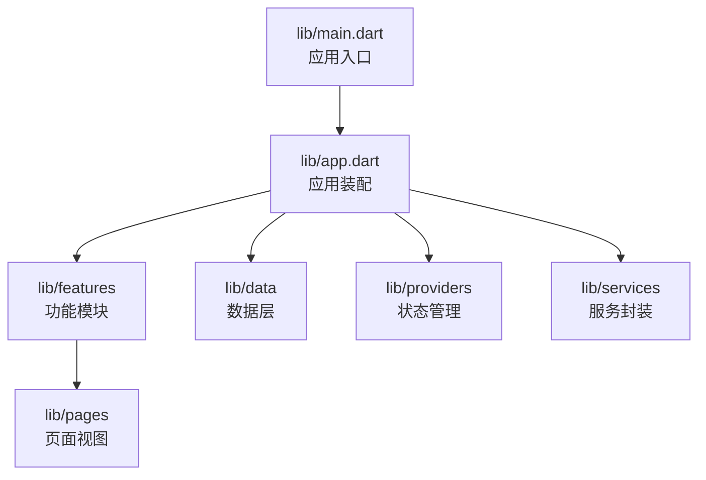
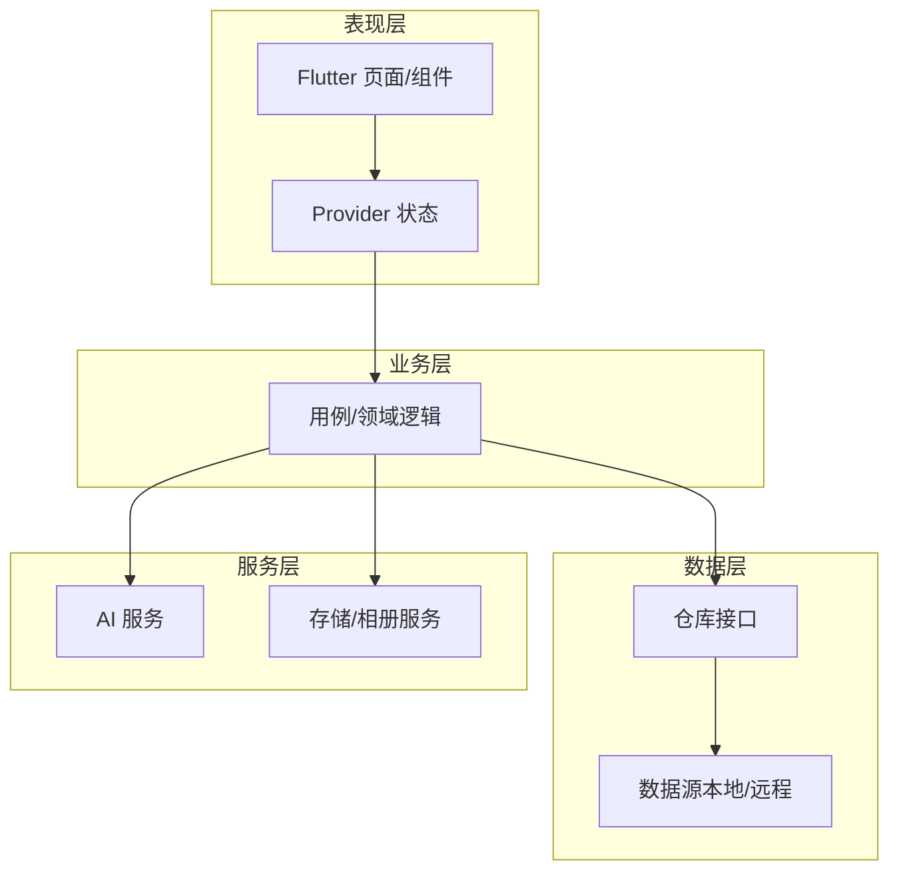
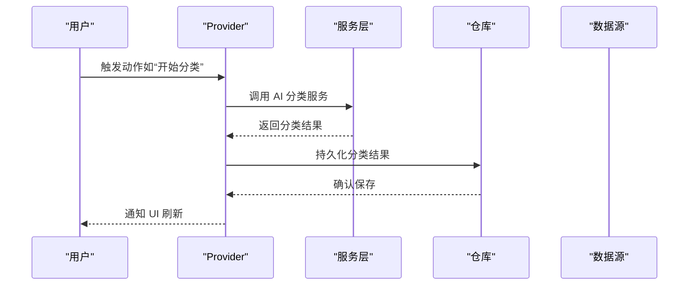
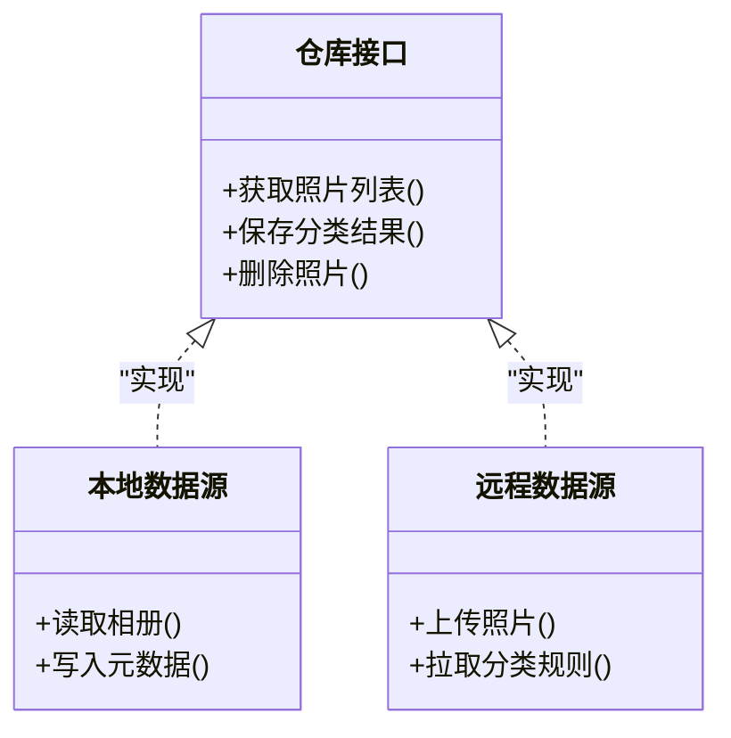
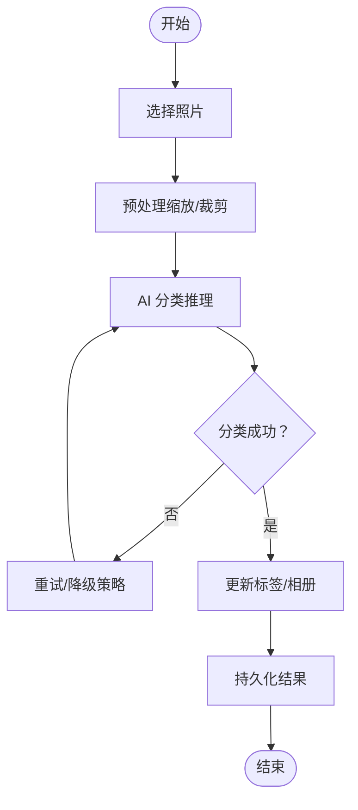
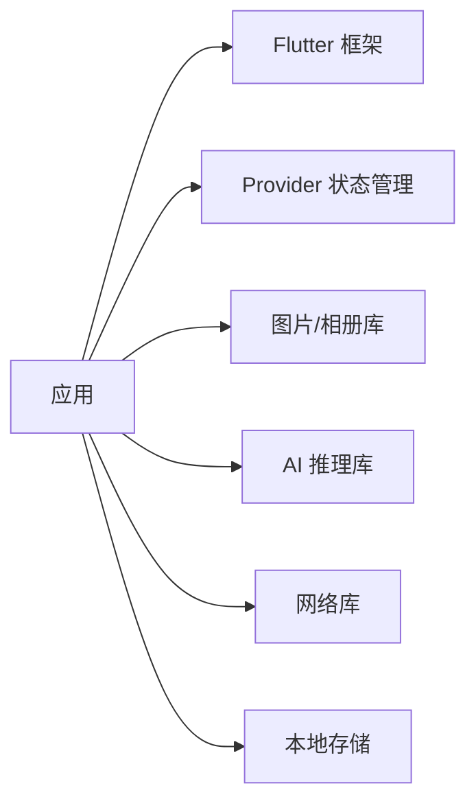

# 项目概述

<cite>
**本文档引用的文件**
- [README.md](file://README.md)
- [pubspec.yaml](file://pubspec.yaml)
- [main.dart](file://lib/main.dart)
- [app.dart](file://lib/app.dart)
</cite>

## 目录
1. [简介](#简介)
2. [项目结构](#项目结构)
3. [核心组件](#核心组件)
4. [架构总览](#架构总览)
5. [详细组件分析](#详细组件分析)
6. [依赖分析](#依赖分析)
7. [性能考虑](#性能考虑)
8. [故障排查指南](#故障排查指南)
9. [结论](#结论)
10. [附录](#附录)

## 简介
本项目是一个基于 Flutter 的“照片整理 AI”应用，目标是通过智能分类与自动化管理帮助用户高效组织海量照片。核心特性包括：
- 智能照片管理：批量导入、去重、标签化、相册/时间线视图等
- AI 分类：基于图像识别与语义理解对照片进行自动分类（人物、风景、美食、活动等）
- 跨平台支持：Android、iOS、Windows、macOS、Linux、Web 等多端一致体验

设计理念采用 Clean Architecture 分层思想，将 UI、业务逻辑与数据访问解耦，提升可测试性与可维护性。技术栈以 Flutter 为核心，结合 Provider 进行状态管理，并通过本地或云端 AI 服务实现智能分类能力。

## 项目结构
项目遵循 Flutter 标准工程结构，并在 lib 目录下按职责划分模块：
- lib/main.dart：应用入口，初始化全局配置与路由
- lib/app.dart：应用装配（主题、国际化、路由、Provider 注入等）
- lib/features：按功能域划分的业务模块（如相册、分类、设置等）
- lib/data：数据层（模型、仓库、数据源）
- lib/providers：状态管理与业务状态容器
- lib/services：外部服务封装（AI 服务、存储、网络等）
- lib/pages：页面级视图（若未使用 features 组织则保留）

图表来源
- [main.dart](file://lib/main.dart)
- [app.dart](file://lib/app.dart)

章节来源
- [README.md](file://README.md)
- [pubspec.yaml](file://pubspec.yaml)

## 核心组件
- 应用入口与装配
  - main.dart：负责启动 Flutter 引擎、设置运行环境、调用应用装配
  - app.dart：集中配置主题、路由、Provider、国际化、错误处理等
- 功能模块（features）
  - 按领域拆分，例如“相册浏览”“AI 分类”“标签管理”“设置”等
  - 每个模块包含 UI、状态、数据访问与服务调用的最小闭环
- 数据层（data）
  - 定义实体模型、仓库接口与实现、数据源（本地/远程）
  - 通过抽象隔离具体实现，便于替换与测试
- 状态管理（providers）
  - 使用 Provider 暴露应用状态，UI 订阅变化并响应更新
- 服务层（services）
  - 封装 AI 推理、图片读取/压缩、相册权限、云同步等能力

章节来源
- [main.dart](file://lib/main.dart)
- [app.dart](file://lib/app.dart)

## 架构总览
本项目的整体架构遵循 Clean Architecture 的分层原则：
- 表现层（UI/交互）：Flutter 页面与组件，仅关注展示与用户输入
- 业务层（用例/领域）：编排业务流程，协调数据与外部服务
- 数据层（仓库/数据源）：提供统一的数据访问接口，屏蔽实现细节

图表来源
- [app.dart](file://lib/app.dart)
- [pubspec.yaml](file://pubspec.yaml)

## 详细组件分析
### 应用入口与装配
- main.dart：初始化运行时环境，调用应用装配方法，确保依赖注入与路由就绪
- app.dart：集中注册 Provider、主题、路由、国际化；为各功能模块提供统一的上下文

章节来源
- [main.dart](file://lib/main.dart)
- [app.dart](file://lib/app.dart)

### 状态管理（Provider）
- 在 app.dart 中集中注入 Provider，供全应用共享
- 各功能模块通过 Provider 获取/更新状态，保持 UI 与逻辑解耦
- 典型流程：用户操作 → Provider 变更 → UI 重建

图表来源
- [app.dart](file://lib/app.dart)
- [pubspec.yaml](file://pubspec.yaml)

### 数据层与仓库模式
- 仓库接口定义统一的数据访问契约
- 数据源负责具体实现（本地数据库、文件系统、网络 API）
- 业务层仅依赖仓库接口，便于替换与单元测试

图表来源
- [pubspec.yaml](file://pubspec.yaml)

### AI 集成流程
- 选择照片后，调用 AI 服务进行特征提取与分类
- 根据分类结果更新标签与相册归属
- 支持离线缓存与增量更新策略

图表来源
- [pubspec.yaml](file://pubspec.yaml)

## 依赖分析
项目依赖主要围绕 Flutter 生态与 AI/媒体能力：
- Flutter SDK：跨平台 UI 框架
- Provider：轻量级状态管理
- 图片与相册：用于读取、压缩、预览与权限管理
- AI 推理：本地或云端模型推理库
- 网络与存储：HTTP 客户端、本地数据库/文件存储

图表来源
- [pubspec.yaml](file://pubspec.yaml)

章节来源
- [pubspec.yaml](file://pubspec.yaml)

## 性能考虑
- 图片处理：优先使用流式读取与按需解码，避免一次性加载大图
- 分类任务：后台队列执行，避免阻塞主线程；支持断点续传与失败重试
- 缓存策略：对分类结果与缩略图进行本地缓存，减少重复计算与网络请求
- 内存管理：及时释放图片资源，限制并发任务数量

## 故障排查指南
- 启动失败
  - 检查 Flutter 环境与依赖安装是否完整
  - 清理构建缓存并重新获取依赖
- 权限问题
  - Android/iOS 相册与存储权限需正确声明与授权
- AI 推理异常
  - 检查模型文件完整性与版本兼容性
  - 网络模式下检查 API 密钥与连通性
- 状态不同步
  - 检查 Provider 注入顺序与生命周期
  - 确认异步任务完成后再更新 UI

## 结论
本项目以 Flutter 为核心，结合 Provider 与 Clean Architecture，构建了可扩展、可测试的照片整理 AI 应用。通过模块化设计与清晰的分层，既保证了用户体验的一致性，也为后续功能扩展与维护提供了坚实基础。建议在新功能开发时遵循现有分层与命名规范，持续优化图片处理与 AI 推理的性能与稳定性。

## 附录
### 快速开始
- 环境要求
  - Flutter SDK（稳定版）
  - Android Studio / Xcode（对应平台）
  - 设备或模拟器
- 安装步骤
  - 克隆仓库
  - 进入项目根目录
  - 安装依赖
  - 运行应用
- 基本使用方法
  - 授予相册与存储权限
  - 导入照片并开始 AI 分类
  - 查看分类结果与标签管理

章节来源
- [README.md](file://README.md)
- [pubspec.yaml](file://pubspec.yaml)